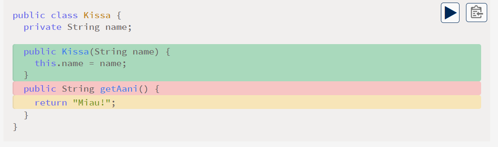

# ISEAI Programming 2 (University of Jyväskylä)

[![CC BY-SA 4.0][cc-by-sa-shield]][cc-by-sa]


This repository contains the course material for the University of Jyväskylä's Programming 2 course in ISEAI program.
The material is available online.

## Developing the Material Locally

- Use the included DevContainer. It utilizes a prebuilt mdBook tooling image that already contains the required extensions.
- Start the preview server inside the DevContainer:

```bash
bash ./start.sh
```

- If you do not want to use the DevContainer (for example, for quick edits or to avoid downloading a large DevContainer image), you can instead use the Docker image that contains the mdBook tool and its extensions.
For example, to build the entire material with a single command:

```bash
docker run --rm -v .:/workspace \
  ghcr.io/ohj-perus-jy/ohj-mdbook-tooling:runner-latest \
  build
```

To serve the material locally:

```bash
docker run --rm -it -v .:/workspace -p 3000:3000 \
  ghcr.io/ohj-perus-jy/ohj-mdbook-tooling:runner-latest \
  serve --hostname 0.0.0.0 --port 3000
```


## Quick Writing Guide

Code examples may contain multiple files. Use `// FILE: filename` and `// FILE_END` markers to separate files.

```java
// FILE: Main.java
public class Program {
    public static void main() {
        Cat cat = new Cat("Snowball");
        IO.println(cat.getSound());
    }
}
// FILE_END
// FILE: Cat.java
public class Cat {
    private String name;

    public Cat(String name) {
        this.name = name;
    }

    public String getSound() {
        return "Meow!";
    }
}
// FILE_END
```

For code highlighting, use the markers, 
`// HIGHLIGHT_COLOR_BEGIN` and
`// HIGHLIGHT_COLOR_END`
where `COLOR` is one of:
`GREEN`,
`YELLOW`
`RED`
`BLUE`.

Example:

```java
public class Cat {
    private String name;

    // HIGHLIGHT_GREEN_BEGIN
    public Cat(String name) {
        this.name = name;
    }
    // HIGHLIGHT_GREEN_END

    // HIGHLIGHT_RED_BEGIN
    public String getSound() {
    // HIGHLIGHT_RED_END
    // HIGHLIGHT_YELLOW_BEGIN
        return "Meow!";
    // HIGHLIGHT_YELLOW_END
    }
}
```




### Task Block

Tasks have a dedicated `task` element containing the task title, assignment text, and a link to the TIM assignment.

```md
<task>
  <task-title> Core Task: Printing <points>1 p.</points> </task-title>
  <handout>

{{#include ../exercises/1-1-1-printing/handout.md}}

  </handout>

  <task-link>
    https://tim.jyu.fi/..." Complete the Task in TIM
    </a>
  </task-link>
</task>
```

To avoid Markdown formatting issues, the `include` macro should be written at the leftmost margin.

### See Also

- [mdBook Documentation](https://rust-lang.github.io/mdBook/index.html)
- [KaTeX Documentation](https://katex.org/docs/supported)

## Acknowledgements

This project is based on the [Programming 2](https://github.com/ohj-perus-jy/ohj2) course material originally created by Denis Zhidkikh, Sami Sarsa, Antti-Jussi Lakanen, Rauli Ruokokoski, and Karri Sormunen. Their work served as the foundation and inspiration for this translated version.

## License

Programming 2 course material © 2025 by Denis Zhidkikh, Sami Sarsa, Antti-Jussi Lakanen, Rauli Ruokokoski, Karri Sormunen and Ville Rantala is licensed under the [Creative Commons Attribution-ShareAlike 4.0 International License][cc-by-sa].

[![CC BY-SA 4.0][cc-by-sa-image]][cc-by-sa]

[cc-by-sa]: http://creativecommons.org/licenses/by-sa/4.0/
[cc-by-sa-image]: https://licensebuttons.net/l/by-sa/4.0/88x31.png

[cc-by-sa-shield]: https://img.shields.io/badge/License-CC%20BY--SA%204.0-lightgrey.svg