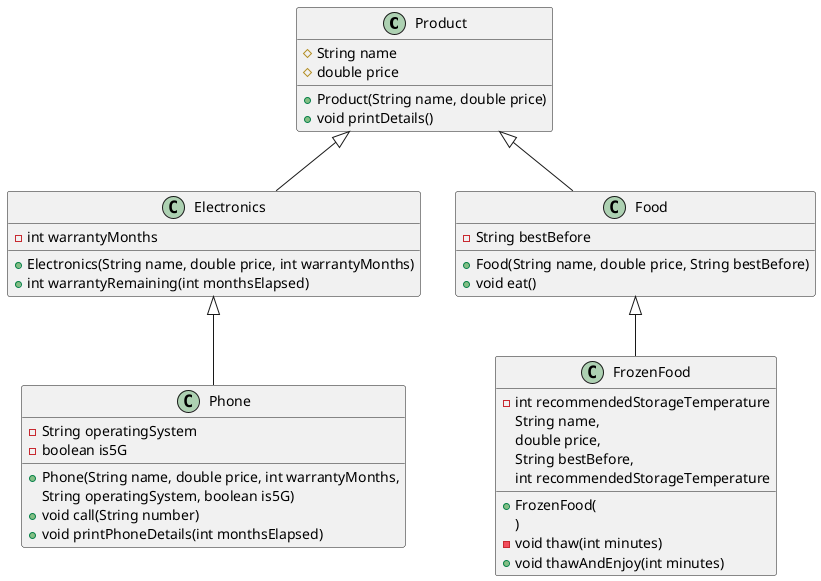

Extend the online store class hierarchy you created earlier according to the UML diagram below.

A main program has been provided on the exercise page, which you can use to test your classes. You can also view the sample output produced by the program.

<details><summary>Open the example output here.</summary>

```text
Calling inherited methods:
Dulce & Käppänä Winter Jacket: 120.0 €
Reissurähjä Rye Bread: 2.5 €
HighPower Computer: 899.0 €

----------------------------

Calling subclass-specific methods:
Test 1: Trying it on a user who wears size M:
Trying on the clothing item Dulce & Käppänä Winter Jacket...
This may not be the best fit. You wear size M, but this clothing item is size L.

Test 2: Trying it on a user who wears size L:
Trying on the clothing item Dulce & Käppänä Winter Jacket...
Great! Size L fits you perfectly!

Eating Reissurähjä Rye Bread.
The best-before date was 20.12.2024. Hopefully it's still good.

Warranty remaining: 19 months.

pHone: 999.99 €
Phone warranty remaining: 19 months
Operating system: Orange
Connection type: 4G
Calling from Orange (4G) to 0401122330

Pea Bag: 0.99 €
You thawed the frozen food Pea Bag for 10 minutes.
Recommended storage temperature is -18 °C.
Eating Pea Bag.
The best-before date was 31.5.2026. Hopefully it's still good.
```

</details>

<br />

<details><summary> Task Description </summary>

Below is a description of the new classes and their required features. The same information can also be found in the UML diagram.

1. `Phone` (inherits from `Electronics`)
    - Add the attributes:
      - `private String operatingSystem` (e.g. `"Droid"` or `"AiOS"`)
      - `private boolean is5G`

    - Add the methods:
      - `public void call(String number)`. The method prints, for example: `Calling from Orange (4G) to 0401122330`
      - `public void printPhoneDetails(int monthsElapsed)`.
        The method should first call the inherited method (`printDetails()`), and then print additional phone-related information(remaining warranty, operating system and 5G support)

2. `FrozenFood` (inherits from `Food`)
   - Add the attribute:
      - `private int recommendedStorageTemperature` (e.g. `-18`)

    - Add the method:
      - `private void thaw(int minutes)` (note the `private` modifier)
        When called, the method prints, for example:
        `You thaw the frozen food for 10 minutes.
        Recommended storage temperature: -18 °C.`
    - Add the method:
      - `public void thawAndEnjoy(int minutes)`
      - The method first calls `thaw(minutes)` and then the inherited `eat()` method.

</details>

## UML Diagram

