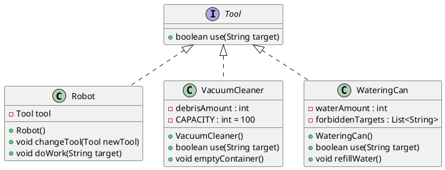

Create a `Robot` that can perform various household tasks, such as vacuum cleaning and watering plants.

Implement the exercise according to the UML diagram below. A dashed line with a filled arrow means that the `Robot` class uses the `Tool` interface: the `Robot` class contains an attribute whose type is `Tool`.

Textual description

The following is a description of the classes and their required features (corresponding to the UML diagram):

The `Robot` class has the following methods:

- `void changeTool(Tool tool)`: Changes the tool used by the robot (for example, a vacuum cleaner or a watering can).

- `void doWork(String target)`: Performs a household task. If the target is on the forbidden list of the currently selected tool (for example, a `WateringCan` object must not be used on the target `"Computer"`), the robot should print an error message. Forbidden targets are defined as a string list attribute of the tool.

- A `WateringCan` object does not water if there is not enough water available. It can be refilled using the `refillWater()` method. The watering can initially contains 50 units of water. If you wish, you may create an additional constructor that allows a different initial water level.

- A `VacuumCleaner` object does not vacuum if its dust container is full. The container can be emptied using the `emptyContainer()` method. The container capacity is 100 units. If you wish, you may create an additional constructor that allows a different initial fill level.

- Both tools return a boolean value from the `use(String target)` method indicating whether the task was completed successfully.

