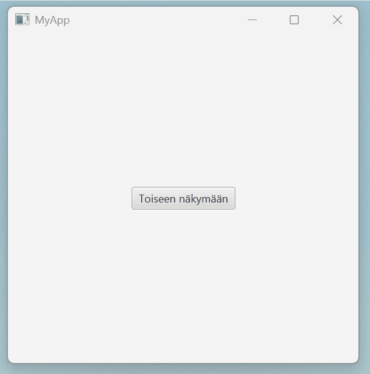

# Views

## Switching Views Within the Same Window

Switching views within the same window is an important part of many JavaFX applications.
Users can move between views without opening a new window.

Below is a simple example with two views: `MainView` and `SecondaryView`.
One button navigates to the second view, and another button returns to the first one.

The key idea is this:
We set the root node of the current `Scene` object to a new view.
This way, the window size and other properties remain unchanged, while only the content is replaced.

```
// FILE: main.fxml
<?xml version="1.0" encoding="UTF-8"?>
<?import javafx.scene.control.Button?>
<?import javafx.scene.layout.VBox?>
<VBox xmlns:fx="http://javafx.com/fxml" fx:controller="fi.jyu.ohj2.examples.MainController">
    <Button text="To the other view" onAction="#navigateToSecondaryView"/>
</VBox>
// FILE_END
// FILE: secondary.fxml
<?xml version="1.0" encoding="UTF-8"?>
<?import javafx.scene.control.Button?>
<?import javafx.scene.layout.VBox?>
<VBox xmlns:fx="http://javafx.com/fxml" fx:controller="fi.jyu.ohj2.examples.SecondaryController">
    <Button text="Back to mainview" onAction="#navigateToMainView"/>
</VBox>
// FILE_END
// FILE: MainController.java
import javafx.event.ActionEvent;
import javafx.fxml.FXML;
import javafx.fxml.FXMLLoader;
import javafx.scene.Node;
import javafx.scene.Parent;
import javafx.scene.Scene;
import javafx.stage.Stage;

public class MainController {
    @FXML
    private void navigateToSecondaryView(ActionEvent event) throws Exception {
        Parent secondaryView = FXMLLoader.load(getClass().getResource("secondary.fxml"));
        Scene currentScene = ((Node)event.getSource()).getScene();
        currentScene.setRoot(secondaryView);
    }
}
// FILE_END
// FILE: SecondaryController.java
import javafx.event.ActionEvent;
import javafx.fxml.FXML;
import javafx.fxml.FXMLLoader;
import javafx.scene.Node;
import javafx.scene.Parent;
import javafx.scene.Scene;
import javafx.stage.Stage;

public class SecondaryController {

    @FXML
    private void navigateToMainView(ActionEvent event) throws Exception {
        Parent mainView = FXMLLoader.load(App.class.getResource("main.fxml"));
        Scene currentScene = ((Node)event.getSource()).getScene();
        currentScene.setRoot(mainView);
    }
}

// FILE_END
```

<br />



If data needs to be passed between views, this can be done during view loading as follows.
In this example, `MainController` sends a message to a `SecondaryController` object, which prints it to the console in its `initialize()` method.
Exactly the same approach could be used to pass information in the opposite direction.

```java,ignore
// FILE: MainController.java
public class MainController {
    @FXML
    private void navigateToSecondaryView(ActionEvent event) throws Exception {
        FXMLLoader loader = new FXMLLoader(App.class.getResource("secondary.fxml"));
        loader.setControllerFactory(_ -> new SecondaryController("Hello"));
        Parent secondaryRoot = loader.load();
        Scene currentScene = ((Node)event.getSource()).getScene();
        currentScene.setRoot(secondaryRoot);
    }
}
// FILE_END
// FILE: SecondaryController.java
public class SecondaryController implements Initializable {

    String forwardedMessage;
    public SecondaryController(String message) {
        forwardedMessage = message;
    }

    @FXML
    private void navigateToMainView(ActionEvent event) throws Exception {
        Parent mainView = FXMLLoader.load(App.class.getResource("main.fxml"));
        Scene currentScene = ((Node)event.getSource()).getScene();
        currentScene.setRoot(mainView);
    }

    @Override
    public void initialize(URL url, ResourceBundle resourceBundle) {
        IO.println("Message from the main view: " + forwardedMessage);
    }
}
// FILE_END
```
