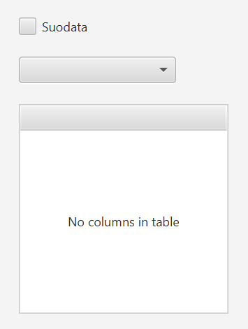
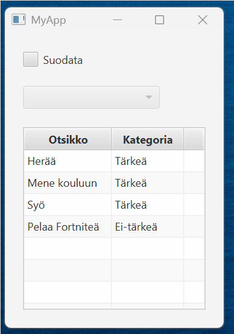
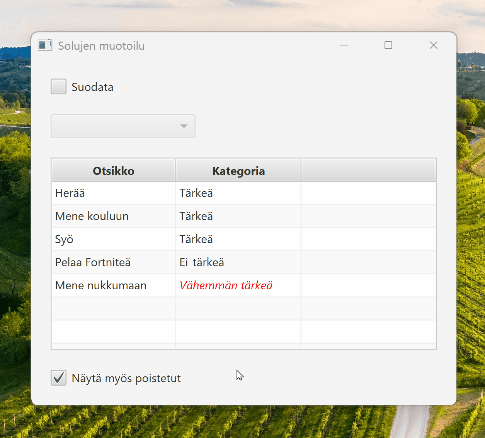

# TableView

## Clicking an Empty Row

By default, a `TableView` component does *not* clear the selection when the user clicks an empty row. This is often unintuitive.

One way to detect clicks on empty rows is to attach a `setOnMouseClicked` listener to each row. The listener checks whether the clicked row is empty and clears the selection if it is.

```java,ignore
tableView.setRowFactory(tv -> {
    TableRow<MyData> row = new TableRow<>();
    row.setOnMouseClicked(event -> {
        if (row.isEmpty()) {
            tableView.getSelectionModel().clearSelection();
        }
    });
    return row;
});
```

## Filtering Rows

This example is fairly long; you can find the complete version on [GitHub](https://github.com/ohj-perus-jy/ohj2/tree/main/src/examples/javafx/FilteredList).

The `TableView` component does not directly support row filtering. JavaFX provides the `FilteredList` class, which enables filtering.

Assume we have tasks and categories. Each task belongs to exactly one category. We would like to choose a category from a drop-down menu and display only the tasks belonging to that category.

`Task` and `Category` might look like the following:

```java,ignore
// FILE: Task.java
package fi.jyu.ohj2.examples.filteredlist;

//- import javafx.beans.property.ObjectProperty;
//- import javafx.beans.property.SimpleObjectProperty;
//- import javafx.beans.property.SimpleStringProperty;
//- import javafx.beans.property.StringProperty;
//-

public class Task {

    private final StringProperty title = new SimpleStringProperty();
    private final ObjectProperty<Category> category = new SimpleObjectProperty<>();

    public Task() {
        // Required by Jackson
    }

    public Task(String title, Category category) {
        this.title.set(title);
        this.category.set(category);
    }

    // Title
    public void setTitle(String title) {
        this.title.set(title);
    }

    public String getTitle() {
        return title.get();
    }

    public StringProperty titleProperty() {
        return title;
    }

    // Category
    public void setCategory(Category category) {
        this.category.set(category);
    }

    public Category getCategory() {
        return category.get();
    }

    public ObjectProperty<Category> categoryProperty() {
        return category;
    }
}

// FILE_END
// FILE: Category.java
package fi.jyu.ohj2.examples.filteredlist;

//- import javafx.beans.property.SimpleStringProperty;
//- import javafx.beans.property.StringProperty;
//-

public class Category {
    private final StringProperty name = new SimpleStringProperty();

    public Category() {
        // Required by Jackson
    }

    public Category(String name) {
        this.name.set(name);
    }

    // Name
    public void setName(String name) {
        this.name.set(name);
    }

    public String getName() {
        return name.get();
    }

    public StringProperty nameProperty() {
        return name;
    }

    public String toString() {
        return getName();
    }
}

// FILE_END
```

The user interface might look something like this:
We have a `TableView` for displaying tasks, a `CheckBox` for enabling filtering, and a `ComboBox` for selecting a category.




Create an `fx:id` for each component and corresponding fields in the controller.

Add a `FilteredList<Task>` attribute called `filteredTasks` to the controller.

After loading tasks and categories, for example from a JSON file, create a `FilteredList` object and assign it as the data source for the `TableView`:

```java,ignore
// Assume tasks have been loaded into an ObservableList called 'tasks'
filteredTasks = new FilteredList<>(tasks, t -> true);
tableView.setItems(filteredTasks);
```

Here, `t -> true` is a lambda expression that determines which tasks are displayed.
Initially, all tasks are shown because the condition is always true.

Next, add a listener to the `ComboBox` that updates the filtering criteria:

```java,ignore
comboBox.setOnAction(event -> {
    updateFilter();
});

private void updateFilter() {
    Category selectedCategory = comboBox.getSelectionModel().getSelectedItem();
    filteredTasks.setPredicate(t ->
        t.getCategory().getName().equals(selectedCategory.getName())
    );
}
```

Here, the `setPredicate` method defines the filtering criteria.
If no category is selected, all tasks should be displayed. Otherwise, only tasks belonging to the selected category should be shown.

However, this implementation has a problem: once filtering has been enabled, it cannot be removed.
For that reason, we added a `CheckBox` component that can activate and deactivate filtering.
Modify the `updateFilter` method as follows:

```java,ignore
private void updateFilter() {
    Category selectedCategory = comboBox.getSelectionModel().getSelectedItem();
    if (checkBox.isSelected() && selectedCategory != null) {
        filteredTasks.setPredicate(t ->
            t.getCategory().getName().equals(selectedCategory.getName())
        );
    } else {
        filteredTasks.setPredicate(t -> true); // Show all
    }
}
```

Filtering should be completely disabled whenever the `CheckBox` is not selected.
This can be achieved as follows:

```java,ignore
comboBox.disableProperty().bind(checkBox.selectedProperty().not());
```

This line may require some explanation.
Here, the disabled state of the `comboBox` is bound to the inverse of the `selected` property of the `checkBox`.
In other words, when the `checkBox` is selected, the `comboBox` is *not disabled*.
JavaFX does not provide an `enableProperty()` method, so we must use `disableProperty()` and invert its value.

The `selectedProperty()` already exists in the `CheckBox` component, so it does not need to be defined separately.

The result might look something like this.



## Cell Formatting

This example can also be found in its entirety on [GitHub](https://github.com/ohj-perus-jy/ohj2/tree/main/src/examples/javafx/CellFactory).

Sometimes it is useful to change the appearance of a cell under certain conditions.

Continuing from the previous example, let us assume that categories can be deleted.
Deleted categories should be displayed using red text so that users notice that the category has been deleted.
The interface might look something like this.



Information about whether a category has been deleted could be stored as a property of the `Category` class and naturally also in the JSON file. See examples of these classes in Github: 
[Kategoria.java](https://github.com/ohj-perus-jy/ohj2/blob/29df2988f92a002812842c0cb03dc054c86565ae/src/examples/javafx/CellFactory/src/main/java/fi/jyu/ohj2/esimerkit/cellfactory/Kategoria.java#L38),
[kategoriat.json](https://github.com/ohj-perus-jy/ohj2/blob/main/src/examples/javafx/CellFactory/kategoriat.json).

Of course, we could add a separate table column indicating whether a category is deleted and filter based on that. However, this is not always an elegant solution.
A better idea is to indicate deleted categories directly through the category name itself, for example by displaying the text in red.

In the previous example, we added the category column like this:

```java,ignore
categoryColumn.setCellValueFactory(cellData -> cellData.getValue().categoryProperty().asString());
```

This only defines where the value is retrieved from.
It cannot affect the cell's appearance.
Appearance must instead be changed using the `setCellFactory()` method, as we learned in [Part 8.2](../part8/02-tableview.md#displaying-the-completed-column-as-a-checkbox).
Unfortunately, there is no ready-made `CellFactory` implementation that changes text color.
We therefore have two options:

1. Create our own `CellFactory` class by extending `TableCell`.
2. Use a lambda expression.

The first option is more work, but useful if the same logic is required in multiple columns or tables.
In this case, however, we only need to customize a single column, so a lambda expression is sufficient.

```java,ignore
categoryColumn.setCellFactory(column -> {
    return new TableCell<Task, String>() {
        @Override
        protected void updateItem(String item, boolean empty) {
            super.updateItem(item, empty);
            if (item == null || empty) { // Empty cells must be handled separately
                setText(null);
                setStyle("");
            } else {
                setText(item); // Get the data object for the current row
                Task task = getTableRow().getItem();
                if (task != null && task.getCategory().isDeleted()) {
                    setStyle("-fx-text-fill: red;");    // Sets deleted text red
                } else {
                    setStyle("");   // Sets the default style
                }
            }
        }
    };
});
```

The basic idea is to override the `updateItem()` method of `TableCell`.
This method is called whenever the content or appearance of a cell needs updating, for example when the table is rendered or when the cell value changes.
By overriding `updateItem()`, we can define exactly how a cell's content and appearance are updated.

Let's also add a checkbox that allows the user to show or hide deleted categories.
By default, this checkbox should be disabled, and only tasks belonging to non-deleted categories should be shown.

```java,ignore
@FXML
private CheckBox showDeletedCategoriesCheckBox;

// ...

public void initialize(URL url, ResourceBundle resourceBundle) {
    // ...

    showDeletedCategoriesCheckBox.setOnAction(event -> {
        if (showDeletedCategoriesCheckBox.isSelected()) {
            filteredTasks.setPredicate(t -> true); // Show all
        } else {
            updateFilter();
        }
    });

    // ...
}

@FXML
private void updateFilter() {
    Category selectedCategory = selectCategoryComboBox.getSelectionModel().getSelectedItem();
    if (filterCheckBox.isSelected() && selectedCategory != null) {
        filteredTasks.setPredicate(t -> t.getCategory().getName().equals(selectedCategory.getName()));
    } else {
        // Show all tasks that do not belong to deleted categories
        filteredTasks.setPredicate(t -> !t.getCategory().isDeleted());
    }
}
```

The "show deleted categories" checkbox should be disabled whenever other filtering is active.

```java,ignore
showDeletedCategoriesCheckBox.disableProperty().bind(filterCheckBox.selectedProperty());
```

As a consequence, the "show deleted categories" checkbox should also be reset whenever filtering changes.

```java,ignore
filterCheckBox.selectedProperty()
        .addListener((obs, oldValue, newValue) ->
        showDeletedCategoriesCheckBox.setSelected(false));
```
