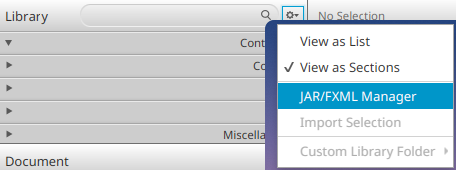

# Using UI Libraries

> [!IMPORTANT]
>
> The use of external libraries in your own project assignment is allowed on this course, but entirely at your own responsibility.
>
> Keep in mind that documentation quality varies between libraries. In the worst case, you may need to investigate the library's behavior directly from its source code.
> External libraries may also contain bugs and issues whose resolution can consume time that would otherwise be spent developing the project itself.
>
> Course instructors and teaching assistants provide support only for components and functionality included in the standard JavaFX library.

There are numerous extension libraries available for JavaFX that can make development easier.
You may find the following libraries useful:

- [ControlsFX](https://controlsfx.github.io/)
([Maven package](https://central.sonatype.com/artifact/org.controlsfx/controlsfx/11.1.2))

- [GemsFX](https://github.com/dlsc-software-consulting-gmbh/GemsFX)
([Maven package](https://central.sonatype.com/artifact/com.dlsc.gemsfx/gemsfx))

- [Awesome JavaFX](ttps://github.com/mhrimaz/AwesomeJavaFX?tab=readme-ov-file#libraries-tools-and-projects)
 collection of various interesting JavaFX libraries, tools, and projects

JavaFX libraries are added in the same way as any [other third-party dependency](../part6/04-external-libraries-and-java-project-management-tools.md#third-party-dependencies): locate the corresponding package from [Maven Central](https://central.sonatype.com/), copy the required dependency declaration, and add it to the `<dependencies>` section of the project's `pom.xml` file.

For example, ControlsFX can be enabled by adding the following to the `<dependencies>` section of `pom.xml`:

```xml
<dependency>
    <groupId>org.controlsfx</groupId>
    <artifactId>controlsfx</artifactId>
    <version>11.2.3</version>
</dependency>
```

This alone, however, does not make the library's components appear in SceneBuilder.
To make the components available in SceneBuilder as well, follow these steps:

1. Open the `.fxml` file you want to edit in SceneBuilder.

2. In the Library view, click the settings button next to the search bar and select **JAR/FXML Manager**.

   

3. In the dialog that opens, choose **Manually add Library from repository**.

4. Enter the information from the `<dependency>` declaration:
   * Group ID: Same value as the dependency's `groupId`. For ControlsFX this is `org.controlsfx`.
   * Artifact ID: Same value as the dependency's `artifactId`. For ControlsFX this is `controlsfx`.

   After entering the Group ID and Artifact ID values, press Enter. SceneBuilder will retrieve the library information from Maven Central.
   Then select the same version in the `<version>` field that you use in the dependency declaration. In the ControlsFX example above, this is `11.2.3`.
   Make sure that the version added to SceneBuilder matches the version used in the project's `pom.xml`.

5. Click **Add JAR**.
   This should open a component-selection dialog where you can preview the library's components and choose which ones to import into SceneBuilder.

   In most cases, simply clicking **Import Components** is sufficient, which imports all the components provided by the library.

6. Finally, close the dialog using the **Close** button.

The library's components should now appear in the **Custom** section of SceneBuilder's Library view.


You can now use those components exactly like the built-in JavaFX components.
