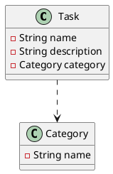
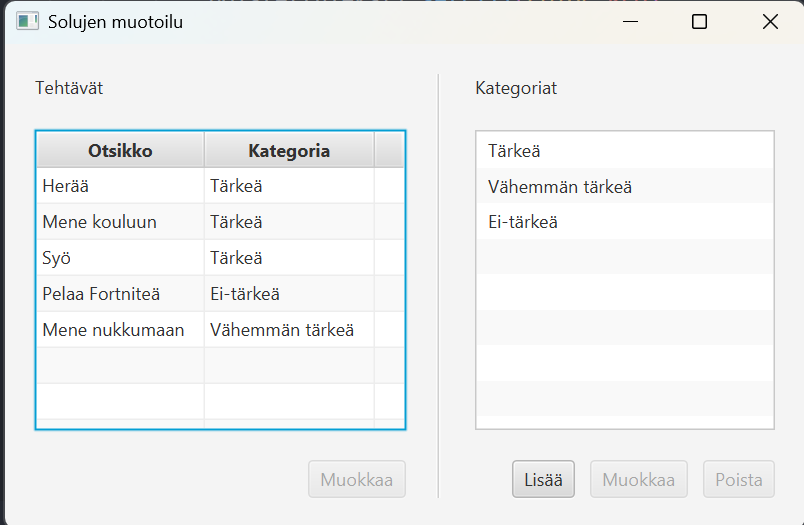

# Reference Management and Listening to Nested Property Objects

You can find the complete source code for this example on [GitHub](https://github.com/ohj-perus-jy/ohj2/tree/main/src/examples/javafx/ViitteidenKorjaaminen/src/main/java/fi/jyu/ohj2/esimerkit/viitteidenkorjaaminen).

Often, one object needs to reference another object in order to access the other object's data or functionality.

Suppose we have the following data model:



In an application, the dependency might look something like this.



Let's create `StringProperty title` and `ObjectProperty category` fields in the `Task` class corresponding to the JSON fields shown above.
Similarly, we create a `StringProperty name` field in the `Category` class.

```java,ignore
// FILE: Task.java
package fi.jyu.ohj2.examples.fixingreferences;

import javafx.beans.property.ObjectProperty;
import javafx.beans.property.SimpleObjectProperty;
import javafx.beans.property.SimpleStringProperty;
import javafx.beans.property.StringProperty;

public class Task {
    private final StringProperty title = new SimpleStringProperty();
    private final ObjectProperty<Category> Category = new SimpleObjectProperty<>();

    public Task() {
    }

    public Task(String title, Kategoria Category) {
        this.title.set(title);
        this.Category.set(Category);
    }

    // title
    public void setTitle(String title) {
        this.title.set(title);
    }

    public String getTitle() {
        return title.get();
    }

    public StringProperty titleProperty() {
        return title;
    }

    // Category
    public void setCategory(Kategoria Category) {
        this.Category.set(Category);
    }
    public Category getCategory() {
        return Category.get();
    }
    public ObjectProperty<Kategoria> categoryProperty() { return Category; }
}
// FILE_END
// FILE: Category.java
package fi.jyu.ohj2.examples.fixingreferences;

import javafx.beans.property.SimpleStringProperty;
import javafx.beans.property.StringProperty;

public class Category {
    private final StringProperty name = new SimpleStringProperty();

    public Category() {
    }

    public Category(String name) {
        this.name.set(name);
    }

    public void setName(String name) {
        this.name.set(name);
    }

    public String getName() {
        return name.get();
    }

    public StringProperty nameProperty() {
        return name;
    }

    public String toString() {
        return getName();
    }
}

// FILE_END
```

Tasks in the JSON file might look roughly like this:

```json
[
  {
    "title": "Wake up",
    "category": "Important"
  },
  {
    "title": "Go to school",
    "category": "Important"
  },
  {
    "title": "Eat",
    "category": "Important"
  },
  {
    "title": "Play Fortnite",
    "category": "Not Important"
  },
  {
    "title": "Go to sleep",
    "category": "Less Important"
  }
]
```

Similarly, categories might look like this:

```json
[
  {"name": "Important"},
  {"name": "Less Important"},
  {"name": "Not Important"}
]
```

If the name of a category is changed, it would be logical for all tasks referring to that category to automatically receive the updated category name, since they all refer to the same `Category` object.
Below is the desired state of the application.

<video controls width="400px">
  <source src="images/references-2.mp4" type="video/mp4">
</video>

However, in the JSON file, the category inside a task is only a string that acts as the category identifier.
When a `Task` object is later created from that string inside the controller, a new `Category` object is also created containing the same category name as the `Category` object loaded from `categories.json`.
These are two different objects.
As a result, whatever happens to the category will not be visible in tasks without manual updating.
This is problematic because it breaks the relationship between objects and makes the application harder to maintain.

To ensure that category names are updated automatically in the task listing without manual intervention, we must:

1. Ensure that the task object references the correct category object.
2. Make the category column of the `TableView` listen for changes to the category name using the `flatMap`
   (see [JavaDoc](https://openjfx.io/javadoc/23/javafx.base/javafx/beans/value/ObservableValue.html#flatMap(java.util.function.Function))) method inside `setCellValueFactory()`.

For example:

```java,ignore
categoryColumn.setCellValueFactory(cellData ->
                cellData
                .getValue()
                .categoryProperty()
                .flatMap(category -> category.nameProperty())
);
```

Let's examine this step by step.

First, we will fix the `Category` references stored in `Task` objects after the application starts.

Assume that our `MainController` contains collections for tasks and categories, together with the corresponding UI components.

```java,ignore
public class MainController implements Initializable {
    // ...

    @FXML
    private TableView tasksTable;

    @FXML
    private TableView categoriesTable;

    private ObservableList tasks = FXCollections.observableArrayList();
    private ObservableList categories = FXCollections.observableArrayList();

    // ...
}
```

Load categories and tasks from JSON files:

```java,ignore
public void initialize(URL url, ResourceBundle resourceBundle) {
    Path tasksPath = Path.of("tasks.json");
    Path categoriesPath = Path.of("categories.json");
    ObjectMapper mapper = new ObjectMapper();
    try {
        Category[] c = mapper.readValue(categoriesPath.toFile(), Category[].class);
        Task[] t = mapper.readValue(tasksPath.toFile(), Task[].class);
        categories.setAll(c);
        tasks.setAll(t);
    } catch (JacksonException e) {
        e.printStackTrace();
    }
}
```

Next, add tasks and categories to the UI components.

```java,ignore
public void initialize(URL url, ResourceBundle resourceBundle) {
    // ...
    TableColumn<Task, String> titleColumn = new TableColumn<>("Title");
    titleColumn.setCellValueFactory(cellData -> cellData.getValue().titleProperty());
    TableColumn<Task, String> categoryColumn = new TableColumn<>("Category");
    categoryColumn.setCellValueFactory(cellData -> cellData.getValue().categoryProperty().asString());
    tasksTable.getColumns().addAll(titleColumn, categoryColumn);

    TableColumn<Category, String> nameColumn = new TableColumn<>("Name");
    nameColumn.setCellValueFactory(cellData -> cellData.getValue().nameProperty());
    categoriesTable.getColumns().add(nameColumn);
}
```

At this point, if we edit a category name, the change is not reflected in the tasks.

<video controls width="400px">
  <source src="images/references-3.mp4" type="video/mp4">
</video>

Let's fix the references after loading the files.

```java,ignore
ObjectMapper mapper = new ObjectMapper();
try {
    Category[] c = mapper.readValue(categoriesPath.toFile(), Category[].class);
    Task[] t = mapper.readValue(tasksPath.toFile(), Task[].class);

    categories.setAll(c);
    // HIGHLIGHT_GREEN_BEGIN
    for (Task task : t) {
        Category jsonCategory = task.getCategory();
        task.setCategory(setCategoryReference(jsonCategory.getName()));
    }
    // HIGHLIGHT_GREEN_END
    tasks.setAll(t);
} catch (JacksonException e) {
    e.printStackTrace();
}

// If the task has no category,
// return an empty category.
// HIGHLIGHT_GREEN_BEGIN
private static final Category EMPTY_CATEGORY = new Category("");

private Category setCategoryReference(String name) {
    for (Category candidate : categories) {
        if (candidate.getName().equals(name)) {
            return candidate;
        }
    }
    return EMPTY_CATEGORY;
// HIGHLIGHT_GREEN_END
    /*
     * Stream-style version:
     *
     * return categories.stream()
     *      .filter(candidate -> candidate.getName().equals(category.getName()))
     *      .findFirst()
     *      .orElse(EMPTY_CATEGORY);
     */

// HIGHLIGHT_GREEN_BEGIN
}
// HIGHLIGHT_GREEN_END
```

Now category information is shared correctly between tasks, but changes still do not immediately appear in the `TableView`.
This is because the category column only listens for changes to the category reference itself.

<video controls width="400px">
  <source src="images/references-4.mp4" type="video/mp4">
</video>


The first idea might be to add a listener for `nameProperty()` into the extractor 
`(task.categoryProperty().get().nameProperty())`
Unfortunately, this does not work because `categoryProperty()` listens for changes to the category reference, and renaming a category does not create a new `Category` object.

The solution is to use `flatMap()`, which allows listening to nested property objects.
Add the following to the `initialize()` method:

```java,ignore
TableColumn<Task, String> titleColumn = new TableColumn<>("Title");
titleColumn.setCellValueFactory(cellData -> cellData.getValue().titleProperty());
TableColumn<Task, String> categoryColumn = new TableColumn<>("Category");
// HIGHLIGHT_GREEN_BEGIN
categoryColumn.setCellValueFactory(
    cellData -> cellData.getValue().categoryProperty().flatMap(category -> category.nameProperty()));
// HIGHLIGHT_GREEN_END
// HIGHLIGHT_RED_BEGIN
categoryColumn.setCellValueFactory(cellData -> cellData.getValue().categoryProperty().asString());
// HIGHLIGHT_RED_END
tasksTableView.getColumns().addAll(titleColumn, categoryColumn);
```

Without `flatMap()`, we have two nested property levels:

```text
categoryProperty() → ObjectProperty
                     ↓
                 nameProperty() → StringProperty
```

We want to listen to both levels:

* changes to the category itself
* changes to the category's name

because we always want to display an up-to-date category name in the `TableView` column.

`flatMap()` combines these two levels into a single `ObservableValue` that reacts to changes occurring on **both** levels.
This combination process is called *flattening*, because two nested layers become one flat layer.

The name `flatMap` consists of two parts:

* **Map**: transforms the value of the outer property (`Category`) into an inner property using a function (`category -> category.nameProperty()`).
* **Flat**: flattens the result so that there is no "property inside property" structure, only a single observable value.

The same naming convention appears in methods such as:
`Stream.flatMap()` and
`Optional.flatMap()`.

In practice, `flatMap()` works as follows:

1. It listens to the outer property (`categoryProperty()`).
2. When the outer property's value exists, it calls the provided function (`category -> category.nameProperty()`) and starts listening to the returned inner property.
3. If the outer value changes, `flatMap()` stops listening to the old inner property and starts listening to the new one's inner property.
4. The result is a single `ObservableValue` that updates whenever either 
   the category name changes, **or** the entire category reference changes.
