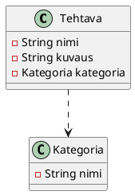

# Viitteiden hallinta

Usein olion on tarpeen viitata toiseen olioon, jotta se voi käyttää toisen olion
tietoja tai toimintoja. 

Oletetaan, että meillä on seuraava tietomalli.



Sovelluksessa riippuvuus voisi näyttää esimerkiksi seuraavalta.


Toisin sanoen, jokaisella `Tehtava`-oliolla on viite `Kategoria`-olioon, joka
kertoo, mihin kategoriaan tehtävä kuuluu. Tällöin `Tehtava`-olion on tarpeen
tallentaa viite `Kategoria`-olioon, jotta se voi käyttää `Kategoria`-olion
tietoja, kuten sen nimeä, ja mahdollisia muita tietoja, joita `Kategoria`-olioon
on tallennettu.

Jos kategorian nimeä muutetaan, on loogista, että kaikki tehtävät, jotka
viittaavat tähän kategoriaan, saavat automaattisesti päivitetyn kategorian
nimen, koska ne viittaavat samaan `Kategoria`-olioon. 

<video controls width="400px">
  <source src="images/references-2.mp4" type="video/mp4">
</video>

Ongelmaksi muodostuu nyt se, että tallennetut tehtävät näyttävät
JSON-tiedostossa suurin piirtein tältä:

```json
[
  {
     "otsikko": "Herää",
     "kategoria": "Tärkeä"
  },
  {
    "otsikko": "Mene kouluun",
    "kategoria": "Tärkeä"
  },
  {
    "otsikko": "Syö",
    "kategoria": "Tärkeä"
  },
  {
    "otsikko": "Pelaa Fortniteä",
    "kategoria": "Ei-tärkeä"
  },
  {
    "otsikko": "Mene nukkumaan",
    "kategoria": "Vähemmän tärkeä"
  }
]
```

Vastaavasti kategoriat näyttäisivät tältä:

```json
[
  {"nimi": "Tärkeä" },
  {"nimi": "Vähemmän tärkeä" },
  {"nimi": "Ei-tärkeä" }
]
```

Tehtävän sisällä kategoria on tosiasiallisesti vain merkkijono, joka toimii
kategorian tunnisteena, ei viite `Kategoria`-olioon. Mitä tahansa kategorialle
tapahtuukaan, muutos ei näy tehtävissä ilman manuaalista päivitystä. Tämä on
ongelmallista, koska se rikkoo olioiden välisen yhteyden ja tekee sovelluksesta
vaikeammin ylläpidettävän.

Ratkaisu tähän ongelmaan tallentaa `Tehtava`-olion sisällä viite
`Kategoria`-olioon sovelluksen käynnistämisen jälkeen. 

Tehdään `Tehtava`-luokkaan `StringProperty otsikko` ja
`ObjectProperty<Kategoria> kategoria` -kentät, jotka vastaavat yllä esitettyjä JSON-kenttiä. Vastaavasti `Kategoria`-luokkaan
tehdään `StringProperty nimi` -kenttä.

```java,ignore
// FILE: Tehtava.java
{{#include ../examples/javafx/ViitteidenKorjaaminen/src/main/java/fi/jyu/ohj2/esimerkit/viitteidenkorjaaminen/Tehtava.java}}
// FILE_END
// FILE: Kategoria.java
{{#include ../examples/javafx/ViitteidenKorjaaminen/src/main/java/fi/jyu/ohj2/esimerkit/viitteidenkorjaaminen/Kategoria.java}}
// FILE_END
```

Luetaan JSON-tiedostot `Tehtava`- ja `Kategoria`-olioiksi, ja näytetään ne
JavaFX-käyttöliittymässä. Lukeminen tehdään tässä kontrollerin
`initialize`-metodissa yksinkertaisuuden vuoksi. 

```java,ignore
public void initialize(URL url, ResourceBundle resourceBundle) {

    Path tehtavatPolku = Path.of("tehtavat.json");
    Path kategoriatPolku = Path.of("kategoriat.json");

    ObjectMapper mapper = new ObjectMapper();
    try {
        Kategoria[] k = mapper.readValue(kategoriatPolku.toFile(), Kategoria[].class);
        Tehtava[] t = mapper.readValue(tehtavatPolku.toFile(), Tehtava[].class);

        kategoriat.setAll(k);
        tehtavat.setAll(t);

    } catch (JacksonException e) {
        e.printStackTrace();
    }

    TableColumn<Tehtava, String> otsikkoColumn = new TableColumn<>("Otsikko");
    otsikkoColumn.setCellValueFactory(cellData -> cellData.getValue().otsikkoProperty());
    TableColumn<Tehtava, String> kategoriaColumn = new TableColumn<>("Kategoria");
    kategoriaColumn.setCellValueFactory(cellData -> cellData.getValue().kategoriaProperty().get().nimiProperty());

    tehtavatTable.getColumns().addAll(otsikkoColumn, kategoriaColumn);
    tehtavatTable.setItems(tehtavat);

    TableColumn<Kategoria, String> nimiColumn = new TableColumn<>("Nimi");
    nimiColumn.setCellValueFactory(cellData -> cellData.getValue().nimiProperty());
    kategoriatTable.getColumns().add(nimiColumn);
    kategoriatTable.setItems(kategoriat);
}
```

Lisätään vielä mahdollisuus muuttaa kategorian nimeä. Importit ja package-koodit
on jätetty pois tilan säästämiseksi. Muokkausnäkymä on yksinkertainen;
FXML-tiedostoa voit katsoa [GitHubista]().

```java,ignore
// FILE: MainController.java
@FXML
void kasitteleMuokkaaKategoria(ActionEvent event) {
    try {
        FXMLLoader loader = new FXMLLoader(App.class.getResource("muokkaaKategoria.fxml"));
        loader.setControllerFactory(_ -> new MuokkaaKategoriaController(valittuKategoria.get(), kategoriat));

        Parent root = loader.load();
        Stage muokkaaKategoriaDialogi = new Stage();
        muokkaaKategoriaDialogi.setScene(new Scene(root));
        muokkaaKategoriaDialogi.setTitle("Muokkaa kategoriaa");
        muokkaaKategoriaDialogi.initModality(Modality.APPLICATION_MODAL);
        muokkaaKategoriaDialogi.showAndWait();
        MuokkaaKategoriaController controller = loader.getController();
        if (controller.getKategoria().isPresent()) {
            Kategoria muokattuKategoria = controller.getKategoria().get();
            valittuKategoria.get().setNimi(muokattuKategoria.getNimi());
        }

    } catch (IOException ioe) {
        IO.println("Kategorian muokkaaminen epäonnistui: " + ioe.getMessage());
    }
}
// FILE_END
// FILE: MuokkaaKategoriaController.java
public class MuokkaaKategoriaController implements Initializable {

    @FXML
    private TextField kategoriaNimiTextField;

    @FXML
    private Button tallennaButton;

    private Kategoria kategoria;

    private Optional<Kategoria> palautettavaKategoria = Optional.empty();

    public MuokkaaKategoriaController(Kategoria kategoria, ObservableList<Kategoria> kategoriat) {
        this.kategoria = kategoria;
    }
    
    @Override
    public void initialize(URL arg0, ResourceBundle arg1) {
        kategoriaNimiTextField.setText(kategoria.getNimi());
    }

    @FXML
    void kasitteleTallenna(ActionEvent event) {
        String uusiNimi = kategoriaNimiTextField.getText();
        if (uusiNimi != null && !uusiNimi.isBlank()) {
            kategoria.setNimi(uusiNimi);
            palautettavaKategoria = Optional.of(kategoria);
        }
        tallennaButton.getScene().getWindow().hide();
    }

    public Optional<Kategoria> getKategoria() {
        return palautettavaKategoria;
    }
}
```

KESKEN...