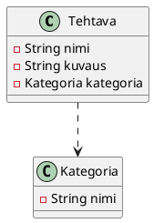

# Viitteiden hallinta

Löydät tämän esimerkin koodit kokonaisuudessaan [GitHubista](https://github.com/ohj-perus-jy/ohj2/tree/main/src/examples/javafx/ViitteidenKorjaaminen/src/main/java/fi/jyu/ohj2/esimerkit/viitteidenkorjaaminen).

Usein olion on tarpeen viitata toiseen olioon, jotta se voi käyttää toisen olion
tietoja tai toimintoja. 

Oletetaan, että meillä on seuraava tietomalli.



Sovelluksessa riippuvuus voisi näyttää esimerkiksi seuraavalta.


Tehdään `Tehtava`-luokkaan `StringProperty otsikko` ja
`ObjectProperty<Kategoria> kategoria` -kentät, jotka vastaavat yllä esitettyjä
JSON-kenttiä. Vastaavasti `Kategoria`-luokkaan tehdään `StringProperty nimi`
-kenttä.

```java,ignore
// FILE: Tehtava.java
{{#include ../examples/javafx/ViitteidenKorjaaminen/src/main/java/fi/jyu/ohj2/esimerkit/viitteidenkorjaaminen/Tehtava.java}}
// FILE_END
// FILE: Kategoria.java
{{#include ../examples/javafx/ViitteidenKorjaaminen/src/main/java/fi/jyu/ohj2/esimerkit/viitteidenkorjaaminen/Kategoria.java}}
// FILE_END
```


Tehtävät näyttävät JSON-tiedostossa suurin piirtein tältä:

```json
[
  {
     "otsikko": "Herää",
     "kategoria": "Tärkeä"
  },
  {
    "otsikko": "Mene kouluun",
    "kategoria": "Tärkeä"
  },
  {
    "otsikko": "Syö",
    "kategoria": "Tärkeä"
  },
  {
    "otsikko": "Pelaa Fortniteä",
    "kategoria": "Ei-tärkeä"
  },
  {
    "otsikko": "Mene nukkumaan",
    "kategoria": "Vähemmän tärkeä"
  }
]
```

Vastaavasti kategoriat näyttäisivät tältä:

```json
[
  {"nimi": "Tärkeä" },
  {"nimi": "Vähemmän tärkeä" },
  {"nimi": "Ei-tärkeä" }
]
```

Jos kategorian nimeä muutetaan, olisi loogista, että kaikki tehtävät, jotka
viittaavat tähän kategoriaan, saavat automaattisesti päivitetyn kategorian
nimen, koska ne viittaavat samaan `Kategoria`-olioon. Alla on kuvattuna
tavoitetila, miten haluaisimme, että sovelluksemme toimii: 

<video controls width="400px">
  <source src="images/references-2.mp4" type="video/mp4">
</video>


JSON-tiedostossa tehtävän sisällä kategoria on kuitenkin vain merkkijono, joka
toimii kategorian tunnisteena. Kun tuon merkkijonon perusteella aikanaan
kontrolleriessa luodaan `Tehtava`-olio, luodaan uusi `Kategoria`-olio, joka
sisältää saman kategorian nimen, kuin `Kategoria`-olio, joka luetaan
`kategoriat.json`-tiedostosta. Nämä ovat kaksi eri oliota. Näin ollen mitä
tahansa kategorialle tapahtuukaan, muutos ei näy tehtävissä ilman manuaalista
päivitystä. Tämä on ongelmallista, koska se rikkoo olioiden välisen yhteyden ja
tekee sovelluksesta vaikeammin ylläpidettävän.

Jotta kategorian nimi saadaan päivittymään tehtävälistauksessa ilman manuaalista
päivitystä, on 

 1. tehtävä-oliossa viitattava oikeaan kategoria-olioon, ja 
 2. TableView-olion kategoria-sarakkeen on kuunneltava kategorian nimen
    muutoksia `setCellValueFactory`-metodissa käyttäen `flatMap`-metodia (ks.
    [JavaDoc](https://openjfx.io/javadoc/23/javafx.base/javafx/beans/value/ObservableValue.html#flatMap(java.util.function.Function))). Esimerkki tästä on:

```java,ignore
kategoriaColumn.setCellValueFactory(cellData -> 
                 cellData
                .getValue()
                .kategoriaProperty()
                .flatMap(kategoria -> kategoria.nimiProperty()));
```

Katsotaan tätä tarkemmin vaihe vaiheelta. 

Korjataan aluksi `Tehtava`-oliossa olevat `Kategoria`-olioiden viitteet oikeaksi
sovelluksen käynnistämisen jälkeen.

Oletetaan, että meillä on `MainController`-luokassa attribuutit tehtäville ja
kategorioille ja niitä vastaavat GUI-oliot. 

```java,ignore
public class MainController implements Initializable {
    // ...
    @FXML
    private TableView<Tehtava> tehtavatTable;

    @FXML
    private TableView<Kategoria> kategoriatTable;

    private ObservableList<Tehtava> tehtavat = FXCollections.observableArrayList();
    private ObservableList<Kategoria> kategoriat = FXCollections.observableArrayList();
    // ...
}
```

Luetaan JSON-tiedostosta kategoriat ja tehtävät.

```java,ignore
public void initialize(URL url, ResourceBundle resourceBundle) {
    Path tehtavatPolku = Path.of("tehtavat.json");
    Path kategoriatPolku = Path.of("kategoriat.json");
    ObjectMapper mapper = new ObjectMapper();
    try {
        Kategoria[] k = mapper.readValue(kategoriatPolku.toFile(), Kategoria[].class);
        Tehtava[] t = mapper.readValue(tehtavatPolku.toFile(), Tehtava[].class);
        kategoriat.setAll(k);
        tehtavat.setAll(t);
    } catch (JacksonException e) {
        e.printStackTrace();
    }
}
```

Lisätään vielä tehtävät ja kategoriat UI-olioihin.

```java,ignore
public void initialize(URL url, ResourceBundle resourceBundle) {
    // ...
    TableColumn<Tehtava, String> otsikkoColumn = new TableColumn<>("Otsikko");
    otsikkoColumn.setCellValueFactory(cellData -> cellData.getValue().otsikkoProperty());
    TableColumn<Tehtava, String> kategoriaColumn = new TableColumn<>("Kategoria");
    kategoriaColumn.setCellValueFactory(cellData -> cellData.getValue().kategoriaProperty().asString());
    tehtavatTable.getColumns().addAll(otsikkoColumn, kategoriaColumn);

    TableColumn<Kategoria, String> nimiColumn = new TableColumn<>("Nimi");
    nimiColumn.setCellValueFactory(cellData -> cellData.getValue().nimiProperty());
    kategoriatTable.getColumns().add(nimiColumn);
}
``` 

 Nyt jos muokkaamme kategorian nimeä, se ei päivity tehtävään.

<video controls width="400px">
  <source src="images/references-3.mp4" type="video/mp4">
</video>


Korjataan viitteet oikeiksi tiedostojen lukemisen jälkeen.

```java,ignore
ObjectMapper mapper = new ObjectMapper();
try {
    Kategoria[] k = mapper.readValue(kategoriatPolku.toFile(), Kategoria[].class);
    Tehtava[] t = mapper.readValue(tehtavatPolku.toFile(), Tehtava[].class);

    kategoriat.setAll(k);
    // HIGHLIGHT_GREEN_BEGIN
    for (Tehtava tehtava : t) {
        Kategoria jsonistaLuettuKategoria = tehtava.getKategoria();
        tehtava.setKategoria(asetaKategoriaViite(jsonistaLuettuKategoria.getNimi()));
    }
    // HIGHLIGHT_GREEN_END
    tehtavat.setAll(t);

} catch (JacksonException e) {
    e.printStackTrace();
}

// Jos tehtävällä ei ole kategoriaa, palautetaan uusi kategoria, 
// joka on vain tyhjä merkkijono.
// HIGHLIGHT_GREEN_BEGIN
private static final Kategoria TYHJA_KATEGORIA = new Kategoria("");

private Kategoria asetaKategoriaViite(String nimi) {
    for (Kategoria ehdokas : kategoriat) {
        if (ehdokas.getNimi().equals(nimi)) {
            return ehdokas;
        }
    }
    return TYHJA_KATEGORIA;
// HIGHLIGHT_GREEN_END
    /* Tai stream-tyyliin:
     * return kategoriat.stream()
     * .filter(ehdokas -> ehdokas.getNimi().equals(kategoria.getNimi()))
     * .findFirst()
     * .orElse(TYHJA_KATEGORIA); 
     */
// HIGHLIGHT_GREEN_BEGIN
}
// HIGHLIGHT_GREEN_END
```

Nyt kategoriatieto kyllä päivittyy tehtäviin, mutta muutos ei näy heti
TableView-oliossa, koska kategoria-sarake kuuntelee vain kategorian viitteen
muutoksia. 

<video controls width="400px">
  <source src="images/references-4.mp4" type="video/mp4">
</video>

Ensimmäinen ajatus voisi olla, että lisätään `tehtavat`-listan ekstraktoriin
`nimiProperty()`-kuuntelija
(`tehtava.kategoriaProperty().get().nimiProperty()`). Valitettavasti tämä ei
toimi, koska `kategoriaProperty()`-kuuntelee kategorian viitteen muutoksia, eikä
nimen muuttaminen tuota uutta kategoria-oliota. 

Ratkaisu on käyttää `flatMap`-metodia, joka mahdollistaa sisäkkäisten
property-olioiden kuuntelemisen. Lisää oheinen rivi `initialize()`-metodiin. 

```java,ignore

TableColumn<Tehtava, String> otsikkoColumn = new TableColumn<>("Otsikko");
otsikkoColumn.setCellValueFactory(cellData -> cellData.getValue().otsikkoProperty());
TableColumn<Tehtava, String> kategoriaColumn = new TableColumn<>("Kategoria");
// HIGHLIGHT_GREEN_BEGIN
kategoriaColumn.setCellValueFactory(
            cellData -> cellData.getValue().kategoriaProperty().flatMap(kategoria -> kategoria.nimiProperty()));
// HIGHLIGHT_GREEN_END
// HIGHLIGHT_RED_BEGIN
kategoriaColumn.setCellValueFactory(cellData -> cellData.getValue().kategoriaProperty().asString());
// HIGHLIGHT_RED_END
tehtavatTableView.getColumns().addAll(otsikkoColumn, kategoriaColumn);

Tässä `flatMap`-metodi litistää sisäkkäisen
property-rakenteen (`Tehtava` → `Kategoria` → `nimi`) yhdeksi kuunneltavaksi
property-olioksi, jolloin kategoria-sarake pystyy kuuntelemaan kategorian nimen
muutoksia, eikä vain kategorian viitteen muutoksia.


Tehdään `MainController`-luokkaan kuuntelijat tehtävän ja kategorian
valitsemiseen.  

