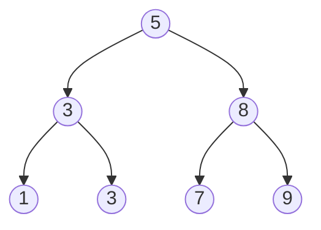

# Rekursio

> [!VAROITUS]
> Tämä osio julkaistaan 9. helmikuuta 2026.
> {{#include ../ei-julkaistu.md}}

> [!Osaamistavoitteet]
>
> - Ymmärrät miten rekursio toimii
> - Ymmärrät, miten rekursiota voidaan mallintaa pinon avulla
> - Rekursio, perus- ja induktiotapaukset, rekursiivinen tietorakenne (?). Hajota ja hallitse -periaate. Pinon käyttö rekursiossa.
> - Mahdollisesti jotakin dynaamisesta ohjelmoinnista (?)

## Johdanto

Rekursio tarkoittaa ongelman määrittelyä itsensä pienempien aliongelmien avulla.
Rekursiivinen ratkaisu on perusteltu, kun ongelmalla on selkeä perustapaus ja
kun rekursiivinen askel pienentää ongelmaa siten, että perustapaukseen päädytään
varmasti. Rekursio on luonteva tapa toteuttaa niin kutsuttua *hajota ja
hallitse* -periaatetta: ongelma jaetaan pienempiin osiin, ratkaistaan pienet
ongelmat ja yhdistetään tulokset.

Rekursio on erityisen luonteva toteuttaa algoritmeja silloin, kun käsitellään rekursiivisia tietorakenteita. Rekursiivinen tietorakenne on rakenne, jonka määritelmä viittaa itseensä.

Eräs esimerkki rekursiivisesta tietorakenteesta on linkitetty lista, jossa
jokainen solmu sisältää viitteen seuraavaan solmuun tai null-arvon, joka
merkitsee listan loppua. Linkitettyihin listoihin törmää käytännössä esimerkiksi
soittolistan toistossa (seuraava kappale), sovellusten "takaisin/eteenpäin"-
historiassa sekä käyttöjärjestelmien ja ohjelmistokirjastojen (eli valmiiden
ohjelmakokoelmien) sisäisissä tietorakenteissa. Seuraava Java-esimerkki näyttää
kokonaislukuja sisältävän linkitetyn listan rakenteen ja listan pituuden
laskemisen rekursiivisesti.

```java,ignore
class Solmu {
    int arvo;
    Solmu seuraava;

    Solmu(int arvo) {
        this.arvo = arvo;
    }
}
```

Tällä tavalla määritellyn listan pituuden laskemiseksi voidaan käyttää rekursiota:

```java,ignore
int pituus(Solmu solmu) {
    if (solmu == null) return 0;           // perustapaus
    return 1 + pituus(solmu.seuraava);     // rekursiivinen tapaus
}
```

Listan rakentelu "käsin" näyttäisi seuraavalta.

```java
//-class Solmu {
//-    int arvo;
//-    Solmu seuraava;
//-
//-    Solmu(int arvo) {
//-        this.arvo = arvo;
//-    }
//-}
//- 
//- int pituus(Solmu solmu) {
//-     if (solmu == null) return 0;           // perustapaus
//-     return 1 + pituus(solmu.seuraava);     // rekursiivinen tapaus
//- }
//-void main() {
Solmu eka = new Solmu(10);
eka.seuraava = new Solmu(20);
eka.seuraava.seuraava = new Solmu(30);

int n = pituus(eka); // n == 3
IO.println(n);
//-}
```

Tämä on kuitenkin hieman kömpelöä. Tyypillisessä käytössä listalla olisi oma
luokka, joka kapseloi `alku`-viitteen ja lisäämisen:

```java,ignore
class Lista {
    Solmu alku;

    void lisaaLoppuun(int arvo) {
        if (alku == null) {
            alku = new Solmu(arvo);
            return;
        }

        Solmu nykyinen = alku;
        while (nykyinen.seuraava != null) {
            nykyinen = nykyinen.seuraava;
        }
        nykyinen.seuraava = new Solmu(arvo);
    }

    int pituus() {
        return pituus(alku);
    }
}
```

Nyt listan käyttö näyttäisi seuraavalta:

```java
Lista lista = new Lista();
lista.lisaaLoppuun(10);
lista.lisaaLoppuun(20);
lista.lisaaLoppuun(30);

int n = lista.pituus(); // n == 3
```

## Rekursio käytännössä

Listat ovat lineaarisia: jokaisella solmulla on korkeintaan yksi seuraava solmu.
Monissa ongelmissa rakenne kuitenkin haarautuu. Puu on tällainen haarautuva
tietorakenne: se koostuu solmuista ja niiden lapsisolmuista, ja sillä on yksi
juurisolmu. Puu ei sisällä syklejä, joten solmulle ei päästä takaisin kulkemalla
lapsista ylöspäin.

Yleinen erikoistapaus on binääripuu, jossa jokaisella solmulla on korkeintaan
kaksi lasta: vasen ja oikea. Rekursio sopii puiden käsittelyyn, koska puu
koostuu alipuista: jokainen lapsi on itsekin puu.

Esimerkki binääripuusta:



Seuraava esimerkki laskee binääripuun korkeuden rekursion avulla. Ajatus seuraa
suoraan korkeuden määritelmästä: tyhjän puun korkeus on 0, ja ei-tyhjän puun
korkeus on 1 + suurimman alipuun korkeus. Jokainen polku juuresta lehteen kulkee
ensin vasempaan tai oikeaan alipuuhun, joten pisin polku saadaan valitsemalla
näistä kahdesta suurempi. Rekursio pysähtyy, kun alipuuta ei ole (`juuri ==
null`), jolloin perustapaus palauttaa 0.

```java
public class Solmu {
    // Solmun tallettama arvo.
    int arvo;
    // Viite vasempaan lapseen (null jos ei ole).
    Solmu vasen;
    // Viite oikeaan lapseen (null jos ei ole).
    Solmu oikea;

    Solmu(int arvo) {
        this.arvo = arvo;
    }
}

public static int korkeus(Solmu juuri) {
    if (juuri == null) {
        return 0;
    }

    return 1 + Math.max(korkeus(juuri.vasen), korkeus(juuri.oikea));
}

void main() {
    // Muodostetaan binääripuu
    Solmu juuri = new Solmu(1);
    juuri.vasen = new Solmu(2);
    juuri.oikea = new Solmu(3);
    juuri.vasen.vasen = new Solmu(4);

    IO.println(korkeus(juuri));
}
```

Kun `korkeus`-metodia kutsutaan juurisolmulle, laskenta etenee luonnollisesti
alaspäin puussa. Metodi kutsuu itseään vasemmalle ja oikealle alipuulle ja
jatkaa näin, kunnes vastaan tulee null, eli tyhjä puu. Tämä on rekursion
perustapaus: tyhjän puun korkeudeksi määritellään 0. 

Kun perustapaukseen on päästy, laskenta alkaa palautua takaisin päin kutsupinoa
pitkin. Jokainen solmu saa alipuittensa korkeudet ja määrittää oman korkeutensa
niiden perusteella arvona 1 + suuremman alipuun korkeus. Näin puun korkeus
rakentuu askel askeleelta lehdistä kohti juurta, pelkkien palautusarvojen
avulla. 

Tällainen ratkaisu intuitiivisesti selkeä, koska se vastaa suoraan puun
matemaattista määritelmää: solmun korkeus riippuu sen alipuista. Siksi koodi on
usein helppo lukea ja perustella oikeaksi. Haittapuolena on se, että rekursio
käyttää kutsupinoa. Jos puu on hyvin syvä, tämä voi johtaa pinon ylivuotoon, ja
lisäksi rekursiiviset kutsut aiheuttavat yleensä hieman enemmän
suorituskykykustannuksia kuin vastaava silmukkaratkaisu.

Tarkastellaan seuraavaksi esimerkkiä, jossa lasketaan binääripuun korkeus iteratiivisesti, eli ilman rekursiota.

```java
//-public class Solmu {
//-    int arvo;
//-    Solmu vasen;
//-    Solmu oikea;
//-
//-    Solmu(int arvo) {
//-        this.arvo = arvo;
//-    }
//-}

public static int puunKorkeusIteratiivisesti(Solmu juuri) {
    if (juuri == null) return 0;

    Queue<Solmu> jono = new LinkedList<>();
    jono.add(juuri);
    int korkeus = 0;

    while (!jono.isEmpty()) {
        int tasonKoko = jono.size();
        korkeus++;

        for (int i = 0; i < tasonKoko; i++) {
            Solmu nykyinen = jono.poll();
            if (nykyinen.vasen != null) jono.add(nykyinen.vasen);
            if (nykyinen.oikea != null) jono.add(nykyinen.oikea);
        }
    }

    return korkeus;
}
//-
//-void main() {
//-    //Muodostetaan binääripuu
//-    Solmu juuri = new Solmu(1);
//-    juuri.vasen = new Solmu(2);
//-    juuri.oikea = new Solmu(3);
//-    juuri.vasen.vasen = new Solmu(4);
//-
//-    IO.println(puunKorkeusIteratiivisesti(juuri));
//-}
```

Vaikka ongelma voitiin ratkaista iteratiivisesti, on iteratiivinen ratkaisu huomattavasti vaikeampi ymmärtää nopealla vilkaisulla.

## Rekursion mallintaminen pinon avulla

Kutsupino on ohjelman käyttämä pino, johon talletetaan aktiivisten
funktiokutsujen tilat. Kun funktiota kutsutaan, ohjelma tekee kutsupinoon (call
stack) uuden *pinokehyksen*. Pinokehys sisältää ainakin parametrit, paikalliset
muuttujat ja tiedon siitä, mihin kohtaan suoritusta palataan, kun kutsuttu
funktio palauttaa arvon. Tämä on mekanismi, joka tekee rekursiosta mahdollisen:
jokainen rekursiivinen kutsu keskeyttää nykyisen laskennan, tallentaa sen tilan
pinoon ja siirtää ohjauksen seuraavalle, pienemmälle aliongelmalle.

Rekursio etenee kahdessa vaiheessa:

1. Kutsuvaihe: jokainen rekursiivinen kutsu työntää uuden pinokehyksen pinoon.
2. Paluuvaihe: kun perustapaus saavutetaan, arvot palautuvat takaisin ja
   pinokehyksiä poistetaan yksi kerrallaan.

Seuraava pinokuvio havainnollistaa pinoa rekursiivisessa summassa, joka laskee
lukujen 1 + 2 + ... + n summan:

```java,ignore
int summa(int n) {
    if (n == 0) return 0;   // perustapaus
    return n + summa(n - 1);
}
```

Oletetaan, että kutsutaan `summa(3)`. Jokainen kehys sisältää parametrin `n`
ja keskeneräisen laskun "n + summa(n - 1)". Toisin sanoen kehys odottaa
alikutsun tulosta, jotta se voi lisätä oman lukunsa.

| Vaihe | Pino (alhaalta → ylös) | Mitä tapahtuu |
| --- | --- | --- |
| 1 | `summa(3)` | Odottaa `summa(2)` |
| 2 | `summa(3)`, `summa(2)` | Odottaa `summa(1)` |
| 3 | `summa(3)`, `summa(2)`, `summa(1)` | Odottaa `summa(0)` |
| 4 | `summa(3)`, `summa(2)`, `summa(1)`, `summa(0)` | Perustapaus: palauttaa 0 |
| 5 | `summa(3)`, `summa(2)`, `summa(1)` | Paluu: `summa(1) = 1 + 0 = 1` |
| 6 | `summa(3)`, `summa(2)` | Paluu: `summa(2) = 2 + 1 = 3` |
| 7 | `summa(3)` | Paluu: `summa(3) = 3 + 3 = 6` |
| 8 | (tyhjä) | Laskenta valmis, tulos 6 |

Kutsuvaiheessa pino kasvaa, koska jokainen kehys odottaa alikutsun tulosta
(esimerkiksi `n + summa(n - 1)`). Perustapauksen jälkeen laskenta etenee
takaisin päin, ja jokainen kehys täydentää omaa laskuaan alikutsun tuloksella.
Tämä on se "muisti", jonka ansiosta rekursio toimii.

Sama ajatus voidaan toteuttaa myös ilman rekursiota käyttämällä omaa pinoa.
Tällöin "pinokehys" on itse rakentamasi rakenne, joka kertoo mitä on vielä
tekemättä. Yksinkertainen esimerkki on kertoma, jossa rekursiivinen versio
kertoo tuloksen aina yhdellä luvulla lisää.

```java,ignore
int kertoma(int n) {
    if (n <= 1) return 1;
    return n * kertoma(n - 1);
}
```

Iteratiivinen versio voidaan kirjoittaa eksplisiittisen pinon avulla niin, että
ensin talletetaan "odottavat kertolaskut" ja sitten puretaan ne:

```java,ignore
int kertomaIter(int n) {
    Deque<Integer> pino = new ArrayDeque<>();
    while (n > 1) {
        pino.push(n);
        n--;
    }

    int tulos = 1;
    while (!pino.isEmpty()) {
        tulos *= pino.pop();
    }

    return tulos;
}
```

Tässä itse ylläpitämämme pino korvaa kutsupinon: jokainen talletettu luku vastaa
rekursiivisen kutsun "odottavaa" vaihetta. Yleinen sääntö on, että jos
rekursiivisessa ratkaisussa on työn tekemistä sekä ennen että jälkeen alikutsun,
tarvitset pinokehykseen lisäksi tiedon siitä, missä vaiheessa ollaan. Tämä on
syy, miksi rekursion muuttaminen silmukaksi vaatii usein pinoa eikä pelkkää
muuttujaa.

Käytännössä rekursio on siis vain yksi tapa käyttää pinoa. Se on usein selkeä
ja suoraan ongelman määritelmästä johdettavissa, mutta syvä rekursio kasvattaa
kutsupinoa ja voi aiheuttaa pinon ylivuodon. Iteratiivinen ratkaisu eksplisiittisellä
pinolla antaa enemmän hallintaa, mutta koodi on yleensä pidempi ja vähemmän
luettava.

Seuraavassa on esimerkki siitä, miten rekursion “tilaa” voidaan mallintaa
omalla pinokehys-oliolla. Tässä pinokehys kertoo, onko solmu jo käsitelty
“kutsuvaiheessa” vai ollaanko “paluuvaiheessa”. Kutsuvaiheessa alikutsu
alustetaan ja pinokehys jää odottamaan sen tulosta; paluuvaiheessa odotus on
päättynyt ja kehys viimeistelee oman työnsä. 

Tätä rakennetta käytetään myös seuraavassa tehtävässä. 

```java,ignore
static class Frame {
    Solmu solmu;
    boolean kayty;

    Frame(Solmu solmu, boolean kayty) {
        this.solmu = solmu;
        this.kayty = kayty;
    }
}
```

Tulostetaan nyt binääripuun solmut jälkijärjestyksessä (vasen, oikea, solmu).
Tässä työ tehdään **alikutsujen jälkeen**, joten meidän täytyy muistaa, onko
solmu jo nähty kutsuvaiheessa (ja laitettu takaisin pinoon odottamaan) vai
ollaanko paluuvaiheessa, jossa varsinainen työ tehdään. Siksi tarvitaan `Frame`:
sen avulla tiedetään **mihin solmuun palataan** ja **ollaanko kutsuvaiheessa vai
paluuvaiheessa** (vaihe-taulukon odotusvaiheet 1–3 ja paluuvaiheet 5–7), eli
odotetaanko vielä rekursiivisten kutsujen tulosta vai ollaanko jo palaamassa.

```java,ignore
void tulostaJalkijarjestyksessa(Solmu juuri) {
    if (juuri == null) return;

    Deque<Frame> pino = new ArrayDeque<>();
    // Huomio: Java:ssa Stack on vanhentunut; Deque/ArrayDeque on suositeltu pino.
    pino.push(new Frame(juuri, false));

    while (!pino.isEmpty()) {
        Frame f = pino.pop();
        if (f.kayty) {
            IO.println(f.solmu.arvo); // paluuvaihe
            continue;
        }

        // Kutsuvaihe: laitetaan solmu odottamaan ja työnnetään lapset.
        f.kayty = true;
        pino.push(f);
        if (f.solmu.oikea != null) pino.push(new Frame(f.solmu.oikea, false));
        if (f.solmu.vasen != null) pino.push(new Frame(f.solmu.vasen, false));
    }
}
```


## Mitä rekursio tarkoittaa yleisellä tasolla

Rekursiivinen ongelmanratkaisu voidaan jakaa kahteen vaiheeseen:

1) Perustapaus:
- Jos ongelma on riittävän helppo, ratkaise se ja palauta vastaus.

2) Rekursiivinen tapaus:
- Muunna ongelmaa hiukan helpommaksi ja välitä se seuraavalle ratkaisijalle

(Hiukan erilainen sanoitus)
1. Voinko ratkaista tämän nyt?
2. Jos en, miten teen ongelmasta helpomman ja lähetän sen eteenpäin?

- Ongelman määrittely itseään pienempien aliongelmien avulla
- Rekursiivisen funktion rakenne
    - Funktion kutsuminen itseään
    - Parametrien muuttuminen kutsujen välillä

- Esimerkkitehtäviä:
   - Faktoriaali
   - Fibonacci
   - Puun tai listan läpikäynti

## Rekursio pinon avulla
Kutsupino (call stack)
- Miten funktiokutsut tallentuvat pinoon
- Paikallisten muuttujien elinkaari

Rekursion eteneminen pinossa
- Kutsuvaihe (push)
- Paluuvaihe (pop)

Rekursion ja iteratiivisen ratkaisun vertailu
- Rekursio vs. silmukat

Muistin käyttö

```java
void lahtolaskenta(int n) {
    if (n == 0) return;
    IO.println(n);
    lahtolaskenta(n - 1);
}

void main() {
    lahtolaskenta(5);
}
```

- Milloin rekursio pysähtyy
- Tyypilliset virheet (puuttuva tai väärä perustapaus)
    - Ääretön rekursio --> Liian suuret kutsusyvyydet
    - Virheellinen perustapaus

Induktiotapaus (rekursiivinen askel)
- Ongelman pienentäminen
- Oikean etenemissuunnan valinta

## Rekursiiviset tietorakenteet
"Itsensä sisältävää" tietorakennetta voidaan kutsua rekursiiviseksi tietorakenteeksi. Esimerkkejä tällaisista ovat linkitetty lista, puut ja graafit.

- Rekursiiviset algoritmit tietorakenteille
    - Haku
    - Läpikäynti (DFS, preorder, inorder, postorder)

### Hajota ja hallitse
Sopii erityisen hyvin, jos ongelma jakaantuu riippumattomiin aliongelmiin.
- Periaatteen idea
    - Ongelman jakaminen osiin
    - Osaongelmien yhdistäminen
- Rekursion rooli hajota ja hallitse -menetelmässä
- Esimerkkejä algoritmeista
    - Merge sort
    - Quick sort
    - Puolitushaku (engl. *binary search*)

## Pinon käyttö rekursiossa
Rekursiossa pinoa hallinnoi ohjelmointikieli. Iteratiivisessa ratkaisussa sinä itse huolehdit pinon käytöstä.

- Implisiittinen pino (kutsupino)
- Eksplisiittinen pino
    - Rekursion simulointi itse toteutetulla pinolla

## Dynaaminen ohjelmointi?
Dynaaminen ohjelmointi on sekä matemaattinen optimointimetodi ja algoritminen paradigma. 
- Yhteys rekursioon
    - Rekursiivinen määrittely + muistin käyttö
- Päällekkäiset aliongelmat
- Muistitekniikat
    - Memoisaatio
    - Taulukointi (bottom-up)
- Esimerkkejä
    - Fibonacci optimoituna
    - Kapsäkkiongelma (engl. *knapsack problem*) (koliket)

# Ahne algoritmi

Ahne algoritmi on mikä tahansa algoritmi, joka noudattaa heuristiikkaa, jossa jokaisessa tilanteessa valitaan lokaali optimi. Katsotaan seuraavaksi esimerkki ahneesta algoritmista eurovaluutalle

```java
void main() {
    int[] tulos = ahneMenetelma(new int[]{1,2,5,10,20,50}, 4);
    IO.println(Arrays.toString(tulos));
}

// Oletetaan, että yksiköt ovat jo nousevassa järjestyksessä
private int[] ahneMenetelma(int[] valuutat, int tavoite) {
    List<Integer> tulos = new ArrayList<>();
    int jaljella = tavoite;

    for (int i = valuutat.length - 1; i >= 0; i--) {
        int valuutta = valuutat[i];

        int maara = jaljella / valuutta; //Otetaan niin monta kuin mahdollista
        for (int j = 0; j < maara; j++) {
            tulos.add(valuutta);
        }
        jaljella -= maara * valuutta;
    }
    // Tavoite ei mahdollinen
    if(jaljella != 0) return new int[0];
    return tulos.stream().mapToInt(Integer::intValue).toArray();
}
```
Useimmat nykyiset rahayksiköt ovat tarkoituksella suunniteltu siten (kuten euro), että ahne algoritmi antaa optimaalisen tuloksen. Esimerkiksi, jos meillä olisi yksiköt `1,3,4` ahne algoritmi antaa tavoitteelle 6 tuloksen `4+1+1`, eikä globaalia optimia `3+3`:

```java
void main() {
    int[] tulos = ahneMenetelma(new int[]{1,3,4}, 6);
    IO.println(Arrays.toString(tulos));
}

//-private int[] ahneMenetelma(int[] valuutat, int tavoite) {
//-    List<Integer> tulos = new ArrayList<>();
//-    int jaljella = tavoite;

//-    for (int i = valuutat.length - 1; i >= 0; i--) {
//-        int valuutta = valuutat[i];

//-        int maara = jaljella / valuutta; //Otetaan niin monta kuin mahdollista
//-        for (int j = 0; j < maara; j++) {
//-            tulos.add(valuutta);
//-        }
//-        jaljella -= maara * valuutta;
//-    }
//-    // Tavoite ei mahdollinen
//-    if(jaljella != 0) return new int[0];
//-    return tulos.stream().mapToInt(Integer::intValue).toArray();
//-}
```
