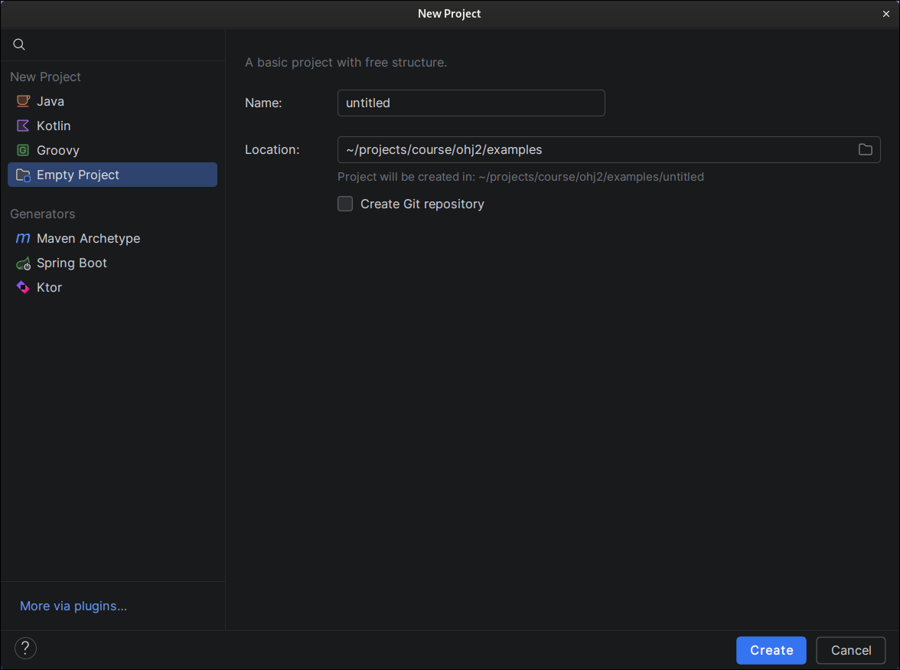
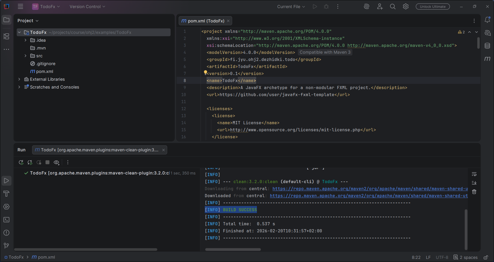

# JavaFX perusteet

> [!Osaamistavoitteet]
> - Ymmärrät JavaFX-sovelluksen rakenteen

Olemme tähän saakka tehneet komentorivisovelluksia ja lähinnä tulostaneet
tekstiä ruudulle. Graafinen käyttöliittymä (GUI) on kuitenkin monille ohjelmille
olennainen osa. Graafisen käyttöliittymän avulla käyttäjä näkee painikkeita,
valikoita ja kuvia sen sijaan, että hänen pitäisi opetella kirjoittamaan
komentoja oikeassa muodossa. 

Java-kielelle on useita kirjastoja graafisten käyttöliittymien toteuttamiseen,
mutta JavaFX on niistä ehkäpä nykyaikaisin ja monipuolisin:

1.  **Scene Graph (näkymägraafi):** JavaFX käsittelee käyttöliittymää puumaisena
    rakenteena. Jokainen ikkunan osa (painike, teksti, ryhmittelyelementti) on
    "solmu" (*Node*), joka kuuluu johonkin suurempaan kokonaisuuteen. Tämä tekee
    monimutkaistenkin näkymien hallinnasta loogista.
2.  **Ulkoasun ja logiikan erottaminen:** Voimme määritellä sovelluksen ulkoasun
    tekstipohjaisesti FXML-kielellä ja kirjoittaa
    toiminnallisen logiikan tavallisena Java-koodina. Tämä muistuttaa tapaa,
    jolla web-kehityksessä erotetaan rakenne (HTML) ja toiminta (JavaScript).
3.  **CSS-tyylittely:** JavaFX tukee CSS-tyylitiedostoja. Voit siis muuttaa
    ohjelmasi ulkoasua lähes samalla tavalla kuin tekisit nettisivuja tyylitellessäsi.
1.  **Ominaisuudet ja sitominen (*Properties and Binding*):** Tämä on yksi
    JavaFX:n tehokkaimmista työkaluista. Voimme "sitoa"
    käyttöliittymäkomponentin (esim. tekstikentän) suoraan olion tilaan. Jos
    olion tila muuttuu, käyttöliittymä päivittyy automaattisesti ilman, että meidän
    tarvitsee kirjoittaa erillistä päivityskoodia.

Analogia: teatteriesitys

Ajattele JavaFX-sovellusta kuin teatteriesitystä:

- **Stage (Näyttämö):** Itse ikkuna, jonka käyttäjä näkee.
- **Scene (Kohtaus):** Se, mitä näyttämöllä tapahtuu juuri nyt. Voit vaihtaa kohtausta (näkymää) lennosta.
- **Actors (Näyttelijät/Solmut):** Painikkeet, tekstit ja kuvat, jotka ovat osa kohtausta.
- **Script (Käsikirjoitus/Kontrolleri):** Java-koodi, joka kertoo, miten näyttelijät reagoivat, kun käyttäjä esimerkiksi klikkaa painiketta.

## Tutoriaali: TODO-sovellus

Osien 7 ja 8 aikana rakennamme yksinkertaisen TODO-sovelluksen. Tähän osioon
kuuluu tehtäviä, jossa opit tekemään saman sovelluksen omatoimisesti. Nämä osat
antavat sinulle tarvittavan ymmärryksen JavaFX:stä, jotta voit luoda oman
harjoitustyön osien 9-11 aikana. 

Osassa 7 teemme sovellukseen seuraavat ominaisuudet:

 * Käyttäjä voi lisätä uuden tehtävän
 * Käyttäjä näkee listan kaikista tehtävistä
 * Käyttäjä voi merkitä tehtävän tehdyksi
 * Käyttäjä voi poistaa tehtävän
 * Käyttäjä voi palauttaa tehdyn tehtävän takaisin tekemättömäksi
 * Tehtävät tallennetaan tiedostoon, jotta ne säilyvät sovelluksen sulkemisen jälkeen
 * Tehtävät haetaan tiedostosta sovelluksen käynnistyessä

Kuten aiemminkin, tämänkin osan tehtävistä täytyy tehdä vähintään 50%.
Erityisesti osissa 7 ja 8 kuitenkin suosittelemme tekemään kaikki tehtävät
jotta harjoitustyön tekeminen olisi helpompaa. Bonustehtävät jäävät kuitenkin
edelleen vapaavalintaisiksi. 

## Ensimmäinen JavaFX-sovellus

Tehdään nyt IDEAssa uusi JavaFX-projekti. 
Avaa IDEA ja valitse
File <i class="bi bi-chevron-right"></i> New <i class="bi bi-chevron-right"></i>
Project. Avautuu tuttu *New Project* -näkymä:

Aiemmissa osissa olemme luoneet tyhjiä projekteja, johon lisäsimme koodia
ja riippuvuuksia. JavaFX vaatii kuitenkin useita riippuvuuksia, asetuksia
ja alustuskoodia, joita olisi vaivallollista lisätä käsin aina, kun halutaan
tehdä uusi sovellus.

Käytämmeki valmista Maven-projektipohjaa, eli ns. *Maven-arkkityyppiä* (engl. Maven Archetype).
Pohja sisältää esimerkiksi valmiin rakenteen projektille, koodia ja valmiiksi määritellyt riippuvuudet. Maven-arkkityyppejä on hyvin
monenlaisia erilaisiin käyttötarkoituksiin. 
Käytämmekin jatkossa tätä kurssia varten tehtyä valmista pohjaa.

Valitse vasemmasta laidasta **Maven Archetype** jolloin saat seuraavat asetukset
näkyviin:

Täytetään lomake meidän projektitiedoilla:

- **Name**: `TodoFx`
- **Location**: Valitse jokin kansio, johon haluat luoda projektin. Voit
  kirjoittaa kansion polun käsin tai käyttää kansionvalitsinta <i class="bi
  bi-folder"></i>-ikonista
- **Create Git repository**: Jätä tyhjäksi. Luomme uuden Git-varaston itse myöhemmin.
- **JDK**: Valitse jokin Java 25 -vaihtoehto. Oletusarvo on yleensä hyvä.
  Tarvittaessa voit ladata JDK:n seuraamalla [työkalujen asennusohjeita](../tyokalut.md#java-development-kit-jdk-jdk).
- **Catalog**: `Maven Central`
- **Archetype**: `io.github.ohj-perus-jy:javafx-fxml-template`
- **Version**: Valitse uusin versio, jos se näkyy. Jos ei, kirjoita kenttään
  käsin `1.0.1`.
- **Additional properties**: Jätä muokkaamatta. Projektipohjan oletusarvot
  riittävät tähän tarkoitukseen.
- **Additional settings** (Klikkaa otsikosta jos sen alla olevia asetuksia ei näy):
  - **GroupId**: Aseta jokin ainutlaatuinen avain sovellukselle. Javassa yleinen
    käytäntö on kirjoittaa avain muodossa `<oma verkkosivun osoite
    käänteisesti>.<sovelluksen tunniste>`. Tässä materiaalissa voit käyttää
    tunnisteena `fi.jyu.ohj2.nimesi.todo`, missä `nimesi` on
    etunimesi tai käyttäjätunnukseksi ilman erikoismerkkejä.
  - **ArtifactId**: Tämä täsmää projektin **Name**-kentän kanssa
  - **Version**: `0.1`

Tietojen täyttämisen jälkeen lomakkeen tulisi siten näyttää seuraavalta:

Paina sen jälkeen *Create*. Tämä luo projektin ja aloittaa Maven-arkkityypin alustamisen.

Anna projektin alustuksen suoriutua loppuun. Lopuksi *Run*-paneelissa
pitäisi lukua `BUILD SUCCESS`-teksti onnistumisen merkiksi:

Kokeillaan vielä käynnistää sovellus.
Avaa projektiselaimessa `src/main/java/<pakkauksen nimi>`-kansiossa
oleva `Main`-luokka ja klikkaa `main`-pääohjelman vieressä olevaa
ajopainiketta (<i class="bi bi-play-fill"></i>) ja valitse *Run*:

Tämä käynnistää sovelluksen, jossa sinun pitäisi nyt nähdä yksi klikattava
painike. Lisäksi tämä luo ajokonfiguraation, ja voit painaa Play-painiketta
suoraan jatkossa.

## JavaFX-sovelluksen rakenne

JavaFX-sovellus koostuu yleensä kolmesta pääkomponentista: pääluokka, ulkoasu ja
kontrolleriluokka. 

**Pääluokka** on Java-luokka, joka toimii sovelluksen käynnistyspisteenä.
Esimerkissämme se on `App.java`, jota kutsutaan `Main.java`-tiedostossa olevasta
perinteisestä `main()`- pääohjelmasta. Pääluokka perii `Application`-luokan ja
määrittelee, miten sovellus luo ja näyttää ikkunan. Pääluokka on vastuussa
sovelluksen elinkaaren hallinnasta.

**Ulkoasu** määritellään niin kutsutussa FXML-tiedostossa, joka on XML-pohjainen
kuvaus käyttöliittymästä. Esimerkissämme se löytyy `resources`-kansiosta nimeltä
`main.fxml`. FXML-tiedosto määrittelee tekstimuodossa, millaisia komponentteja
ikkunassa on ja miten ne on järjestetty. FXML-tiedosto ei ole siis Java-koodia,
vaan erillinen tiedosto, joka kuvaa käyttöliittymän rakennetta. Pienessä
projektissa FXML-tiedostoja on yleensä vain yksi, mutta suuremmissa projekteissa
niitä voi olla useita. Jos esimerkiksi sovelluksella on useita eri näkymiä,
kuten päävalikko, asetukset ja itse pääkäyttöliittymä, jokaiselle näkymälle
voidaan luoda oma FXML-tiedosto.

**Kontrolleriluokka** on Java-luokka, joka sisältää logiikan käyttöliittymän
komponenttien käsittelyyn. Esimerkkiprojektissamme tämän nimi on
`MainController.java`. Kontrolleriluokassa määritellään miten sovellus reagoi
käyttäjän syötteisiin ja tapahtumiin. Kontrolleriluokka sisältää metodeja, jotka
on sidottu FXML-tiedoston komponentteihin, kuten painikkeisiin ja
tekstikenttiin. Nämä metodit määrittelevät, mitä tapahtuu, kun käyttäjä
vuorovaikuttaa käyttöliittymässä olevien komponenttien kanssa.
Kontrolleriluokkia on yleensä yksi per FXML-tiedosto, ja ne toimivat ikään kuin
välittäjinä FXML:n ja pääluokan välillä.

## TODO.... Tarvittaneenko tässä??? Stage, Scene ja Node

Stage on ikkunan pääkomponentti, joka sisältää kaikki muut komponentit. 

Scene on ikkunan sisältö, joka koostuu erilaisista graafisista elementeistä,
kuten painikkeista, tekstikentistä ja kuvista. Nämä elementit järjestetään
layout-pohjiin, kuten VBox tai HBox, jotka määrittävät niiden asettelun
ikkunassa.

Node on JavaFX:n peruskomponentti, joka toimii pohjana kaikille
graafisilleelementeille. Esimerkiksi Button, Label ja TextField ovat kaikki
Node-luokan aliluokkia.
