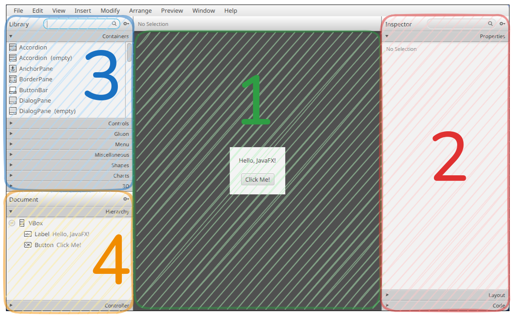
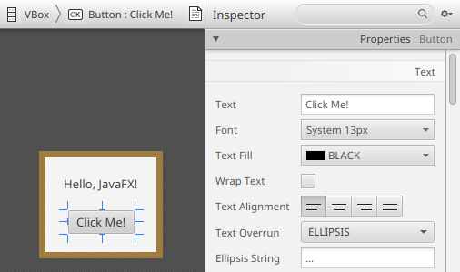
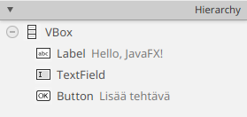

# SceneBuilder

> [!Osaamistavoitteet]
> - Osaat käyttää SceneBuilder-työkalua JavaFX-käyttöliittymien luomiseen
> - Osaat yhdistää FXML-tiedoston ja kontrolleriluokan

> [!TÄRKEÄÄ]
>
> Tästä luvusta alkaen tarvitset SceneBuilder-työkalun.
> 
> Asenna työkalu seuraamalla [kurssin työkaluohjeita](../tyokalut.md#scenebuilder).

SceneBuilder on visuaalinen työkalu, joka helpottaa JavaFX-käyttöliittymien
luomista. Se tarjoaa drag-and-drop-käyttöliittymän, jonka avulla voit luoda ja
muokata FXML-tiedostossa määriteltyä käyttöliittymää ilman FXML:n kirjoittamista
käsin. SceneBuilderin avulla voit helposti lisätä komponentteja, määrittää
niiden ominaisuuksia ja järjestää ne haluamallasi tavalla. Se on erityisen
hyödyllinen, jos et ole vielä tottunut kirjoittamaan FXML:ää suoraan tai haluat
nopeuttaa käyttöliittymän suunnitteluprosessia.

SceneBuilderin päänäkymään on kolme pääaluetta.

## Ensimmäinen komponentti

Avataan nyt alkuun projektimme `main.fxml`-näkymätiedosto SceneBuilderissä.

Avaa SceneBuilder ja valitse vasemmasta alalaidasta **Open Project**.
Hae ja avaa `src/resources/pakkaus`-kansiosta `main.fxml` (tässä `pakkaus`
viittaa edellisessä vaiheessa luotun projektin pääpakkauksen alikansioita).
Nyt sama käyttöliittymä, jonka näimme IDEAssa, pitäisi näkyä SceneBuilderissä:



Tutustutaan samalla SceneBuilderin käyttöliittymään:

1. **Suunnittelunäkymä.** Tässä näet FXML-tiedoston
   määrittelemän käyttöliittymän visuaalisena esityksenä. Voit tässä raahata
   komponentteja ja järjestää niitä haluamallasi tavalla.

2. **Inspector-näkymä.** Löydät tästä muun muassa *Properties*-, *Layout*-
   ja *Code*-paneeleja. Näissä paneeleissa voi muuttaa
   valitun komponentin ominaisuuksia, kuten tekstiä, fonttia, väriä sekä
   asettelua ja määrittää komponentin ja kontrollerin liittämiseen
   liittyvät asetukset.

3. **Library-näkymä.** Löydät tästä kaikki käytettävissä olevat komponentit, kuten painikkeet,
   tekstikentät, layout-komponentit ja niin edelleen.
   Saat lisättyä komponentit käyttölittymään raahamalla ne suunnittelunäkymään.

4. **Document-näkymä.** Näet tässä sovelluksesi kaikki komponentit puurakenteessa.
   Voit käyttää tämän näkymän komponenttien tarkkaan valintaan, siirtämiseen ja poistamiseen.

 * Vasemmalla on kaksi paneelia: **Library** ja **Document**. Library-paneelista
   löydät kaikki käytettävissä olevat komponentit, kuten painikkeet,
   tekstikentät, layout-komponentit ja niin edelleen. Document-paneelissa näet
   hierarkkisen esityksen oman sovelluksesi käyttöliittymän rakenteesta.
 
Suunnittelunäkymässä on valmiina painike, eli `Button`-komponentti sekä nimiö eli
`Label`-komponentti. Jos napsautat `Button`-komponenttia, näet oikealla
Properties-paneelissa kyseisen komponentin ominaisuuksia. Voit muuttaa
esimerkiksi tekstiä, fonttia, väriä ja monia muita ominaisuuksia.

Kokeile alkuun muokata painikkeen tekstiä. Klikkaa suunnittelunäkymässä olevasta
painikkeesta, jolloin painikkeen perusominaisuudet ilmestyvät Inspector-näkymän
Properties-paneeliin:



Muuta painikkeen *Text*-ominaisuus arvoon `Lisää tehtävä` ja paina <kbd>Enter</kbd>.
Huomaa, että painikkeen teksti päivittyy samalla suunnittelunäkymässä.

Tallenna muutokset (**File** <i class="bi bi-chevron-right"></i> **Save**).
Kokeile nyt ajaa sovellus taas IDEA:n kautta. Huomaat, että painikkeen teksti muuttui.

## Käyttöliittymän hierarkkinen rakenne

Vasemmalla olevassa Document-paneelissa näet käyttöliittymän rakenteen, joka
muistuttaa hierarkiaa: `Button` ja `Label`-komponentit ovat `VBox`-komponentin
lapsia. `VBox` (Vertical Box, eli "pystysuuntainen laatikko") on
layout-komponentti, joka järjestää lapsikomponentit automaattisesti
pystysuoraan. 

JavaFX:ssä on paljon vastaavia valmiita `Pane`-luokasta periytyviä luokkia,
jotka auttavat järjestelemään käyttöliittymää kokonaisuuksiin sen sijaan, että
kaikki komponentit olisivat yhdessä läjässä suoraan ikkunan alaisuudessa. 

 * `HBox`-komponentti järjestää lapsensa vaakasuoraan,
 * `GridPane`-komponentti järjestää lapsensa ruudukkomaisesti,
 * `BorderPane`-komponentti järjestää lapsensa reunoille ja keskelle, ja niin
edelleen. 

Näiden komponenttien avulla voidaan luoda monimutkaisiakin
käyttöliittymiä, jotka skaalautuvat hyvin eri kokoisiksi ikkunoiksi.

## Syöttökenttä

Lisätään nyt käyttöliittymään syöttökenttä, johon käyttäjä voi kirjoittaa.
Valitse vasemmalta **Library-näkymän** paneeleista **Controls** <i class="bi bi-chevron-right"></i> **`TextField`** ja raahaa se `VBox`-komponentin sisään,
aiemman tekstikentän ja painikkeen väliin:

<video src="images/scenebuilder-textfield-drag.mp4" controls></video>

(Mikäli pudotit tekstikentän väärään paikkaan, voit peruuttaa muutokset
painamalla <kbd>Ctrl</kbd>+<kbd>Z</kbd> tai <kbd>⌘</kbd>+<kbd>Z</kbd>)

Tallenna muutokset (**File** <i class="bi bi-chevron-right"></i> **Save**)
ja kokeile vielä käynnistää sovellus IDEA:ssa. Huomaat, että sovellukseen
ilmestyi syöttökentä, johon voi kirjoittaa tekstiä.

<details><summary><i class="bi bi-stars jyu-gold"></i>Bonus: Missä käyttöliittymä on määritelty?</summary>

Avaa IDEA:ssa `resources`-kansiossa oleva `main.fxml`.
Tiedoston pitäisi näyttää nyt suunnilleen seuraavalta:

```xml
<?xml version="1.0" encoding="UTF-8"?>

<?import javafx.geometry.Insets?>
<?import javafx.scene.control.Button?>
<?import javafx.scene.control.Label?>
<?import javafx.scene.control.TextField?>
<?import javafx.scene.layout.VBox?>

<VBox alignment="CENTER" spacing="20.0" xmlns="http://javafx.com/javafx/25" xmlns:fx="http://javafx.com/fxml/1" fx:controller="fi.jyu.ohj2.dezhidki.todo.MainController">
    <padding>
        <Insets bottom="20.0" left="20.0" right="20.0" top="20.0" />
    </padding>

    <Label text="Hello, JavaFX!" />
   <TextField />
    <Button text="Lisää tehtävä" />
</VBox>
```

FXML-tiedosto sisältää käyttöliittymän näkymän määrittelyn käyttäen
tekstuaalista esittelymuotoa.
Vertaa tekstitiedostoa SceneBuilderissa olevaan hierarkiarakenteeseen:



SceneBuilder on siten yksinkertaisuudessaan sovellus, joka osaa lukea ja tuottaa
FXML-käyttölittymätiedostoja.

</details>

<task>
  <task-title>Tehtävä 7.1: TODO-ohjelma, vaihe 1 <points>1 p.</points> </task-title>
  <handout>

{{#include ../exercises/7-1-todo-1/handout.md}}

  </handout>
  <task-link><a href="https://tim.jyu.fi/view/kurssit/tie/tiep111/tehtavat/osa7/tehtava1">Tee tehtävä TIMissä</a></task-link>
</task>


## FXML:n ja kontrolleriluokan yhdistäminen

Painikkeesta ei vielä tapahdu mitään. Jotta voimme käsitellä käyttöliittymän
tapahtumia, kuten painikkeen klikkaus, meidän on luotava yhteys FXML-tiedoston
ja kontrolleriluokan välille. Tämä tapahtuu kahdessa vaiheessa: antamalla
komponenteille tunnisteet SceneBuilderissä ja määrittelemällä vastaavat
muuttujat Java-koodissa.

**Tunnisteiden määrittäminen komponenteille**

 * Jokaisella komponentilla, jota haluamme ohjata koodista käsin, täytyy olla
   yksilöllinen tunniste, niin sanottu *fx:id*.
 * Avaa projekti SceneBuilderissä ja valitse haluamasi komponentti, esimerkiksi `TextField`.
 * Avaa oikeasta reunasta Code-paneeli.
 * Kirjoita fx:id-kenttään komponentin nimi, esimerkiksi `uusiTehtavaNimi`.
 * Toista sama painikkeelle ja anna sille fx:id `lisaaUusiTehtavaPainike`.
 * Tallenna, jotta muutokset päivittyvät FXML-tiedostoon.

**Muuttujien määrittäminen FXML:ssä**

 * Palaa IDEAan. Jotta Java-koodi löytää nämä komponentit, ne on ilmoitettava
   `MainController`-luokassa käyttämällä `@FXML`-annotaatiota.
 * Lisää luokkaan seuraavat attribuutit:

```java,ignore
@FXML
private Button lisaaUusiTehtavaPainike;

@FXML
private TextField uusiTehtavaNimi;
```

> [!TÄRKEÄÄ]
> Muuttujan nimen on oltava täsmälleen sama kuin SceneBuilderissä määritellyn
> fx:id-arvon. Muuten JavaFX ei osaa yhdistää niitä.

 * Lisää puuttuvat import-lauseet `javafx.scene.control`-pakkauksesta, *ei*
`java.awt`-pakkauksesta.

Kun ohjelma käynnistyy, `FXMLLoader`-luokka (alustettu `App.java`-luokassa)
lukee FXML-tiedoston ja huomaa siellä määritellyt fx:id:t. Tämän jälkeen se:

 * luo instanssin kontrolleriluokasta (esim. `MainController`),
 * etsii kontrollerista `@FXML`-annotaatiolla merkityt kentät,
 * injektoi eli asettaa viittaukset käyttöliittymän komponentteihin näihin muuttujiin.

Käytännössä JavaFX tekee puolestasi työn, joka vastaisi koodia:
this.uusiTehtavaNimi = (TextField) findComponentById("uusiTehtavaNimi");.

Kokeile kääntää ja ajaa ohjelma uudestaan. Ohjelman pitäisi toimia kuten
ennenkin.

## Kontrollerin elinkaari ja initialize-metodi

Kontrolleriluokan on hyvä toteuttaa `Initializable`-rajapinta, jolloin
`initialize()`-metodi kutsutaan automaattisesti, kun FXML-tiedosto on ladattu ja
kontrolleriluokka on alustettu. Tämä on oikea paikka määritellä
tapahtumankäsittelijöitä ja tehdä muita alustuksia, jotka vaativat pääsyä
FXML-komponentteihin.

Vaihtoehtoisesti voitaisiin määritellä `@FXML public void initialize()`-metodi.
Tekemässämme archetypessä kontrolleriluokka toteuttaa
`Initializable`-rajapinnan, joten käytämme `initialize()`-metodia.

Lisätään nyt `initialize()`-metodiin seuraava rivi, joka asettaa tekstikentän
fokukseen heti ohjelman käynnistyessä.

```java,ignore
uusiTehtavaNimi.requestFocus();
```

Testaa ohjelma uudestaan. 

## setOnAction

Lisätään seuraavaksi tapahtumankäsittelijä painikkeelle, joka 

 * lukee tekstikentän sisällön ja
 * tulostaa sen konsoliin.

Monien komponenttien, kuten painikkeiden, tekstikenttien ja valintaruutujen,
tapahtumia voidaan käsitellä `setOnAction`-metodilla. Tämä tapahtuma laukeaa,
kun käyttäjä vuorovaikuttaa komponentin kanssa tietyllä tavalla, kuten
klikkaamalla painiketta tai painamalla Enter-näppäintä tekstikentässä. Tällöin
komponentti tuottaa `ActionEvent`-tapahtuman. Painikkeen kohdalla tämä tarkoittaa
käytännössä sitä, että koodi ajetaan painiketta klikattaessa (tai kun painike
aktivoidaan näppäimistöllä). Suoritettava koodi voidaan määritellä
lambda-lausekkeena tai erillisenä metodina. 

Määritellään nyt `lisaaUusiTehtavaPainike`-painikkeelle tapahtumankäsittelijä
`initialize()`-metodissa lambda-lausekkeena:

```java,ignore
lisaaUusiTehtavaPainike.setOnAction(event -> {
    String teksti = uusiTehtavaNimi.getText(); // Haetaan tekstikentän sisältö
    IO.println("Tekstikentän sisältö: " + teksti); // Tulostetaan se konsoliin
});
```

<details><summary>Lisätietoa: Miksi emme lisää tapahtumankäsittelijää suoraan konstruktorissa?</summary>

Syy liittyy JavaFX:n alustuksen järjestykseen ja siihen, milloin
FXML-komponentit ovat saatavilla. 

Kun käynnistät JavaFX-sovelluksen, tapahtuu seuraavaa:

1. JavaFX luo kontrollerin kutsumalla konstruktoria `new MainController()`.
2. `@FXML`-kentät ovat tässä vaiheessa vielä `null`.
3. `FXMLLoader` lukee FXML-tiedoston ja injektoi kenttiin oikeat komponentit
   `fx:id`-arvojen perusteella.
4. Lopuksi kutsutaan `initialize()`-metodi.

Jos siis kirjoitat konstruktoriin koodia, joka käyttää FXML-komponentteja, saat
`NullPointerException`in. Voit kokeilla tätä itse kirjoittamalla
tapahtumankäsittelijän konstruktorin sisään:

```java,ignore
public MainController() {
    uusiTehtavaNimi.requestFocus();
    lisaaUusiTehtavaPainike.setOnAction(event -> {
        String teksti = uusiTehtavaNimi.getText();
        IO.println(teksti);
    });
}
```

Yllä olevassa esimerkissä sekä `lisaaUusiTehtavaPainike` että `uusiTehtavaNimi`
ovat konstruktorin aikana vielä `null`.

Siksi tapahtumankäsittelijät ja muut FXML-komponentteihin nojaavat alustukset
tehdään `initialize()`-metodissa.

</details>

Nyt kun painiketta klikataan, konsoliin tulostuu tekstikentän sisältö.

## Tekstikentän sisällön näyttäminen ikkunassa

Lisätään nyt tekstikenttään kirjoitettu sisältö näkyviin yläpuolella olevaan
`Label`-komponenttiin. Anna `Label`-komponentille fx:id "tekemattomat". Tämä
kuvastaa tehtäviä, jotka eivät ole vielä tehty. Tyhjennä Properties <i class="bi
bi-chevron-right"></i> Text, jotta se on aluksi tyhjä. 
Tallenna muutokset.

Lisää kontrolleriluokkaan `@FXML private Label tekemattomat;`.

Muokkaa aiemmin tekemääsi tapahtumankäsittelijää: 

```java,ignore
lisaaUusiTehtavaPainike.setOnAction(event -> {
    String teksti = uusiTehtavaNimi.getText();
    // HIGHLIGHT_RED_BEGIN
    IO.println(teksti);
    // HIGHLIGHT_RED_END
    //HIGHLIGHT_GREEN_BEGIN
    tekemattomat.setText(tekemattomat.getText() + teksti + "\n");
    //HIGHLIGHT_GREEN_END
});
```

Nyt kirjoittamasi teksti näkyy ikkunassa, ja voit lisätä uusia rivejä
painikkeella. Jos suurennat ikkunaa, näet, että tekstirivejä lisätään aina
edellisen tekstin perään. 


