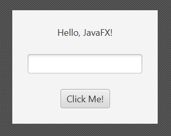

# SceneBuilder

> [!Osaamistavoitteet]
> - Osaat käyttää SceneBuilder-työkalua JavaFX-käyttöliittymien luomiseen
> - Osaat yhdistää FXML-tiedoston ja kontrolleriluokan

SceneBuilder on visuaalinen työkalu, joka helpottaa JavaFX-käyttöliittymien
luomista. Se tarjoaa drag-and-drop-käyttöliittymän, jonka avulla voit luoda ja
muokata FXML-tiedostossa määriteltyä käyttöliittymää ilman FXML:n kirjoittamista
käsin. SceneBuilderin avulla voit helposti lisätä komponentteja, määrittää
niiden ominaisuuksia ja järjestää ne haluamallasi tavalla. Se on erityisen
hyödyllinen, jos et ole vielä tottunut kirjoittamaan FXML:ää suoraan tai haluat
nopeuttaa käyttöliittymän suunnitteluprosessia.

SceneBuilderin päänäkymään on kolme pääaluetta.

 * Vasemmalla on kaksi paneelia: **Library** ja **Document**. Library-paneelista
   löydät kaikki käytettävissä olevat komponentit, kuten painikkeet,
   tekstikentät, layout-komponentit ja niin edelleen. Document-paneelissa näet
   hierarkkisen esityksen oman sovelluksesi käyttöliittymän rakenteesta.
 * Keskellä on visuaalinen suunnittelunäkymä. Tässä näet FXML-tiedoston
   määrittelemän käyttöliittymän visuaalisena esityksenä. Voit tässä raahata
   komponentteja ja järjestää niitä haluamallasi tavalla.
 * Oikealla on **Properties**, **Layout** ja **Code**-paneelit. Näissä muutetaan
   valitun komponentin ominaisuuksia, kuten tekstiä, fonttia, väriä ja monia
   muita asetuksia.

## Ensimmäinen komponentti

Avataan nyt projektimme SceneBuilderissä ja lisätään siihen ensimmäinen oma
komponentti. 

Valitaan File <i class="bi bi-chevron-right"></i> Open, ja avaa tekemäsi
projektin alta `resources`-kansio ja sieltä FXML-tiedosto nimeltä `main.fxml`.
Nyt sama käyttöliittymä, jonka näimme IDEAssa, pitäisi näkyä SceneBuilderissä.

TODO: Kuva.

Pohjassa on valmiina painike, eli `Button`-komponentti sekä tekstikenttä eli
`Label`-komponentti. Jos napsautat `Button`-komponenttia, näet oikealla
Properties-paneelissa kyseisen komponentin ominaisuuksia. Voit muuttaa
esimerkiksi tekstiä, fonttia, väriä ja monia muita ominaisuuksia. Laitetaan
painikkeen teksti vaikkapa "Lisää tehtävä". Tallenna, jotta muutokset
päivittyvät FXML-tiedostoon.

## Käyttöliittymän hierarkkinen rakenne

Vasemmalla olevassa Document-paneelissa näet käyttöliittymän rakenteen, joka
muistuttaa hierarkiaa: `Button` ja `Label`-komponentit ovat `VBox`-komponentin
lapsia. `VBox` (Vertical Box, eli "pystysuuntainen laatikko") on
layout-komponentti, joka järjestää lapsikomponentit automaattisesti
pystysuoraan. 

JavaFX:ssä on paljon vastaavia valmiita `Pane`-luokasta periytyviä luokkia,
jotka auttavat järjestelemään käyttöliittymää kokonaisuuksiin sen sijaan, että
kaikki komponentit olisivat yhdessä läjässä suoraan ikkunan alaisuudessa. 

 * `HBox`-komponentti järjestää lapsensa vaakasuoraan,
 * `GridPane`-komponentti järjestää lapsensa ruudukkomaisesti,
 * `BorderPane`-komponentti järjestää lapsensa reunoille ja keskelle, ja niin
edelleen. 

Näiden komponenttien avulla voidaan luoda monimutkaisiakin
käyttöliittymiä, jotka skaalautuvat hyvin eri kokoisiksi ikkunoiksi.

## Syöttökenttä

Lisätään nyt käyttöliittymään tekstikenttä, johon käyttäjä voi kirjoittaa.
Valitaan vasemmalta Controls <i class="bi
bi-chevron-right"></i> `TextField` ja raahataan se `VBox`-komponentin sisään,
aiemman tekstikentän ja painikkeen väliin. Tuloksen pitäisi nyt näyttää tältä:



Klikkaa nyt Save. Avaa IDEA:ssa `main.fxml`, niin näet, että FXML-tiedostoon on
ilmestynyt uusi `<TextField>`-elementti `<Label>`- ja `<Button>`-elementtien
väliin.

Käynnistä nyt ohjelma. Nyt sinulla pitäisi olla ikkunassa tekstikenttä, johon
voit kirjoittaa.

<task>
  <task-title>Tehtävä 7.1: TODO-ohjelma, vaihe 1 <points>1 p.</points> </task-title>
  <handout>

{{#include ../exercises/7-1-todo-1/handout.md}}

  </handout>
  <task-link><a href="https://tim.jyu.fi/view/kurssit/tie/tiep111/tehtavat/osa7/tehtava1">Tee tehtävä TIMissä</a></task-link>
</task>


## FXML:n ja kontrolleriluokan yhdistäminen

Painikkeesta ei vielä tapahdu mitään. Jotta voimme käsitellä käyttöliittymän
tapahtumia, kuten painikkeen klikkaus, meidän on luotava yhteys FXML-tiedoston
ja kontrolleriluokan välille. Tämä tapahtuu kahdessa vaiheessa: antamalla
komponenteille tunnisteet SceneBuilderissä ja määrittelemällä vastaavat
muuttujat Java-koodissa.

**Tunnisteiden määrittäminen komponenteille**

 * Jokaisella komponentilla, jota haluamme ohjata koodista käsin, täytyy olla
   yksilöllinen tunniste, niin sanottu *fx:id*.
 * Avaa projekti SceneBuilderissä ja valitse haluamasi komponentti, esimerkiksi `TextField`.
 * Avaa oikeasta reunasta Code-paneeli.
 * Kirjoita fx:id-kenttään komponentin nimi, esimerkiksi `uusiTehtavaNimi`.
 * Toista sama painikkeelle ja anna sille fx:id `lisaaUusiTehtavaPainike`.
 * Tallenna, jotta muutokset päivittyvät FXML-tiedostoon.

**Muuttujien määrittäminen FXML:ssä**

 * Palaa IDEAan. Jotta Java-koodi löytää nämä komponentit, ne on ilmoitettava
   `MainController`-luokassa käyttämällä `@FXML`-annotaatiota.
 * Lisää luokkaan seuraavat attribuutit:

```java,ignore
@FXML
private Button lisaaUusiTehtavaPainike;

@FXML
private TextField uusiTehtavaNimi;
```

> [!TÄRKEÄÄ]
> Muuttujan nimen on oltava täsmälleen sama kuin SceneBuilderissä määritellyn
> fx:id-arvon. Muuten JavaFX ei osaa yhdistää niitä.

 * Lisää puuttuvat import-lauseet `javafx.scene.control`-pakkauksesta, *ei*
`java.awt`-pakkauksesta.

Kun ohjelma käynnistyy, `FXMLLoader`-luokka (alustettu `App.java`-luokassa)
lukee FXML-tiedoston ja huomaa siellä määritellyt fx:id:t. Tämän jälkeen se:

 * luo instanssin kontrolleriluokasta (esim. `MainController`),
 * etsii kontrollerista `@FXML`-annotaatiolla merkityt kentät,
 * injektoi eli asettaa viittaukset käyttöliittymän komponentteihin näihin muuttujiin.

Käytännössä JavaFX tekee puolestasi työn, joka vastaisi koodia:
this.uusiTehtavaNimi = (TextField) findComponentById("uusiTehtavaNimi");.

Kokeile kääntää ja ajaa ohjelma uudestaan. Ohjelman pitäisi toimia kuten
ennenkin.

## Kontrollerin elinkaari ja initialize-metodi

Kontrolleriluokan on hyvä toteuttaa `Initializable`-rajapinta, jolloin
`initialize()`-metodi kutsutaan automaattisesti, kun FXML-tiedosto on ladattu ja
kontrolleriluokka on alustettu. Tämä on oikea paikka määritellä
tapahtumankäsittelijöitä ja tehdä muita alustuksia, jotka vaativat pääsyä
FXML-komponentteihin.

Vaihtoehtoisesti voitaisiin määritellä `@FXML public void initialize()`-metodi.
Tekemässämme archetypessä kontrolleriluokka toteuttaa
`Initializable`-rajapinnan, joten käytämme `initialize()`-metodia.

Lisätään nyt `initialize()`-metodiin seuraava rivi, joka asettaa tekstikentän
fokukseen heti ohjelman käynnistyessä.

```java,ignore
uusiTehtavaNimi.requestFocus();
```

Testaa ohjelma uudestaan. 

## setOnAction

Lisätään seuraavaksi tapahtumankäsittelijä painikkeelle, joka 

 * lukee tekstikentän sisällön ja
 * tulostaa sen konsoliin.

Monien komponenttien, kuten painikkeiden, tekstikenttien ja valintaruutujen,
tapahtumia voidaan käsitellä `setOnAction`-metodilla. Tämä tapahtuma laukeaa,
kun käyttäjä vuorovaikuttaa komponentin kanssa tietyllä tavalla, kuten
klikkaamalla painiketta tai painamalla Enter-näppäintä tekstikentässä. Tällöin
komponentti tuottaa `ActionEvent`-tapahtuman. Painikkeen kohdalla tämä tarkoittaa
käytännössä sitä, että koodi ajetaan painiketta klikattaessa (tai kun painike
aktivoidaan näppäimistöllä). Suoritettava koodi voidaan määritellä
lambda-lausekkeena tai erillisenä metodina. 

Määritellään nyt `lisaaUusiTehtavaPainike`-painikkeelle tapahtumankäsittelijä
`initialize()`-metodissa lambda-lausekkeena:

```java,ignore
lisaaUusiTehtavaPainike.setOnAction(event -> {
    String teksti = uusiTehtavaNimi.getText(); // Haetaan tekstikentän sisältö
    IO.println("Tekstikentän sisältö: " + teksti); // Tulostetaan se konsoliin
});
```

<details><summary>Lisätietoa: Miksi emme lisää tapahtumankäsittelijää suoraan konstruktorissa?</summary>

Syy liittyy JavaFX:n alustuksen järjestykseen ja siihen, milloin
FXML-komponentit ovat saatavilla. 

Kun käynnistät JavaFX-sovelluksen, tapahtuu seuraavaa:

1. JavaFX luo kontrollerin kutsumalla konstruktoria `new MainController()`.
2. `@FXML`-kentät ovat tässä vaiheessa vielä `null`.
3. `FXMLLoader` lukee FXML-tiedoston ja injektoi kenttiin oikeat komponentit
   `fx:id`-arvojen perusteella.
4. Lopuksi kutsutaan `initialize()`-metodi.

Jos siis kirjoitat konstruktoriin koodia, joka käyttää FXML-komponentteja, saat
`NullPointerException`in. Voit kokeilla tätä itse kirjoittamalla
tapahtumankäsittelijän konstruktorin sisään:

```java,ignore
public MainController() {
    uusiTehtavaNimi.requestFocus();
    lisaaUusiTehtavaPainike.setOnAction(event -> {
        String teksti = uusiTehtavaNimi.getText();
        IO.println(teksti);
    });
}
```

Yllä olevassa esimerkissä sekä `lisaaUusiTehtavaPainike` että `uusiTehtavaNimi`
ovat konstruktorin aikana vielä `null`.

Siksi tapahtumankäsittelijät ja muut FXML-komponentteihin nojaavat alustukset
tehdään `initialize()`-metodissa.

</details>

Nyt kun painiketta klikataan, konsoliin tulostuu tekstikentän sisältö.

## Tekstikentän sisällön näyttäminen ikkunassa

Lisätään nyt tekstikenttään kirjoitettu sisältö näkyviin yläpuolella olevaan
`Label`-komponenttiin. Anna `Label`-komponentille fx:id "tekemattomat". Tämä
kuvastaa tehtäviä, jotka eivät ole vielä tehty. Tyhjennä Properties <i class="bi
bi-chevron-right"></i> Text, jotta se on aluksi tyhjä. 
Tallenna muutokset.

Lisää kontrolleriluokkaan `@FXML private Label tekemattomat;`.

Muokkaa aiemmin tekemääsi tapahtumankäsittelijää: 

```java,ignore
lisaaUusiTehtavaPainike.setOnAction(event -> {
    String teksti = uusiTehtavaNimi.getText();
    // HIGHLIGHT_RED_BEGIN
    IO.println(teksti);
    // HIGHLIGHT_RED_END
    //HIGHLIGHT_GREEN_BEGIN
    tekemattomat.setText(tekemattomat.getText() + teksti + "\n");
    //HIGHLIGHT_GREEN_END
});
```

Nyt kirjoittamasi teksti näkyy ikkunassa, ja voit lisätä uusia rivejä
painikkeella. Jos suurennat ikkunaa, näet, että tekstirivejä lisätään aina
edellisen tekstin perään. 

## Versiohallinnan aloittaminen

Tässä vaiheessa on hyvä hetki aloittaa versionhallinta. Käytämme
Git-versionhallintaa, joka on laajasti käytetty työkalu ohjelmistokehityksessä.
Jos et ole aiemmin käyttänyt Gitiä, lue aluksi
Ohjelmointi 1 -kurssin materiaalin
[Git-osio](https://ohjelmointi1.it.jyu.fi/git.html). Emme tässä vaiheessa
tarvitse vielä etävarastoa, joten voit ohittaa GitLab-etävarastoa käsittelevän
kohdan. 

Lyhyesti: Gitin avulla voit seurata koodiin tehtyjä muutoksia, tehdä koodista
varmuuskopion etävarastoon, työskennellä tiimin kanssa saman koodin parissa ja
paljon muuta. 

Osien 7 ja 8 aikana teet jokaisesta tehtävästä oman Git-commitin, joka kuvaa
tehtävän aikana tehtyjä muutoksia. 

Gitin käyttämiseen on monenlaisia käyttöliittymiä &ndash; myös IDEAssa on
omansa. Käytämme tässä kuitenkin komentoriviä, koska se on suhteellisen
universaali tapa käyttää Gitiä kaikissa ympäristöissä samalla tavalla. 

Aloitetaan versionhallinta luomalla Git-varasto projektille. Avataan komentorivi
ja navigoidaan projektin juurikansioon. Juurikansio on se kansio, jossa on
`src`-kansio ja `pom.xml`-tiedosto. Tyhjä Git-varasto alustetaan komennolla `git
init`.

TODO: Tähän Asciinema?

```bash
cd /polku/projektiin
git init
```

Saat ilmoituksen, että tyhjä Git-varasto on luotu. Projektin polku `...Path...`
on tietenkin erilainen omalla koneellasi.

```
Initialized empty Git repository in C:/...Path.../Todo/.git/
```

Ennen kuin teemme ensimmäisen commitin, meidän on kerrottava Gitille, mitä
tiedostoja haluamme seurata. Voimme tässä vaiheessa tehdä sen komennolla `git
add .`, joka lisää kaikki nykyisessä kansiossa ja sen alikansioissa olevat
tiedostot seurantaan. 

Kirjoittamalla `git status` saat listan tiedostoista, jotka on lisätty
seurantaan. Pohjaprojektin mukana tuli `.gitignore`-tiedosto, mikä pitäisi näkyä
listassa ensimmäisenä. Tämä tiedosto kertoo Gitille, mitä tiedostoja **ei**
haluta seurata. Näin varmistetaan, että esimerkiksi käännettyt
`.class`-tiedostot tai IDEAn omat asetustiedostot eivät päädy versionhallintaan.
`.gitignore`-tiedostoa voi ja kannattaa muokata tarpeen mukaan, jos halutaan
jättää pois seurannasta muita tiedostoja.

Nyt voimme tehdä ensimmäisen commitin, joka on kuin "snapshot" projektista
tietyssä vaiheessa. Commitin yhteydessä kirjoitetaan kuvaava viesti, joka
kertoo, mitä muutoksia on tehty. Yleensä ensimmäiselle commitille kirjoitetaan
viesti, kuten "Initial commit" tai "Projektin aloitus". 

```bash
git commit -m "Initial commit"
```

Tästä eteenpäin jokaisen tehtävän yhteydessä teet uuden commitin, jossa kuvaat
tehtävän aikana tekemiäsi muutoksia. Voit aivan hyvin tehdä useammankin
commitin, jos haluat. 

<task>
  <task-title>Tehtävä 7.2: TODO-ohjelma, vaihe 2. <points>1 p.</points> </task-title>
  <handout>

{{#include ../exercises/7-2-todo-2/handout.md}}

  </handout>
  <task-link><a href="https://tim.jyu.fi/view/kurssit/tie/tiep111/tehtavat/osa7/tehtava2">Tee tehtävä TIMissä</a></task-link>
</task>

## Komponenttien luominen dynaamisesti 

"Tehtävät" ovat toistaiseksi pelkkää tekstiä, eikä niitä voi merkitä tehdyiksi.
Muutetaan käyttöliittymää niin, että tehtävät näkyvät erillisinä riveinä, ja
niihin liittyy valintaruutu, `CheckBox`, jonka avulla tehtävän voidaan näyttää
paitsi tehtävän nimi, myös se, onko tehtävä tehty vai ei.

Poista `Label`-komponentti ja tilalle `VBox`-komponentti pohjalla olevan
`VBox`-komponentin ensimmäiseksi lapsielementiksi. Anna tälle sama fx:id
"tekemattomat". Tallenna, jotta muutokset päivittyvät FXML-tiedostoon.

Muokkaa `MainController`-luokkaa niin, että `tekemattomat`-muuttuja on tyyppiä
`VBox` eikä `Label`. Nyt tapahtumankäsittelijä ei enää toimi, koska
`VBox`-komponentti ei osaa näyttää tekstiä. Sen sijaan sille lisätään
lapsikomponentteja.

Luetaan tapahtumankäsittelijässä ensin `tekemattomat`-VBoxin lapsikomponentit
`getChildren()`-metodilla, ja lisätään sille aluksi uusi `Label`-komponentti,
joka sisältää syöttämämme tekstin. 

```java,ignore
lisaaUusiTehtavaPainike.setOnAction(event -> {
    String teksti = uusiTehtavaNimi.getText(); 
    tekemattomat.getChildren().add(new Label(teksti));
});
```

Vaihda `Label` tilalle `CheckBox`, jolloin tehtävän nimen eteen pitäisi
ilmaantua valintaruutu.

Tehdään pari pientä korjausta: tyhjennetään tekstikenttä painikkeen klikkauksen
jälkeen, ja estetään tyhjän tekstin lisääminen. Myös fokus voisi palata takaisin
tekstikenttään painikkeen klikkauksen jälkeen. 

```java,ignore
lisaaUusiTehtavaPainike.setOnAction(event -> {
    String teksti = uusiTehtavaNimi.getText();
    // HIGHLIGHT_GREEN_BEGIN
    if (teksti == null || teksti.isBlank()) {        
        uusiTehtavaNimi.requestFocus(); 
        return; 
    }
    // HIGHLIGHT_GREEN_END
    tekemattomat.getChildren().add(new CheckBox(teksti));
    // HIGHLIGHT_GREEN_BEGIN
    uusiTehtavaNimi.clear(); 
    uusiTehtavaNimi.requestFocus(); 
    // HIGHLIGHT_GREEN_END
});
```

Nyt hieman ärsyttävästi joudumme asettamaan fokuksen kahteen kohtaan. Tämän
voisi ratkaista esimerkiksi käyttämällä `Platform.runLater()`-metodia, joka ajaa
sille annettavan koodin JavaFX:n tapahtumasilmukan seuraavalla kierroksella.
Näin varmistetaan, että kaikki tapahtumankäsittelijän koodi on suoritettu ennen
kuin fokusta asetetaan uudestaan. Laitetaan tämä kutsu aivan
tapahtumankäsittelijän alkuun.

```java,ignore
lisaaUusiTehtavaPainike.setOnAction(event -> {
    // HIGHLIGHT_GREEN_BEGIN
    Platform.runLater(uusiTehtavaNimi::requestFocus);
    // HIGHLIGHT_GREEN_END
    String teksti = uusiTehtavaNimi.getText();
    if (teksti == null || teksti.isBlank()) {
        // HIGHLIGHT_RED_BEGIN
        uusiTehtavaNimi.requestFocus(); 
        // HIGHLIGHT_RED_END
        return; 
    }
    tekemattomat.getChildren().add(new CheckBox(teksti));
    uusiTehtavaNimi.clear(); 
    // HIGHLIGHT_RED_BEGIN    
    uusiTehtavaNimi.requestFocus(); 
    // HIGHLIGHT_RED_END
});
```

Nyt fokuksen pitäisi aina asettua tekstikenttään painikkeen painamisen jälkeen
riippumatta siitä, onko syötetty teksti tyhjä vai ei.

Huomaa, että `runLater()`-metodi ottaa parametrinaan `Runnable`-olion, joka on
funktionaalinen rajapinta (ks. [Osa
6.1](../osa6/01-funktiorajapinnat-ja-lambda-lausekkeet.md)). Koska
`requestFocus()`-metodi sopii `Runnable`-rajapinnan määritelmään (ts. se on
parametriton `void`-metodi), voimme käyttäämetodiviittausta
`uusiTehtavaNimi::requestFocus` lambda-lausekkeena. Toki voimme kirjoittaa tämän
myös perinteisempänä lambda-lausekkeena, jos se tuntuu selkeämmältä:

```java,ignore
Platform.runLater(() -> uusiTehtavaNimi.requestFocus());
```

Jos tehtäviä syöttää paljon, ikkunaan mahtuu vain osa niistä ja sovelluksemme
ulkoasu hajoaa. Ratkaistaan tämä hieman myöhemmin. 

## Käsitellyt tehtävät

Siirretään käsitellyt tehtävät pois tekemättömien tehtävien joukosta. Aloitetaan
siitä, että luodaan uusi `VBox`-komponentti, ja sijoitetaan se tekemättömien
tehtävien VBoxin alle. Anna sille fx:id "käsitellyt", tallenna, ja määrittele
kontrolleriluokkaan vastaava attribuutti. 

> [!VINKKI]
> Kun lisäät uuden komponentin, SceneBuilder muistuttaa yläreunassa, että
> FXML-tiedostossa on määritetty fx:id, mutta kontrolleriluokassa ei ole
> vastaavaa `@FXML`-annotaatiolla merkittyä muuttujaa. Kannattaa lisätä
> muuttujat aina, kun SceneBuilder niitä ehdottaa, jotta ei tarvitse myöhemmin
> ihmetellä miksi FXML-komponentteihin ei saa yhteyttä. Varoituksen saat pois
> klikkaamalla keltaisessa boksissa Clear.

Siirretään nyt käsitellyt tehtävät omaan VBoxiinsa. Tehtävän käsitellyksi
merkitsemiseen voidaan käyttää `CheckBox`-komponentin
`setOnAction`-tapahtumankäsittelijää. Kun käyttäjä klikkaa tehtävän edessä
olevaa valintaruutua, tarkistetaan, onko se nyt valittuna vai ei. Jos se on
valittuna, siirretään tehtävä tekemättömien tehtävien VBoxista käsiteltyjen
tehtävien VBoxiin.

```java,ignore
public void initialize(...)
    //...

    // HIGHLIGHT_GREEN_BEGIN
    // Luo uusi checkbox
    CheckBox checkbox = new CheckBox(teksti);
    checkbox.setOnAction(cbevent -> {
        tekemattomat.getChildren().remove(checkbox);
        tehdyt.getChildren().add(checkbox);
    });    
    tekemattomat.getChildren().add(checkbox);
    // HIGHLIGHT_GREEN_END
    // HIGHLIGHT_RED_BEGIN
    tekemattomat.getChildren().add(new CheckBox(teksti));
    // HIGHLIGHT_RED_END
```

Nyt tehtävän klikkaaminen siirtää sen tekemättömien tehtävien joukosta
käsiteltyjen joukkoon. Klikkaamalla käsiteltyä tehtävää uudestaan, se ei
kuitenkaan siirry takaisin tekemättömien joukkoon. Jos katsot IDEAssa konsoliin,
näet poikkeuksen, joka kertoo, että yritämme lisätä samaa
`CheckBox`-komponenttia uudestaan `tehdyt`-VBoxiin, vaikka se on jo siellä.
Tarvitsemme siis hieman enemmän logiikkaa, jotta komponentti voidaan siirtää
takaisin tekemättömien joukkoon.

```java,ignore
// ...
checkbox.setOnAction(cbevent -> {
    if (checkbox.isSelected()) { // Tehtävä valittu --> Siirretään tehtyjen joukkoon
        tekemattomat.getChildren().remove(checkbox);
        tehdyt.getChildren().add(checkbox);
    } else { // Tehtävä ei-valittu--> Siirretään takaisin tekemättömien joukkoon
        tehdyt.getChildren().remove(checkbox);
        tekemattomat.getChildren().add(checkbox);
    }
});
// ...
```

Huomaa, että `isSelected()`-metodilla on jo tiedossaan "uusi" arvo, onko
komponentti valittuna vai ei. 
Tilan päivitys tapahtuu ennen `setOnAction`-tapahtuman laukeamista. 
Kun käyttäjä klikkaa valintaruutua, tapahtumaketju on karkeasti seuraava:

 * Hiiren painallus rekisteröityy käyttöjärjestelmään.
 * JavaFX päivittää sisäisen `selected`-ominaisuuden (esim. `false` -> `true`).
 * `ActionEvent` luodaan ja `setOnAction`-käsittelijä suoritetaan.
 * Käsittelijän suoritus: Kun kutsut tässä vaiheessa `isSelected()`, saat jo uuden, päivitetyn tilan.

Lisätään vielä `Label`-komponentit listojen yläpuolelle. Laitetaan tekemättömien
tehtävien yläpuolelle teksti "TODO" ja käsiteltyjen tehtävien yläpuolelle teksti
"DONE". Document-paneelin pitäisi nyt näyttää tältä:


<task>
  <task-title>Tehtävä 7.3: TODO-ohjelma, vaihe 3. <points>1 p.</points> </task-title>
  <handout>

{{#include ../exercises/7-3-todo-3/handout.md}}

  </handout>
  <task-link><a href="https://tim.jyu.fi/view/kurssit/tie/tiep111/tehtavat/osa7/tehtava3">Tee tehtävä TIMissä</a></task-link>
</task>

## Tehtävien lukeminen ja kirjoittaminen tiedostoon

Tekemämme TODO-ohjelma on vielä melko väliaikainen, koska kaikki tehtävät
katoavat, kun suljet ohjelman. Ratkaistaan tämä tallentamalla tehtävät
tiedostoon. 

Käytetään JSON-muotoista tiedostoa tallentamiseen. Tiedoston rakenne voisi olla
esimerkiksi seuraavanlainen.

```json
{
  "tehtavat": [
    {
      "teksti": "Osta maitoa",
      "tehty": false
    },
    {
      "teksti": "Vie roskat",
      "tehty": true
    }
  ]
}
```

Lisätään riippuvuus Jackson-kirjastoon [osan
6.5](../osa6/05-tiedostojen-kasittely.md#jackson) ohjeen mukaisesti. 

Tarvitsemme luokan, joka kuvaa yksittäistä tehtävää. Luodaan `Tehtava`-luokka,
jossa on kaksi attribuuttia: `teksti` ja `tehty`. Tehdään niille myös getterit
ja setterit, jotta Jackson osaa käsitellä niitä. 

Aivan aluksi meidän pitäisi saada tuotettua lista tehtävistä. Luodaan
tehtävälista (`List<Tehtava>`) aivan `initialize()`-metodin loppuun. Tämä takaa,
että kaikki muutokset listaan on tehty. 

```java,ignore
public void initialize(...) {
    // ...
    
    // HIGHLIGHT_GREEN_BEGIN
    List<Tehtava> kaikkiTehtavat = new ArrayList<>();
    // HIGHLIGHT_GREEN_END
}
```

Tehtävät ovat nyt siis tallennettuina `tehdyt`- ja `tekemattomat`-VBoxeihin.
VBoxien lapsikomponenttien muuntaminen `Tehtava`-olioiksi vaatii hieman jumppaa.

```java,ignore
tekemattomat.getChildren().forEach(node -> {
    if (!(node instanceof CheckBox c)) {
        // Periaatteessa kaikki lapsikomponentit pitäisi 
        // olla CheckBoxeja, mutta varmuuden vuoksi tarkistetaan 
        // tämä kuitenkin. 
        return;
    }
    // Jos pääsemme tänne, niin node on CheckBox, 
    // ja voimme turvallisesti käyttää c-muuttujaa
    // CheckBox-tyyppisenä.

    String tekstiC = c.getText();
    boolean tehtyC = c.isSelected();
    Tehtava tehtava = new Tehtava(tekstiC, tehtyC);
    kaikkiTehtavat.add(tehtava);
});
```

Kokeillaan nyt pyytää Jacksonia kirjoittamaan tehtävät JSON-tiedostoon. Lisää
tämä aivan `initialize()`-metodin loppuun.

```java,ignore
public void initialize(...) {
    // ...
    ObjectMapper mapper = new ObjectMapper();
    mapper.writeValue(Path.of("tehtavat.json"), kaikkiTehtavat);
}
```

Katso IDEAssa, että projektikansioon ilmestyy `tehtavat.json`-tiedosto, kun
lisäät uuden tehtävän. 

<task>
  <task-title>Tehtävä 7.4: TODO-ohjelma, vaihe 4. <points>1 p.</points> </task-title>
  <handout>

{{#include ../exercises/7-4-todo-4/handout.md}}

  </handout>
  <task-link><a href="https://tim.jyu.fi/view/kurssit/tie/tiep111/tehtavat/osa7/tehtava4">Tee tehtävä TIMissä</a></task-link>
</task>


## Refaktorointia


Niinpä myös tehdyt tehtävät tallennetaan samaan tapaan. Jotta koodia ei tarvitse
toistaa, tehdään erillinen metodi, joka ottaa `VBox`-komponentin ja palauttaa
sen lapsikomponenttien perusteella listan `Tehtava`-olioita. Kutsutaan tätä
sitten sekä `tekemattomat`- että `tehdyt`-VBoxeille.

```java,ignore
List<Tehtava> kaikkiTehtavat = new ArrayList<>();
kaikkiTehtavat.addAll(teeTehtavalista(tekemattomat));
kaikkiTehtavat.addAll(teeTehtavalista(tehdyt));
```

## Fiksumpi skaalautuminen

USE_COMPUTED_SIZE

USE_PREF_SIZE

Vai tartteeko jo aikaisemmin?

## AnchorPane vs Gridpane

AnchorPane ei osaa skaalatua, joten vaihdetaan se GridPaneen, ja laitetaan sen
sisään asiat. Vaihda buttonin row ja column indexit Layout-kohdassa. 

Skaalauden säätäminen niin että ikkunan pienentäminen ja suurentaminen ei
totallisesti hajota layoutia. 
