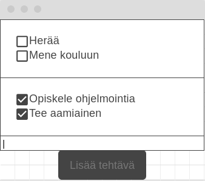
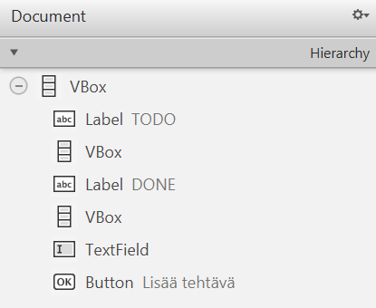

# Sovelluslogiikan ja käyttöliittymän yhdistäminen

Sovelluksemme voisi jo nyt toimia eräänlaisena TODO-listana.
Palautetaan kuitenkin vielä mieleen, mitä ominaisuuksia suunnittelimme tämän
osan alussa:

* Käyttäjä voi lisätä uuden tehtävän
* Käyttäjä näkee listan kaikista tehtävistä
* Käyttäjä voi merkitä tehtävän tehdyksi
* Käyttäjä voi poistaa tehtävän
* Käyttäjä voi palauttaa tehdyn tehtävän takaisin tekemättömäksi
* Tehtävät tallennetaan tiedostoon, jotta ne säilyvät sovelluksen sulkemisen jälkeen
* Tehtävät haetaan tiedostosta sovelluksen käynnistyessä

Näitä huomioon ottaen sovelluksemme ei ole vielä kovin käytettävä: tehtäviä
voidaan lisätä, ja pystymme näkemään kaikki tehtävät, mutta tehtäviä ei voi
poistaa eikä merkitä tehdyksi.

Muutetaan käyttöliittymä siten, että tehtävät näytetään valintaruutuina,
jolloin ne voi merkitä tehdyksi tai tekemättömäksi. Lisäksi listataan tehdyt ja
tekemättömät tehtävät omaan listaan. Piirretään alustava
wireframe-suunnitelmakuva:



Yllä oleva kuva on piirretty käyttäen
[wireframe.cc](https://wireframe.cc/Mq98ie) -palvelua, mutta vastaavia
suunnitelmakuvia voidaan piirtää millä tahansa piirtotyökalulla. 
Yleisesti ottaen käyttöliittymiä on hyvä suunnitella hieman etukäteen, jotta 
sen toteuttaminen olisi suoraviivaisempaa.

## Komponenttien luominen dynaamisesti 

Aloitetaan ensin muuttamalla painikkeen toimintaa niin, että uusi tehtävä
lisätään käyttöliittymään valintaruutuna, eli ns. `CheckBox`-komponenttina.
Koska käyttäjä voi lisätä uusia tehtäviä rajattomasti, emme voi
lisätä valintaruutuja SceneBuilderin kautta. Sen sijaan lisäämme komponentteja
suoraan kontrollerin koodissa.

Valmistellaan ensiksi käyttöliittymä. Mene SceneBuilderiin ja poista siellä
oleva `Label`-nimiökomponentti. Koska nimiössä ei ole oletuksena tekstiä, 
sitä ei pysty klikkaamaan suunnittelunäkymässä.
Sen sijaan valitse nimiö käyttäen vasemmalla puolella olevan Document-näkymän
Hierrachy-paneelia:

<video src="images/scenebuilder-hierarchy-panel-select.mp4"></video>

Poista nimiö painamalla <kbd>Delete</kbd> (macOS: <kbd>⌫ delete</kbd>).
Saat varoituksen "This component has an fx:id. Do you really want to delete
it?" sen merkiksi, että nimiökomponenttia käytetään kontrollerin koodissa.
Valitse varoitusdialogissa **Delete**.

Tämän jälkeen etsi `VBox`-komponentti Library-näkymästä (**Library** 
<i class="bi bi-chevron-right"></i> **Containers** 
<i class="bi bi-chevron-right"></i> **VBox**
) ja raahaa se tekstikentän yläpuolelle:


`VBox` (**V**ertical **Box**) on ns. *sisältökomponentti*, joka on tarkoitettu
muiden komponenttien ryhmittelyyn ja asetteluun. Sisältökomponentteihin voi
lisätä muita elementteja, joita sisältökomponentti asettelee sille ominaisella
tavalla. Esimerkiksi `VBox` asettelee kaikki sen sisällä olevat komponentit
pystysuorasti ylhäältä alas.

Anna uudelle `VBox`-komponentille fx:id-tunnisteeksi `tekemattomat`, eli sama
kuin poistetun nimiökomponentin. Tallenna FXML-tiedosto ja muokkaa sitten `MainController`-luokka niin,
että `tekemattomat`-attribuutin tyyppi on jatkossa `VBox`:


```java,ignore
// HIGHLIGHT_RED_BEGIN
@FXML
private Label tekemattomat;
// HIGHLIGHT_RED_END
// HIGHLIGHT_GREEN_BEGIN
@FXML
private VBox tekemattomat;
// HIGHLIGHT_GREEN_END
```

Nyt tapahtumankäsittelijä ei enää toimi, koska
`VBox`-komponentti ei sisällä `getText`/`setText`-metodia. 
Sen sijaan `VBox`-komponentin oleellinen metodi on `getChildren()`, joka
palauttaa listan kaikista sen sisältämistä komponenteista.
Muokataankin painikkeen tapahtumakäsittelijä niin, että painikkeen painasusta
alustetaan uusi `CheckBox`-olio ja lisätään se `VBox`-komponenttiin.
Tällöin tapahtumakäsittelijästä tulee seuraavanlainen:

```java,ignore
lisaaUusiTehtavaPainike.setOnAction(event -> {
    String teksti = uusiTehtavaNimi.getText();
    CheckBox tehtava = new CheckBox(teksti);
    tekemattomat.getChildren().add(tehtava);
});
```

Kokeile ajaa sovellus tässä vaiheessa. Huomaat, että "Lisää tehtävä" -painike
luo uuden valintaruutukomponentin ja lisää sen syöttökentän yläpuolelle.
Valintaruudut ovat klikattavissa ikään kuin merkiksi siitä, onko tehtävä
tehty:

<video src="images/todo-app-checbox-add.mp4" controls></video>

Parannetaan sovelluksen käytettävyyttä hieman tässä vaiheessa. Ensiksi, jos
"Lisää tehtävä" -painiketta painaa ilman, että syöttökenttään kirjoittaa mitään,
sovellukseen ilmestyy tyhjä valintaruutu. Lisäämme järkevyystarkistuksen: jos
tekstikentästä haettu teksti on `null`-viite, ei sisällä mitään tekstiä tai
sisältää vain välilyöntejä, lopetetaan tapahtumankäsittely kesken.
Tämä onnistuu `String`-tyypin `isBlank()`-metodilla.
Lisäksi, poistetaan tehtävän alusta ja lopusta turhia välilyöntejä, jos käyttäjä
saattaa kirjoittaa ne vahingossa käyttäen `trim()`-metodia:

```java,ignore
lisaaUusiTehtavaPainike.setOnAction(event -> {
    String teksti = uusiTehtavaNimi.getText();
    // HIGHLIGHT_GREEN_BEGIN
    if (teksti == null || teksti.isBlank()) {        
        return; 
    }
    teksti = teksti.trim();
    // HIGHLIGHT_GREEN_END
    CheckBox tehtava = new CheckBox(teksti);
    tekemattomat.getChildren().add(tehtava);
});
```

Toiseksi, tehtävän lisääminen jättää tehtävätekstin syöttökenttään, jolloin
uuden tehtävän lisäämistä varten joudumme kumittamaan pois vanhan tekstin.
Käytetään sitä varten `TextField`-komponentin `clear()`-metodia, jolla
me tyhjennämme tekstikentän sisällön aina tehtävän lisäämisen lopuksi:

```java,ignore
lisaaUusiTehtavaPainike.setOnAction(event -> {
    String teksti = uusiTehtavaNimi.getText();
    if (teksti == null || teksti.isBlank()) {        
        return; 
    }
    teksti = teksti.trim();
    CheckBox tehtava = new CheckBox(teksti);
    tekemattomat.getChildren().add(tehtava);
    // HIGHLIGHT_GREEN_BEGIN
    uusiTehtavaNimi.clear();
    // HIGHLIGHT_GREEN_END
});
```

Kolmanneksi, tehtävän lisäämisen jälkeen joudumme klikkaamaan syöttökentästä
ennen kuin seuraavan tehtävän kirjoittamista. Tehdään tämä klikkaus
ohjelmallisesti käyttäen `requestFocus()`-metodia, joka siirtää fokuksen eli
ikään kuin simuloi komponentin valintaa. 
Huomaa, että metodi on lisättävä kaikkin kohtiin, jossa tapahtumankäsittely
päättyy:

```java,ignore
lisaaUusiTehtavaPainike.setOnAction(event -> {
    String teksti = uusiTehtavaNimi.getText();
    if (teksti == null || teksti.isBlank()) {        
        // HIGHLIGHT_GREEN_BEGIN
        uusiTehtavaNimi.requestFocus(); 
        // HIGHLIGHT_GREEN_END
        return; 
    }
    teksti = teksti.trim();
    CheckBox tehtava = new CheckBox(teksti);
    tekemattomat.getChildren().add(tehtava);
    uusiTehtavaNimi.clear();
    // HIGHLIGHT_GREEN_BEGIN
    uusiTehtavaNimi.requestFocus(); 
    // HIGHLIGHT_GREEN_END
});
```

<details><summary><i class="bi bi-stars jyu-gold"></i>Bonus: Fokuksen automaattinen asettaminen tapahtuman lopuksi </summary>

Nyt hieman ärsyttävästi joudumme asettamaan fokuksen kahteen kohtaan.

Eräs JavaFX-tyylinen tapa ratkaista ongelma on käyttää
`Platform.runLater()`-metodia ([JavaDoc](https://download.java.net/java/GA/javafx25/docs/api/javafx.graphics/javafx/application/Platform.html#runLater(java.lang.Runnable))), joka ajaa
sille annettavan koodin myöhemmin sovelluksen aikana (mutta aikaisintaan
sen tapahtuman jälkeen, jona metodia kutsuttiin).
Metodi ottaa parametrina `Runnable`-rajapintaa toteuttavan olion. Koska
`Runnable` on funktionaalinen (ks. [Luku 6.1](../osa6/01-funktiorajapinnat-ja-lambda-lausekkeet.md#valmiita-funktiorajapintoja)), voimme
antaa parametrina lambdalausekkeen tai funktioviitteen metodiin, joka ei ota
mitään parametreja eikä palauta mitään.
Koska `requestFocus()`-metodi täsmää parametrien ja palautusarvon kannalta
`Runnable`-rajapinnan kanssa, voimme käyttää funktioviitettä suoraan.
Tällöin tapahtumankäsittely yksinkertaistuu muotoon:

```java,ignore
lisaaUusiTehtavaPainike.setOnAction(event -> {
    Platform.runLater(uusiTehtavaNimi::requestFocus);
    String teksti = uusiTehtavaNimi.getText();
    if (teksti == null || teksti.isBlank()) {        
        return; 
    }
    teksti = teksti.trim();
    CheckBox tehtava = new CheckBox(teksti);
    tekemattomat.getChildren().add(tehtava);
    uusiTehtavaNimi.clear();
});
```

Toinen tapa on soveltaa geneerisia metodeja (ks. [luku
4.4](../osa4/04-tyyppiparametrit-ja-geneerisyys.md#geneerinen-metodi)) sekä 
funktionaalisia rajapintoja (ks. [luku
6.1](../osa6/01-funktiorajapinnat-ja-lambda-lausekkeet.md)).
Koska lambdalausekkeita voidaan ottaa parametrina ja toisaalta palauttaa arvona,
voimme tehdä apumetodin `ajaJaFokusoi`, joka ottaa parametrina
tapahtumakäsittelijän ja palauttaa uuden tapahtumakäsittelijän, joka kutsuu
`requestFocus` aina lopuksi:

```java,ignore


static <T extends Event> EventHandler<T> ajaJaFokusoi(EventHandler<T> kasittelija, Node komponentti) {
    return e -> {
        kasittelija.handle(e);
        komponentti.requestFocus();
    };
}
```

Tällaista metodia, joka palauttaa parametrina annetun funktion pienellä
muutoksella, kutsutaan yleensä ns. *käärijämetodiksi* tai *wrapper-metodiksi*.
Nimensä mukaan metodi siis "käärii" alkuperäisen funktion toisen sisään.

Apumetodin avulla voimme yksinkertaistaa tapahtumankäsittelijän muotoon:

```java,ignore
lisaaUusiTehtavaPainike.setOnAction(ajaJaFokusoi(event -> {
    String teksti = uusiTehtavaNimi.getText();
    if (teksti == null || teksti.isBlank()) {
        return;
    }
    teksti = teksti.trim();
    CheckBox tehtava = new CheckBox(teksti);
    tekemattomat.getChildren().add(tehtava);
    uusiTehtavaNimi.clear();
}, uusiTehtavaNimi));
```

Huomaa, että kaikki JavaFX-komponentin perivät `Node`-luokasta.
</details>

Lopuksi

## Käsitellyt tehtävät

Siirretään käsitellyt tehtävät pois tekemättömien tehtävien joukosta. Aloitetaan
siitä, että luodaan uusi `VBox`-komponentti, ja sijoitetaan se tekemättömien
tehtävien VBoxin alle. Anna sille fx:id "käsitellyt". Tallenna, ja määrittele
kontrolleriluokkaan vastaava attribuutti.  

> [!VINKKI]
> Kun lisäät uuden komponentin, SceneBuilder muistuttaa yläreunassa, että
> FXML-tiedostossa on määritetty fx:id, mutta kontrolleriluokassa ei ole
> vastaavaa `@FXML`-annotaatiolla merkittyä muuttujaa. Kannattaa lisätä
> muuttujat aina, kun SceneBuilder niitä ehdottaa, jotta ei tarvitse myöhemmin
> ihmetellä miksi FXML-komponentteihin ei saa yhteyttä. Varoituksen saat pois
> klikkaamalla keltaisessa boksissa *Clear*.

Tehtävän käsitellyksi merkitsemiseen voidaan käyttää `CheckBox`-komponentin
`setOnAction`-tapahtumankäsittelijää. Kun käyttäjä klikkaa tehtävän edessä
olevaa valintaruutua, tarkistetaan, onko se nyt valittu vai ei. Jos se on
valittu, poistetaan tehtävä tehdyistä ja lisätään se tekemättömien tehtävien
VBoxiin. 

```java,ignore
public void initialize(...)
    //...

    // HIGHLIGHT_GREEN_BEGIN
    // Luo uusi checkbox
    CheckBox checkbox = new CheckBox(teksti);
    checkbox.setOnAction(cbevent -> {
        tekemattomat.getChildren().remove(checkbox);
        tehdyt.getChildren().add(checkbox);
    });    
    tekemattomat.getChildren().add(checkbox);
    // HIGHLIGHT_GREEN_END
    // HIGHLIGHT_RED_BEGIN
    tekemattomat.getChildren().add(new CheckBox(teksti));
    // HIGHLIGHT_RED_END
```

Nyt tehtävän klikkaaminen siirtää sen käsiteltyihin. Klikkaamalla käsiteltyä
tehtävää se ei kuitenkaan siirry takaisin tekemättömiin. Jos
katsot IDEAssa konsoliin, näet poikkeuksen, joka kertoo, että yritämme lisätä
samaa `CheckBox`-komponenttia uudestaan `tehdyt`-VBoxiin, vaikka se on jo
siellä. Tarvitsemme siis hieman enemmän logiikkaa, jotta komponentti voidaan
siirtää takaisin tekemättömien joukkoon.

```java,ignore
// ...
checkbox.setOnAction(cbevent -> {
    // HIGHLIGHT_GREEN_BEGIN
    if (checkbox.isSelected()) { // Tehtävä valittu --> Siirretään tehtyjen joukkoon
    // HIGHLIGHT_GREEN_END
        tekemattomat.getChildren().remove(checkbox);
        tehdyt.getChildren().add(checkbox);
    // HIGHLIGHT_GREEN_BEGIN
    } else { // Tehtävä ei-valittu--> Siirretään takaisin tekemättömien joukkoon
        tehdyt.getChildren().remove(checkbox);
        tekemattomat.getChildren().add(checkbox);
    }
    // HIGHLIGHT_GREEN_END
});
// ...
```

Huomaa, että `isSelected()`-metodilla on jo tiedossaan "uusi" arvo, onko
komponentti valittuna vai ei. 
Tilan päivitys tapahtuu ennen `setOnAction`-tapahtuman laukeamista. 
Kun käyttäjä klikkaa valintaruutua, tapahtumaketju on karkeasti seuraava:

 * Hiiren painallus rekisteröityy käyttöjärjestelmään.
 * JavaFX päivittää sisäisen `selected`-ominaisuuden (esim. `false` -> `true`).
 * `ActionEvent` luodaan ja `setOnAction`-käsittelijä suoritetaan.
 * Käsittelijän suoritus: Kun kutsut tässä vaiheessa `isSelected()`, saat jo uuden, päivitetyn tilan.

Lisätään vielä `Label`-komponentit listojen yläpuolelle. Laitetaan tekemättömien
tehtävien yläpuolelle teksti "TODO" ja käsiteltyjen tehtävien yläpuolelle teksti
"DONE". Document-paneelin pitäisi nyt näyttää tältä:



<task>
  <task-title>Tehtävä 7.3: TODO-ohjelma, vaihe 3. <points>1 p.</points> </task-title>
  <handout>

{{#include ../exercises/7-3-todo-3/handout.md}}

  </handout>
  <task-link><a href="https://tim.jyu.fi/view/kurssit/tie/tiep111/tehtavat/osa7/tehtava3">Tee tehtävä TIMissä</a></task-link>
</task>

## Tehtävien lukeminen ja kirjoittaminen tiedostoon

Tekemämme TODO-ohjelma on vielä melko väliaikainen, koska kaikki tehtävät
katoavat, kun suljet ohjelman. Ratkaistaan tämä tallentamalla tehtävät
tiedostoon. 

Käytetään JSON-muotoista tiedostoa tallentamiseen. Tiedoston rakenne voisi olla
esimerkiksi seuraavanlainen.

```json
{
  "tehtavat": [
    {
      "teksti": "Osta maitoa",
      "tehty": false
    },
    {
      "teksti": "Vie roskat",
      "tehty": true
    }
  ]
}
```

Lisätään riippuvuus Jackson-kirjastoon [osan
6.5](../osa6/05-tiedostojen-kasittely.md#jackson) ohjeen mukaisesti. 

Tarvitsemme luokan, joka kuvaa yksittäistä tehtävää. Luodaan `Tehtava`-luokka,
jossa on kaksi attribuuttia: `teksti` ja `tehty`. Tehdään niille myös getterit
ja setterit, jotta Jackson osaa käsitellä niitä. 

Aivan aluksi meidän pitäisi saada tuotettua lista tehtävistä. Luodaan
tehtävälista (`List<Tehtava>`) aivan `initialize()`-metodin loppuun. Tämä takaa,
että kaikki muutokset listaan on tehty. 

```java,ignore
public void initialize(...) {
    // ...
    
    // HIGHLIGHT_GREEN_BEGIN
    List<Tehtava> kaikkiTehtavat = new ArrayList<>();
    // HIGHLIGHT_GREEN_END
}
```

Tehtävät ovat nyt siis tallennettuina `tehdyt`- ja `tekemattomat`-VBoxeihin.
VBoxien lapsikomponenttien muuntaminen `Tehtava`-olioiksi vaatii hieman jumppaa.
VBoxin lapsikomponentit ovat tyyppiä `Node` &ndash; JavaFX:ssä kaikki
visuaaliset komponentit, myös `CheckBox`, periytyvät `Node`-luokasta. Vaikka
meidän tapauksessamme kaikki VBoximme lapset ovatkin `CheckBox`-komponentteja,
on hyvä silti tarkistaa olion todellinen tyyppi. Tämä tarkistus voidaan tehdä
`instanceof`-operaattorilla, jonka perään voidaan kirjoittaa muuttujan nimi
(tässä `c`), johon tarkistettu objekti sijoitetaan uuden tyypin kera.

```java,ignore
tekemattomat.getChildren().forEach(node -> {
    // Periaatteessa kaikki lapsikomponentit pitäisi 
    // olla CheckBoxeja, mutta varmuuden vuoksi tarkistetaan 
    // tämä kuitenkin. 
    if (!(node instanceof CheckBox c)) {
        return;
    }
    // Jos pääsemme tänne, niin node on CheckBox, 
    // ja voimme turvallisesti käyttää c-muuttujaa
    // CheckBox-tyyppisenä.

    String tekstiC = c.getText();
    boolean tehtyC = c.isSelected();
    Tehtava tehtava = new Tehtava(tekstiC, tehtyC);
    kaikkiTehtavat.add(tehtava);
});
```

Kokeillaan nyt pyytää Jacksonia kirjoittamaan tehtävät JSON-tiedostoon. Lisää
tämä aivan `initialize()`-metodin loppuun.

```java,ignore
public void initialize(...) {
    // ...
    ObjectMapper mapper = new ObjectMapper();
    mapper.writeValue(Path.of("tehtavat.json"), kaikkiTehtavat);
}
```

Katso IDEAssa, että projektikansioon ilmestyy `tehtavat.json`-tiedosto, kun
lisäät uuden tehtävän. 

Luonnollisesti myös tehdyt tehtävät tulee tallentaa. Jotta koodia ei tarvitse
toistaa, tehdään yllä olevasta koodista uusi metodi, `teeTehtavalista(VBox vbox)`, joka palauttaa VBox-parametrin lapsikomponenttien perusteella listan
`Tehtava`-olioita. 

Kutsutaan tätä sitten sekä `tekemattomat`- että `tehdyt`-VBoxeille.

```java,ignore

List<Tehtava> kaikkiTehtavat = new ArrayList<>();
// HIGHLIGHT_GREEN_BEGIN
kaikkiTehtavat.addAll(teeTehtavalista(tekemattomat));
kaikkiTehtavat.addAll(teeTehtavalista(tehdyt));
// HIGHLIGHT_GREEN_END
// HIGHLIGHT_RED_BEGIN
tekemattomat.getChildren().forEach(node -> {
    //...
});
// HIGHLIGHT_RED_END
ObjectMapper mapper = new ObjectMapper();
mapper.writeValue(Path.of("tehtavat.json"), kaikkiTehtavat);
```

> [!HUOMAUTUS]
> Tässä välissä on hyvä lisätä `.gitignore`-tiedostoon rivi `tehtavat.json`,
> koska tuota tiedostoa ei haluta versionhallintaan. Tallennuksen jälkeen tee
> komennot 
> 
> `git add .gitignore` ja \
> `git commit -m "Lisätty tehtavat.json .gitignoreen"`.
> 
> Jos lisäsit jo `tehtavat.json`-tiedoston versionhallintaan, poista se ensin
> komennolla `git rm --cached tehtavat.json`, tee commit, ja muuta vasta sen
> jälkeen `.gitignore`-tiedostoa

Nyt tallennus kyllä toimii, kun tehtävä lisätään. Tila täytyy kuitenkin
tallentaa myös silloin, kun tehtävä merkitään tehdyksi tai palautetaan
tekemättömäksi. Tämä kyllä onnistuu, jos kirjoitetaan sama tallennuskoodi
uudestaan `CheckBox`-komponentin `setOnAction`-tapahtumankäsittelijään,
mutta koodin toistaminen ei ole hyvä ratkaisu. 

Mietitäänpä siis hetki. Tallentaminen on selkeästi oma kokonaisuutensa, joka ei
liity suoraan siihen, miten tehtävät luodaan, näytetään tai siirretään. Tehdään
siitä oma metodi. 

```java,ignore
private void tallenna() {
    List<Tehtava> kaikkiTehtavat = new ArrayList<>();
    kaikkiTehtavat.addAll(teeTehtavalista(tekemattomat));
    kaikkiTehtavat.addAll(teeTehtavalista(tehdyt));
    ObjectMapper mapper = new ObjectMapper();
    mapper.writeValue(Path.of("tehtavat.json"), kaikkiTehtavat);
}
```

Nyt voimme kutsua tallennusta uuden `CheckBox`-komponentin
tapahtumankäsittelijässä, eikä koodia tarvitse toistaa. Siirretään samassa
rytäkässä myös uuden `CheckBox`-komponentin luominen erilliseen metodiin, jotta
`initialize()`-metodi pysyisi vähän selkeämpänä. 

Uuden `CheckBox`-komponentin luominen on selkeästi
oma kokonaisuutensa, joten erotetaan se omaksi metodikseen. 

```java,ignore
private CheckBox luoCheckBox(String teksti) {
    CheckBox checkbox = new CheckBox(teksti);
    checkbox.setOnAction(cbevent -> {
      // ... 
      tallenna();
    });
    return checkbox;
}
```

Jos katsot nyt ajon aikana `tehtavat.json`-tiedostoa, näet, että se päivittyy,
kun tehtävä lisätään, merkitään tehdyksi tai tehdään tekemättömäksi. Näiden
keskinäinen järjestys ei säily, mutta emme murehdi siitä tässä vaiheessa.
  
Nyt olemme saaneet tehtävät tallennettua, ne pitäisi myös lukea ohjelman
käynnistyessä. Tehdään sitä varten metodi `lueTehtavat()`. Käytetään tiedoston
lukemiseen tapaa, jonka opimme [osassa
6.5](../osa6/05-tiedostojen-kasittely.md#jackson), eli käytetään
`ObjectMapper`-luokan `readValue()`-metodia. Kääritään koko komeus `try-catch`-lohkon sisään, jotta mahdolliset poikkeukset saadaan kiinni.

```java,ignore
private void lueTehtavat() {
    ObjectMapper mapper = new ObjectMapper();
    Path path = Path.of("tehtavat.json");
    try {
        // 
        List<Tehtava> kaikkiTehtavat = mapper.readValue(path.toFile(),
                new TypeReference<java.util.List<Tehtava>>() {});
        kaikkiTehtavat.forEach(tehtava -> {
            CheckBox checkbox = luoCheckBox(tehtava.getTeksti());
            if (tehtava.isTehty()) {
                tehdyt.getChildren().add(checkbox);
            } else {
                tekemattomat.getChildren().add(checkbox);
            }
        });
    } catch (JacksonException je) {
        IO.println("JSONin lukeminen epäonnistui: " + je.getMessage());
    }
}
```

Lisätään kutsu `initialize()`-metodiin.

```java,ignore
public void initialize(...) {
    lueTehtavat();
    // ...
```

Lukemisessa, tai oikeastaan checkboxien luomisessa, on pieni ongelma.
`luoCheckBox()`-metodi ei ota huomioon sitä, onko tehtävä tehty vai ei, vaan luo
aina tekemättömän tehtävän. Korjataan tämä lisäämällä metodille toinen
parametri.

```java,ignore
private CheckBox luoCheckBox(String teksti, boolean valittu) {
    CheckBox checkbox = new CheckBox(teksti);
    if (valittu) checkbox.setSelected(true);
    // ...
}
```

Nyt voimme lisätä metodin kutsuun mukaan checkboxin oikean tilan. 

```java,ignore
// ...
kaikkiTehtavat.forEach(tehtava -> {
    // HIGHLIGHT_GREEN_BEGIN
    CheckBox checkbox;
    // HIGHLIGHT_GREEN_END
    if (tehtava.isTehty()) {
    // HIGHLIGHT_GREEN_BEGIN
        checkbox = luoCheckBox(tehtava.getTeksti(), true);
    // HIGHLIGHT_GREEN_END
        tehdyt.getChildren().add(checkbox);
    } else {
    // HIGHLIGHT_GREEN_BEGIN
        checkbox = luoCheckBox(tehtava.getTeksti(), false);
    // HIGHLIGHT_GREEN_END
        tekemattomat.getChildren().add(checkbox);
    }
});
// ...
```

<task>
  <task-title>Tehtävä 7.4: TODO-ohjelma, vaihe 4. <points>1 p.</points> </task-title>
  <handout>

{{#include ../exercises/7-4-todo-4/handout.md}}

  </handout>
  <task-link><a href="https://tim.jyu.fi/view/kurssit/tie/tiep111/tehtavat/osa7/tehtava4">Tee tehtävä TIMissä</a></task-link>
</task>
