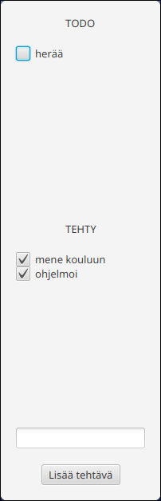
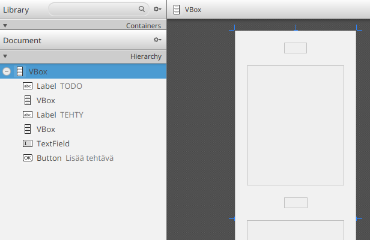
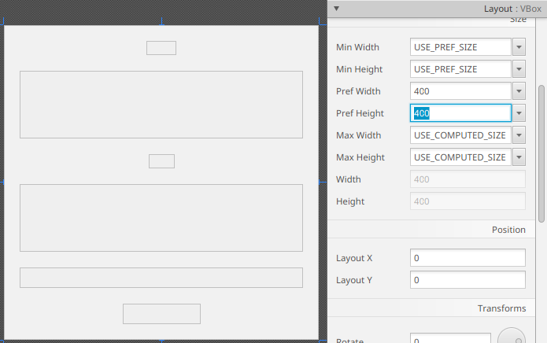
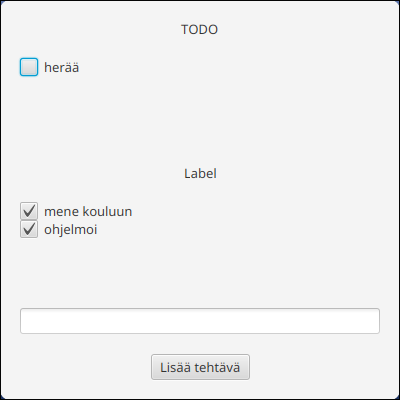
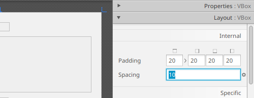
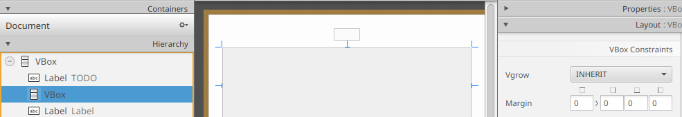

# Komponenttien asettelu

Sovelluksemme on toiminnallisesti valmis. 
Kuitenkin sovelluksessa on vielä muutama ulkoasuun liittyvä kiusallinen puute.
Ensinnäkin, kun sovellus käynnistyy, ikkunan koko on suhteellisen korkea:



Toiseksi, ikkunnan korkeuden kasvattaminen jättää TODO-nimiön ja ikkunan yläosan
ja Lisää tehtävä -painikkeen välille ylimääräistä tilaa.
Lopuksi, komponenttien asettelu kaipaisi hieman työstämistä: valintaruudut ovat
liian lähellä toisiinsa, nimiöt ovat oudosti keskitetty, ja Lisää tehtävä
-painike on liian kaukana syöttökentästä, jolloin komponettien välien yhteys ei
ole selvä.

Parannetaan sovelluksen ulkoasua ja tutustutaan vielä `VBox`-säiliön lähisukulaiseen `HBox`.

Avaa sovelluksen `main.fxml`-tiedosto SceneBuilder:ssa. Aivan heti valitse
yläpalkista **View** <i class="bi bi-chevron-right"></i> **Show Outlines**
tai paina <kbd>Ctrl</kbd>+<kdb>E</kbd> (macOS: <kbd>Cmd</kbd>+<kbd>E</kbd>).
Toiminto muuttaa komponentit näyttämään laatikoilta:



Toiminto helpottaa merkittävästi komponenttien paikan ja erityisesti koon
hahmottamista.
Tämän luvun jälkeen voit palata takaisin perusnäkymään valitsemalla yläpalkista
**View** <i class="bi bi-chevron-right"></i> **Hide Outlines**
tai painamalla <kbd>Ctrl</kbd>+<kdb>E</kbd> (macOS:
<kbd>Cmd</kbd>+<kbd>E</kbd>).

## Ikkunan ja komponenttien koko

Korjataan aivan alkuun ikkunan koko SceneBuilderissa.
Klikkaa kaikkia komponentteja sisältävä `VBox`-elementti.
Helpointen tämä onnistuu vasemman puolen Hierarchy-paneelista.
Valitse sitten samalla oikealta Layout-paneeli näkyviin:

<video src="images/scenebuilder-layout-panel.mp4" controls></video>

Layout-paneeli sisältää asetuksia liittyen komponentin kokoon.
Tällä hetkellä meitä erityisesti kiinnostaa komponentin leveys (*width*)
ja korkeus (*height*). JavaFx:ssä jokaisella komponentilla on kuitenkin
kolmenlaista korkeutta ja leveyttä:

- Oletusleveys ja -korkeus (`Pref Width` ja `Pref Height`): komponentin
  oletuskoko, kun sovelluksennäkymä ladataan. Koko voi kuitenkin muuttua
  riippuen komponentin luonteesta ja sitä ympäröivistä tai sisältämistä
  komponenteista.
- Pienin leveys ja korkeus (`Min Width` ja `Min Height`): komponentin pienin
  sallittu koko, jos komponentin koko muuttuu.
- Suurin leveys ja korkeus (`Max Width` ja `Max Height`): komponentin suurin
  sallittu koko, jos komponentin koko muuttuu.

Jokaiselle ominaisuudelle voi antaa arvoksi desimaaliluku, jolloin JavaFx pyrkii pitämään
komponentin koon annettujen lukujen rajoissa. Lisäksi JavaFx tukee kaksi
erikoisarvoa:

- `USE_COMPUTED_SIZE`: Antaa JavaFx:lle laskea paras komponentin koko
  komponentin sisällön perusteella. Toisin sanoen: JavaFx laajentaa tai
  pienentää komponenttia sen sisällön perusteella.
- `USE_PREF_SIZE` (vain suurimmalle ja pienimmälle koolle): JavaFx käyttää
  kokona samaa kuin komponentin oletuskoko. Tämä on hyödyllinen silloin, kun
  halutaan estää, että komponentti kasvaa liian suureksi tai pieneksi.

Näitä huomioon ottaen asetetaan koko näkymän `VBox`:lle seuraavat arvot:

- Min Width: `USE_PREF_SIZE`
- Min Height: `USE_PREF_SIZE`
- Pref Width: `400`
- Pref Height: `400`
- Max Width: `USE_COMPUTED_SIZE`
- Max Height: `USE_COMPUTED_SIZE`

Toisin sanoen: alusta näkymän oletuskooksi 400x400, älä pienennä näkymää
pienemmäksi kuin oletuskoko, mutta anna näkymän koon kasvaa niin isoksi kuin
käyttäjä haluaa.
Huomaat muutoksen saman tien SceneBuilderissa:



Tallenna FXML-tiedosto ja kokeile käynnistää sovellus. Huomaat, että sovelluksen
käynnistyessä ikkunan koko on oletuksella myös 400x400:



Kuitenkin jos nyt yrität muuttaa ikkunan kokoa, huomaat, että voit silti
pienentää ikkunan pienemmäksi kuin 400x400.
Tämä johtuu siitä, että muokkasimme vain näkymän kokorajoja, kun taas koko
ikkunan, eli `Stage`-olion, minimikokoa ei muokattu.
Korjataan tämä asettamalla ikkunan minimikoko `App`-luokan `start()`-metodissa.
Samalla muokataan sovelluksen otsikko siistimmäksi:

```java,ignore
public void start(Stage stage) throws IOException {
    FXMLLoader loader = new FXMLLoader(getClass().getResource("main.fxml"));
    Scene scene = new Scene(loader.load());

    stage.setScene(scene);
    // HIGHLIGHT_GREEN_BEGIN
    stage.setMinHeight(400);
    stage.setMinWidth(400);
    // HIGHLIGHT_GREEN_END
    // HIGHLIGHT_YELLOW_BEGIN
    stage.setTitle("TODO-sovellus");
    // HIGHLIGHT_YELLOW_END
    stage.show();
}
```

Nyt kun käynnistät sovelluksen, huomaat, että ikkunan kokoa ei voi pienentää
alle 400x400:

<video src="images/todo-app-size-limit.mp4" controls width="400"></video>

## `VBox`-säiliön komponenttien väli

`VBox`-komponentti sisältää Spacing-asetuksen, joka määrittää komponentin
sisällä olevien komponenttien välisen tyhjän tilan.

Huomaamme, että näkymän `VBox`-säiliössä välistys on 20, joka on hiukan liian
suuri. Korjataan tämä vaihtamalla asetuksen arvoksi `10`:



Korjataan samalla se, että tehtävien `VBox`-säiliöissä
`CheckBox`-valintaruutujen välissä ei ole yhtään tyhjää tilaa.
Aseta tehtyjen ja tekemättömien tehtävien `VBox`-komponenteille Spacing-arvoksi
`5`. Tallenna FXML-tiedosto ja aja sovellus. Huomaat, että nyt valintaruutujen
välissä on hieman tyhjää tilaa:


## Komponenttien kasvaminen `VBox`-säiliön kasvaessa

Jos yritämme kasvattaa sovelluksen ikkunan kokoa ajon aikana, huomaamme, että
tietyn korkeuden jälkeen tehtyjen ja tekemättömien listan korkeus ei kasva sovelluksen
mukaan. Alla oleva video havainnollistaa ongelman:

<video src="images/todo-app-vbox-no-resize.mp4" controls width="300"></video>

Kun `VBox`-säiliön korkeus kasvaa, oletuksella säiliön sisällä olevien
komponenttien korkeus pidetään muuttumattomana.
Voimme kuitenkin kertoa `VBox`-säiliölle erikseen, miten jokaisen komponentit
tulee käyttäytyä, kun säiliön ympärille syntyy tyhjää tilaa.
Tässä tapauksessa jos sovelluksen koko kasvaa, haluaisimme ensisijaisesti
kasvattaa tehtyjen ja tekemättömien tehtävien listat ja säilyttää muut nimiöt,
syöttökentät ja painikkeet samankokoisina.

Valita SceneBuilderissa tekemättömien tehtävien `VBox` ja avaa oikealla puolella
Layout-paneeli:



Kun komponentti on jonkin `VBox`-säiliön sisällä, komponentille on mahdollista
asettaa ns. Vgrow-asetus. Asetus määrittää, miten komponentin korkeuden tulee
käyttäytyä, jos komponenttia sisältävän `VBox` korkeus kasvaa.
Mahdolliset asetukset ovat:

- `NEVER`: Tämän komponentin korkeus pysyy samana jos `VBox` kasvaa.
- `ALWAYS`: Tämän komponentin korkeus kasvatetaan *aina* täyttämään tyhjän
  tilan, kun `VBox` kasvaa. Jos usealla komponentilla on `ALWAYS`-vaihtoehto,
  komponenttien korkeus kasvatetaan samaan aikaan.
- `SOMETIMES`: Tämän komponentin korkeus kasvatetaan vain, jos mitään
  komponenttia ei voi kasvattaa.

Asetetaan tekemättömien tehtävien säiliölle Vgrow-asetuksen arvoksi `ALWAYS`.
Tee sama myös tehtyjen tehtävien säililölle, jolloin kummatkin säiliöt kasvavat
samassa suhteessa.

Tallenna muutokset ja käynnistä sovellus. Nyt ikkunan korkeuden kasvaessa
tehtyjen ja tekemättömien tehtävien korkeus täyttää uuden tyhjän tilan, ja muut
komponenttien koko pysyy muuttumattomana.

## Painikkeen asettaminen syöttökentän tasolle

Tällä hetkellä syöttökenttä näyttää olevan hieman irrallinen painikkeesta.
Sovelluksissa on yleisempää, että suoraan kenttään liittyvät toiminnut laitetaan
samalle riville kuin syöttökenttä.

Koska `VBox` asettaa komponentit aina allekkain, se ei auta tässä tapauksessa.
Sen sijaan voimme käyttää sen vaakasuoraa vastinetta `HBox` (**H**orizontal
**Box**). Nimensä mukaisesti `HBox` on säiliökomponentti, jonka sisällä olevat
alkiot sijoitetaan vaakasuorassa suunnassa vasemmalta oikealle.

Lisää `HBox`-komponentti tehtyjen tehtävien alle ja raahaa nykyinen syöttökenttä
ja painike komponentin sisään:

<video src="images/scenebuilder-hbox-add.mp4" controls></video>

Aseta samalla `HBox`-komponentin Spacing-asetuksen arvoksi `10`, jotta
syöttökentän ja painikkeen välille jää tyhjää tilaa.
Aseta lisäksi `HBox`:n Pref Width ja Pref Height -asetukset arvoon
`USE_COMPUTED_SIZE`, jotta säiliön koko mukautuu ympärillä olevaan tilaan ja sen
sisältöön. Lopuksi, aseta `HBox`-komponentin Vgrow-asetuksen arvoksi `NEVER`, 
jotta sen korkeus ei ikinä muuttuisi. Tässä tapauksessa tämä on OK, sillä
syöttökentän ja painikkeen korkeus on aina vakio.

Sen jälkeen valitse `TextBox`-syöttökenttä ja aseta sen Hgrow-asetuksen arvoksi
`ALWAYS`,
jolloin syöttökentän leveys täyttää aina kaiken vaakasuoran tilan. Hgrow-asetus
vastaa siis `VBox`:n Vgrow-asetusta, mutta on tarkoitettu komponenttien
kasvattamiseen vaakasuorassa suunnassa.

## Nimiöiden tasaaminen vasemmalle

Tehdään aivan viimeinen loppusilaus: sovelluksissa on yleistä, että nimiöt ovat
tasattu vasempaan reunaan. Korjataan vielä tasaus, jotta sovelluksen ulkoasu on
käyttäjälle "tutumpi".

Valitse SceneBuilderissa koko näkymän päällimmäinen `VBox`-komponentti, joka
sisältää kaikki muut komponentit. Aseta sitten Properties-paneelissa
Alignment-asetuksen arvoksi `CENTER_LEFT`, jolloin kaikki komponentit tasataan
ikkunan vasempaan reunaan:


Tallenna FXML-tiedosto ja käynnistä sovellus. Varmista vielä, että sovellus
toimii ja komponetit mukautuvat hyvin ikkunan kokoon.

<video src="images/todo-app-final-product.mp4" controls></video>


<task>
  <task-title>Tehtävä 7.6: TODO-ohjelma, vaihe 6. <points>1 p.</points> </task-title>
  <handout>

{{#include ../exercises/7-6-todo-6/handout.md}}

  </handout>
  <task-link><a href="https://tim.jyu.fi/view/kurssit/tie/tiep111/tehtavat/osa7/tehtava6">Tee tehtävä TIMissä</a></task-link>
</task>


<!-- 

Komponetin kokoon vaikuttavat neljä pääominaisuutta: leveys (*width*), korkeus
(*height*), marginaali eli komponentin ympärillä oleva tila (*marginal*)
ja välistys eli komponentin sisäreunan ympärillä oleva tila (*padding*).
Visuaalisesti nämä ominaisuudet voidaan esittää seuraavasti:

```bob
+-------------------------------+
|            width              |
|     |<----------------- |     |
|                               |
|  -  +-------------------+     |
|h ^  |     padding       |     |
|e |  |   +----------+    |     |
|i |  |   |   {c}    |    |     |
|g |  |   | "Sisältö"|    |     |
|h |  |   +----------+    |     |
|t v  |       {p}         |     |
|  -  +-------------------+     |
|             {m}               |
|           margin              |
+-------------------------------+

Legend:
m = {
    fill: #af8255;
}
p = {
    fill: #b7c37f;
}
c = {
    fill: #87b0bc;
}
```

-->