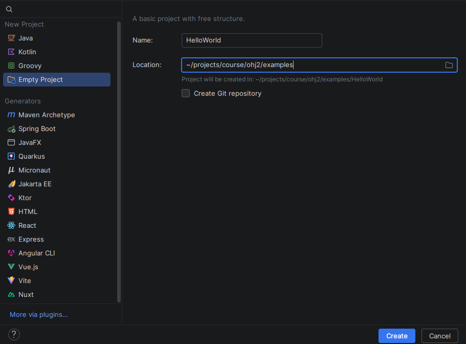
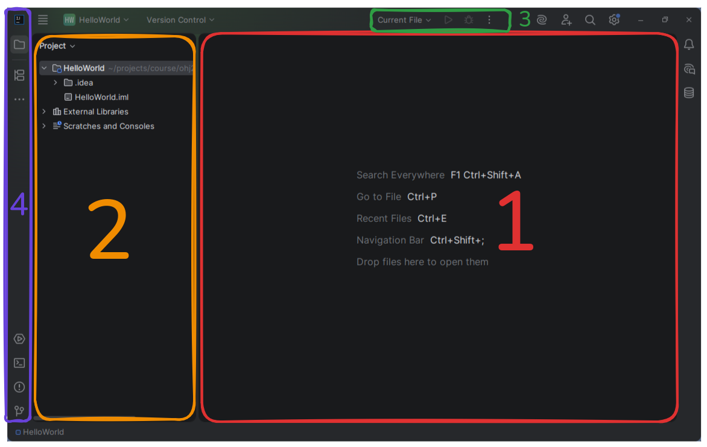

# Hello, Java!

## Learning Objectives

* You will become familiar with the basics of the Java language.
* You will know how to compile and run a Java program.
* You will know what the (J)VM is and how compilation differs from interpretation.
* You will be familiar with Java equivalents of the most common I/O operations.

In the Programming 2 course, we use the Java programming language.
Java is a general-purpose language that supports object-oriented programming and is designed for writing platform-independent programs. Java consistently ranks among the most popular programming languages
(See for example 
[TIOBE index](https://www.tiobe.com/tiobe-index/), 
[StackOverflow 2025 developer survey](https://survey.stackoverflow.co/2025/technology), 
[Most popular languages in GitHub](https://madnight.github.io/githut)).
<!-- . Java syntax closely resembles the C# language used in the Programming 1 course. -->

## Basics of the Java Language

Let's begin with the traditional "Hello, world!" example in Java:

```java
/* 1 */ void main() {
/* 2 */     IO.println("Hello, world!");
/* 3 */ }
```

Let's examine the program line by line:

1. Execution of a Java program begins from a method named `main`. The keyword `void` means that the method does not return any value. Since this main program does not take parameters, the parentheses following the word `main` can be left empty. The method body begins with an opening brace `{`.

2. Printing text to the command-line window is done using the `IO.println` method. In Java, statements usually end with a semicolon `;`, as in this example.

3. The method body is terminated with a closing brace `}`. Program execution ends automatically when the `main` method has finished.

Although the program is very simple, it is still a fully valid Java program.
Throughout the course, we will write many programs that output to and read from the command-line window. In the latter half of the course, the focus shifts toward graphical user interfaces.

<details>
<summary>Optional additional information: Back to the 1990s and older Java</summary>

Before the introduction of *compact source files* in Java 25, even the traditional "Hello, world!" program required significantly more boilerplate code.

The program would typically look like this:

```java
public class HelloWorld {
    public static void main(String[] args) {
        System.out.println("Hello, World!");
    }
}
```

Although this program may currently look somewhat intimidating, by the end of the course you will understand the purpose of every keyword and structure used in it.

The newer compact source-file format allows us to focus on the essentials of programming before introducing the more advanced features of the language. Later in the course we will revisit this older style and see how it relates to the compact programs used in the first chapters.

</details>

## Differences Between Java and Python

We can already observe several important differences between Java and Python. Some of these differences are syntactic, while others are related to the languages' semantics and type systems.

### Syntactic Differences

In Python, *indentation* is used to mark the bodies of functions, loops, conditional statements and other control structures.

```python
def weird(n: int) -> list:
    # The function body is indented using four spaces.
    sequence = [n]

    while n != 1:
        if n % 2 == 0:
            # The body of the if-statement is indented further.
            n /= 2
        else:
            # The body of the else-statement is indented further.
            n = n * 3 + 1

        # The body of the while-loop is indented using eight spaces.
        sequence.append(n)

    return sequence
```

In Java, code blocks are enclosed within curly braces `{` and `}`. These braces mark the beginning and end of method bodies, loops, conditional statements and other language constructs.

Although indentation is not required by the Java compiler, it is still used to improve readability and make program structure easier for humans to understand.

Another notable difference is that Java statements are typically terminated with a semicolon `;`.

### Typing System

As you learned in Programming 1, Python supports *type hints*, which can make programs easier to read and understand.

```python
def square(n: float) -> float:
    return n * n
```

However, Python is a dynamically typed language, meaning that type hints are optional and are generally not enforced by the interpreter.

Java, on the other hand, is a [statically typed language](./02-variables-and-types.md#javas-type-system). As a result, type information is required when defining methods and variables.

The equivalent Java method would be:

```java
double square(double n) {
    return n * n;
}

void main() {
    IO.println(square(10));
}
```

In Java, we must explicitly specify the return type of the method, which in this example is `double`. We must also specify the type of each parameter. Here the method has a single parameter named `n`, whose type is also `double`.

Static typing allows the compiler to detect many programming errors before the program is executed.

In the next [section](./02-variables-and-types.md), we will examine Java's primitive data types in more detail.

### Methods and Functions

In Python, reusable pieces of code are usually called functions.

In Java, similar constructs are typically called methods, because they are usually associated with a class. Since we have not yet introduced classes, we may occasionally use the terms *function* and *method* interchangeably in the first chapters.

Later in the course, we will see why Java programmers usually prefer the term *method*.

## Java Coding Conventions

Most programming languages have a set of coding conventions established for that language. Java is no exception.
We will become familiar with various conventions as this material progresses. It is worth mentioning that Java coding conventions differ slightly from those used in Python, particularly in naming and code formatting.

The most important Java conventions to keep in mind at this stage are:

- The opening brace `{` that starts a method body is usually placed on the same line as the method declaration. The same applies to other constructs that use braces, such as `if`, `for`, `while`, and `do-while` statements.

- Variables and methods use the `camelCase` naming style, where the first letter is lowercase and subsequent words begin with an uppercase letter. For example: `thisIsAFunctionName`.

- Files and classes use the `PascalCase` naming style, where the first letter is uppercase and each subsequent word also begins with an uppercase letter: `HelloWorld.java`, `public class Student`, and so on. PascalCase is similarly used for many other structures that we will learn later, such as interfaces and enumerations.

## Guide: Compiling and Running Java Programs

> [!IMPORTANT]
>
> In this section, you will need the course development tools. Install all required tools first using the course [tool installation guide](../tools.md).

Although many small programs like the one above could technically be created in a web browser, it is much more practical to use a dedicated development environment.
In this material, we use the IntelliJ IDEA development environment for creating, running, and debugging Java programs.

### Create a New Project

Next, let's create a simple project in IDEA.
A project is IDEA's way of grouping source code files, tests, libraries, and other resources into a single entity.

Do the following:

1. Open IntelliJ IDEA and open the new project dialog.
  * If you see **Welcome to IntelliJ IDEA**, select **New Project**.

  * If an existing Java project is open, select **File** → **New** → **Project** from the menu bar.
    

  * The menu options may be hidden behind a hamburger menu button depending on your configuration.

2. In the new project dialog:
  * Select **Empty Project** from the list on the left.

  * Enter **HelloWorld** into the **Name** field. Project names are usually written without spaces.

  * Set the project location in the **Location** field. Click the folder icon on the right side of the field and choose a suitable directory. Choose a location that you will be able to find easily later.

  * Clear the **Create Git repository** checkbox. We do not need version control yet.

    


3. After making these choices, click **Create**.
IDEA will then create a new project in the selected directory.

Let's briefly review the most important parts of IDEA:



   1. **Code editor**: displays the contents of opened files. Each opened file appears in its own tab.
   2. **Project explorer**: displays folders and files belonging to the project. Files and directories can be added, removed, moved, and renamed here.
   3. **Run and debug controls**: displays the program to be run, together with the run and debug buttons.
   4. **Views and tool windows**: IDEA includes various views that are hidden by default. The sidebar can be used to open and hide them as needed. For example, the project explorer can be hidden by clicking its folder icon.

### Create a Java Module

By default, a new project is empty.
In IDEA, program code is written inside *modules*. Several modules can be added to the same project and developed or executed independently.
For example, you might create a single project for all exercises of a given week and add each exercise as its own module.

Next, create a module named `HelloProgram`, add a new program to it, and run it.

Do the following:

1. Right-click the project name (`HelloWorld`) in the project view and select **New** → **Module**.

2. In the **New Module** dialog:

  * Select **Java** as the module type.

  * Enter **HelloProgram** into the **Name** field.

  * Leave the **Location** field unchanged. IDEA automatically selects the correct location.

  * Select **IntelliJ** as the **Build system**.

  * Make sure the **JDK** field contains the same JDK version that you installed.

  * Clear the **Add sample code** checkbox. We will create the source file ourselves.

  

    Finally, click **Create**.
    This creates a new `HelloProgram` directory containing a `src` directory.

    <video src="images/intellij-module-create.mp4" controls></video>


### Create a Source Code File

In an IntelliJ project, code belonging to a module is placed in the `src` directory.
If a project contains multiple modules, each module has its own `src` directory.

Next, create a Java source code file:

1. Expand the `HelloProgram` module in the project explorer.
2. Right-click the `src` directory and select **New** → **Java Compact File**.
3. Enter the name `Program` and press Enter.

<video src="images/intellij-new-java-file.mp4" controls></video>

IDEA creates a new file named `Program.java` inside the `src` directory.
IDEA also automatically inserts a `main` method skeleton into the source file and opens the file in the editor.
You can later reopen the file by double-clicking it.

### Write the Program

Next, write a simple "Hello, world!" program from scratch into the newly created `Program.java` file.

Do the following:

1. Delete all code currently in the file.
  IDEA usually inserts a default template into new source-code files.
  For this exercise, however, we will write the code ourselves.

2. *Type* the following code into `Program.java`:

    ```java,noplayground
    void main() {
        IO.println("Hello, world!");
    }
    ```

    Avoid copying and pasting the code. Typing it yourself often helps you remember where important programming symbols such as braces, parentheses, and semicolons are located.

<details>
<summary><i class="bi bi-stars jyu-gold"></i> Bonus: Using IDEA's code completion features</summary>
IDEA provides various time-saving completion features that are worth practicing.

Try at least the following:

* Automatic insertion of the `main` method:
  Begin typing `main`.  Press <kbd>Ctrl</kbd>+<kbd>Space</kbd> (<kbd>⌘</kbd>+<kbd>Space</kbd> on macOS).
  Select the `main` template with the arrow keys and press <kbd>Enter</kbd>.

    <video src="images/intellij-main-template.mp4" controls></video>

  IDEA contains many built-in templates that speed up coding and help remember common structures.
  You can view all templates by pressing <kbd>Ctrl</kbd>+<kbd>J</kbd> (<kbd>⌘</kbd>+<kbd>J</kbd> on macOS).

* Automatic completion of `println`:
    Move the cursor to an empty line inside the `main` method.

    Type the letter `I`.  IDEA automatically displays all suitable completions beginning with `I`.
    Select `IO` and press <kbd>Enter</kbd>.
    This inserts `IO` at the cursor position.

    Then type a period (`.`).
    IDEA automatically displays all methods belonging to the `IO` class.
    Select `println` and press <kbd>Enter</kbd>.
    This inserts `println`.

    Type an opening parenthesis `(`.
    IDEA automatically inserts the matching closing parenthesis `)`.
    Move between the parentheses and type: `"Hello, world!"`
    Finally, move to the end of the line and add a semicolon `;`.

    <video src="images/intellij-auto-completion.mp4" controls></video>

    IDEA can therefore automatically suggest class and method names based on context.
    You can always manually open the completion menu as well.

</details>

### Running the Program

Source files containing a `main` method can be executed.
Execution can be started using the run button (<i class="bi bi-play-fill"></i>) located next to the `main` method or from IDEA's toolbar.

Do the following:

1. Click the run button to the left of the `main` method (<i class="bi bi-play-fill"></i>).

    IDEA first compiles the program.
    Once compilation is complete, IDEA executes the program and opens the **Run** window below the editor.
    The first line shows the command IDEA used to execute the compiled file.
    The next line contains the output produced by our program:
    `Hello, world!`
    The final line indicates that the program terminated successfully.

   <video src="images/intellij-run-gutter.mp4" controls></video>


2. Try running the program again using the created run configuration.  

    The first time you run a source file, IDEA creates a *run configuration*.
    A run configuration is a small configuration file that stores execution-related settings such as:
    the JDK version to use, possible command-line parameters and the working directory
    By default, this configuration is stored in `.idea` <i class="bi bi-chevron-right"></i> `workspace.xml`.

    Once the run configuration has been created, you can run the program in the future directly using the run button in IDEA's toolbar.
    This makes it easy to execute programs without opening the source file separately.

    IDEA's toolbar should now display the name of the `Program` run configuration together with a run button.
    Try closing `Program.java` and running the program from the toolbar.

   <video src="images/intellij-run-config.mp4" controls></video>

    Run configurations make it possible to execute programs located in different modules.
    Later in the material, we will also become familiar with the Gradle build tool, which allows us to create separate configurations for running, testing, and building projects.

> [!TIP]
> 
> **Become Familiar with Common Keyboard Shortcuts**
> 
> Keyboard shortcuts speed up the use of the development environment, and with some practice it is possible to program almost entirely without using the mouse.
> Keyboard shortcuts depend on the operating system and selected keymap settings.
> However, IDEA displays shortcut keys in menus and tooltips, making them easier to learn.
> 
> 
> 
> You can modify keyboard shortcuts in
> File → Settings → Keymap
> You can also install keymaps from other development environments, such as Visual Studio Code, through:
> File → Plugins.

## Compiling and Running from the Command Line

Before IDEA actually runs a program, it first compiles it into an executable form.
Within IDEA this happens automatically when you press the run button, the debug button, or use commands from the Build menu.
However, Java source code can also be compiled and executed manually from the command line.
Understanding how this works helps you understand what IDEA is doing behind the scenes.

Let's now explore how a program is compiled and executed from the command line.

<details closed><summary>How can I follow along?</summary>

First, create a simple program according to the [guide above](#guide-compiling-and-running-java-programs).

Then open IDEA's integrated terminal by clicking the terminal button (<i class="bi bi-terminal"></i>) in the left sidebar.
This opens the operating system's command-line shell 
(zsh on macOS, powerShell on Windows, the default shell on Linux).

If you installed the Java development environment according to the course instructions, the terminal may not initially find Java tools.
Enable them temporarily by running the following command.

#### [Windows](#tab/win)

```powershell
Get-ChildItem -Path "$env:USERPROFILE\.jdks" -Directory | Sort-Object Name -Descending | Select-Object -First 1 |
ForEach-Object { $env:JAVA_HOME = $_.FullName; $env:PATH = "$_.FullName)\bin;$env:PATH" }
```

***

#### [macOS](#tab/macos)
```bash
export JAVA_HOME=$(/usr/libexec/java_home) && export PATH="$JAVA_HOME/bin:$PATH"
```

***

### [Linux](#tab/linux)

```bash
export JAVA_HOME=$(printf "%s\n" ~/.jdks/* | sort -V | tail -n 1) && export PATH="$JAVA_HOME/bin:$PATH"
```

***

### [Choose](#tab/default)

Choose your OS from the options above.

***

The command above enables the JDK command-line tools *temporarily*.
The terminal returns to its original state after it is closed and reopened.

</details>

Next, move into the project directory and examine its contents.

<asciinema src="images/rec_ls_files.cast" rows="3" poster="npt:3"></asciinema>

Because we are using an IntelliJ project, only a few important files and directories are present:

* `HelloWorld.iml` is the project settings file used by IDEA to recognize the directory as a Java project.
* `HelloProgram` is the source-code module directory.
* `out` contains compiled programs.

Next, move into the `HelloProgram` directory and inspect its contents.

<asciinema src="images/rec_cd_module.cast" rows="4" poster="npt:10"></asciinema>

A single module contains the following files and directories:

* `HelloProgram.iml` is the module settings file used by IDEA to recognize the directory as a Java module.
* `src` is the source-code directory containing the program's source code.

Move into the `src` directory and inspect its contents.

<asciinema src="images/rec_cd_project.cast" rows="4" poster="npt:5"></asciinema>

Files ending with `.java` are Java *source code files*.
They contain the program as text and cannot yet be executed directly.

To run a program, it must first be compiled.
As mentioned earlier, IDEA performs this automatically when running a program, but source code can also be compiled using the `javac` compiler included with the JDK.
Let's compile `Program.java`. `javac Program.java`

<asciinema src="images/rec_javac.cast" rows="2" poster="npt:5"></asciinema>

If compilation succeeds, the `javac` command produces no output by default.
Examine the directory contents again using `ls`.

<asciinema src="images/rec_javac_ls.cast" rows="3" poster="npt:5"></asciinema>

As a result of compilation, a file with the `.class` extension is created.
This file contains so-called *bytecode*.
Bytecode is the compiled form of the program.
It is not directly executable by the processor. Instead, it is an intermediate representation.
Bytecode can be executed by the Java Virtual Machine (JVM), which is a separate program capable of interpreting and executing Java bytecode.
Although this may sound complicated, the benefit is that a program compiled into Java bytecode can run on different platforms (Windows, macOS, Linux and others).
provided that a JVM exists for that platform.

The JVM can then optimize the bytecode for the specific processor and operating system.
Java's famous slogan:
”Write Once, Run Anywhere”
refers to this principle.

The JDK also includes the Java Runtime Environment (JRE) and the JVM itself.
A bytecode file can be executed using the `java` command:
`java Program` 

<asciinema src="images/rec_java.cast" rows="3" poster="npt:5"></asciinema>

Notice that when using the `java` command, the `.class` extension is omitted.
Later in the course we will learn about Gradle, which can compile multiple source files into a single `.jar` file containing everything needed to run the application.
`.jar` files can also be executed using the `java` command.

> [!TIP]
> 
> Beginning with Java 11, the `java` command can also compile and execute `.java` source files directly without separately running `javac`.
> 
> In addition, throughout most of this course we will use IntelliJ IDEA, which performs source-code compilation automatically and efficiently.

<details close>
<summary><i class="bi bi-stars jyu-gold"></i> Bonus: The <code>jshell</code> REPL</summary>

Although Java is considered a compiled language, it can sometimes be useful to experiment with Java interactively without continually recompiling.
In this context, *interactive* means that you can execute commands one line or block at a time without creating classes or a `main` method.

For this purpose, the JDK includes the `jshell` program, which is Java's command-line interpreter, or REPL (*read-evaluate-print loop*).

`jshell` provides several useful features, including:

* class and method name completion using the <kbd>Tab</kbd> key
* execution of expressions without a `main` method

You can exit `jshell` using `/exit`.

<asciinema src="images/rec_jshell.cast" rows="25" poster="npt:60" controls></asciinema>

</details>

## Printing Text and Reading Input in the Command-Line Window

Later on it will often be useful to print information to the terminal and read information from it.
Java's `IO` class provides three basic operations for console output and input:

| Method    | Example                          | Description                                                                                                                          |
| --------- | -------------------------------- | ------------------------------------------------------------------------------------------------------------------------------------ |
| `println` | `IO.println("Hello!");`          | Prints the given value followed by a newline                                                                                         |
| `println` | `IO.println();`                  | Prints an empty line                                                                                                                 |
| `print`   | `IO.print("On the same line!");` | Prints the given value without adding a newline                                                                                      |
| `readln`  | `IO.readln();`                   | Reads one line of input from the user (up to Enter). If the user terminates input without entering data, returns a [null reference](02-variables-and-types.md#reference-data-types). |
| `readln`  | `IO.readln("Enter a word > ");`  | Same as `readln`, but prints the given prompt first                                                                                  |

Let's see how these work together.

You can freely modify the example below and experiment with different kinds of output:

```java,editable
void main() {
    String name = IO.readln("Enter your name: > ");
    IO.println();

    IO.println("Hello, " + name + "!");

    IO.print("This text");
    IO.print(" goes on the");
    IO.print(" same line");

    IO.println(); // Try removing this and see what happens

    IO.println("Welcome to the Programming 2 course!");
}
```
