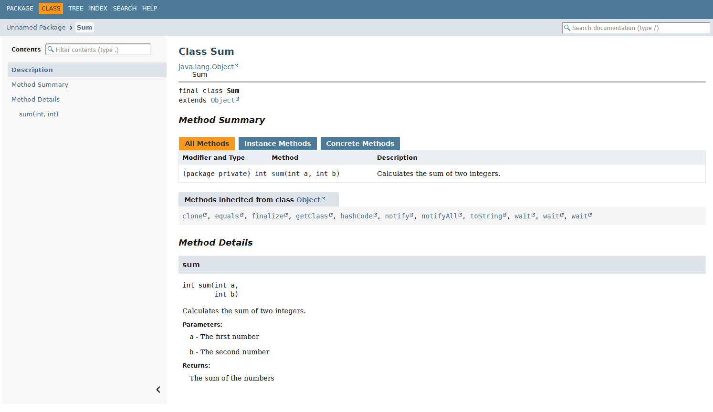

# Subroutines

* You can define a subroutine.
* You can process data using subroutines.
* You understand the difference between Java primitive types and reference types when calling a subroutine.
* You can document a subroutine.

A **subroutine** is a part of a program that performs a specific task. Subroutines make programs easier to structure because they allow a program to be divided into smaller, more manageable parts. Subroutines also improve reusability, as the same subroutine can be called multiple times from different parts of a program without rewriting the code.

Subroutines are sometimes called **functions**, and in the context of object-oriented programming, they are often referred to as **methods**. The exact terminology depends on the context, but in this context we use the term *subroutine*.

A subroutine can receive **inputs**, called **parameters**. After completing its task, a subroutine may return a result. Consider the `average` subroutine below, which calculates the average of a collection of integers. The subroutine receives an integer array as a parameter and returns the average as a `double`.

```java
void main() {
    int[] numbers = {4, 8, 15, 16, 23, 42};
    double average = average(numbers);
    IO.println("The average of the numbers is: " + average);
}

double average(int[] numbers) {
    if (numbers.length == 0) {
        return 0;
    }
    double sum = 0;
    for (int number : numbers) {
        sum += number;
    }

    return sum / numbers.length;
}
```

## Defining a Subroutine

The `average` subroutine above consists of four main parts (1) return type,
(2) name,
(3) parameters,
(4) body.

* **(1) Return type** (here `double`): Specifies the type of value returned by the subroutine. If the subroutine does not return a value, the return type is `void`.
* **(2) Subroutine name** (here `average`): Specifies the name used when calling the subroutine.
* **(3) Parameters** (here `int[] numbers`): Variables declared within the parentheses that receive the inputs provided to the subroutine. A subroutine may have zero or more parameters, separated by commas. Each parameter has its own type and name.

Together, these three parts are called the *subroutine declaration*. In Part 2, we will also introduce object-oriented programming **modifiers**, which can be added to the declaration.

Following the declaration, the *body* of the subroutine is written inside curly braces. The body contains the code that is executed whenever the subroutine is called.

As with all source code, the names of subroutines and parameters should be descriptive, follow Java naming conventions, and comply with the style guide used in this course.

## Return Values and Data Processing

A subroutine can be viewed as a **black box**: raw materials (parameters) go in, processing happens inside the box, and a finished product (the return value) comes out.
The `return` keyword immediately terminates the execution of a subroutine and returns a value to the caller. The type of the returned value must match the return type specified in the subroutine declaration.

When using a subroutine written by someone else, we do not necessarily know what happens inside the box. Instead, we trust that it behaves according to its specification. This is common in programming, where we routinely use pre-existing libraries and subroutines.

## Void Subroutines

Sometimes a subroutine is needed only to perform an action, such as printing text to the screen or causing some other side effect. In such cases, the subroutine does not need to return a value.
The return type is then specified as `void`.


## Parameter Passing: Primitive Types and Reference Types

It is important to understand what is actually passed as a parameter when a subroutine is called. In Java, all parameters are passed by value (*pass-by-value*), but the nature of the value being passed depends on the parameter's type.

* If the parameter type is a *primitive type* (such as `int`, `double`, `char`, or `boolean`), the subroutine receives *a copy of the original value*.
* If the parameter type is a *reference type* (such as an array), the subroutine receives *a copy of the reference to the original data*.

When a primitive type is passed as a parameter,
(see [Chapter 1.2](02-variables-and-types.md#primitive-data-types))
 the value of the variable is copied and passed to the called subroutine. If the subroutine modifies this copy, the original variable remains unchanged.

```java
void tryToModify(int number) {
    number = 99; // Only the copy is modified
    IO.println("Inside method: " + number);
}

void main() {
    int x = 10;

    tryToModify(x);

    IO.println("In main: " + x); // Still prints 10
}
```

When a reference type is passed as a parameter
(see [Chapter 1.2](02-variables-and-types.md#reference-data-types))
, the reference is copied rather than the underlying data. The subroutine therefore receives a copy of a reference that points to the same data as the variable in the main program. If the subroutine modifies the data being referenced (for example, elements of an array), the change is visible in the main program as well.

You can think of a reference as a *remote control* used to operate a *television*, where the television represents the data. Even though a copy of the remote control is passed to the subroutine, it can still control the same television.

The following example demonstrates this by passing an `int[]` array as a parameter and modifying its elements:

```java
void zeroArray(int[] array) {
    // This modification affects the original array!
    // The variable "array" refers to the same array.
    for (int i = 0; i < array.length; i++) {
        array[i] = 0;
    }
}

void main() {
    int[] numbers = {1, 2, 3};

    zeroArray(numbers);

    // The original array has been modified
    IO.println(numbers[0]); // Prints 0
}
```

However, it is important to understand that the subroutine call passed a copy of the reference, not the original reference itself. If the subroutine attempts to make the reference point to different data (for example, another array), this change will not affect the original reference in the calling code.

The following example demonstrates this:

```java
void main() {
    int[] numbers = {1, 2, 3};

    changeReference(numbers);

    // The original array has not changed
    IO.println(numbers[0]); // Still prints 1
}

void changeReference(int[] array) {
    // This does not affect the original reference!
    array = new int[] {9, 9, 9};
}
```

In some languages, such as C++, it is possible to pass the original variable itself by reference (*pass-by-reference*). Java does not provide such a mechanism. Instead, all parameters are passed by value, as described above.

## Subroutines and Side Effects

A subroutine that modifies data provided through its parameters is often said to produce **side effects**.
For example, consider the following `reverse` subroutine, which reverses the order of elements in an array:

```java
void reverse(int[] array) {
    // Implementation hidden to save space
//- for (int i = 0; i < array.length / 2; i++) {
//-     int temp = array[i];
//-     array[i] = array[array.length - 1 - i];
//-     array[array.length - 1 - i] = temp;
//- }
}

void main() {
    int[] array = {1, 2, 3, 4, 5};
    IO.println("array = " + Arrays.toString(array));
    reverse(array);
    IO.println("array = " + Arrays.toString(array));
}
```

Notice that `reverse` does not return a value, yet it has the **side effect** of reversing the array that was provided as a parameter.
The same functionality could also be implemented without side effects by returning a new array instead:

```java
int[] reverse(int[] array) {
    // Implementation hidden to save space
//- int[] result = new int[array.length];
//- for (int i = 0; i < array.length; i++) {
//-     result[i] = array[array.length - 1 - i];
//- }
//- return result;
}

void main() {
    int[] array = {1, 2, 3, 4, 5};
    IO.println("array = " + Arrays.toString(array));
    int[] reversed = reverse(array);
    IO.println("reversed = " + Arrays.toString(reversed));
}
```

Side effects can be useful, for example, when optimizing memory usage. However, they can also make programs more difficult to understand.
In the example above, the side effect of `void reverse(int[] array)` is not immediately obvious unless the implementation of the subroutine is examined. 
Side effects can unintentionally modify or even destroy data if the programmer is not aware of them.
For this reason, it is extremely important to understand how subroutines process their parameters.

## Comments and Documentation

Source code can contain text that is not executable code but instead explains it. Such explanatory text comes in two forms: (1) comments written directly within the code (referred to simply as *comments*) and also 
(2) documentation comments.

The purpose of comments is to support the *development process*. 
They are intended for programmers working with the code.
Documentation comments, on the other hand, are intended for everyone who *uses* the code. 
They are visible not only to the programmer who wrote the code but also to users who access the code through an API (*Application Programming Interface*), for example.

### Single-Line Comments

Single-line comments, which use the syntax `//`, can be used to mark TODO items in code:

```java
void main() {
    // TODO: Investigate potential issues with this solution
    String input = IO.readln();
    IO.println("You typed: " + input);
}
```

In general, a good principle is to write code that explains itself. Variables, classes, subroutines, and other programmer-defined names should be as descriptive as possible, reducing the need for comments on individual lines.

Sometimes, however, single-line comments are unavoidable when an operation is not self-explanatory or when a descriptive variable name would become excessively long:

```java
void main() {
    int n = 9;
    // Rounds down to the nearest number divisible by four
    int rounded = n & ~3;
    IO.println(rounded);
}
```

The variable name `roundedDownToNearestNumberDivisibleByFour` would also not be a particularly reasonable alternative.

### Multi-Line Comments

In Java, a multi-line comment is enclosed between `/*` and `*/`. This style of comment is recommended when more complex logic requires additional explanation and/or when it is useful to explain why a particular solution was chosen. Unlike documentation comments, these explanations are not intended to be displayed to users of the code.

```java,noplayground
if (user.usesLegacySystem()) {
    /*
     * Users registered before 2022 still use the legacy
     * authorization model for the time being.
     * Do not remove this check until all accounts have
     * been migrated.
     */
    return useLegacyPermissions(user);
}
```

### Documentation Comments

A documentation comment is a comment from which documentation intended for users of the code can be generated automatically.
Examples of such documentation include HTML API documentation that explains how to use the code, as well as tooltips displayed by IDEs when using subroutines.

Documentation comments are placed immediately before the code element being documented, such as a subroutine or a class.

In Java, documentation comments use a special syntax that differs from ordinary comments. They begin with `/**` and end with `*/`, making them very similar to multi-line comments.

```java
//- void main() {
//-     IO.println("sum(1, 2) ==> " + sum(1, 2));
//- }
//-
/**
 * Calculates the sum of two integers.
 *
 * @param a The first number
 * @param b The second number
 * @return The sum of the numbers
 */
int sum(int a, int b) {
    return a + b;
}
```

The basic structure of a documentation comment can be generated automatically in the IntelliJ IDEA development environment by typing `/**` above a subroutine declaration and pressing <kbd>Enter</kbd>.

<details closed><summary><i class="bi bi-stars jyu-gold"></i> Bonus: How does the Java documentation look like? </summary>

Suppose that you save the code above in a file called `Sum.java` and then execute the command 
`javadoc Sum.java`
This generates documentation files, including an `index.html` file. Opening this file in a web browser and navigating to the `Sum` class produces a view similar to the following:



Does it look familiar? Compare it to Java's official API documentation of 
[Object class](https://docs.oracle.com/javase/8/docs/api/java/lang/Object.html)
.
</details>

> [!TIP]
> It is worth exploring the official Java documentation linked throughout these course materials. Links to official documentation can usually be recognized by the text "JavaDoc".
> 
> Be prepared, however, for documentation to feel challenging at first. Official documentation often contains terminology and syntax that have not yet been introduced and may therefore be difficult to understand.
> There is no need to worry about this. Everything required for the course will be covered in these course materials unless explicitly stated otherwise.
> 
> Nevertheless, the ability to read and understand documentation is an important skill for any programmer. It is worth becoming gradually accustomed to it—even in the age of artificial intelligence. AI tools do not always provide the most recent information, nor do they always accurately reproduce what the documentation says.
> If you learn to rely solely on AI, you may encounter difficulties when problems become more complex. Artificial intelligence, particularly generative AI, tends to perform best when problems are common, well-known, and do not require deep expertise or careful attention to detail.
