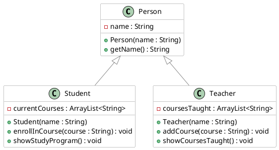
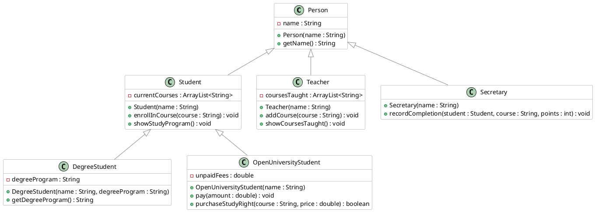

# Inheritance

### Learning Objectives

After completing this chapter, you will:

* Understand the concept of inheritance in object-oriented programming and know how to inherit classes in Java.
* Be able to create a simple class hierarchy where one class inherits from another.
* Understand that all Java classes ultimately inherit from the `Object` class.

*Inheritance* is a mechanism that allows a class to include the properties (attributes) and behaviors (methods) of another class. This enables code reuse and the creation of hierarchies between classes.

In practice, objects often share common characteristics. One way to handle these shared characteristics without duplicating code is through inheritance.


## Student Information System

Let's consider an imaginary student information system.

Olli Student, Maija Teacher, and Satu Secretary could all be objects in a fictional student information system called Kisu. They all share properties common to all users, such as a name and a username. Each user should also be able to log in to and log out of the system.

However, each user also has characteristics specific to their role:
A student may have a list of courses they are enrolled in and the credits they have earned.
A teacher has courses they teach and a job title but does not have earned credits.
A secretary is responsible for recording completed courses and awarding degrees but does not have a student number or teaching assignments.

Let's start with a simpler version of the system.
Below are `Student` and `Teacher` classes containing a few attributes and methods. Examine these classes.

> [!WARNING]
> Many of the examples below are missing documentation comments, or the comments may be incomplete. This is intentional, as adding full documentation would make the example code considerably longer and more difficult to read. In this material, the surrounding text serves as the primary explanation of the code.

> [!WARNING]
> The example below is intended to demonstrate inheritance syntax and therefore does not yet follow all best practices. In particular, assigning a name directly through a public `setName` method violates the principle of information hiding (see [Chapter 2.3](../part2/03-encapsulation.md)). We will fix this issue later as the example progresses.

```java
// FILE: Student.java
{{#include ../examples/part3/E31_Kisu_phase0/src/Student.java}}
// FILE_END
// FILE: Teacher.java
{{#include ../examples/part3/E31_Kisu_phase0/src/Teacher.java}}
// FILE_END
// FILE: main.java
{{#include ../examples/part3/E31_Kisu_phase0/src/Main.java}}
// FILE_END
```

Notice that both classes contain the same `name` attribute as well as the methods `getName` and `setName`.

Although the classes also have differences, the duplication is problematic because:

* Every class must redefine the same properties and behaviors.
* If we want to change a shared property or behavior, we must make the change in multiple places.
* Adding a new class with the same characteristics requires copying the same code yet again.

Suppose we wanted to change the `name` attribute so that first and last names are stored separately. We would need to make the same modification in every class.
This increases the likelihood of errors and makes maintenance difficult.
One of the key principles of software development is 
*Don't Repeat Yourself (DRY)* (see [Wikipedia](https://en.wikipedia.org/wiki/Don%27t_repeat_yourself))

***

## Class Hierarchy

To avoid duplication, we can create a superclass called `Person` that contains all shared properties and behaviors.
The subclasses `Student` and `Teacher` can then *inherit* from the `Person` class and automatically gain access to all of its attributes and methods.
This allows us to add only the role-specific functionality to each subclass without duplicating common code.

Let's create a new `Person` class and modify the `Student` and `Teacher` classes so that they inherit from it.
In Java, inheritance is implemented using the `extends` keyword.
For example: `class Student extends Person`
means that the `Student` class inherits from the `Person` class.

Let's make that change.

```java
// FILE: Person.java
{{#include ../examples/part3/E31_Kisu_phase1/src/Person.java}}
// FILE_END
// FILE: Student.java
{{#include ../examples/part3/E31_Kisu_phase1/src/Student.java}}
// FILE_END
// FILE: Teacher.java
{{#include ../examples/part3/E31_Kisu_phase1/src/Teacher.java}}
// FILE_END
// FILE: main.java
{{#include ../examples/part3/E31_Kisu_phase1/src/Main.java}}
// FILE_END
```

Notice that the `Student` and `Teacher` classes no longer define the `name` attribute or
the `getName` method or the `setName` method
because these are inherited from the `Person` class.
The code is now considerably cleaner and easier to maintain.
Inheritance defines *one*
superclass (`Person`) and 
one or more subclasses (`Student`, `Teacher`)
that extend the superclass with additional information and functionality.

In other words, when `Student` and `Teacher` inherit from `Person`, they gain access to all non-private attributes and methods defined in `Person`.
Private members remain part of the object's internal structure but are not directly available to subclasses. They are generally not considered part of the object's public interface.

In the literature, you may also encounter the terms 
*base class* (superclass) and *derived class* (subclass).
These terms mean the same thing. In this material, however, we mainly use the terms superclass and subclass.

Inheritance can be represented using a diagram such as the following:

```plantuml
@startuml
' --- Style: square corners, no compartments, theme-safe colors ---
hide empty members
skinparam class {
    RoundCorner        0
    BorderColor        #888888
    BackgroundColor    transparent
}
skinparam arrowColor   #888888

class Person
class Student
class Teacher

Person <|-- Student
Person <|-- Teacher
@enduml
``` 



Here:

* Big letter `C` means Class
* `Person` is the superclass.
* `Student` and `Teacher` are subclasses.
* The inheritance arrow points from subclass to superclass.

This type of diagram is based on UML (*Unified Modeling Language*).

<!-- ======================================================================= -->
## Constructors and the `super` Keyword

Constructors defined in a superclass can be called from a subclass using the `super` keyword.
Let's look at an example where such a call becomes necessary.

Our previous example has a couple of problems. The `Person` class does not have a constructor, so the name is initialized through the `setName` method instead. This means that after a `Person` object has been created, the `name` attribute is initially `null` until it is explicitly assigned a value.
This is not good practice for two reasons:
an object should ideally be ready for use immediately after it is created, without requiring additional initialization.
Secondly setting the name through a public `setName` method breaks the principle of encapsulation.

While there may be situations where changing a person's name is necessary in a student information system, allowing any object to change the name of any `Person` object through a public method is not desirable. Such changes should occur through a much more controlled process.

Let's improve the design.
First, make the `name` attribute private in the `Person` class. Then add a constructor that receives a name as a parameter and initializes the attribute accordingly.
After that, we can remove the `setName` method entirely, making the constructor the only way to assign a name. This means the name can no longer be changed after object creation, which is acceptable for our purposes at this stage.

We must also update object creation in the main program to use the new constructor.

```java,noplayground
// FILE: Person.java
class Person {

    // HIGHLIGHT_GREEN_BEGIN
    private String name;

    public Person(String name) {
        this.name = name;
    }
    // HIGHLIGHT_GREEN_END

    // HIGHLIGHT_RED_BEGIN
    void setName(String name) {
        this.name = name;
    }
    // HIGHLIGHT_RED_END

    public String getName() {
        return this.name;
    }
}
// FILE_END
// FILE: main.java
public class Main {
    public static void main() {
        // HIGHLIGHT_GREEN_BEGIN
        Student student = new Student("Matti Meikäläinen");
        // HIGHLIGHT_GREEN_END
        // HIGHLIGHT_RED_BEGIN
        student.setName("Matti Meikäläinen");
        // HIGHLIGHT_RED_END
        student.enrollInCourse("Programming 2");
        student.showStudyPlan();

        // ...
    }
}
// FILE_END
```

Now that `Person` defines a constructor that *takes parameters*, Java no longer automatically creates a default no-argument constructor.
As a result, the compiler produces an error similar to the following:

```
java: constructor Student in class Student cannot be applied to given types;
    required: no arguments
    found: java.lang.String
    reason: actual and formal argument lists differ in length
```

The essential point of this error message is that the constructor of `Student` does not match the way we are trying to create the object.

A very important observation follows from this:
classes do not inherit constructors from their superclasses.
For example, the `Student` class does not inherit the constructors of the `Person` class. Constructors must be defined separately in each subclass.
Let's add constructors to both `Student` and `Teacher`.
The beginning of the `Student` constructor might look like this:

```java,noplayground
class Student extends Person {
    public Student(String name) {
        // Constructor body goes here
    }
}
```

However, since we made the `name` attribute private, we cannot assign it directly in the subclass:

```java,noplayground
class Student extends Person {
    public Student(String name) {
        // HIGHLIGHT_YELLOW_BEGIN
        this.name = name;
        // HIGHLIGHT_YELLOW_END
    }
}
```

This results in compiler errors such as:

```
Student.java:6:5
java: constructor Person in class Person cannot be applied to given types;
  required: java.lang.String
  found:    no arguments
  reason: actual and formal argument lists differ in length

Student.java:8:13
java: nimi has private access in Person
```

The second error is our current concern. Because `name` is private, subclasses cannot access it directly.

Since the `setName` method was removed, the only way to initialize the name is to call the superclass constructor from within the subclass constructor and pass the required parameter to it.
This is done using the `super` keyword.
Let's modify both subclasses accordingly and make the remaining attributes private as well.

```java,noplayground
import java.util.*;
class Student extends Person {
    // HIGHLIGHT_GREEN_BEGIN
    private ArrayList<String> ongoingCourses;
    // HIGHLIGHT_GREEN_END


    // HIGHLIGHT_GREEN_BEGIN
    public Student(String name) {
        super(name);
        ongoingCourses = new ArrayList<>();
    }
    // HIGHLIGHT_GREEN_END
    // ...
}
```

Notice that the call to `super(...)` is usually the first statement in a constructor.
With certain restrictions, the `super(...)` call may also appear elsewhere in the constructor body (see [JEP 513: Flexible Constructor Bodies](https://openjdk.org/jeps/513)).

Make the same change to the `Teacher` class.

After doing so, the program still will not compile because the subclasses are still attempting to access the superclass's private `name` attribute directly.

```java,noplayground
class Student extends Person {
    void showStudyPlan() {
        String courses = String.join(", ", ongoingCourses);
        // HIGHLIGHT_YELLOW_BEGIN
        IO.println(this.name + " is studying: " + courses);
        // HIGHLIGHT_YELLOW_END
        // Compilation error: name is private
    }
}
```

The only way to access the `name` attribute is through the superclass's public `getName()` method.
Replace all direct references to the `name` attribute in subclasses with calls to `getName()`.

For example:

```java
// FILE: Person.java
{{#include ../examples/part3/E31_Kisu_phase2/src/Person.java}}
// FILE_END
// FILE: Student.java
{{#include ../examples/part3/E31_Kisu_phase2/src/Student.java}}
// FILE_END
// FILE: Teacher.java
{{#include ../examples/part3/E31_Kisu_phase2/src/Teacher.java}}
// FILE_END
// FILE: main.java
{{#include ../examples/part3/E31_Kisu_phase2/src/Main.java}}
// FILE_END
```

After making these changes, the program compiles successfully again.

We no longer need a no-argument constructor, so we will simply leave it unimplemented.

***

### UML Representation

In UML diagrams, it is common to include not only inheritance relationships but also information about attributes, methods, and their visibility.
Attributes are listed below the class name, and methods—including constructors—are listed beneath the attributes.
Inherited members are usually omitted from the subclass unless they are overridden&mdash;more from this in [Part 3.2](./02-polymorphism.md).
Green ball means public visibility and a red square means a private attribute/methods.
These diagrams allow us to describe program structure without needing to explain every implementation detail in prose.




A class hierarchy can be more than two levels deep.
For example, we might also have a `Secretary` class that can record completed studies. The `Secretary` class would inherit directly from `Person`.
We might also distinguish between different types of students:
`DegreeStudent` and `OpenUniversityStudent`
A `DegreeStudent` could belong to a degree program and
an `OpenUniversityStudent` might not belong to a degree program, but instead would need to pay fees before receiving study credits.

In such a hierarchy:
`DegreeStudent` and `OpenUniversityStudent` inherits from `Student`.
and since `Student` inherits from `Person`, both subclasses also indirectly inherit from `Person`.

This means that a `DegreeStudent` object inherits:
all non-private members of `Student` and also
all non-private members of `Person`

The same is true for an `OpenUniversityStudent` object.



We don't implement this system, but you can find the code in finnish [here](https://github.com/ohj-perus-jy/ohj2/tree/main/src/examples/osa3/E31_Kisu_vaihe4).

One final note: calling a superclass constructor with `super(...)` always invokes the constructor of the *immediate superclass*.
You cannot "skip levels" in the hierarchy with something like: `super().super();`
For example, a constructor in `DegreeStudent` can directly call only the constructor of `Student`, not the constructor of `Person`.

<!-- ======================================================================= -->
## Methods and the `super` Keyword

The `super` keyword can also be used when calling a method inherited from a superclass. It allows us to explicitly refer to the superclass version of a method.

```java,ignore
class Student extends Person {

    // ...
    public void showCourses() {
        String allCourses = String.join(", ", ongoingCourses);
        // HIGHLIGHT_RED_BEGIN
        IO.println(this.getName() + " is studying: " + allCourses);
        // HIGHLIGHT_RED_END
        // HIGHLIGHT_GREEN_BEGIN
        IO.println(super.getName() + " is studying: " + allCourses);
        // HIGHLIGHT_GREEN_END
    }
}
```

In this example, using `this.getName()` or `super.getName()` produces exactly the same result because the `getName()` method exists only in the superclass and has not been redefined in the subclass.
In the next chapter, [3.2 Polymorphism](./02-polymorphism.md), we will examine situations where a subclass defines a method with the same name as one in the superclass. In such cases, the `super` keyword allows us to specifically invoke the superclass implementation.

## A Note About the Absence of Multiple Inheritance

In Java, a class can inherit from only one class.
Some other programming languages, such as C++, support *multiple inheritance*, where a class may inherit from more than one superclass.
We will not explore multiple inheritance in detail here, but it is worth mentioning that it can introduce certain complications. One famous example is the [Diamond Problem](https://en.wikipedia.org/wiki/Multiple_inheritance#The_diamond_problem), where the same member may be inherited through multiple paths in the inheritance hierarchy.

You may sometimes read that Java's *interfaces* provide functionality somewhat similar to multiple inheritance. While there are similarities, interfaces are fundamentally a different concept and serve a different purpose.
Interfaces will be covered later in the course.
