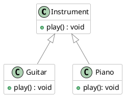
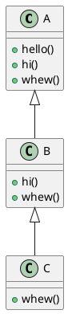

# Polymorphism

### Learning Objectives

After completing this chapter, you will:

* Understand the basic idea of polymorphism.
* Be able to override a superclass method in a subclass and prevent overriding with the `final` keyword.
* Be able to write a small program that utilizes polymorphism.
* Recognize overridable methods inherited from `Object`, such as `toString()`.


*Polymorphism* refers to the ability in object-oriented programming to treat different kinds of objects in a uniform way. When a method is called, the decision about which implementation is actually executed is made at runtime based on the object's real type.
Polymorphism makes it possible to write flexible code where new object types can be added without requiring changes to existing code.

Polymorphism is usually divided into two main categories:
(1) *Compile-time polymorphism*, also called *static binding* and
(2). *Runtime polymorphism*.

In Java, compile-time polymorphism refers to *method overloading*. This topic was covered in Programming 1, so we will not discuss it in detail here. Briefly, method overloading means that a method may have multiple implementations that differ in the number of parameters, parameter types, or return type. Refer to the Programming 1 material for more information.

This may all sound a bit abstract, so let's look at a concrete example!

## Method Overriding and Dynamic Binding

Imagine a program that contains different musical instruments: a `Guitar`, a `Piano`, and a `DrumSet`.
We want to be able to play these instruments. One possibility would be to create a separate method for each instrument:

```java,noplayground
Guitar guitar = new Guitar();
guitar.playGuitar();
Piano piano = new Piano();
piano.playPiano();
DrumSet drumSet = new DrumSet();
drumSet.playDrums();
```

This approach is not very extensible. If we wanted to process instruments as a group—for example, in a list—we would need awkward and error-prone type checks just to determine which play method should be called.
The solution is to find something common to all instruments.
After all, both guitars and pianos are *instruments*. Let's create a superclass called `Instrument` that contains a behavior every instrument should support: `play()`.

> [!NOTE]
> The `Instrument` class is defined here as a regular class, although it could also be an abstract class. Since abstract classes will not be covered until [Chapter 3.3 Abstract Classes](./03-abstract-classes.md), we will keep it as a regular class for now.

```java,ignore
public class Instrument {
    // Every instrument has a play() method.
    public void play() {
        IO.println("An unknown instrument is playing.");
    }
}
```

Now we can define `Guitar` and `Piano` as subclasses of `Instrument`.

```java,ignore
public class Guitar extends Instrument {
    // ...
}

public class Piano extends Instrument {
    // ...
}
```

We now have a common method name, but if we call `play()` on either a `Guitar` or a `Piano`, they will both execute the superclass implementation: "An unknown instrument is playing."
That is not sufficient!
We want each instrument to play in its own distinctive way. To achieve this, a subclass can *override* a superclass method with its own specialized implementation.
Overriding is indicated using the `@Override` annotation. Although the annotation is not required by Java syntax, it is strongly recommended because it helps both the programmer and the IDE recognize that the method is intended to override an inherited method.
In the assignments for this course, the `@Override` annotation is required.

```java,ingonre
public class Guitar extends Instrument {
    // Override Instrument.play()
    @Override
    public void play() {
        IO.println("The guitar plays and its strings are plucked.");
    }
}

public class Piano extends Instrument {
    // Override Instrument.play()
    @Override
    public void play() {
        IO.println("The piano plays and its keys are pressed.");
    }
}
```

Inheritance gave us a common type (`Instrument`).
Method overriding gave us object-specific implementations.
Together, these two mechanisms enable *polymorphism*. When we call a method through a superclass reference, the program automatically selects the correct overridden method based on the actual runtime type of the object.

This allows the uniform processing we were looking for:

```java
// FILE: main.java
void main() {
    ArrayList<Instrument> orchestra = new ArrayList<>();
    orchestra.add(new Guitar());
    orchestra.add(new Piano());
    // A DrumSet could be implemented similarly
    // orchestra.add(new DrumSet());

    // Call the same play() method for all instruments...
    for (Instrument instrument : orchestra) {
        instrument.play();
    }
}
// FILE_END
// FILE: Instrument.java
public class Instrument {
    // Every instrument has a play() method.
    public void play() {
        IO.println("An unknown instrument is playing.");
    }
}
// FILE_END
// FILE: Guitar.java
public class Guitar extends Instrument {
    // Override Instrument.play()
    @Override
    public void play() {
        IO.println("The guitar plays and its strings are plucked.");
    }
}
// FILE_END
// FILE: Piano.java
public class Piano extends Instrument {
    // Override Instrument.play()
    @Override
    public void play() {
        IO.println("The piano plays and its keys are pressed.");
    }
}
// FILE_END
```



***

## The is-a Relationship

An inheritance relationship is often described using the English term *is-a relationship*.

We can say that: A `Piano` *is an* `Instrument` and A `Guitar` **is an** `Instrument`.
Importantly, the relationship works in this direction.

Let's briefly return to our student information system example.
There too we can say:
A `Student` *is a* `Person` and
a `Teacher` *is a* `Person` and
a  `Secretary` *is a* `Person`.
Likewise, a `DegreeStudent` *is a* `Person`, because it inherits from `Student`, which in turn inherits from `Person`.

As we learned above, polymorphism allows us to treat `Student`, `Teacher`, and `Secretary` objects as `Person` objects in our code.

We can therefore place all these objects into a `Person` array:

```java, noplayground
Student student = new Student();
Teacher teacher = new Teacher();
Secretary secretary = new Secretary();

Person[] people = {student, teacher, secretary };
```

To make the example a bit more meaningful, let's add methods `login()` and `logout()` to the `Person` class.
All subclasses of `Person` automatically inherit these methods.

```java,noplayground
class Person {
    // HIGHLIGHT_GREEN_BEGIN
    private boolean loggedIn;
    // HIGHLIGHT_GREEN_END

    public Person(String name) {
        // ...

        // HIGHLIGHT_GREEN_BEGIN
        this.loggedIn = false;
        // HIGHLIGHT_GREEN_END

        // ...
    }

    // HIGHLIGHT_GREEN_BEGIN
    void login() {
        this.loggedIn = true;
        IO.println(this.getName() + " logged in.");
    }

    void logout() {
        this.loggedIn = false;
        IO.println(this.getName() + " logged out.");
    }
    // HIGHLIGHT_GREEN_END
}
```

We can now call `logout()` for every object in the `people` array without knowing their exact types:

```java,noplayground
for (Person person : people) {
    person.logout();
}
```

Notice the direction of the **is-a** relationship:
A `Teacher` is not a `Secretary`, even though both inherit from `Person`.

Let's add a boolean attribute `studyRightValid` to our `Student` example that indicates whether the student has a valid right to study. If the study right is not valid, the student should not be allowed to log into the system.
Override the `login()` method in the `Student` class so that it checks this condition before logging in.

```java,noplayground
class Student extends Person {
    // ...

    boolean studyRightValid;

    @Override
    void login() {
        if (studyRightValid) {
            super.login(); // Call the superclass login() method
        } else {
            IO.println("Your study right is not valid. " + "You cannot log in.");
        }
    }
}
```

In other subclasses of `Person`, such as `Teacher` and `Secretary`, the `login()` method continues to work exactly as before because it has not been overridden.

There are a couple of important rules related to method overriding:

* Overriding always applies to the *closest* superclass method in the hierarchy.
* When a method is called on a subclass object, the call is always resolved to the closest overridden version in the inheritance hierarchy.

The following example demonstrates method overriding and how method calls are resolved in a class hierarchy.

```java
// FILE: main.java
public class TestOverriding {
    public static void main(String args[]) {
        C c = new C();
        c.hello();     // Calls A.hello()
        c.hi();        // Calls B.hi()
        c.whew();      // Calls C.whew()
    }
}
// FILE_END
// FILE: A.java
class A {
    public void hello() { IO.println("Object A says hello."); }
    public void hi() { IO.println("Object A says hi."); }
    public void whew() { IO.println("Object A says whew!!"); }
}
// FILE_END
// FILE: B.java
class B extends A {
    @Override
    public void hi() { IO.println("Object B shouts hi!"); }
    @Override
    public void whew() { IO.println("Object B shouts whew!!"); }
}
// FILE_END
// FILE: C.java
class C extends B {
    @Override
    public void whew() { IO.println("Object C goes whew...."); }
}
// FILE_END
```

The UML diagram for this example would look as follows:



***

## Example: The `Shape` Class

Let's look at another example.
Consider a class called `Shape` that contains a method `calculateArea()`.

```java,noplayground
public class Shape {
    public double calculateArea() {
        return 0.0;
    }
}
```

The implementation of `calculateArea()` looks a bit strange. The reason is that there is no such thing as a truly generic shape. A `Shape` should always represent some concrete type of shape, such as a rectangle or a circle, each of which has its own way of calculating area.
As we mentioned in the instrument example, we will return to this issue in [Chapter 3.3, Abstract Classes](./03-abstract-classes.md).

For now, let's create the subclasses `Rectangle` and `Circle`.
Since these shapes calculate their areas differently, each class should provide its own implementation of `calculateArea()`.

```java,ignore
// FILE: Rectangle.java
public class Rectangle extends Shape {
    private double width;
    private double height;

    public Rectangle(double width, double height) {
        this.width = width;
        this.height = height;
    }

    @Override
    public double calculateArea() {
        return width * height;
    }
}
// FILE_END
// FILE: Circle.java
public class Circle extends Shape {
    private double radius;

    public Circle(double radius) {
        this.radius = radius;
    }

    @Override
    public double calculateArea() {
        return Math.PI * radius * radius;
    }
}
// FILE_END
```

We can now write code that works with `Shape` objects without needing to know whether they are rectangles or circles.

```java
// FILE: main.java
public class Main {
    public static void main() {

        Shape shape1 = new Circle(5);
        Shape shape2 = new Rectangle(5, 7);

        IO.println(shape1.calculateArea());
        IO.println(shape2.calculateArea());
    }
}
// FILE_END
// FILE: Shape.java
public class Shape {
    public double calculateArea() {
        return 0.0;
    }
}
// FILE_END
// FILE: Rectangle.java
public class Rectangle extends Shape {
    private double width;
    private double height;

    public Rectangle(double width, double height) {
        this.width = width;
        this.height = height;
    }

    @Override
    public double calculateArea() {
        return width * height;
    }
}
// FILE_END
// FILE: Circle.java
public class Circle extends Shape {

    private double radius;

    public Circle(double radius) {
        this.radius = radius;
    }

    @Override
    public double calculateArea() {
        return Math.PI * radius * radius;
    }
}
// FILE_END
```

***

## Why Do We Need Polymorphism?

Polymorphism enables flexible and extensible program design in many ways.
In object-oriented programming, polymorphism is particularly useful because it provides a unified way to work with objects that may be very different from one another.

When several classes inherit from the same superclass (or implement the same interface, which we will discuss later in [Chapter 4.1 Interface](../part4/01-interface.md)), they can all be treated through a single common type.
This allows a program to work with collections of diverse objects such as:

* all instruments (`Instrument`), including guitars, pianos, and drums,
* all vehicles (`Vehicle`), including cars, bicycles, and airplanes,
* all animals (`Animal`), including dogs, cats, and birds,
* all graphical user interface components (`Drawable`), including buttons, text fields, and images,
* all payment methods (`PaymentMethod`), including credit cards, PayPal, and cash.

Java provides another way to distinguish object types through the `instanceof` operator.
For example:

```java,noplayground
if (instrument instanceof Guitar) {
    ((Guitar) instrument).playGuitar();
}
else if (instrument instanceof Piano) {
    ((Piano) instrument).playPiano();
}
```

In this course, we generally avoid using `instanceof` unless specifically instructed otherwise.
The reason is that frequent use of `instanceof` often indicates that inheritance and polymorphism are not being used effectively. It tends to lead to complicated chains of conditional statements like the example above and undermines one of the key benefits of object-oriented programming: hiding implementation details behind a common interface.

`instanceof` can still be appropriate in certain situations, such as:

* when we do not control the class hierarchy,
* when code operates at a system boundary, such as parsing external data, integrating with another system, or using reflection,
* when the alternative would be significantly more complex or require excessive code duplication.


<details><summary>Example of usage of instanceof operator</summary>
Consider a situation where a program receives messages (text messages, image messages) from an external system such as a JSON API, a network connection, or a third-party library. The message classes cannot be modified, and they share only a common supertype.

```java,ignore
interface Message { }

// Concrete message types (from an external library)
class TextMessage implements Message {
    String text;
}

class ImageMessage implements Message {
    byte[] data;
}
```

The program must process messages differently depending on their actual runtime type.

```java,ignore
void process(Message message) {
    if (message instanceof TextMessage textMessage) {
        IO.println("Text: " + textMessage.text);
    } else if (message instanceof ImageMessage imageMessage) {
        IO.println( "Image size: " + imageMessage.data.length);
    } else {
        throw new IllegalArgumentException("Unknown message type");
    }
}
```

This is one of the rare situations where `instanceof` is genuinely the correct solution:

* The class hierarchy cannot be modified. The message classes come from an external library, so methods cannot be added to them.
* Polymorphism is not available. For example, we cannot define a `process()` method in the `Message` interface.
* Processing depends on the concrete runtime type. A text message and an image message require fundamentally different logic.
* The code belongs to a system boundary, such as an I/O layer, integration layer, or adapter layer.
</details>

## Overriding Methods from the `Object` Class

In Java, all classes share a common superclass called `Object`.
This means that every class automatically inherits the attributes and methods of the `Object` class unless specified otherwise. The `Object` class contains several useful methods that can be overridden in subclasses.

One example is the [`toString()` method](https://docs.oracle.com/javase/8/docs/api/java/lang/Object.html#toString--), which provides a string representation of an object.
By default, the method returns the object's class name and hash code, which is often not very informative. We can override this method in our own classes so that it returns a representation that is more meaningful for our needs.

Let's create a `Vector3D` class representing a three-dimensional vector. In the main program, we create a few `Vector3D` objects and print their values.

```java
// FILE: main.java
public class Main {
    public static void main(String[] args) {
        Vector3D v1 = new Vector3D(1.0, 2.0, 3.0);
        Vector3D v2 = new Vector3D(4.0, 5.0, 6.0);

        IO.println("Vector 1: (" + v1.getX() + ", " + v1.getY() + ", " + v1.getZ() + ")");
        IO.println("Vector 2: (" + v2.getX() + ", " + v2.getY() + ", " + v2.getZ() + ")");
    }
}
// FILE_END
// FILE: Vector3D.java
class Vector3D {
    private double x;
    private double y;
    private double z;

    public Vector3D(double x, double y, double z) {
        this.x = x;
        this.y = y;
        this.z = z;
    }

    public double getX() {
        return x;
    }

    public double getY() {
        return y;
    }

    public double getZ() {
        return z;
    }
}
// FILE_END
```

Although the printing works, it would be much more convenient if we could simply write
`IO.println("Vector 1: " + v1);`
without explicitly retrieving coordinates and concatenating strings.
To accomplish this, we can override the `toString()` method in `Vector3D`.

```java
// FILE: main.java
public class Main {
    public static void main(String[] args) {
        Vector3D v1 = new Vector3D(1.0, 2.0, 3.0);
        Vector3D v2 = new Vector3D(4.0, 5.0, 6.0);

        IO.println("Vector 1: " + v1);
        IO.println("Vector 2: " + v2);
    }
}
// FILE_END
// FILE: Vector3D.java
class Vector3D {
    private double x;
    private double y;
    private double z;

    public Vector3D(double x, double y, double z) {
        this.x = x;
        this.y = y;
        this.z = z;
    }

    public double getX() {
        return x;
    }

    public double getY() {
        return y;
    }

    public double getZ() {
        return z;
    }
    // HIGHLIGHT_GREEN_BEGIN
    @Override
    public String toString() {
        return "(" + x + ", " + y + ", " + z + ")";
    }
    // HIGHLIGHT_GREEN_END
}
// FILE_END
```

The main program now looks considerably cleaner.

You are encouraged to explore other methods inherited from `Object` in the [Java documentation]((https://docs.oracle.com/javase/8/docs/api/java/lang/Object.html)).

***

## Preventing Inheritance or Overriding (`final` Keyword)

Inheritance of a class or overriding of a method can be prevented using the `final` keyword.
When a class is declared with the `final` keyword, it cannot be inherited.
Similarly, when a method is declared with the `final` keyword, it cannot be overridden in a subclass.

Somewhat confusingly, the `final` keyword can also be used with variables. In that context, it means that the value of the variable cannot be changed after initialization. However, that usage is unrelated to inheritance.

***

## Exercises 
<task>
<task-title>Exercise 3.4: Class Hieracrhy, Part 4 <points>1 p.</points> </task-title>
<handout>

{{#include ../exercises/3-4-online-store-4/handout.md}}

</handout>
<task-link><a href="https://tim.jyu.fi/view/kurssit/it/iseai/26-27/programming2/exercises/part3/exercise4">Complete this exercise in TIM</a></task-link>
</task>

<task>
<task-title>Exercise 3.5: Replacement, Part 1  <points>1 p.</points> </task-title>
<handout>

{{#include ../exercises/3-5-replacement-1/handout.md}}

</handout>
<task-link><a href="https://tim.jyu.fi/view/kurssit/it/iseai/26-27/programming2/exercises/part3/exercise5">Complete this exercise in TIM</a></task-link>
</task>

<task>
<task-title> Exercise 3.6: Replacement, Part 2
<points>1 p.</points> </task-title>
<handout>

{{#include ../exercises/3-6-replacement-2/handout.md}}

</handout>
<task-link><a href="https://tim.jyu.fi/view/kurssit/it/iseai/26-27/programming2/exercises/part3/exercise6">Complete this exercise in TIM</a></task-link>
</task>