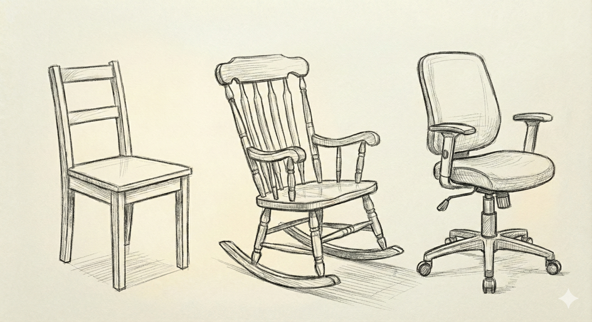
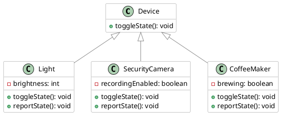
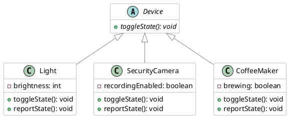

# Abstract Classes

### Learning Objectives

After completing this chapter, you will:

* Be able to create abstract classes and abstract methods in Java.
* Understand the concepts of abstract classes and abstract methods, as well as their benefits in object-oriented programming.



When designing superclass–subclass relationships, we may encounter situations where it is useful to create a superclass that defines shared functionality, but where creating instances of the superclass itself does not make sense.

Consider the concept of a *chair*.
While the word *chair* probably brings a specific image to mind, there are actually many different kinds of chairs: wooden chairs, rocking chairs, office chairs, and so on. Each type of chair is somewhat different.
One could argue that the concept of a chair is itself an abstraction. A chair is essentially just something that enables sitting. To describe an actual physical chair that could be manufactured, we need a more specific concept, such as an office chair.

Let's look at another example that is closer to actual code.
We'll continue the `Shape` example from the previous chapter. In principle, we could create an instance of `Shape` and call its `calculateArea()` method.

```java,ignore
Shape shape = new Shape();
double area = shape.calculateArea();
IO.println("The area of the shape is " + area); // 0.0
```

However, this doesn't really make sense.
A `Shape` object does not represent any concrete shape. It is merely a general concept from which concrete shapes such as `Circle` and `Rectangle` inherit.
This becomes especially obvious when we try to print the area of such a generic shape.
The `Shape` class is therefore intended only to be inherited from, and creating direct instances of it is not meaningful.
Let's make `Shape` an abstract class and `calculateArea()` an abstract method.

```java,ignore
public abstract class Shape {
    public abstract double calculateArea();
}
```

After this change, instances of `Shape` can no longer be created.

```java,ignore
Shape shape = new Shape();
```

```
java: Shape is abstract; cannot be instantiated
```

An *abstract class* is a class that allows us to express this idea directly in code.
An abstract class cannot be instantiated directly. Instead, it serves only as a foundation for classes that inherit from it.
An abstract class may contain:
*abstract methods* (methods without an implementation) and also
*concrete methods* (methods with an implementation).
A subclass must implement all abstract methods unless the subclass itself is also abstract.

> [!NOTE]
> At this point, it is worth briefly considering the student information system from the [previous chapter](./02-polymorphism.md): do we actually need plain `Person` objects at all, or is every person really something more specific, such as a student or teacher?

***

## Example: Smart Home

A smart home might contain many different kinds of devices, such as lights, security cameras, and of course a smart coffee maker.
Let's assume that every device has an operation called `toggleState()`, which performs the device's primary action( for example a light turns on or off, a security camera starts or stops recording,  a coffee maker starts or stops brewing coffee.)
Each device should also be able to report its current state through a method called `reportState()`.

We'll begin with a simple example where a device can only switch between two states. More advanced controls will be considered later.

Our class diagram might look like this:



```java
// FILE: main.java
public class Main {
    public static void main() {
        Device[] devices = {
            new Light(),
            new SecurityCamera(),
            new CoffeeMaker()
        };

        for (Device device : devices) {
            device.toggleState();
            device.reportState();
        }
    }
}
// FILE_END
// FILE: Device.java
public class Device {

    public void toggleState() {
    }

    public void reportState() {
    }
}
// FILE_END
// FILE: Light.java
public class Light extends Device {

    private int brightness = 0;

    @Override
    public void toggleState() {
        switch (brightness) {
            case 0 -> brightness = 50;
            case 50 -> brightness = 100;
            case 100 -> brightness = 0;
        }
    }

    @Override
    public void reportState() {
        IO.println("The light brightness is " + brightness + "%.");
    }
}
// FILE_END
// FILE: SecurityCamera.java
public class SecurityCamera extends Device {
    private boolean recordingEnabled = false;

    @Override
    public void toggleState() {
        // Enable or disable recording
        recordingEnabled = !recordingEnabled;
    }

    @Override
    public void reportState() {
        String state = recordingEnabled ? "on" : "off";

        IO.println("Security camera recording is " + state + ".");
    }
}
// FILE_END
// FILE: CoffeeMaker.java
public class CoffeeMaker extends Device {
    private boolean brewing = false;

    @Override
    public void toggleState() {
        // Start brewing or turn off
        brewing = !brewing;
    }

    @Override
    public void reportState() {
        String state = brewing ? "on" : "off";

        IO.println("The coffee maker is " + state + ".");
    }
}
// FILE_END
```

If we examine the `Device` class, we notice that its methods `toggleState()` and `reportState()` do nothing.
In theory, we could also create instances of `Device` directly and call its methods:

```java,ignore
Device device = new Device();

device.toggleState();  // Does nothing
device.reportState();  // Does nothing
```

As we can see, nothing happens when these methods are called, making `Device` objects largely useless.
It doesn't really make sense to have some generic "device" without knowing what type of device it is.
Therefore, the `Device` class is really intended *only for inheritance*.

Let's make `Device` an abstract class. Since its methods are also intended to be implemented by subclasses, we will make those methods abstract as well.
All subclasses must implement these methods, as they already do in our example.


```java
// FILE: main.java
public class Main {

    public static void main() {
        Device[] devices = {
            new Light(),
            new SecurityCamera(),
            new CoffeeMaker()
        };

        for (Device device : devices) {
            device.toggleState();
            device.reportState();
        }
    }
}
// FILE_END
// FILE: Device.java
public abstract class Device {
    public abstract void toggleState();
    public abstract void reportState();
}
// FILE_END
// FILE: Light.java
public class Light extends Device {
    private int brightness = 0;

    @Override
    public void toggleState() {
        // Change brightness:
        // 0 -> 50 -> 100 -> 0 ...
        switch (brightness) {
            case 0 -> brightness = 50;
            case 50 -> brightness = 100;
            case 100 -> brightness = 0;
        }
    }

    @Override
    public void reportState() {
        IO.println("The light brightness is " + brightness + "%.");
    }
}
// FILE_END
// FILE: SecurityCamera.java
public class SecurityCamera extends Device {

    private boolean recordingEnabled = false;

    @Override
    public void toggleState() {
        // Enable or disable recording
        recordingEnabled = !recordingEnabled;
    }

    @Override
    public void reportState() {
        String state = recordingEnabled ? "on" : "off";

        IO.println("Security camera recording is " + state + ".");
    }
}
// FILE_END
// FILE: CoffeeMaker.java
public class CoffeeMaker extends Device {
    private boolean brewing = false;

    @Override
    public void toggleState() {
        // Start brewing coffee or turn off
        brewing = !brewing;
    }

    @Override
    public void reportState() {
        String state = brewing ? "on" : "off";

        IO.println("The coffee maker is " + state + ".");
    }
}
// FILE_END
```

Just as in the earlier `Shape` example, instances of `Device` can no longer be created.

```java,ignore
Device device = new Device();
```

```
java: Device is abstract; cannot be instantiated
```

The class diagram looks almost the same as before, but now `Device` is marked as an abstract class, and its methods are marked as abstract methods. In UML notation, abstract classes and abstract methods are written in italics.



The opposite of an abstract class is often called a **concrete class**, meaning a class that can be instantiated. For example, `Light`, `SecurityCamera`, and `CoffeeMaker` are concrete classes because objects can be created from them.

***

## Why Are Abstract Classes Useful?

An abstract class is not merely a way to prevent instantiation.

Its primary purposes are:

* to define a common contract that all subclasses must follow, and
* to provide shared attributes and implementations so that subclasses can focus only on their unique behavior.

Because `Device` is abstract, we can add attributes and method implementations that all subclasses share.

Let's add the attribute `name`, representing the device's name, and the attribute `poweredOn`, indicating whether the device is currently powered on.
These attributes are useful for all devices and therefore belong naturally in the abstract superclass.

```java,ignore
public abstract class Device {

    // HIGHLIGHT_GREEN_BEGIN
    private String name;
    private boolean poweredOn;
    // HIGHLIGHT_GREEN_END

    public abstract void toggleState();
    public abstract void reportState();
}
```

If we were modeling network devices, useful or even mandatory attributes might include a MAC address and an IP address. To keep the example simple, however, we will limit ourselves to the device name and power state.

Let's also add the methods `powerOn()` and `powerOff()`, which provide common startup and shutdown logic that all devices can follow.

```java,ignore
public abstract class Device {
    private String name;
    private boolean poweredOn;

    // HIGHLIGHT_GREEN_BEGIN
    protected Device(String name) {
        this.name = name;
        this.poweredOn = false; // default
    }

    public void powerOn() {
        if (!poweredOn) {
            poweredOn = true;
            IO.println(name + " is powering on.");
        }
    }

    public void powerOff() {
        if (poweredOn) {
            poweredOn = false;
            IO.println(name + " is powering off.");
        }
    }
    // HIGHLIGHT_GREEN_END

    public abstract void toggleState();
    public abstract void reportState();
}
```

Notice that because we decided every device must have a name, the name must now be supplied as a constructor parameter.
As a result, we can no longer create instances using a parameterless constructor.

```java,ignore
Light light = new Light();
```
```
Light.java
java: constructor Device in class Device cannot be applied to given types;
  required: java.lang.String
  found: no arguments
  reason: actual and formal argument lists differ in length
```

Creating an object now requires a name, for example:
`new Light("PhilipsHue");`
Therefore, each subclass constructor must call the superclass constructor.
Let's make this change in all subclasses.

```java
// FILE: main.java
public class Main {

    public static void main() {
        Device[] devices = {
            new Light("PhilipsHue"),
            new CoffeeMaker("Moccamaster"),
            new SecurityCamera("Reolink")
        };

        for (Device device : devices) {
            device.powerOn();
            device.toggleState();
            device.reportState();
            device.powerOff();
        }
    }
}
// FILE_END
// FILE: Device.java
public abstract class Device {
    private String name;
    private boolean poweredOn;

    protected Device(String name) {
        this.name = name;
    }

    public void powerOn() {
        if (!poweredOn) {
            poweredOn = true;
            IO.println(name + " is powering on.");
        }
    }

    public void powerOff() {
        if (poweredOn) {
            poweredOn = false;
            IO.println(name + " is powering off.");
        }
    }

    public abstract void toggleState();
    public abstract void reportState();
}
// FILE_END
// FILE: Light.java
public class Light extends Device {
    private int brightness = 0;

    public Light(String name) {
        super(name);
    }

    @Override
    public void toggleState() {
        // Change brightness: 0 -> 50 -> 100 -> 0 ...
        switch (brightness) {
            case 0 -> brightness = 50;
            case 50 -> brightness = 100;
            case 100 -> brightness = 0;
        }
    }

    @Override
    public void reportState() {
        IO.println("The light brightness is " + brightness + "%.");
    }
}
// FILE_END
// FILE: SecurityCamera.java
public class SecurityCamera extends Device {
    private boolean recordingEnabled = false;

    public SecurityCamera(String name) {
        super(name);
    }

    @Override
    public void toggleState() {
        // Enable or disable recording
        recordingEnabled = !recordingEnabled;
    }

    @Override
    public void reportState() {
        String state = recordingEnabled ? "on" : "off";
        IO.println("Security camera recording is " + state + ".");
    }
}
// FILE_END
// FILE: CoffeeMaker.java
public class CoffeeMaker extends Device {
    private boolean brewing = false;

    public CoffeeMaker(String name) {
        super(name);
    }

    @Override
    public void toggleState() {
        // Start brewing coffee or turn off
        brewing = !brewing;
    }

    @Override
    public void reportState() {
        String state = brewing ? "on" : "off";
        IO.println("The coffee maker is " + state + ".");
    }
}
// FILE_END
```

Subclasses now inherit the power-on and power-off logic directly, but they are *required* to implement the device-specific functionality themselves.
This creates a balance between flexibility and enforced structure:
changing state and reporting state are mandatory,
the implementation of those operations is up to each individual device,
startup and shutdown behavior is shared by all devices.

***

## Visibility of Methods in Abstract Classes

Abstract methods follow the same visibility rules as other methods.
Abstract methods are usually declared either `public` or `protected` so that subclasses can implement them.
If a method will be called by code that uses objects of the class, the method should be `public`.
If the method is intended for use only within subclasses, `protected` is sufficient.
It is important to note that a subclass implementation cannot reduce visibility.
For example, a `public` abstract method cannot be implemented as a `protected` method in a subclass.

Concrete methods may also be declared `private`. In that case they serve as internal helper methods and are not visible to subclasses.

An abstract method cannot be declared `private`.

***

## Template Method Pattern

An abstract class may also contain a concrete method whose implementation calls an abstract method.
This design is known as the *Template Method* pattern.
The abstract class defines the overall algorithm or workflow, while delegating specific steps to subclasses.


The previously implemented parts have been hidden from the code. You can reveal them by clicking the eye icon in the upper-right corner of the code area.

```java
// FILE: Device.java
public abstract class Device {
//-    private String name;
//-    private boolean poweredOn;
//-
//-    protected Device(String name) {
//-        this.name = name;
//-    }

    public final void performUpdate() {
        powerOn();
        prepareUpdate(); // Abstract step implemented by subclasses
        update();
        powerOff();
    }

    protected abstract void prepareUpdate();

    private void update() {
        IO.println("Downloading the latest update from the network...");
        IO.println("Updating device...");
    }

//-    public void powerOn() {
//-        if (!poweredOn) {
//-            poweredOn = true;
//-            IO.println(name + " is powering on.");
//-        }
//-    }
//-
//-    public void powerOff() {
//-        if (poweredOn) {
//-            poweredOn = false;
//-            IO.println(name + " is powering off.");
//-        }
//-    }
//-
//-    public abstract void toggleState();
//-    public abstract void reportState();
}
// FILE_END
// FILE: Light.java
public class Light extends Device {

    private int brightness = 0;

//-    public Light(String name)
//-    {
//-        super(name);
//-    }
//-

    @Override
    protected void prepareUpdate() {
        IO.println("Preparing light for update...");
        IO.println("Setting brightness to 0%...");
    }

//-    @Override
//-    public void toggleState() {
//-        // Change brightness 0 -> 50 -> 100 -> 0 ...
//-        switch (brightness) {
//-            case 0 -> brightness = 50;
//-            case 50 -> brightness = 100;
//-            case 100 -> brightness = 0;
//-        }
//-    }

    @Override
    public void reportState() {
        IO.println("The light brightness is " + brightness + "%.");
    }
}
// FILE_END
// FILE: CoffeeMaker.java
public class CoffeeMaker extends Device {
//-    private boolean brewing = false;
//-
//-    public CoffeeMaker(String name)
//-    {
//-        super(name);
//-    }

    @Override
    protected void prepareUpdate() {
        IO.println("Preparing coffee maker for update...");
        IO.println("Interrupt brewing...");
    }

//-    @Override
//-    public void toggleState() {
//-        // Brew coffee or switch off
//-        brewing = !brewing;
//-    }
//-
//-    @Override
//-    public void reportState() {
//-        String state = brewing ? "on" : "off";
//-        IO.println("The coffee maker is " + state + ".");
//-    }
}
// FILE_END
// FILE: main.java
public class Main {

    public static void main() {
        Light hue = new Light("PhilipsHue");
        CoffeeMaker mocca = new CoffeeMaker("MoccaMaster");

        hue.performUpdate();
        // Try also:
        // mocca.performUpdate();
    }
}
// FILE_END
```

`performUpdate()` now acts as a predefined recipe that subclasses cannot modify because it is declared `final`.
The subclasses instead customize the recipe by implementing the abstract methods required by the process.

🤔 Something to think about: In what situations would you want to prevent a subclass from overriding a particular method?

***

## Exercises
<task>
<task-title>Exercise 3.7: Messages
<points>1 p.</points> </task-title>
<handout>

{{#include ../exercises/3-7-messages/handout.md}}

</handout>
<task-link><a href="https://tim.jyu.fi/view/kurssit/it/iseai/26-27/programming2/exercises/part3/exercise7">Complete this exercise in TIM</a></task-link>
</task>

<task>
<task-title>Exercise 3.8: Abstract vehicle  <points>1 p.</points> </task-title>
<handout>

{{#include ../exercises/3-8-abstract-vehicle/handout.md}}

</handout>
<task-link><a href="https://tim.jyu.fi/view/kurssit/it/iseai/26-27/programming2/exercises/part3/exercise8">Complete this exercise in TIM</a></task-link>
</task>

<task>
<task-title>Exercise 3.9: Communication channels <points>1 p.</points> </task-title>
<handout>

{{#include ../exercises/3-9-communication-channels/handout.md}}

</handout>
<task-link><a href="https://tim.jyu.fi/view/kurssit/it/iseai/26-27/programming2/exercises/part3/exercise9">Complete this exercise in TIM</a></task-link>
</task>

<task>
<task-title><i class="bi bi-stars jyu-gold"></i> Exercise 3.10: Messaging service <points>1 p.</points> </task-title>
<handout>

{{#include ../exercises/3-10-messaging-service/handout.md}}

</handout>
<task-link><a href="https://tim.jyu.fi/view/kurssit/it/iseai/26-27/programming2/exercises/part3/exercise10">Complete this exercise in TIM</a></task-link>
</task>