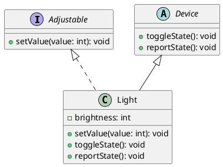
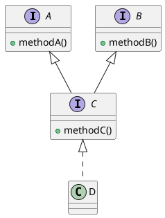

# Interfaces

### Learning Objectives

After completing this chapter, you will:

- Understand what an interface means in object-oriented programming.
- Be able to define and use interfaces in Java.
- Be able to use an interface as a method parameter and as a variable type.
- Understand when to use an interface instead of inheritance.
- Understand that a class can implement multiple interfaces but inherit only one class.

An *interface* acts as a binding contract: it defines which methods a class must provide without specifying how those methods are technically implemented.
Unlike an abstract class, which provides a foundation for attributes and methods, an interface focuses on describing an object's capabilities.
Interfaces make it possible to define common capabilities even when classes are completely different or belong to different inheritance hierarchies. When a programmer works with an object through its interface, they can rely on the object providing the agreed functionality regardless of the object's actual class.

***

## Smart Home: Adjustable Devices

Let's continue the smart home example that we started in [Part 3](../part3/03-abstract-classes.md#example-smart-home).
Some devices in our smart home could be *adjustable*, meaning that a value such as brightness, temperature, or volume can be set directly.
This is essentially what our `Light` class already does, where brightness changes between a few predefined values. From the perspective of the object's user, however, it would be more convenient if the brightness could be set directly to a desired value (for example, 33%) instead of repeatedly calling `toggleState()` and hoping to reach the correct setting.
For an end user, this would be similar to setting the desired brightness directly in a mobile application instead of repeatedly clicking *Increase Brightness* or *Decrease Brightness* buttons.

Let's define an interface called `Adjustable`, containing the method `setValue(int value)`.
The file is saved as `Adjustable.java`, just like a class definition.

```java,ignore
/**
 * A device that can be adjusted directly to a desired value.
 */
public interface Adjustable {
    void setValue(int value);
}
```

This can be read as follows:

> Every class implementing the `Adjustable` interface must provide a `setValue()` method.

We can now modify the `Light` class to implement the `Adjustable` interface.
For simplicity, we will leave `CoffeeMaker` and `SecurityCamera` out of this example because we decide that they are not adjustable devices.

```java
// FILE: main.java
public class Main {
    public static void main() {
        Light light = new Light("PhilipsHue");
        light.setValue(33);
        light.reportState();

        light.toggleState();
        light.reportState();
    }
}
// FILE_END
// FILE: Adjustable.java
public interface Adjustable {
    void setValue(int value);
}
// FILE_END
// FILE: Light.java
public class Light extends Device implements Adjustable {
    private int brightness = 0;

    protected Light(String name) {
        super(name);
    }

    @Override
    public void setValue(int value) {
        this.brightness = Math.clamp(value, 0, 100);
    }

    @Override
    public void toggleState() {
        // Simple on/off behavior
        if (brightness == 100) {
            brightness = 0;
        }
        else {
            brightness = 100;
        }
    }

    @Override
    public void reportState() {
        IO.println("The light brightness is " + brightness + "%.");
    }
}
// FILE_END
// FILE: Device.java
public abstract class Device {
    private final String name;
    private boolean poweredOn;

    protected Device(String name) {
        this.name = name;
    }

    public void powerOn() {
        if (!poweredOn) {
            poweredOn = true;
            IO.println(name + " is powering on.");
        }
    }

    public void powerOff() {
        if (poweredOn) {
            poweredOn = false;
            IO.println(name + " is powering off.");
        }
    }

    public abstract void toggleState();
    public abstract void reportState();
}
// FILE_END
```

Our class diagram would now look like this.
The letter **I** indicates an interface. Like abstract classes, interfaces are displayed in italics.
Implementing an interface is represented with a dashed line ending in a hollow arrow pointing toward the interface.



***

## Implementing Multiple Interfaces

A class can implement multiple interfaces.
For example, Java's built-in `ArrayList` class implements several interfaces:
`List`, `RandomAccess`, `Cloneable` and `Serializable` (see [`ArrayList` class documentation](https://docs.oracle.com/javase/8/docs/api/java/util/ArrayList.html)).

Each interface describes a particular capability:

* `List` defines basic list operations such as adding, removing, and retrieving elements.
* `RandomAccess` indicates that elements should be accessed efficiently by index.
* `Cloneable` allows an object to be cloned.
* `Serializable` allows an object to be stored in a file or transmitted over a network.

Similarly, [Java's `Date` class](https://docs.oracle.com/javase/8/docs/api/java/util/Date.html) also implements the `Cloneable` interface, allowing date objects to be cloned.
Notice that `Date` and `ArrayList` are otherwise unrelated classes, yet they both implement the same interface.

Let's create two interfaces of our own and classes that implement them.

Suppose we have user-interface components that can:
be drawn on the screen, and
be clicked with a mouse.

We define two interfaces: `Drawable` and `Clickable`.
These interfaces describe the capabilities of user-interface components.
Let's agree on the following:
a drawable component can draw itself and
a clickable component can process click events and highlight itself when the mouse cursor is over it.

```java,ignore
// FILE: Drawable.java
/**
 * A component that can be drawn in the user interface.
 */
public interface Drawable {
    public void draw();
}
// FILE_END
// FILE: Clickable.java
/**
 * A user interface component that can be clicked.
 */
public interface Clickable {
    public void clicked();

    public void setHighlight(boolean highlight);
}
// FILE_END
```

Notice that we neither know nor care how these methods are implemented.

Rendering could happen
in a graphical user interface,
in a text-based interface,
or even by writing output to a file.
All we need to know is that every class implementing `Drawable` provides a `draw()` method, and every class implementing `Clickable` provides `clicked()` and `setHighlight()` methods.

Let's continue by implementing `Text`, a user-interface component that displays only text.

```java,ignore
/**
 * A drawable component displaying only text.
 */
public class Text implements Drawable {
    private String content;
    public Text(String content) {
        this.content = content;
    }

    @Override
    public void draw() {
        // Draw only the text content without a border
        IO.println(content);
    }
}
```

<!-- ======================================================================= -->
The benefits of interfaces are not yet fully apparent, partly because `draw()` is currently the only method provided by the `Drawable` interface.
Now, however, we can create another component: a `Button`, which is a box-shaped clickable button containing text.
The `Button` class implements both interfaces: `Drawable` and `Clickable`.

```java,ignore
/**
 * A box-shaped clickable button
 * containing text.
 */
public class Button implements Drawable, Clickable {
    private String content;
    private boolean highlighted;

    public Button(String content) {
        this.content = content;
        this.highlighted = false;
    }

    @Override
    public void draw() {
        // Draw a rectangle and text
        if (!highlighted) {
            IO.println("[ " + content + " ]");
        } else {
            IO.println("[*" + content + "*]");
        }
    }

    /**
     * Handle a click event.
     */
    @Override
    public void clicked() {
        IO.println( "(The button labeled \"" + content + "\" was clicked)");
    }

    /**
     * Set the highlight state.
     * If the state changes,
     * redraw the component.
     */
    @Override
    public void setHighlight(boolean highlight) {
        if (this.highlighted == highlight) {
            return;
        }

        this.highlighted = highlight;
        this.draw();
    }
}
```

We now have two different user-interface components that can both be drawn on the screen.
In addition, the `Button` component is clickable.
Let's use these components in a main program.

```java
// FILE: Drawable.java
/**
 * A component that can be drawn
 * in the user interface.
 */
public interface Drawable {
    public void draw();
}
// FILE_END
// FILE: Clickable.java
/**
 * A user interface component
 * that can be clicked.
 */
public interface Clickable {
    public void clicked();
    public void setHighlight(boolean highlight);
}
// FILE_END
// FILE: Text.java
/**
 * A component displaying only text.
 */
public class Text implements Drawable {
    private String content;

    public Text(String content) {
        this.content = content;
    }

    @Override
    public void draw() {
        // Draw only the text content
        // without borders
        IO.println(content);
    }
}
// FILE_END
// FILE: Button.java
/**
 * A box-shaped clickable button
 * containing text.
 */
public class Button implements Drawable, Clickable {

    private String content;
    private boolean highlighted;

    public Button(String content)
    {
        this.content = content;
        this.highlighted = false;
    }

    @Override
    public void draw() {
        // Draw a rectangle and text
        if (!highlighted) {
            IO.println("[ " + content + " ]");
        } else {
            IO.println("[*" + content + "*]");
        }
    }

    /**
     * Handle a click event.
     */
    @Override
    public void clicked() {
        IO.println("(The button labeled \"" + content + "\" was clicked)");
    }

    /**
     * Set the highlight state.
     */
    @Override
    public void setHighlight(boolean highlight) {
        this.highlighted = highlight;
    }
}
// FILE_END
// FILE: main.java
public class Main {
    public static void main(String[] args) {
        Text heading = new Text("Would you like to start studying interfaces?");
        heading.draw();

        Button okButton = new Button("OK!");
        okButton.draw();

        // Simulate moving the mouse
        // over the button
        // Redraw the button after highlighting
        okButton.setHighlight(true);
        okButton.draw();

        // Simulate a click
        okButton.clicked();
    }
}
// FILE_END
```

<details closed><summary><i class="bi bi-stars jyu-gold"></i> Optional additional information: Moving drawing responsibility out of components. </summary>

The example above is somewhat artificial in the sense that user-interface components usually are not responsible for drawing themselves. Instead, rendering is often delegated to another part of the system.
In such architectures, components merely provide the information needed for rendering, while another part of the system handles the actual drawing on the screen (or another presentation medium).

Let's modify our example accordingly.
We create a `Screen` class that keeps track of all user-interface components currently visible.

```java,ignore
/**
 * The Screen class manages drawable components.
 */
public class Screen {
    private ArrayList<Drawable> components = new ArrayList<>();

    public void addComponent(Drawable component) {
        components.add(component);
    }

    public void removeComponent(Drawable component) {
        components.remove(component);
    }
}
```

Next, we create a `Renderer` class that acts as an intermediate layer between `Screen` and the user-interface components.
The `Renderer` is responsible for drawing components correctly. In this example, rendering simply prints output to the console, but in a real application it could render graphics to a graphical display.

```java,ignore
/**
 * Responsible for rendering the drawing surface.
 */
public class Renderer {
    public void drawButton(String text, boolean highlighted) {
        if (!highlighted) {
            IO.println("[ " + text + " ]");
        } else {
            IO.println("[*" + text + "*]");
        }
    }

    public void drawText(String text) {
        IO.println(text);
    }

    public void clear() {
        IO.println("Clearing drawing area");
        // Left unimplemented
    }
}
```

The `Screen` class can now use the `Renderer` whenever components need to be displayed.
Let's add an `update()` method that goes through every component currently on the screen and asks it to render itself using a `Renderer` object.

```java,ignore
import java.util.ArrayList;

/**
 * The Screen class manages drawable components.
 */
public class Screen {
    private ArrayList<Drawable> components = new ArrayList<>();
    // HIGHLIGHT_GREEN_BEGIN
    private Renderer renderer = new Renderer();
    // HIGHLIGHT_GREEN_END

    public void addComponent(Drawable component) {
        components.add(component);
    }

    public void removeComponent(Drawable component) {
        components.remove(component);
    }

    // HIGHLIGHT_GREEN_BEGIN
    public void update() {
        renderer.clear();
        for (Drawable component : components) {
            component.draw(renderer);
        }
    }
    // HIGHLIGHT_GREEN_END
}
```

Notice that the `Drawable` interface's `draw()` method must now receive a `Renderer` object as a parameter.
This allows components to use the renderer for drawing.

```java,ignore
public interface Drawable {

    // HIGHLIGHT_GREEN_BEGIN
    public void draw(Renderer renderer);
    // HIGHLIGHT_GREEN_END
}
```

Now comes the important part:
As a consequence of this change, the `draw()` methods of `Text` and `Button` no longer print anything themselves. Instead, they call methods of the `Renderer` object.

```java,ignore
/**
 * A drawable component
 * displaying only text.
 */
public class Text implements Drawable {
    private String content;

    public Text(String content) {
        this.content = content;
    }

    /**
     * Draw the component.
     *
     * @param renderer Renderer
     */
    @Override
    // HIGHLIGHT_GREEN_BEGIN
    public void draw(Renderer renderer) {
        renderer.drawText(content);
    }
    // HIGHLIGHT_GREEN_END
}
```

A corresponding change must also be made to the `Button` class.

In our simplified example everything is still rendered by printing to the console. In a real graphical user interface, however, the `Renderer` class could use a graphics library such as JavaFX or Swing for actual rendering.

</details>

***

## Interface Inheritance

An interface can also extend (inherit from) another interface.
Syntactically, this is done using the `extends` keyword, just as with classes.
Unlike classes, however, an interface may inherit from multiple interfaces.
A subinterface automatically inherits all methods declared in its parent interfaces.
The following synthetic example demonstrates this.

```java
// FILE: A.java
public interface A {
    void methodA();
}
// FILE_END
// FILE: B.java
public interface B {
    void methodB();
}
// FILE_END
// FILE: C.java
public interface C extends A, B {
    void methodC();
}
// FILE_END
// FILE: D.java
public class D implements C {
    @Override
    public void methodA() {
        IO.println("Implementation of method A");
    }

    @Override
    public void methodB() {
        IO.println("Implementation of method B");
    }

    @Override
    public void methodC() {
        IO.println("Implementation of method C");
    }
}
// FILE_END
// FILE: main.java
public class Main {
    public static void main(String[] args) {
        D objectD = new D();
        objectD.methodA();
        objectD.methodB();
        objectD.methodC();
    }
}
// FILE_END
```



***

## Notes

<i class="bi bi-stars jyu-gold"></i> Optional additional information:
Starting with Java 8, interfaces can also contain *default method implementations*.
This feature can be useful when adding a new method to an existing interface without breaking older implementations.
Read more about this in [Java documentation](https://docs.oracle.com/javase/tutorial/java/IandI/defaultmethods.html)

***