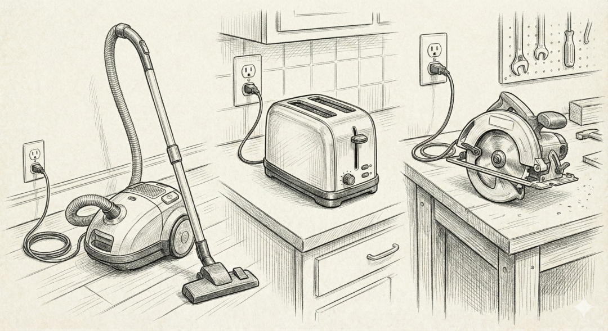
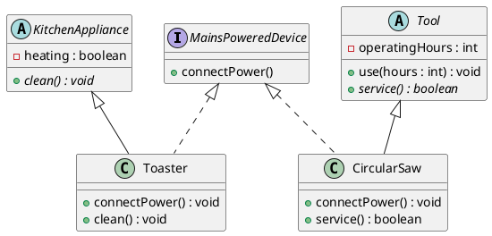

# Inheritance and Interfaces in Object Collaboration

### Learning Objectives

After completing this chapter, you will:

* Be able to use interfaces and abstract classes to avoid dependencies between classes.
* Recognize when inheritance should be used and when composition is the better alternative ("Composition over Inheritance").



Inheritance and interfaces can work together, and often do.
Inheritance defines a hierarchy between classes and allows them to share common functionality. Interfaces, on the other hand, define capabilities that different classes can implement regardless of their position in the class hierarchy.

In fact, we already used both inheritance (the abstract `Device` class) and an interface (the `Adjustable` interface) in our [Smart Home](./01-interfaces.md#smart-home-adjustable-devices) example. Let's expand this cooperation between inheritance and interfaces further.
Consider a situation where we have classes that do not share a common superclass but still share a common capability.

***

## Power Outlet and Electrical Devices

Let's do a small thought experiment.
Imagine a power outlet on the wall of your home. The outlet provides electricity, but not to just anything. It requires the device to have a suitable plug.

In this analogy, an interface is the standard or contract that a device must satisfy in order to use the outlet.
We can also think about it from another direction:

> If a device has a plug that fits the outlet, it must be capable of reacting appropriately when connected to power.

The outlet does not care whether you plug in a toaster or a circular saw.
These are actually completely different kinds of devices. One is used for food preparation; the other is a tool. They do not necessarily share a common ancestor in a class hierarchy the way a `Car` and a `Motorcycle` might inherit from a `Vehicle` class.
The only thing connecting the toaster and the circular saw is their ability to connect to mains electricity.

If we tried to model this with inheritance alone, we would immediately run into problems. Should a toaster inherit from `ElectricalDevice`, `KitchenAppliance`, or perhaps both?
Java does not allow a class to inherit from multiple superclasses.

An interface solves this elegantly:

* `Toaster` is a `KitchenAppliance` (inheritance), but it also *implements* the `MainsPoweredDevice` interface.
* Similarly, `CircularSaw` might be a `Tool` (inheritance) that also implements the same `MainsPoweredDevice` interface.

As a result, the outlet can accept either device because both satisfy the same contract.

At its simplest, the `MainsPoweredDevice` interface might define that a device must be able to react when power begins flowing through it.

```java,ignore
public interface MainsPoweredDevice {
    // This method is the "plug".
    // When the outlet activates it,
    // the device receives power.
    void connectPower();
}
```

Now both `Toaster` and `CircularSaw` can implement this interface.

```java,ignore
public class Toaster implements MainsPoweredDevice {
    @Override
    public void connectPower() {
        // The toaster's way of reacting to electrical power.
        IO.println( "Toaster: Heating elements begin glowing red.");
    }
}
public class CircularSaw implements MainsPoweredDevice {
    @Override
    public void connectPower() {
        // The circular saw's way of reacting to power.
        IO.println("CircularSaw: Motor begins spinning the blade at 4000 rpm.");
    }
}
```

These classes can exist in completely different parts of the class hierarchy.
One is a kitchen appliance. The other is a tool.
Both react to electrical power being connected—but in their own way.
Let's add abstract superclasses `KitchenAppliance` and `Tool`, from which `Toaster` and `CircularSaw` inherit.
To make the example more meaningful, we will add a few attributes and methods to the superclasses.

```java,ignore
public abstract class KitchenAppliance {
    /**
     * Does the appliance contain heating elements?
     */
    boolean heating;

    /**
     * All kitchen appliances must be cleanable.
     */
    public abstract void clean();
}
public abstract class Tool {
    /**
     * Number of operating hours.
     */
    private int operatingHours = 0;

    /**
     * Use the tool.
     *
     * @param hours Number of hours the tool is used.
     */
    public void use(int hours) {
        this.operatingHours = hours;
    }

    /**
     * Service the tool.
     *
     * @return Whether servicing succeeded.
     */
    public abstract boolean service();
}
```

Now let's implement those behaviors in the subclasses.

```java,ignore
// CircularSaw is a Tool that operates on mains power.
public class CircularSaw extends Tool implements MainsPoweredDevice {

    @Override
    public void connectPower() {
        // Circular saw's reaction to electrical power.
        IO.println("CircularSaw: Motor begins spinning the blade at 4000 rpm.");

        // Also call the superclass
        // use() method.
        super.use(1);
    }

    /**
     * Service the circular saw.
     *
     * @return Whether servicing  succeeded.
     */
    @Override
    public boolean service() {
        IO.println( "Servicing circular saw..."
            + "Sharpening blade and adjusting rotation speed."
        );
        return true;
    }
}
// Toaster is a KitchenAppliance that operates on mains power.
public class Toaster extends KitchenAppliance implements MainsPoweredDevice {

    @Override
    public void connectPower() {
        IO.println( "Toaster: Heating elements "
            + "begin glowing red."
        );
    }

    @Override
    public void clean() {
        IO.println( "Toaster: Removing crumbs "
            + "and wiping gently "
            + "with a damp cloth."
        );
    }
}
```

The class hierarchy would look like this:



This is the most important point conceptually:
The power outlet is a class that **uses** the interface.

```java,ignore
public class PowerOutlet {

    // Any mains-powered device
    // can be connected.
    // Outlot isn't intrested if it's toaster or TV
    public void connectDevice(MainsPoweredDevice device) {
        IO.println( "--- Power outlet supplies electricity ---");

        // The outlet calls the method defined by the contract.
        // Polymorphism occurs here:
        // each device reacts in its
        // own appropriate way.
        device.connectPower();
    }
}
```

Notice that the parameter type is the `MainsPoweredDevice` interface.
The parameter does not need to be a `Toaster`, a `CircularSaw`, or any other specific class.
It is enough that the object implements the interface.

This means the method can accept any object implementing `MainsPoweredDevice`, regardless of where that object belongs in the class hierarchy.

***

## Interfaces as Variable Types

To put `PowerOutlet` to actual use, we need a main program that creates a `PowerOutlet` object and connects different devices to it.
Let's first connect a `Toaster`.

```java
// FILE: main.java
public class HouseholdElectricity {

    public static void main(String[] args) {

        // 1. Create the infrastructure:
        // the power outlet
        PowerOutlet kitchenOutlet = new PowerOutlet();

        // 2. Create devices
        Toaster toaster = new Toaster();
        CircularSaw saw = new CircularSaw();

        // 3. Use the devices
        // through the outlet
        IO.println("--- Morning in the kitchen ---");

        kitchenOutlet.connectDevice(toaster);
        IO.println("\n--- Renovation begins ---");

        kitchenOutlet.connectDevice(saw);
    }
}
// FILE_END
// FILE: MainsPoweredDevice.java
{{#include ../examples/part3/E35_Outlet/src/MainsPoweredDevice.java}}
// FILE_END
// FILE: Toaster.java
{{#include ../examples/part3/E35_Outlet/src/Toaster.java}}
// FILE_END
// FILE: CircularSaw.java
{{#include ../examples/part3/E35_Outlet/src/CircularSaw.java}}
// FILE_END
// FILE: KitchenAppliance.java
{{#include ../examples/part3/E35_Outlet/src/KitchenAppliance.java}}
// FILE_END
// FILE: Tool.java
{{#include ../examples/part3/E35_Outlet/src/Tool.java}}
// FILE_END
// FILE: PowerOutlet.java
{{#include ../examples/part3/E35_Outlet/src/PowerOutlet.java}}
// FILE_END
```

As we learned in Chapter [3.2 Polymorphism](../part3/02-polymorphism.md), we don't actually need to declare the variables using their concrete types (`Toaster` and `CircularSaw`).
Since we only care that the devices can be plugged into an outlet, both variables can be declared using the interface type instead.

```java,ignore
public class HouseholdElectricity {

    public static void main(String[] args) {

        PowerOutlet kitchenOutlet = new PowerOutlet();

        // HIGHLIGHT_GREEN_BEGIN
        MainsPoweredDevice toaster = new Toaster();
        MainsPoweredDevice saw = new CircularSaw();
        // HIGHLIGHT_GREEN_END

        IO.println("--- Morning in the kitchen ---");
        kitchenOutlet.connectDevice( toaster);

        IO.println("\n--- Renovation begins ---");
        kitchenOutlet.connectDevice(saw);
    }
}
```

***

## Programming to a Supertype

The practice described above—treating subclass objects as objects of a superclass or interface type—is very common and highly recommended in object-oriented programming.
It is often referred to as:
*programming to an interface* or *programming to a supertype*.
This approach reduces coupling between program components and allows implementations to be substituted without changing the rest of the code.

<!-- ======================================================================= -->
Why Is Programming to a Supertype Useful?
One reason is that it allows us to treat very different kinds of objects as a uniform collection. We already did something similar in the polymorphism examples.
Consider our `MainsPoweredDevice` example. We can create a list containing different kinds of mains-powered devices and connect all of them to a power outlet in a loop.

```java,ignore
List<MainsPoweredDevice> devices = List.of(
    new Toaster(),
    new CircularSaw(),
    new VacuumCleaner()
);

PowerOutlet outlet = new PowerOutlet();

for (MainsPoweredDevice device : devices) {
    outlet.connectDevice(device);
}
```

If each device were treated only as its concrete type, we might end up writing something like this instead (assuming `KitchenAppliance` and `Tool` are existing superclasses):

```java,ignore
List<KitchenAppliance> kitchenAppliances = ...;
List<Tool> tools = ...;

PowerOutlet outlet = new PowerOutlet();

for (KitchenAppliance appliance : kitchenAppliances) {
    outlet.connectDevice(appliance);
}

for (Tool tool : tools) {
    outlet.connectDevice(tool);
}
```

Another advantage is easy substitutability, often referred to as *loose coupling*.
When code uses an interface as the variable type, it is not tied to any specific implementation. This means we can replace one implementation with another without modifying the code that uses the interface.

Imagine we are building a program for testing electrical devices.

```java,ignore
Toaster deviceUnderTest = new Toaster();

// ... test the device ...

// Switch to another device implementation
deviceUnderTest = new CircularSaw(); // Does not compile
```

This does not work because the types do not match.
When the variable is declared using the interface type, replacing implementations becomes easy.

```java,ignore
MainsPoweredDevice deviceUnderTest = new Toaster();
// ... test the device ...

// Switch to another implementation
deviceUnderTest = new CircularSaw();

// This works because both implement
// the MainsPoweredDevice interface.
```

A third reason relates to software design.
When you declare a variable as `MainsPoweredDevice`, the compiler prevents you from calling methods that are specific only to a toaster (such as `getHeatingLevel()`) or only to a circular saw (such as `setBladeHeight()`).
While this kind of self-imposed restriction may initially seem inconvenient, it helps keep code clean and prevents mistakes where an object is used in a way that is incompatible with the interface being relied upon.

***

## The Liskov Substitution Principle

Closely related to *loose coupling* is the [*Liskov Substitution Principle* (LSP)](https://en.wikipedia.org/wiki/Liskov_substitution_principle).
The Liskov Substitution Principle states that an object should be replaceable by another object implementing the same interface or contract without changing the correctness of the program.
In practice, this means:
a subclass should honor the contracts and behavioral expectations established by its superclass.
A class implementing an interface should honor the contract defined by that interface.

Let's briefly return to the instrument example introduced in [Chapter 3.2](../part3/02-polymorphism.md).
Suppose we have an interface `Instrument`, which defines the ability to perform music for an audience through the method `play()`.

```java,noplayground
public interface Instrument {
    /**
     * Performs a musical piece for an audience.
     */
    void play();
}
```

All instruments—such as `Guitar`, `Piano`, and `DrumSet`—implement this interface.
A concert organizer wants to ensure that all instruments can perform, regardless of their specific type.
Let's create a `Concert` class whose `playAllInstruments()` method instructs all instruments to play.

```java,noplayground
public class Concert {
    public void playAllInstruments(Instrument[] instruments) {
        for (Instrument instrument : instruments) {
            instrument.play();
        }
    }
}
```

Now let's create a new instrument called `PracticePiano`.
This piano can only be played through headphones, meaning the audience cannot hear anything.
It still implements the `Instrument` interface, but its behavior differs from the expectation established by the interface.

```java,noplayground
class PracticePiano implements Instrument {
    @Override
    public void play() {
        // Technically meaningful,
        // but violates the intended contract.
        IO.println("Practicing with headphones. The audience hears nothing."
        );
    }
}
```

Let's assemble a "concert" in the main program.

```java,noplayground
void main() {
    Instrument[] instruments = {
        new Guitar(),
        new Piano(),
        new PracticePiano()
    };

    Concert concert = new Concert();
    concert.playAllInstruments(instruments);
}
```

The code works perfectly well from a technical perspective.
However, `PracticePiano` violates the contract implied by the `Instrument` interface. Its `play()` method does not actually "perform music for an audience"; it performs only for the player.
The subclass's behavior might make sense in another context—in this case, practice sessions—but it does not satisfy the expectations established by the interface.
In a well-designed class hierarchy, every object adheres to the contract promised by its superclass or interface.
This allows polymorphism to be used reliably without requiring the programmer to know every concrete implementation in advance.

***

Our electrical device example relates to the same principle.
Recall that we declared our toaster and circular saw variables as type `MainsPoweredDevice`.
Because of this, we cannot call methods that are not part of the `MainsPoweredDevice` interface.
For example:
`toaster.clean();`
`saw.service();`
would not be allowed through `MainsPoweredDevice` references because those methods do not belong to the interface.
If we genuinely need access to those methods, we should stop and ask why we are treating the object merely as a mains-powered device in the first place.
From a software design perspective, such a situation suggests that we may be trying to solve two different problems in the same place.

In a good design, code that works with `MainsPoweredDevice` objects—such as an electricity meter or fuse box—is interested only in electrical behavior.
It should not care whether the device is a toaster or a circular saw, and it certainly should not be responsible for cleaning or servicing them.

If we find ourselves needing the `clean()` method, we are probably "in the wrong room":

* *Wrong abstraction level.* If we are building application logic for cleaning kitchen equipment, we should not store devices in a `List<MainsPoweredDevice>`. Instead, we should use a `List<KitchenAppliance>`. Then every object in the list naturally provides the `clean()` method.

* *Single Responsibility Principle.* If the same method attempts both to measure electricity consumption (an interface concern) and clean the appliance (a kitchen-appliance concern), it is doing too much. A better solution is to separate responsibilities: one part of the program manages electrical devices through the `MainsPoweredDevice` interface, while another handles maintenance through `KitchenAppliance` or `Tool` types.

In summary, rather than trying to expose specialized features through a generic interface, we should choose the variable type according to the task at hand.
An electrician sees a circular saw as a mains-powered device.
A carpenter sees it as a tool.
The code should reflect this distinction.

***

## Abstract Class or Interface?

The table below summarizes the key differences between abstract classes and interfaces.

| Question                                | Abstract Class                              | Interface                                        |
| --------------------------------------- | ------------------------------------------- | ------------------------------------------------ |
| Can it contain attributes?              | Yes                                         | No                                               |
| Can it contain method implementations?  | Yes                                         | No (except default methods introduced in Java 8) |
| How many can a class inherit/implement? | A class can inherit only one abstract class | A class can implement multiple interfaces        |
| Primary purpose                         | Shared structure and partial implementation | Shared behavioral contract                       |

***