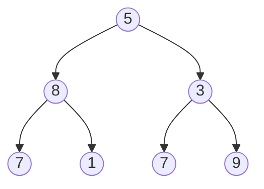

# Recursion

### Learning Objectives

* Understand how recursion works.
* Understand how recursion can be modeled using a stack.

Recursion means defining a problem in terms of itself so that the problem consists of smaller parts that have the same structure as the original problem.
A recursive solution is justified when the problem has:
a clear base case, and
a recursive step that reduces the problem so that the base case is eventually reached.
Recursion is a natural way to implement the *divide and conquer* principle: a problem is divided into smaller subproblems, the subproblems are solved, and the results are combined.

A *recursive data structure* is a structure whose definition refers to itself.
One example is a linked list, where each node contains a reference to the next node or a `null` value that marks the end of the list.
In practice, linked lists appear in situations such as playlist playback ("next track"), browser back/forward history, and the internal data structures of operating systems and software libraries.

Recursive algorithms are particularly natural when working with recursive data structures.
The following Java example shows a linked list containing integers and a recursive method for calculating the length of the list.

```java,ignore
class Node {
    int value;
    Node next;

    Node(int value) {
        this.value = value;
    }
}
```

The length of a list defined in this way can be calculated recursively.

```java,ignore
int length(Node node) {
    if (node == null) return 0;       // base case
    return 1 + length(node.next);     // recursive case
}
```

Constructing a list "by hand" would look like this:

```java
//-class Node {
//-    int value;
//-    Node next;
//-
//-    Node(int value) {
//-        this.value = value;
//-    }
//-}
//-
//- int length(Node node) {
//-     if (node == null) return 0;       // base case
//-     return 1 + length(node.next);     // recursive case
//- }
//-void main() {
Node first = new Node(10);
first.next = new Node(20);
first.next.next = new Node(30);

int n = length(first); // n == 3
IO.println(n);
//-}
```

This is, however, somewhat cumbersome.
In a typical implementation, the list would have its own class that encapsulates the reference to the first node and the insertion operation.

```java,ignore
class List {
    Node first;

    void addToEnd(int value) {
        if (first == null) {
            first = new Node(value);
            return;
        }

        Node current = first;
        while (current.next != null) {
            current = current.next;
        }
        current.next = new Node(value);
    }

    int length() {
        return length(first);
    }
}
```

Using the list would then look like this:

```java
//-class Node {
//-    int value;
//-    Node next;
//-
//-    Node(int value) {
//-        this.value = value;
//-    }
//-}
//-class List {
//-    Node first;
//-
//-    void addToEnd(int value) {
//-        if (first == null) {
//-            first = new Node(value);
//-            return;
//-        }
//-
//-        Node current = first;
//-        while (current.next != null) {
//-            current = current.next;
//-        }
//-        current.next = new Node(value);
//-    }

//-    int length(Node node) {
//-        if (node == null) return 0;       // base case
//-        return 1 + length(node.next);     // recursive case
//-    }
//-
//-    int length() {
//-        return length(first);
//-    }
//-}
//-void main() {
List list = new List();

list.addToEnd(10);
list.addToEnd(20);
list.addToEnd(30);

int n = list.length(); // n == 3
IO.println(n);
//-}
```

***

## Recursion in Practice

Lists are linear structures: each node has at most one successor.
Many problems involve branching structures instead.
A *tree* is such a branching data structure. It consists of nodes and their child nodes, and it has one root node.
A tree contains no cycles, meaning that when moving downward through child references, it is impossible to return to the same node simply by following child links.

A common special case is a *binary tree*, where each node has at most two children: a left child and a right child.
Recursion fits tree processing naturally because a tree consists of *subtrees*; every child is itself the root of another tree.

Example of a binary tree:



The following example calculates the height of a binary tree using recursion.
The idea follows directly from the definition of tree height:
the height of an empty tree is 0, and
the height of a non-empty tree is 1 plus the height of the taller subtree.
Every path from the root to a leaf must first go either into the left subtree or the right subtree, so the longest path is obtained by choosing the larger of those two heights.
Recursion stops when there is no subtree left (`root == null`), in which case the base case returns 0.

```java
public class Node {
    // Value stored in the node.
    int value;
    // Reference to left child (null if none exists).
    Node left;
    // Reference to right child (null if none exists).
    Node right;

    Node(int value) {
        this.value = value;
    }
}

public static int height(Node root) {
    if (root == null) {
        return 0;
    }

    return 1 + Math.max(height(root.left), height(root.right));
}

void main() {
    // Construct a binary tree
    Node root = new Node(1);
    root.left = new Node(2);
    root.right = new Node(3);
    root.left.left = new Node(4);

    IO.println(height(root));
}
```

As a side note, nothing in this code currently prevents us from creating cyclic structures where nodes refer to one another, forming a loop.
In such a situation, recursion would never terminate and would eventually crash the program with a *stack overflow*.
Although we do not implement cycle detection in this example, real-world programs should ensure that cycles cannot arise when algorithms assume tree-like structures.

When the `height` method is called for the root node, computation naturally proceeds downward through the tree.
The method calls itself recursively for the left and right subtrees and continues until it encounters a `null` reference, representing an empty tree.
This is the recursion base case: the height of an empty tree is defined as zero.

Once the base case has been reached, computation begins to return back up through the call stack.
Each node receives the heights of its subtrees and determines its own height as:
1 + height of the taller subtree.
Thus, the tree's height is constructed step by step from the leaves toward the root using only return values.

***

## Modeling Recursion with a Stack

Recursive solutions often seem deceptively simple—even magical.
How does the computer know where execution should continue after a function has called itself dozens of times?
How do the variables of previous calls (`node`, `left`, `right`, and so on) remain intact?

The computer performs no magic at all.
Behind the scenes, it uses a stack.

Every time a function calls itself, the computer:

* Suspends the current execution.
* Creates a new *stack frame* containing at least:
  * the method arguments,
  * local variables,
  * information about where execution should continue after the method returns.
* Pushes this frame onto the top of the call stack.

When a recursive call completes—that is, when a base case is reached—the top frame is popped from the stack and execution resumes where the previous frame left off.
Recursion is therefore fundamentally just the process of filling and emptying a stack.

This mechanism is what makes recursion possible:
each recursive call pauses the current computation, stores its state on the stack, and transfers control to the next, smaller subproblem.

The following example illustrates recursion using a recursive sum that computes:
$1 + 2 + \dots + n$.

```java,ignore
int sum(int n) {
    if (n == 0) return 0; // base case

    return n + sum(n - 1);
}
```

Assume that we call `sum(3)`
Each stack frame contains the parameter `n` and the unfinished computation:
$n + \text{sum}(n - 1)$.
In other words, the frame is waiting for the result of the recursive call.

<!-- ======================================================================= -->
The execution of `sum(3)` can be visualized as follows:

| Step | Stack (bottom → top)                            | What happens                           |
| ----- | ---------------------------------------------- | -------------------------------------- |
| 1     | `sum(3)`                                       | Waiting for `sum(2)`                   |
| 2     | `sum(3)`, `sum(2)`                             | Waiting for `sum(1)`                   |
| 3     | `sum(3)`, `sum(2)`, `sum(1)`                   | Waiting for `sum(0)`                   |
| 4     | `sum(3)`, `sum(2)`, `sum(1)`, `sum(0)`         | Base case: returns 0                   |
| 5     | `sum(3)`, `sum(2)`, `sum(1)`                   | Return: `sum(1) = 1 + 0 = 1`           |
| 6     | `sum(3)`, `sum(2)`                             | Return: `sum(2) = 2 + 1 = 3`           |
| 7     | `sum(3)`                                       | Return: `sum(3) = 3 + 3 = 6`           |
| 8     | (empty)                                        | Computation complete, result is 6      |

During the call phase, the stack grows because each frame waits for the result of a recursive call (for example, `n + sum(n - 1)`).
After reaching the base case, computation proceeds back upward, and each frame completes its own calculation using the result returned by its recursive call.
This is the "memory" that makes recursion work.

Could we do the same thing ourselves without recursion?
Yes, we can.
We can "play computer" and manage the stack manually.
This is not merely an academic exercise. It is a useful skill because it helps us understand what is really happening behind the scenes. There are also situations—for example, extremely deep trees—where the automatic call stack may overflow, while a manually managed stack continues to work.

Let us begin with a classic simple example: the factorial function.
As a reminder, here is the recursive version.

```java,ignore
int factorial(int n) {
    if (n <= 1) return 1;
    return n * factorial(n - 1);
}
```

An iterative version can be written using a stack that we maintain ourselves.
The idea is to first store the "pending multiplications" and then process them afterward.
In modern Java, 
[`ArrayDeque`](https://docs.oracle.com/en/java/javase/11/docs/api/java.base/java/util/ArrayDeque.html) is the recommended stack data structure.

```java
int factorialIter(int n) {
    Deque<Integer> stack = new ArrayDeque<>(); // Explicit stack for pending factors
    while (n > 1) {
        // Call phase: store the pending factor.
        stack.push(n--);
    }

    int result = 1;
    while (!stack.isEmpty()) {
        // Return phase: pop factors and multiply them.
        result *= stack.pop();
    }

    return result;
}
//-void main() {
IO.println(factorialIter(10));
//-}
```

In this example, the "stack frame" is simply a value stored in a structure that we created ourselves.
In simple cases such as the factorial function, a stack frame can consist of nothing more than information about which numbers still need to be multiplied.

***

Let's also solve the tree-height problem iteratively.
To do this, we need two things:

* a `while` loop that continues as long as work remains,
* a stack data structure for storing nodes that have not yet been processed—just as recursion does automatically.

Computing the height works by traversing the tree level by level (*breadth-first traversal*).
A queue is particularly well suited for this task because it keeps track of which nodes still need to be processed on each level.
At every level, all nodes are processed, and their children are added to the queue for the next level.

```java
//-public class Node {
//-    int value;
//-    Node left;
//-    Node right;
//-
//-    Node(int value) {
//-        this.value = value;
//-    }
//-}

public static int treeHeightIter(Node root) {
    if (root == null) return 0;

    // Use a queue for level-order traversal.
    // At each level, process all nodes and
    // add their children for the next level.
    Queue<Node> pendingNodes = new ArrayDeque<>();
    pendingNodes.add(root);
    int height = 0;

    while (!pendingNodes.isEmpty()) {
        int levelNodeCount = pendingNodes.size();
        height++;

        for (int i = 0; i < levelNodeCount; i++) {
            // Take the first node from the queue.
            Node current = pendingNodes.poll();
            // Add left child for the next level if it exists.
            if (current.left != null) pendingNodes.add(current.left);
            // Add right child if it exists.
            if (current.right != null) pendingNodes.add(current.right);
        }
    }

    return height;
}

void main() {
    // Construct a binary tree
    Node root = new Node(1);
    root.left = new Node(2);
    root.right = new Node(3);
    root.left.left = new Node(4);

    IO.println(treeHeightIter(root));
}
```

<task>
<task-title>Exercise 5.11: Sum with a Stack
<points>1 p.</points> </task-title>
<handout>

{{#include ../exercises/5-11-sum-with-stack/handout.md}}

</handout>
<task-link><a href="https://tim.jyu.fi/view/kurssit/it/iseai/26-27/programming2/exercises/part5/exercise11">Complete this exercise in TIM</a></task-link>
</task>

For both the factorial function and the tree-height calculation, no additional state information was required.
In the factorial example, only numbers were stored on the stack.
When computing the tree height, only nodes were processed, and every node was handled in the same way.
The call phase and return phase of recursion did not need to be distinguished because, once the base case was reached, the final result was constructed automatically through return values.
For this reason, a plain stack or queue was sufficient for maintaining processing order and computing the result.

The situation changes when an algorithm performs work both **before** and **after** a recursive call, as happens during tree traversal.
In such cases, storing only the data is no longer sufficient. We must also remember whether we are in the call phase or the return phase.
For this purpose we need a *stack frame*, which combines node-related data with information about the state of the recursion.

In the following example, recursive execution is modeled using a custom stack-frame object.
The frame acts like a reminder note that tells us which node we are returning to and what stage of computation we are currently in.
This makes explicit the information that would otherwise be hidden inside the call stack.

```java,ignore
static class Frame {
    Node node;
    boolean visited;

    Frame(Node node, boolean visited) {
        this.node = node;
        this.visited = visited;
    }
}
```

Our goal is to print the nodes of a binary tree in *postorder*.
Postorder traversal means to process the left subtree,
process the right subtree, and
 finally process the node itself.
The key point is that the actual work is performed only after the recursive calls have completed, not when the node is first encountered.

Since we are not using recursion, we must explicitly remember whether a node has already been encountered during the call phase and left waiting, or whether we are returning to it from its subtrees.

For this reason, the stack stores `Frame` objects.
When a node is encountered for the first time, it is marked as visited and pushed back onto the stack to wait.
Its children are then pushed onto the stack so that they are processed before the node itself.
When the same frame later reappears at the top of the stack, we know that we are in the return phase and can print the node's value.

```java
//-class Node {
//-    int value;
//-    Node left;
//-    Node right;
//-
//-    Node(int value) {
//-        this.value = value;
//-    }
//-}
//-static class Frame {
//-    Node node;
//-    boolean visited;
//-
//-    Frame(Node node, boolean visited) {
//-        this.node = node;
//-        this.visited = visited;
//-    }
//-}
void printPostorder(Node root) {
    if (root == null) return;

    Deque<Frame> stack = new ArrayDeque<>();
    stack.push(new Frame(root, false));

    while (!stack.isEmpty()) {
        Frame f = stack.pop();
        if (f.visited) { 
            IO.println(f.node.value); // return phase
            continue;
        }

        // Call phase: put the node on hold and push the children.
        f.visited = true;
        stack.push(f);
        if (f.node.right != null) stack.push(new Frame(f.node.right, false));
        if (f.node.left != null) stack.push(new Frame(f.node.left, false));
    }
}
//-void main() {
//-    Node root = new Node(5);
//-    // Left sub tree
//-    Node ln = new Node(8);
//-    Node lln = new Node(7);
//-    Node lrn = new Node(1);
//-    ln.left = lln;
//-    ln.right = lrn;
//-    root.left = ln;
//-
//-    // Right subtree
//-    Node rn = new Node(3);
//-    Node rln = new Node(7);
//-    Node rrn = new Node(9);
//-    rn.left = rln;
//-    rn.right = rrn;
//-    root.right = rn;
//-
//-    printPostorder(root);
//-}
```

In this way, the loop and stack precisely imitate the behavior of recursion:
first work is created for the subtrees, and only during the return phase is the node itself processed.
The code follows the definition of postorder traversal directly, but without using recursive method calls.

<task>
<task-title>Exercise 5.12: Tree Sum with a Stack
<points>1 p.</points> </task-title>
<handout>

{{#include ../exercises/5-12-tree-sum-with-stack/handout.md}}

</handout>
<task-link><a href="https://tim.jyu.fi/view/kurssit/it/iseai/26-27/programming2/exercises/part5/exercise12">Complete this exercise in TIM</a></task-link>
</task>