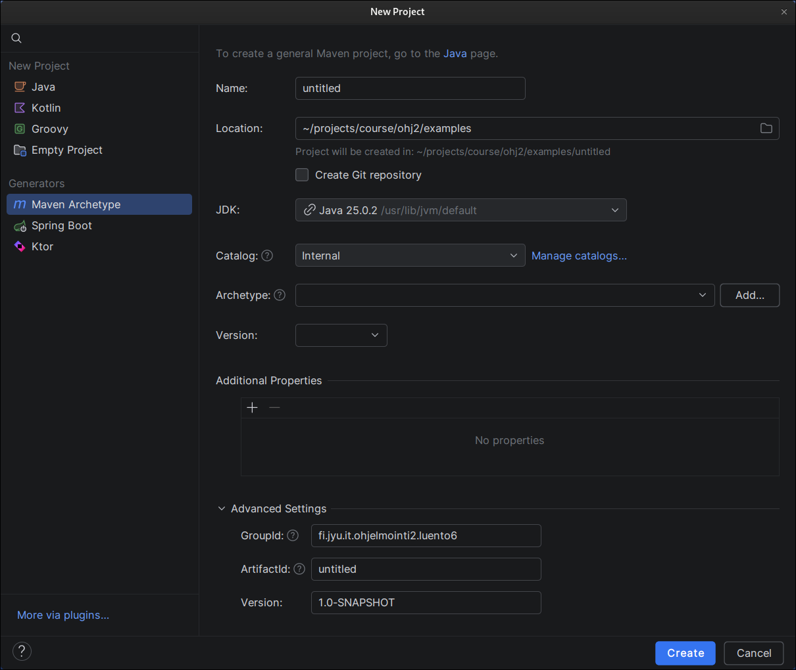
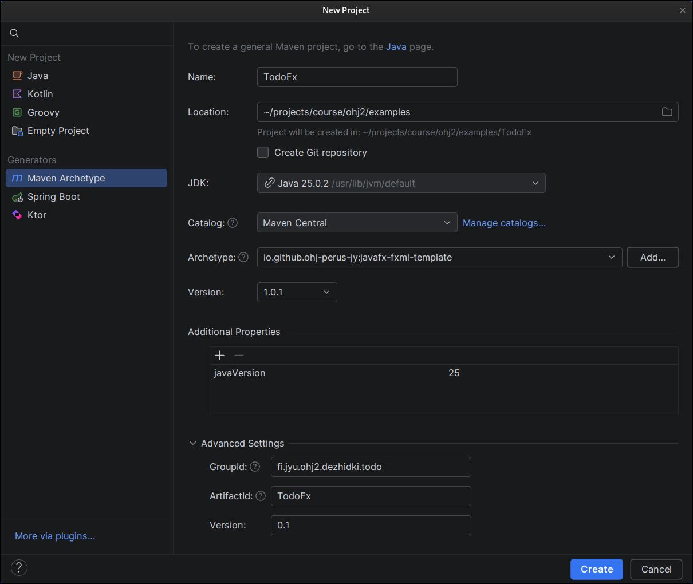
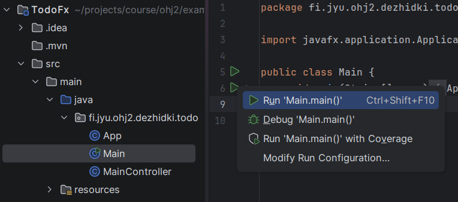
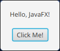
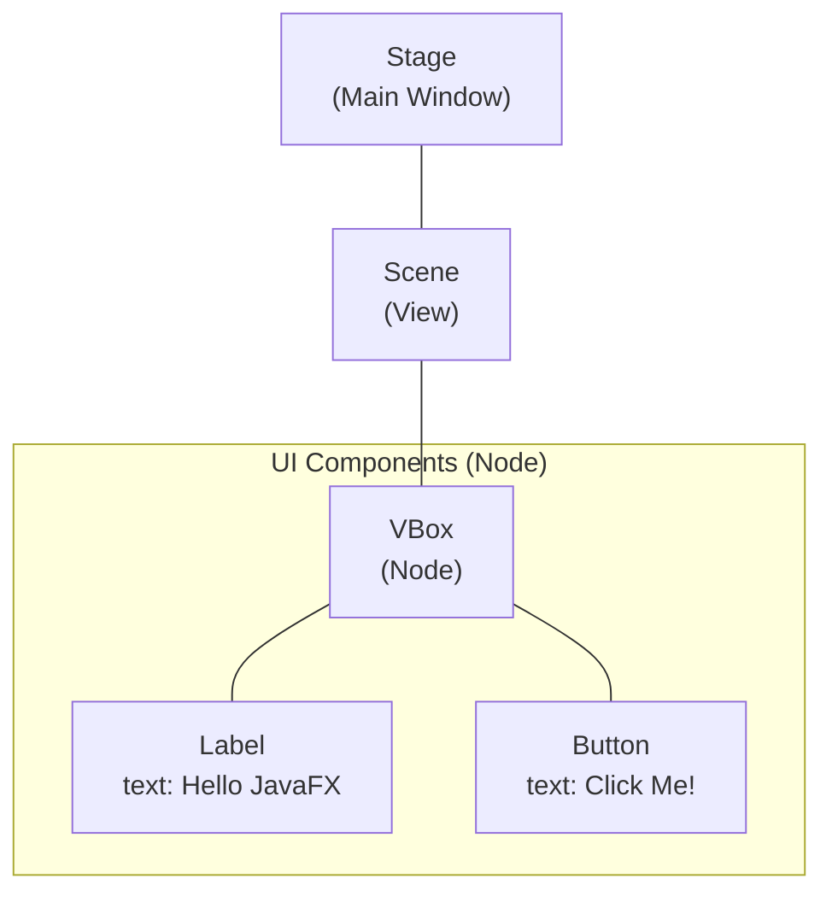

# JavaFX Fundamentals

### Learning Objectives

* Understand the structure of a JavaFX application.

So far, we have built command-line applications and mainly printed text to the screen. However, a **graphical user interface (GUI)** is an essential part of many programs. A graphical user interface allows the user to interact with buttons, menus, and images instead of learning how to type commands in the correct format.

There are several libraries available for creating graphical user interfaces in Java, but **JavaFX** is perhaps the most modern and versatile of them. JavaFX treats the user interface as a tree-like structure. Every part of a window, such as a button, text element, or layout container, is a **node** (`Node`) that belongs to some larger structure. This makes even complex views logical to manage.

In JavaFX, appearance and application logic are separated from one another. The visual layout is defined using **FXML**, an XML-based file format. Functional logic is written in ordinary Java code. This resembles the way web development separates HTML (structure) from JavaScript (behavior).

JavaFX also has its own implementation of CSS (Cascading Style Sheets), supporting parts of CSS 2.1 and some CSS 3 features. This allows user-interface styling to be implemented in a manner somewhat familiar from web development. However, CSS support is fairly limited, and features such as `float`, `position`, and `flexbox` are not supported. In some cases JavaFX offers its own alternatives, such as `VBox` and `HBox` instead of Flexbox. Additionally, the JavaFX community continuously develops open-source libraries that bring some familiar CSS features to JavaFX.

***

## Tutorial: Todo Application

During Parts 7 and 8, we will build a simple Todo application. These chapters include exercises in which you learn to build the same application independently. Together, these chapters provide the JavaFX knowledge required to create your own course project during Parts 9–11.

In Part 7, we will implement the following features:

* The user can add a new task.
* The user can see a list of all tasks.
* The user can mark a task as completed.
* The user can delete a task.
* The user can restore a completed task back to an unfinished state.
* Tasks are saved to a file so they persist after the application is closed.
* Tasks are loaded from a file when the application starts.

By the end of this chapter, our application will function as follows:

<video src="images/todo-app-final-product.mp4" controls></video>

<!-- As before, you must complete at least 50% of the exercises in this chapter. -->

<!-- However, for Parts 7 and 8 we strongly recommend completing all exercises, as this will make the course project considerably easier. Bonus exercises remain optional. -->

***

## The First JavaFX Application

Let's create a new JavaFX project in IDEA.
Open IDEA and select:
```text
File → New → Project
```
The familiar *New Project* view appears.

In previous chapters, we created empty projects and manually added code and dependencies. JavaFX, however, requires several dependencies, configuration settings, and initialization code that would be tedious to add manually every time a new application is created.

A Maven project can be based on a predefined template called a *Maven Archetype*.
An archetype contains, for example, a predefined project structure, example code, and required dependencies.
There are many different archetypes available for different purposes. For this course, we have prepared our own template and will use it from now on.

Select *Maven Archetype* from the left-hand side. The following settings become available.




Fill in the form as follows:

* **Name**: `TodoFx`
* **Location**: Choose a directory where you want to create the project. You can type the path manually or select it using the folder browser icon.
* **Create Git repository**: Leave unchecked. We will create our own Git repository later.
* **JDK**: Select a Java 25 installation. The default is usually suitable. If necessary, download a JDK by following the installation instructions.
* **Catalog**: `Maven Central`
* **Archetype**: `io.github.ohj-perus-jy:javafx-fxml-template`
* **Version**: Select the latest version if available. Otherwise, enter `1.0.1` manually.
* **Additional properties**: Leave unchanged. The template defaults are sufficient.
* **Additional settings** (click the heading if the options are hidden):
  * **GroupId**: A public, unique identifier for the application. A common Java convention is to use the format:
    `<reversed-domain-name>.<application-identifier>`
    In this course, you may use:
    `fi.jyu.ohj2.yourname.todo`
    where `yourname` is your first name or username without special characters.
  * **ArtifactId**: Should match the **Name** field.
  * **Version**: `0.1`

After filling in the information, the form should look approximately like the one shown below.



Press *Create*.

This creates the project and downloads the Maven archetype dependencies. The process may take a moment, so be patient.
Eventually, the *Run* panel should display:
`BUILD SUCCESS`
indicating successful creation.


Let's try running the application.
Open the `Main` class located under:`src/main/java/<package-name>`
and click the run button next to the `main()` method, then select *Run*.



This launches the application, where you should see a single clickable button.



A run configuration is also created, allowing you to launch the project using the toolbar run button.

***

## Structure of a JavaFX Application

You may already have noticed that the JavaFX project template contains several files:

```bob
🗎 pom.xml
🖿 src
  └──🖿 main
      ├──🖿 java
      │   └──🖿 "fi/jyu/ohj2/yourname/todo"
      │       ├──🗎 App.java
      │       ├──🗎 MainController.java
      │       └──🗎 Main.java
      └──🖿 resources
          └──🖿 "fi/jyu/ohj2/yourname/todo"
              └──🗎 main.fxml
```

* `pom.xml` is the Maven project configuration file.
* `fi/jyu/ohj2/yourname/todo` corresponds to the *GroupId* value you specified and acts as the project's main package. Java source files are located here.
* `App.java`, `MainController.java`, and `Main.java` are Java classes related to the JavaFX application.
* `main.fxml` is the file that defines the application's user interface.

A JavaFX application usually consists of three main components: the main class, the view, and the controller class.

**The main class** is the Java class that serves as the application's entry point. In our example this is `App.java`, which is called from the traditional `main` method in `Main.java`.
The main class extends `Application` and defines how the application creates and displays its window. It is responsible for managing the application's lifecycle.

**The user-interface view** is defined in an FXML file, which is an XML-based description of the interface. In our example, it is located in the `resources` directory as `main.fxml`.
The FXML file describes, in textual form, which components the window contains and how they are arranged.
Small projects often have zero or one FXML file, while larger projects may contain several. For example, if an application has separate views for the main window, settings, and other screens, each view can have its own FXML file.

**The controller class** is a Java class that contains the logic for handling user-interface components.
A controller class and its corresponding FXML view are linked together.
For example, `MainController.java` acts as the controller for `main.fxml`.
The controller defines how the application responds to user input and other events.
In other words, while the FXML file defines the user interface, the controller makes that interface interactive.

***

### Application Startup and Core JavaFX Classes

Let's examine the structure of the main class `App.java` more closely:

```java,ignore
public class App extends Application {
    @Override
    public void start(Stage stage) throws IOException {
        /* 1 */ FXMLLoader loader = new FXMLLoader(getClass().getResource("main.fxml"));
        /* 1 */ Scene scene = new Scene(loader.load());

        /* 2 */ stage.setScene(scene);
        /* 3 */ stage.setTitle("MyApp");
        /* 4 */ stage.show();
    }
}
```

The main JavaFX class extends the `Application` class, which is responsible for initializing the application and creating a window at the operating-system level.
The JavaFX runtime calls the `start` method once the application window has been created.

The `start` method receives a `Stage` object as its parameter.
A `Stage` represents the application's window.
The responsibility of `start` usually consists of four main steps (corresponding to the numbered comments above):

1. **Initialize the view:** First, the primary user interface is initialized by creating a `Scene` object. A `Scene` is a collection of user-interface components, that is, a view object. In this project template, the components are loaded from `main.fxml` using the helper class `FXMLLoader`, which initializes the components defined in the view. Components could also be created manually by instantiating Java objects directly.

2. **Attach the view to the window:** The `stage.setScene` method attaches the newly created `Scene` and its components to the window. Note that a single `Stage` can contain only one `Scene` at a time, but the scene can be changed whenever needed. This allows different views to be presented within the same application, such as a login view and the main application view.

3. **Configure the window:** The `Stage` object provides numerous methods for modifying window behavior. One common example is `setTitle()`, which changes the window title.

4. **Show the window:** Initially, the window is hidden from the user to prevent visible interface flickering during initialization. Calling `show()` makes the window visible so that the user can begin interacting with it. This is usually the final step once initialization is complete.

In JavaFX, all user-interface elements inherit from the `Node` class.
A *node* represents an individual component in the interface, such as a button or a piece of text.
Nodes are recursive: a node can contain other nodes.
As a result, a JavaFX user interface forms a tree structure in which components contain other components.
For example, the structure of the template application's interface could be modeled as follows:



<task>
<task-title>Exercise 7.1: Todo Application, Part 1
<points>1 p.</points> </task-title>
<handout>

{{#include ../exercises/7-1-todo-1/handout.md}}

</handout>
<task-link><a href="https://tim.jyu.fi/view/kurssit/it/iseai/26-27/programming2/exercises/part7/exercise1">Complete this exercise in TIM</a></task-link>
</task>