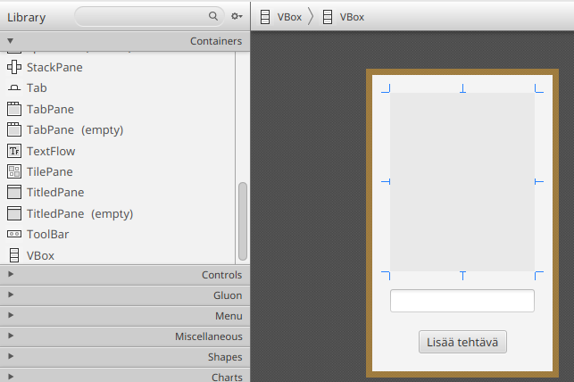

# Connecting Application Logic and the User Interface

Our application could already function as a kind of Todo list. However, let's recall the features we planned at the beginning of this part:

* The user can add a new task.
* The user can see a list of all tasks.
* The user can mark a task as completed.
* The user can delete a task.
* The user can restore a completed task back to an unfinished state.
* Tasks are saved to a file so that they persist after the application is closed.
* Tasks are loaded from a file when the application starts.

Considering these requirements, our application is not yet very usable: tasks can be added and we can see all tasks, but tasks cannot be deleted or marked as completed.

Let's modify the user interface so that tasks are displayed as checkboxes, allowing them to be marked as completed or incomplete. In addition, completed and incomplete tasks will be displayed in separate lists.

Let's draw a preliminary wireframe design:


The figure above was drawn using the 
`wireframe.cc`(https://wireframe.cc/Mq98ie)
service, but similar design mockups can be created using any drawing tool. In general, it is a good idea to plan user interfaces a little in advance so that implementation becomes more straightforward.

## Creating Components Dynamically

Let's begin by modifying the button so that a new task is added to the user interface as a checkbox, that is, a `CheckBox` component.
Since users may add an unlimited number of tasks, we cannot create all checkboxes through SceneBuilder. Instead, we create components directly in the controller code.

First, let's prepare the user interface.
Open SceneBuilder and remove the existing `Label` component.
Since the label has no default text, it cannot easily be selected in the design view. Instead, select it using the Hierarchy panel in the Document view.

<video src="images/scenebuilder-hierarchy-panel-select.mp4"></video>

Delete the label by pressing <kbd>Delete</kbd> (macOS: <kbd>⌫ delete</kbd>).
You will receive the warning:
"This component has an fx:id. Do you really want to delete it?"
This indicates that the label component is used in the controller code.
Choose **Delete**.

Next, locate a `VBox` component in the Library view:
`Library → Containers → VBox`
and drag it above the text field.




`VBox` (**V**ertical **Box**) is a container component intended for grouping and arranging other components.
Container components can hold other elements and arrange them according to their own rules.
For example, `VBox` arranges all components it contains vertically from top to bottom.

Assign the new `VBox` the fx:id:
`pendingTasks`
using the same identifier as the deleted label.
Save the FXML file and then modify the `MainController` class so that the type of `pendingTasks` becomes `VBox`:

```java,ignore
// HIGHLIGHT_RED_BEGIN
@FXML
private Label pendingTasks;
// HIGHLIGHT_RED_END

// HIGHLIGHT_GREEN_BEGIN
@FXML
private VBox pendingTasks;
// HIGHLIGHT_GREEN_END
```

Now the event handler no longer works because a `VBox` does not contain `getText` or `setText` methods.
Instead, the most important method of a `VBox` is `getChildren`, which returns a list of all components contained within it.
Let's modify the button event handler so that pressing the button creates a new `CheckBox` object and adds it to the `VBox` component:

```java,ignore
addNewTaskButton.setOnAction(event -> {
    String text = newTaskName.getText();
    CheckBox task = new CheckBox(text);
    pendingTasks.getChildren().add(task);
});
```

Run the application at this point.
You will notice that the "Add Task" button now creates a new checkbox component and adds it above the text field.
The checkboxes are clickable as an indication of whether the task has been completed.

<video src="images/todo-app-checbox-add.mp4" controls></video>

Let's improve the usability of the application a little.
First, if the "Add Task" button is pressed without entering any text, an empty checkbox appears.
Let's add a validation check: if the text is `null`, contains no text, or contains only whitespace, we stop processing the event.
This can be done using the `String` method `isBlank()`.
We will also remove unnecessary whitespace from the beginning and end of the task name using `trim`:

```java,ignore
addNewTaskButton.setOnAction(event -> {
    String text = newTaskName.getText();
    // HIGHLIGHT_GREEN_BEGIN
    if (text == null || text.isBlank()) {
        return;
    }
    text = text.trim();
    // HIGHLIGHT_GREEN_END
    CheckBox task = new CheckBox(text);
    pendingTasks.getChildren().add(task);
});
```

Second, after adding a task, the task text remains in the text field, forcing us to erase it before entering another task.
We can clear the contents using the `TextField` method `clear`:

```java,ignore
addNewTaskButton.setOnAction(event -> {
    String text = newTaskName.getText();
    if (text == null || text.isBlank()) {
        return;
    }
    text = text.trim();
    CheckBox task = new CheckBox(text);
    pendingTasks.getChildren().add(task);
    // HIGHLIGHT_GREEN_BEGIN
    newTaskName.clear();
    // HIGHLIGHT_GREEN_END
});
```

Third, after adding a task we must click the text field before entering another task.
Let's perform this click programmatically using `requestFocus()`, which moves the focus as if the component had been selected.
Notice that the focus must be restored at every point where event processing ends:

```java,ignore
addNewTaskButton.setOnAction(event -> {
    String text = newTaskName.getText();
    if (text == null || text.isBlank()) {
        // HIGHLIGHT_GREEN_BEGIN
        newTaskName.requestFocus();
        // HIGHLIGHT_GREEN_END
        return;
    }
    text = text.trim();
    CheckBox task = new CheckBox(text);
    pendingTasks.getChildren().add(task);
    newTaskName.clear();
    // HIGHLIGHT_GREEN_BEGIN
    newTaskName.requestFocus();
    // HIGHLIGHT_GREEN_END
});
```

<details><summary><i class="bi bi-stars jyu-gold"></i>Bonus: Automatically Setting Focus at the End of an Event</summary>

Now we somewhat annoyingly have to set the focus in two separate places.

One JavaFX-style solution is to use the `Platform.runLater` 
([JavaDoc](https://download.java.net/java/GA/javafx25/docs/api/javafx.graphics/javafx/application/Platform.html#runLater(java.lang.Runnable)))
method, which executes a piece of code later during application execution (but not before the current event has completed).
The method accepts an object implementing the `Runnable` interface.
Since `Runnable` is a functional interface
(see [Chapter 6.1](../part6/01-functional-interfaces-and-lambda-expressions.md#built-in-functional-interfaces))
, we can provide either a lambda expression or a method reference.
Because `requestFocus` matches the parameter and return-value requirements of `Runnable`, we can use a method reference directly:

```java,ignore
addNewTaskButton.setOnAction(event -> {
    Platform.runLater(newTaskName::requestFocus);
    String text = newTaskName.getText();
    if (text == null || text.isBlank()) {
        return;
    }
    text = text.trim();
    CheckBox task = new CheckBox(text);
    pendingTasks.getChildren().add(task);
    newTaskName.clear();
});
```

Another possibility is to combine generic methods
(see [Chapter 4.4](../part4/04-type-parameters-and-generics.md#generic-methods))
and functional interfaces
(see [Chapter 6.1](../part6/01-functional-interfaces-and-lambda-expressions.md))
.
Since lambda expressions can be passed as parameters and returned as values, we can create a helper method `runAndFocus`, which accepts an event handler and returns a new event handler that always calls `requestFocus` at the end:

```java,ignore
static <T extends Event> EventHandler<T> runAndFocus(EventHandler<T> handler, Node component) {
    return e -> {
        handler.handle(e);
        component.requestFocus();
    };
}
```

Such a method is commonly known as a *wrapper method*.
As the name suggests, it "wraps" one function inside another.
Using the helper method, the event handler becomes:

```java,ignore
addNewTaskButton.setOnAction(runAndFocus(event -> {
    String text = newTaskName.getText();
    if (text == null || text.isBlank()) {
        return;
    }
    text = text.trim();
    CheckBox task = new CheckBox(text);
    pendingTasks.getChildren().add(task);
    newTaskName.clear();
}, newTaskName));
```

Notice that all JavaFX components inherit from the `Node` class.
</details>

Finally, adding a task always requires pressing the Add Task button.
For a power user, it would be more convenient to add tasks using the <kbd>Enter</kbd> key, allowing tasks to be entered much more quickly.
The `TextField` component's `onAction` event is triggered when the user presses <kbd>Enter</kbd> in the text field.
(see 
[JavaDoc](https://download.java.net/java/GA/javafx25/docs/api/javafx.controls/javafx/scene/control/TextField.html#setOnAction(javafx.event.EventHandler))).
Let's therefore add an event handler to the `newTaskName` text field using `setOnAction`.
Since we want both the button click and the <kbd>Enter</kbd> key to perform the same operation, let's refactor the event handling into a separate method:

```java,ignore
public void initialize(URL url, ResourceBundle resourceBundle) {
    addNewTaskButton.setOnAction(event -> addTask());
    newTaskName.setOnAction(event -> addTask());
}

private void addTask() {
    String text = newTaskName.getText();

    if (text == null || text.isBlank()) {
        newTaskName.requestFocus();
        return;
    }

    text = text.trim();

    CheckBox task = new CheckBox(text);

    pendingTasks.getChildren().add(task);

    newTaskName.clear();
    newTaskName.requestFocus();
}
```

Run the application again and verify that everything works.

After these changes, the application is noticeably more usable:

* Tasks cannot be added if the text field is empty.
* Adding a task clears the text field and restores focus for faster entry.
* Tasks can also be added by pressing <kbd>Enter</kbd>.

<video src="images/todo-app-usability.mp4" controls></video>


## Completed Tasks

Let's continue improving the application.
We want completed tasks to always be separated from incomplete tasks so that progress is easier to track.

Return to SceneBuilder and add another `VBox` component below the incomplete-tasks container.
Give the new `VBox` the *fx:id*:
`completedTasks`

Save the FXML file and define the corresponding field in the controller:

```java,ignore
@FXML
private VBox completedTasks;
```

Let's make it so that whenever a checkbox is clicked, the task moves from the incomplete list to the completed list.
We notice that `CheckBox` inherits from `ButtonBase`, meaning the `onAction` event is triggered whenever the checkbox is clicked.
(see.
[JavaDoc](https://download.java.net/java/GA/javafx25/docs/api/javafx.controls/javafx/scene/control/CheckBox.html)).
Modify the `addTask` method so that a handler is assigned to the checkbox.
The event handler first removes the checkbox from `pendingTasks` and then adds it to `completedTasks`:

```java,ignore
private void addTask() {
    // beginning of method hidden...
    //- String text = newTaskName.getText();
    //- if (text == null || text.isBlank()) {
    //-     newTaskName.requestFocus();
    //-     return;
    //- }
    //- text = text.trim();

    CheckBox task = new CheckBox(text);
    // HIGHLIGHT_GREEN_BEGIN
    task.setOnAction(event -> {
        pendingTasks.getChildren().remove(task);
        completedTasks.getChildren().add(task);
    });
    // HIGHLIGHT_GREEN_END
    pendingTasks.getChildren().add(task);
    // end of method hidden...
    //- newTaskName.clear();
    //- newTaskName.requestFocus();
}
```

Run the application.
Clicking a task now moves it to the lower container.
However, clicking a completed task does not move it back, and you will see the following exception in the IDEA console:

```
java.lang.IllegalArgumentException: Children: duplicate children added: parent = VBox[id=completedTasks]
```

The exception indicates that we are attempting to add the same `CheckBox` to `completedTasks` even though it is already there.
Let's modify the logic so that selecting a task moves it to the completed list and deselecting it moves it back.
We can use the `CheckBox` method `isSelected()`, which tells us whether the checkbox is currently selected (see 
[JavaDoc](https://download.java.net/java/GA/javafx25/docs/api/javafx.controls/javafx/scene/control/CheckBox.html#isSelected())).


The event handler then becomes:

```java,ignore
task.setOnAction(event -> {
    if (task.isSelected()) {
        // Task selected --> move to completed tasks
        pendingTasks.getChildren().remove(task);
        completedTasks.getChildren().add(task);
    } else {
        // Task deselected --> move back to pending tasks
        completedTasks.getChildren().remove(task);
        pendingTasks.getChildren().add(task);
    }
});
```

Run the application again.
Marking a task as completed should move it to the lower container.
Likewise, marking a task as incomplete moves it back to the upper container.

<video src="images/todo-app-checkbox-move.mp4" controls></video>

Notice that `isSelected()` already returns the **new** value.
The state update happens before the `setOnAction` event is fired.
When the user clicks a checkbox, the sequence of events is approximately:

* The operating system registers the mouse click.
* JavaFX updates the internal `selected` property (for example, `false → true`).
* An `ActionEvent` is created and the `setOnAction` handler runs.
* Calling `isSelected()` inside the handler therefore returns the updated state.

## Labels for the Containers

Let's make one final improvement to usability.
Add a `Label` component above the incomplete-tasks container and set its `Text` attribute to:
`TODO`
Then add another `Label` above the completed-tasks container and set its text to:
`DONE`

Save the FXML file and run the application again from IDEA to verify that everything still works correctly.

<task>
<task-title>Exercise 7.4: Todo Application, Part 4
<points>1 p.</points> </task-title>
<handout>

{{#include ../exercises/7-4-todo-4/handout.md}}

</handout>
<task-link><a href="https://tim.jyu.fi/view/kurssit/it/iseai/26-27/programming2/exercises/part7/exercise4">Complete this exercise in TIM</a></task-link>
</task>