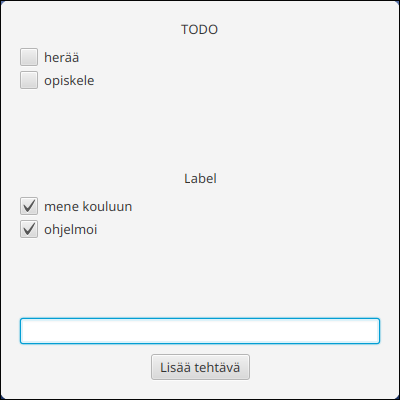
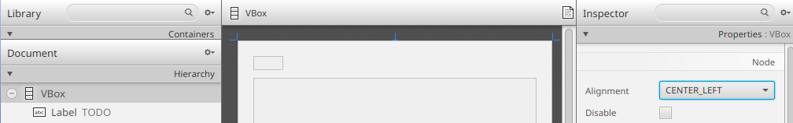

# Component Layout

Our application is functionally complete, but there are still a few issues with its appearance:

* The default window size is too large.
* Resizing the window leaves empty space in the wrong places.
* The component layout needs some refinement: the checkboxes are too close together, the labels are centered oddly, and the button is far away from the input field.

Let's improve the application's appearance and become familiar with `HBox`, the close relative of the `VBox` container.

Open the application's `main.fxml` file in SceneBuilder.
Immediately select:
View → Show Outlines
or press <kbd>Ctrl</kbd>+<kbd>E</kbd> (macOS: <kbd>Cmd</kbd>+<kbd>E</kbd>).
This makes components appear as boxes, making it easier to understand their size and position.


After completing this chapter, you can return to the normal view using:
View → Hide Outlines

## Window and Component Size

Let's begin by fixing the window size.

Select the `VBox` that contains the entire application from the Hierarchy panel on the left and open the Layout panel on the right.

<video src="images/scenebuilder-layout-panel.mp4" controls></video>

The Layout panel contains size-related properties.
In JavaFX, every component has three types of width and height:

* **Preferred size** (`Pref Width` and `Pref Height`): the default size when the view is loaded. The actual size may still change depending on the component itself and the surrounding layout.
* **Minimum size** (`Min Width` and `Min Height`): the smallest size to which the component may shrink.
* **Maximum size** (`Max Width` and `Max Height`): the largest size to which the component may grow.

You can assign decimal values or use the following special values:

* `USE_COMPUTED_SIZE`: JavaFX calculates the most appropriate size from the component's contents.
* `USE_PREF_SIZE`: JavaFX uses the preferred size (`Pref`). Useful for restricting component size.

Set the following values for the root `VBox`:

* Min Width: `USE_PREF_SIZE`
* Min Height: `USE_PREF_SIZE`
* Pref Width: `400`
* Pref Height: `400`
* Max Width: `USE_COMPUTED_SIZE`
* Max Height: `USE_COMPUTED_SIZE`

In other words: initialize the view at 400×400 pixels, do not allow it to shrink below that size, but allow it to grow freely.
You should immediately see the change in SceneBuilder.


Save the FXML file and launch the application.
The default window size is now 400×400.


However, the window can still be resized smaller than 400×400 because we only modified the view's limits, not the window (`Stage`) itself.
Let's fix that by setting the minimum window size in the `start` method of the `App` class.
At the same time, we'll give the application a nicer title:

```java,ignore
public void start(Stage stage) throws IOException {
    FXMLLoader loader = new FXMLLoader(getClass().getResource("main.fxml"));
    Scene scene = new Scene(loader.load());

    stage.setScene(scene);
    // HIGHLIGHT_GREEN_BEGIN
    stage.setMinHeight(400);
    stage.setMinWidth(400);
    // HIGHLIGHT_GREEN_END
    // HIGHLIGHT_YELLOW_BEGIN
    stage.setTitle("Todo Application");
    // HIGHLIGHT_YELLOW_END
    stage.show();
}
```

Now when you run the application, the window can no longer be resized below 400×400.

<video src="images/todo-app-size-limit.mp4" controls width="400"></video>

## Spacing Between Components in a `VBox`

The `VBox` component contains a Spacing property that defines the amount of empty space between its child components.

Notice that the main `VBox` currently has a spacing value of 20, which is a bit too large.
Change it to `10`:


Let's also fix the task-list containers, whose checkboxes currently have no space between them.
Set the Spacing value of both task-list `VBox` containers to `5`.
Save the FXML file and run the application.
You should now see a small amount of space between checkboxes.



## Growing Components When a `VBox` Grows

Resizing the window reveals another issue: the completed and pending task lists do not grow along with the window.

<video src="images/todo-app-vbox-no-resize.mp4" controls width="300"></video>

By default, a `VBox` keeps the height of its child components unchanged.
However, each component can specify how it should behave when extra space becomes available.
In this case, we want the task lists to expand while other components (labels, text fields, buttons) remain unchanged.

Select the `VBox` containing pending tasks and open the Layout panel.


Whenever a component is inside a `VBox`, it can be assigned a Vgrow setting.
This setting controls how the component's height behaves when its containing `VBox` grows.
The available values are:
* `NEVER`: Height never changes.
* `ALWAYS`: Always fills available space. If multiple components use this setting, they share the available space.
* `SOMETIMES`: Grows only if nothing else can be expanded.

Set the pending-task container's Vgrow value to
`ALWAYS`.
Do the same for the completed-task container.
Now both containers will grow proportionally.

Save and test the application.
The task lists should now expand vertically with the window while the remaining components keep their original size.

## Placing the Button on the Same Row as the Text Field

Currently, the text field appears somewhat disconnected from the button.
In most applications, buttons related directly to a text field are placed on the same row.

Since `VBox` always arranges components vertically, we need its horizontal counterpart: **`HBox`** (**H**orizontal **Box**).
As its name suggests, an `HBox` arranges its child components horizontally from left to right.

Add an `HBox` below the completed-tasks section and drag the text field and button into it.

<video src="images/scenebuilder-hbox-add.mp4" controls></video>

Configure the `HBox` with the following settings:

* Spacing: `10` (adds empty space between the text field and button)
* Pref Width and Pref Height: `USE_COMPUTED_SIZE` (the container size adapts to its contents)
* Vgrow: `NEVER` (the container height never changes even if the surrounding `VBox` grows)

Finally, select the `TextField` and set its **Hgrow** value to
`ALWAYS`
This is the horizontal equivalent of `Vgrow` inside a `VBox`.
The text field will now fill all remaining horizontal space.

## Left-Aligning the Labels

Let's make one final adjustment.
Applications commonly align labels to the left edge.
Let's update the alignment to make the interface feel more familiar.

Select the root `VBox` and set its **Alignment** property in the Properties panel to
`CENTER_LEFT`: 



Save and run the application.
Verify that everything still works correctly and that the components adapt nicely when the window is resized.

<video src="images/todo-app-final-product.mp4" controls></video>

<task>
<task-title> Exercise 7.6: Todo Application, Part 6
<points>1 p.</points> </task-title>
<handout>

{{#include ../exercises/7-6-todo-6/handout.md}}

</handout>
<task-link><a href="https://tim.jyu.fi/view/kurssit/it/iseai/26-27/programming2/exercises/part7/exercise6">Complete this exercise in TIM</a></task-link>
</task>