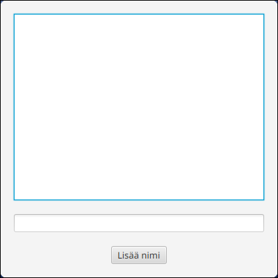

# Model and the Observable Interface

In [Part 7.5](../part7/05-reading-and-writing-tasks-to-file.md), we created the `Task` class, whose purpose was to model the data stored in a JSON file. In the user interface, tasks were represented as `CheckBox` objects. During saving and loading, we converted tasks between the two representations (`CheckBox <-> Task`). As mentioned in the [introduction](./index.md) to this part, that conversion is not a good long-term solution.

The first major step in separating the responsibilities of data and the user interface is reducing data duplication. A clear way to achieve this is to make the `Task` class the only representation of an individual task's state and behavior. In UI terminology, `Task` becomes a *model class*. The term *model* refers to the structure and state of the application's data without any user-interface dependencies. The model answers the question of what data the application contains, not how that data appears on screen.

The first problem that immediately arises is how to get the information from a `Task` object into the user interface. Furthermore, if task data changes while the program is running, the view should react automatically without requiring manual update code for every user-interface component after each change.

This is where JavaFX's `Observable` structures help us by providing a controlled way to connect data and the user interface.

## Observable Structures

The word **observable** means that an object can notify other objects when it changes. Objects that listen to changes in an observable object are often called **observers**, **subscribers**, or **listeners**. In practice, these terms refer to the same idea, although different contexts may favor different terminology.

Observers and observable objects are related to the *Observer* design pattern, which we will study in more detail later. For now, it is enough to understand that observable structures are the foundation of how JavaFX updates the user interface immediately when data changes.

In JavaFX, we mainly use the following `observable` structures:

* `ObservableList<T>`, which reports when items are added to or removed from a list.
* `ObservableValue<T>`, which reports when its contained value changes.
* `Property` types, which report whenever their contained value changes. Property types are observable versions of corresponding primitive types. For example, `StringProperty` is an observable version of `String`, `BooleanProperty` is an observable version of `Boolean`, and so on.

## An Introductory Example

Let's momentarily forget about the Todo application and focus on understanding how Observable types work.

Create a new JavaFX project following the instructions from [Part 7.1.](../part7/01-javafx-fundamentals.md#the-first-javafx-application) Give it a different name and `groupId`, for example
`ObservableExample` and `fi.jyu.ohj2.examples.observable`.

Comment out the call to `Application.launch()` inside the `main()` method:

```java,ignore
public static void main(String[] args) {
    // HIGHLIGHT_GREEN_BEGIN
    // Application.launch(App.class, args);
    // HIGHLIGHT_GREEN_END
}
```

Our application now behaves like a normal command-line program.

Try running the following example. Add the import if necessary `import javafx.collections.*;`

```java
//-// ==========================================
//-// DO NOT COPY THE HIDDEN CODE
//-// This code exists so that we can mimic ObservableList in mdbood.
//-// In JavaFX Observablelist is already implemented.
//-// ==========================================
//-static interface ListChangeListener<E> {
//-    void onChanged(Change<E> c);
//-    class Change<E> {
//-        boolean next = true, added;
//-        List<E> items;
//-        Change(boolean a, E item) { 
//-            added = a; 
//-            items = a ? Collections.singletonList(item) : Collections.emptyList(); 
//-        }
//-        boolean next() { boolean r = next; next = false; return r; }
//-        boolean wasAdded() { return added; }
//-        List<E> getAddedSubList() { return items; }
//-    }
//-}
//-
//-static class ObservableList<E> extends ArrayList<E> {
//-    List<ListChangeListener<E>> listeners = new ArrayList<>();
//-    void addListener(ListChangeListener<E> l) { listeners.add(l); }
//-    public boolean add(E e) {
//-        super.add(e);
//-        listeners.forEach(l -> l.onChanged(new ListChangeListener.Change<>(true, e)));
//-        return true;
//-    }
//-    public boolean remove(Object o) {
//-        if (super.remove(o)) {
//-            listeners.forEach(l -> l.onChanged(new ListChangeListener.Change<>(false, null)));
//-        }
//-        return true;
//-    }
//-}
//-
//-static class FXCollections {
//-    public static <E> ObservableList<E> observableArrayList() { return new ObservableList<>(); }
//-}
//-
public static void main(String[] args) {
    // 1. Create an observable list instead of a normal ArrayList
    ObservableList<String> names = FXCollections.observableArrayList();

    // 2. Register a "listener" that reacts whenever the list changes
    names.addListener((ListChangeListener<String>) change -> {
        int size = names.size();
        IO.println("The list now contains " + size + " names.");
    });

    // 3. Modify the data
    names.add("Denis");
    names.add("Antti-Jussi");

    // Application.launch(App.class, args);
}
```

When you run the code, you will see output every time `names.add()` is executed. The message is printed whenever the `names` list changes, regardless of where in the program that modification occurs.

The key difference between `ObservableList` and a normal list is that it provides an `addListener` method, allowing other code to observe changes to the list.
If items are added to a normal `ArrayList`, no other object automatically knows about the change unless it explicitly checks the list.
`ObservableList`, on the other hand, is active. Whenever items are added or removed, it sends notifications to all observers registered through `addListener`.

In the example above, the observer is a lambda expression that prints the list size after every modification.

The lambda parameter `change` contains information about the modification or modifications that just occurred: which indices were affected, whether items were added or removed, and which items were involved.
It provides methods such as `wasAdded()`, `wasRemoved()`, `getAddedSubList()`, and `getRemoved()` that can be used to inspect the details of the change 
(see 
[JavaDoc](https://download.java.net/java/GA/javafx25/docs/api/javafx.base/javafx/collections/ListChangeListener.Change.html)). 


Let's try using the `change` parameter. Add a condition so that additions are printed, while removals are ignored.

```java
//-// ==========================================
//-// DO NOT COPY THE HIDDEN CODE
//-// This code exists so that we can mimic ObservableList in mdbood.
//-// In JavaFX Observablelist is already implemented.
//-// ==========================================
//-static interface ListChangeListener<E> {
//-    void onChanged(Change<E> c);
//-    class Change<E> {
//-        boolean next = true, added;
//-        List<E> items;
//-        Change(boolean a, E item) { 
//-            added = a; 
//-            items = a ? Collections.singletonList(item) : Collections.emptyList(); 
//-        }
//-        boolean next() { boolean r = next; next = false; return r; }
//-        boolean wasAdded() { return added; }
//-        List<E> getAddedSubList() { return items; }
//-    }
//-}
//-
//-static class ObservableList<E> extends ArrayList<E> {
//-    List<ListChangeListener<E>> listeners = new ArrayList<>();
//-    void addListener(ListChangeListener<E> l) { listeners.add(l); }
//-    public boolean add(E e) {
//-        super.add(e);
//-        listeners.forEach(l -> l.onChanged(new ListChangeListener.Change<>(true, e)));
//-        return true;
//-    }
//-    public boolean remove(Object o) {
//-        if (super.remove(o)) {
//-            listeners.forEach(l -> l.onChanged(new ListChangeListener.Change<>(false, null)));
//-        }
//-        return true;
//-    }
//-}
//-
//-static class FXCollections {
//-    public static <E> ObservableList<E> observableArrayList() { return new ObservableList<>(); }
//-}
//-
public static void main(String[] args) {

    ObservableList<String> names = FXCollections.observableArrayList();
    names.addListener((ListChangeListener<String>) change -> {
        while (change.next()) { // Process all changes that occurred
            if (change.wasAdded()) { // Was the change an addition?
                IO.println("Added to the list: " + change.getAddedSubList());
            }
        }
        // This code still executes every time
        // the listener is called regardless of
        // whether the change was an addition or removal
        int size = names.size();
        IO.println("The list now contains " + size + " names.");
    });

    names.add("Denis");
    names.add("Antti-Jussi");
    names.add("Sami");
    names.remove("Denis");
    // Application.launch(App.class, args);
}
```

The loop `while (change.next())` is JavaFX's way of processing changes in a list.
Several modifications may be bundled together, such as additions, removals, or moves.
The loop ensures each one gets processed.

There may also be multiple listeners. Every call to `addListener(...)` registers a new listener. Whenever a change occurs, JavaFX notifies all listeners one after another.
One listener might update the user interface, another might write to a log, and a third could perform validation.

An important detail is that an `ObservableList` listener normally reacts only to *structural* changes in the list (additions, removals, etc.), not to changes inside the list elements themselves.
For example, if the first element in the list changes from `"Denis"` to `"Antti-Jussi"`, the listener is **not** automatically triggered.
We will return to this topic in [Part 8.2](./02-tableview.md) when discussing Property types.

<details><summary>Optional information: Why is the typecast needed in the lambda expression?</summary>

One final note about the `change` parameter, which may appear somewhat complicated.
`Change` is a generic object describing a modification that occurred in the list.
It is used by the `onChanged()` method of the `ListChangeListener` interface:
`void onChanged(Change<? extends E> c);`
In this example `E` is `String`, so the full type is:
`ListChangeListener.Change<? extends String>`
The reason for this syntax is that lists are generic, and different types of modifications (addition, removal, replacement, etc.) can all be represented using the same `Change` object.
</details>

## Connecting to the User Interface

In JavaFX, observable objects are typically used so that the observer is a user-interface component.
Let's look at how this works in practice.

Restore the `Main` class so that `main()` once again contains only the call to `Application.launch()`.
Then use the following controller and FXML view as a starting point. Some import statements have been omitted to save space.

```java
// FILE: MainController.java
package fi.jyu.ohj2.examples.observable;

public class MainController implements Initializable {
    @FXML
    private TextField nameField;

    @FXML
    private Button nameButton;

    @FXML
    private ListView<String> nameOutputs;

    private ObservableList<String> names = FXCollections.observableArrayList();

    @Override
    public void initialize(URL url, ResourceBundle resourceBundle) {
    }
}

// FILE_END
// FILE: main.fxml
<?xml version="1.0" encoding="UTF-8"?>

<VBox prefWidth="400" prefHeight="400" alignment="CENTER" spacing="20.0" xmlns="http://javafx.com/javafx/21" xmlns:fx="http://javafx.com/fxml/1" fx:controller="fi.jyu.ohj2.examples.observable.MainController">
    <padding>
        <Insets bottom="20.0" left="20.0" right="20.0" top="20.0"/>
    </padding>

    <ListView fx:id="nameOutputs"/>
    <TextField fx:id="nameField"/>
    <Button text="Add name" fx:id="nameButton"/>
</VBox>
// FILE_END
```

Try running the application. It should look roughly like this.



The controller fields `nameField` and `nameButton` correspond to the text field and button in the user interface.
The field `names` is an `ObservableList` containing the names, just like in the examples above.
Finally, `nameOutputs` is a `ListView`
([JavaDoc](https://download.java.net/java/GA/javafx25/docs/api/javafx.controls/javafx/scene/control/ListView.html)),
component that knows how to display the contents of an `ObservableList`.
Components whose names end in "View", such as `ListView`, are often called *view components*.

Initially, the `ListView` does not know which list should be displayed.

Let's connect the list and the view:

```java,ignore
public void initialize(URL url, ResourceBundle resourceBundle) {
    // HIGHLIGHT_GREEN_BEGIN
    nameOutputs.setItems(names);

    names.add("Denis");
    names.add("Antti-Jussi");
    names.add("Sami");
    // HIGHLIGHT_GREEN_END
}
```

This makes `nameOutputs` observe the `names` list.
The actual `addListener()` call happens inside `setItems()` in exactly the same way we did manually earlier.
After this connection has been established, we never need to call any kind of "refresh list" method.
When the code executes
`names.add("New name");`
the name automatically appears on the screen.

This is still somewhat difficult to observe because the names are hardcoded into `initialize()`.
Let's add a button handler that inserts a new name into the list.

```java,ignore
public void initialize(URL url, ResourceBundle resourceBundle) {
    nameOutputs.setItems(names);

    // HIGHLIGHT_RED_BEGIN
    names.add("Denis");
    names.add("Antti-Jussi");
    names.add("Sami");
    // HIGHLIGHT_RED_END

    // HIGHLIGHT_GREEN_BEGIN
    nameButton.setOnAction(event -> {
        String text = nameField.getText();
        names.add(text);
        nameField.clear();
        nameField.requestFocus();
    });
    // HIGHLIGHT_GREEN_END
}
```

Try running the application and adding names through the user interface.

<video src="images/list-app-works.mp4" controls></video>


## Making Task a Model Class

Now let's return to our Todo application.
Our goal is to model all task state using the `Task` class.
The responsibility of `VBox` and `CheckBox` components should be limited to displaying the data.

Start by adding an `ObservableList` field to `MainController` to act as the container for all tasks:

```java,ignore
private ObservableList<Task> tasks = FXCollections.observableArrayList();
```

Then modify `addTask()` so that it no longer adds a `CheckBox` component but instead creates a new `Task` object:

```java,ignore
private void addTask() {
    String text = newTaskName.getText();
    if (text == null || text.isBlank()) {
        newTaskName.requestFocus();
        return;
    }

    text = text.trim();
    // HIGHLIGHT_RED_BEGIN
    pendingTasks.getChildren().add(createCheckBox(text, false));
    // HIGHLIGHT_RED_END
    // HIGHLIGHT_GREEN_BEGIN
    tasks.add(new Task(text, false));
    // HIGHLIGHT_GREEN_END
    newTaskName.clear();
    newTaskName.requestFocus();
    save();
}
```

Likewise, we can now simplify `save()` so that it saves the `tasks` list directly, since it becomes the application's single source of truth:

```java,ignore
private void save() {
    // HIGHLIGHT_RED_BEGIN
    List<Task> allTasks = new ArrayList<>();
    allTasks.addAll(getTasks(pendingTasks));
    allTasks.addAll(getTasks(completedTasks));
    // HIGHLIGHT_RED_END
    ObjectMapper mapper = new ObjectMapper();
    // HIGHLIGHT_YELLOW_BEGIN
    mapper.writeValue(Path.of("tasks.json").toFile(), tasks);
    // HIGHLIGHT_YELLOW_END
}
```

Similarly, `load()` becomes simpler:

```java,ignore
private void load() {
    Path path = Path.of("tasks.json");
    if (Files.notExists(path)) {
        return;
    }

    try {
        ObjectMapper mapper = new ObjectMapper();
        List<Task> allTasks = mapper.readValue( path.toFile(), new TypeReference<>() {});
        // HIGHLIGHT_RED_BEGIN
        allTasks.forEach(task -> {
            CheckBox checkBox = createCheckBox(task.getText(), task.getCompleted());
            if (task.getCompleted()) {
                completedTasks.getChildren().add(checkBox);
            } else {
                pendingTasks.getChildren().add(checkBox);
            }
        });
        // HIGHLIGHT_RED_END
        // HIGHLIGHT_GREEN_BEGIN
        tasks.addAll(allTasks);
        // HIGHLIGHT_GREEN_END
    } catch (JacksonException je) {
        IO.println("Failed to read JSON: " + je.getMessage());
    }
}
```

At this point, task creation, loading, and saving have been separated from the user-interface components.
In other words, the `Task` class and the `tasks` list now form the application's model.

Naturally, tasks no longer appear in the user interface because no connection exists yet between the model and the view.
Let's implement that connection next.

At this point, it is also natural to change the signature of the `createCheckBox` method.
Previously, we passed the task text and completion status as separate parameters, but now that we have a `Task` object available, we can pass the entire object directly:

```java,ignore
// HIGHLIGHT_YELLOW_BEGIN
private CheckBox createCheckBox(Task t) {
    CheckBox task = new CheckBox(t.getText());
    task.setSelected(t.getCompleted());
// HIGHLIGHT_YELLOW_END
//-    task.setOnAction(event -> {
//-        if (task.isSelected()) {
//-            pendingTasks.getChildren().remove(task);
//-            completedTasks.getChildren().add(task);
//-        } else {
//-            completedTasks.getChildren().remove(task);
//-            pendingTasks.getChildren().add(task);
//-        }
//-        save();
//-    });
//-    return task;
}
```

Let's now create a helper method `updateView` for updating the user interface.

```java,ignore
private void updateView() {
    // Clear the current lists
    pendingTasks.getChildren().clear();
    completedTasks.getChildren().clear();

    // Rebuild the view from the model.
    // The createCheckBox(task) method now
    // receives the entire object as a parameter.
    for (Task task : tasks) {
        CheckBox cb = createCheckBox(task);
        if (task.getCompleted()) {
            completedTasks.getChildren().add(cb);
        } else {
            pendingTasks.getChildren().add(cb);
        }
    }
}
```

Now we can connect everything together.

However, instead of calling `updateView()` whenever tasks are added or loaded, we connect the model and the view loosely using the `ObservableList`.
Add a listener to the list that updates the view and saves tasks whenever the task list changes:

```java,ignore
public void initialize(URL url, ResourceBundle resourceBundle) {
    // HIGHLIGHT_GREEN_BEGIN
    tasks.addListener((ListChangeListener<Task>) change -> {
        updateView();
        save();
    });
    // HIGHLIGHT_GREEN_END

//-    load();
//-    newTaskName.setOnAction(event -> addTask());
//-    addNewTaskButton.setOnAction(event -> addTask());
}
```

Since saving now happens automatically whenever the list changes, we can also remove the explicit call to `save()` from `addTask()`:

```java
private void addTask() {

    // beginning of method hidden...

    // ...

    // HIGHLIGHT_RED_BEGIN
    save();
    // HIGHLIGHT_RED_END
}
```

If you run the application now, tasks loaded from the file are visible in the user interface, and adding new tasks works correctly.

## Using CheckBox Events to Modify the Model

At this point, the `createCheckBox()` method still contains logic that manually moves checkboxes between `VBox` containers.
This duplicates work already performed by the view update mechanism, so let's remove the old code now:

```java,ignore
private CheckBox createCheckBox(Task t) {
    CheckBox task = new CheckBox(t.getText());
    task.setSelected(t.getCompleted());
    task.setOnAction(event -> {
        // HIGHLIGHT_RED_BEGIN
        if (task.isSelected()) {
            pendingTasks.getChildren().remove(task);
            completedTasks.getChildren().add(task);
        } else {
            completedTasks.getChildren().remove(task);
            pendingTasks.getChildren().add(task);
        }
        save();
        // HIGHLIGHT_RED_END
    });
    return task;
}
```

Now we need to change our way of thinking.
Clicking a checkbox should not move the checkbox itself.
Instead, it should only modify the model.
When the model changes, the listener attached to `tasks` updates the user interface through `updateView()`.

At this stage, a `Task` object does *not yet* know how to notify others when its internal state changes.
If we simply called `task.setCompleted(true);`
the `ObservableList` would not notice anything, because no item was added to or removed from the list.

For the moment, we work around this limitation by modeling the state change as the removal of the old task and the addition of a new task whose completed state is the opposite.
At the same time, let's rename the `CheckBox` variable to something more descriptive, since it no longer represents the task itself:

```java,ignore
private CheckBox createCheckBox(Task t) {
    CheckBox cb = new CheckBox(t.getText());
    cb.setSelected(t.getCompleted());
    cb.setOnAction(event -> {
        // CHANGE:
        // We no longer move the component
        // manually between VBoxes.
        //
        // Instead, we update the model list,
        // which triggers a view update.

        // HIGHLIGHT_GREEN_BEGIN
        tasks.remove(t);
        tasks.add(new Task(t.getText(), !t.getCompleted()));
        // HIGHLIGHT_GREEN_END
    });

    return cb;
}
```

The checkbox's behavior is now much simpler:

* The user clicks a checkbox.
* The `setOnAction` handler inside `createCheckBox()` modifies the `tasks` list (`remove` and `add`). At this stage, the `VBox` components are not touched.
* The listener attached to the `tasks` list (`addListener`) notices that the list contents changed.
* The listener calls `updateView()` and `save()`.
* Only then does `updateView()` clear the `VBox` containers and rebuild them according to the model's new state.

It should be mentioned that this solution is somewhat inefficient.
The entire user interface is rebuilt because of a single click.
In addition, changing a checkbox state results in two separate changes to the `tasks` list: removal of the old `Task` object and addition of the new one.
In other words, `updateView()` is called twice every time a checkbox is clicked.
This is somewhat wasteful, but it works because `ObservableList` notices both changes and updates the view automatically.

Nevertheless, we have achieved our primary goal: modeling the application's state and state changes has been moved into the responsibility of the `tasks` list and `Task` objects.

<task>
<task-title>Exercise 8.1: Todo Application, Part 7
<points>1 p.</points> </task-title>
<handout>

{{#include ../exercises/8-1-todo-7/handout.md}}

</handout>
<task-link><a href="https://tim.jyu.fi/view/kurssit/it/iseai/26-27/programming2/exercises/part8/exercise1">Complete this exercise in TIM</a></task-link>
</task>