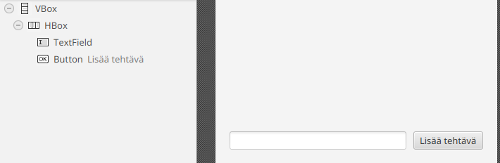
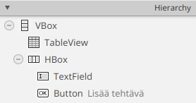
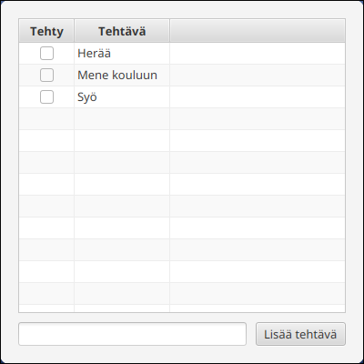

# TableView and Data Binding

In Part 7, tasks were displayed in `VBox` containers as `CheckBox` components. This is an excellent way to learn the basic idea behind user interfaces: create components and add them to a view. In the previous chapter, we saw that separating the model and the user interface required an `updateView()` method that was called whenever the model changed. However, updating the view whenever the model changes can become a bottleneck as an application grows larger, since optimizing view updates is itself a difficult problem that is beyond the scope of this course.

At this point, it is better to rely on JavaFX's built-in view components, which efficiently display objects and react to changes automatically. In this chapter, we introduce the `TableView` component. `TableView` is a ready-made JavaFX component that displays objects as rows and object properties as columns. You can think of a `TableView` as a table where each row represents a task and each column represents a property such as the title, priority, or whether the task has been completed.

## Preparation: Making the Task Class Observable

JavaFX's `TableView` can react not only to changes in the number of objects but also to changes inside the objects themselves. For example, if the title of a task changes, the `TableView` can detect the change automatically.
For this to work, simply using `ObservableList` is not enough, because it only notifies listeners when tasks are added or removed. We must also make the task object and its properties observable.

Individual object properties can be made observable using JavaFX's *Property* types. Property types wrap ordinary values such as `Boolean` and `String` and provide a mechanism for reporting value changes. For example, `StringProperty` is an observable version of `String`, while `BooleanProperty` is an observable version of `Boolean`.

We therefore need observable versions of strings and booleans in our `Task` class. Previously, a task contained a normal `boolean completed` field hidden inside the class. We will now replace it with an observable property. The same applies to the task text.
JavaFX provides ready-made implementations called `SimpleStringProperty` and `SimpleBooleanProperty`.

```java,ignore
import javafx.beans.property.*;

public class Task {
    // Original fields replaced with Property wrappers
    private final StringProperty text = new SimpleStringProperty("");
    private final BooleanProperty completed = new SimpleBooleanProperty(false);

    @SuppressWarnings("unused")
    public Task() {}

    public Task(String text, boolean completed) {
        setText(text);
        setCompleted(completed);
    }

    // --- Property setters and getters ---
    // Notice that JavaFX convention typically provides
    // three methods for each property:
    // 1. Normal getter (returns e.g. boolean)
    // 2. Normal setter (accepts e.g. boolean)
    // 3. Property getter (returns the Property object)

    public boolean getCompleted() { return this.completed.get(); }
    public void setCompleted(boolean completed) { this.completed.set(completed); }
    public BooleanProperty completedProperty() { return this.completed; }

    public String getText() { return this.text.get(); }
    public void setText(String text) { this.text.set(text); }
    public StringProperty textProperty() { return this.text; }

    @Override
    public String toString() {
        return getText() + ": " + (getCompleted() ? "DONE" : "NOT DONE");
    }
}
```

Now the properties of an individual task are observable. This allows the user interface to be *bound* to the data. The view updates automatically whenever the data changes. Likewise, when the user modifies a value in the interface, the change is written back to the same property. We will explore this idea next.

## Adding a TableView and Cleaning Up the UI

Let's start with the view.
Open `main.fxml` in SceneBuilder.
Remove the `completedTasks` and `pendingTasks` `VBox` components along with their labels.
After the removal, only the `HBox` containing the input field and button should remain.



Next, locate the `TableView` component in the Library panel and place it above the input field.
Be careful to choose TableView, <u>not</u> TreeTableView.
Select the newly added `TableView` and set its `Vgrow` property to `ALWAYS` so that it fills all available space.
Also assign it the `fx:id` `taskTable`


Finally, remove both automatically created `TableColumn` components from the Hierarchy panel.




Save the FXML file.

A few words before continuing.
`TableView` is the table itself. It displays rows but does not yet know what kind of objects those rows contain. We provide that information in the controller momentarily.
A `TableView` contains one or more `TableColumn` objects that display object properties as columns. We also configure those columns in code shortly.

Let's now clean up the `MainController`.
First, remove the old `VBox pendingTasks` and `VBox completedTasks` fields and replace them with a `TableView<Task>` field:

```java,ignore
// HIGHLIGHT_RED_BEGIN
@FXML
private VBox pendingTasks;

@FXML
private VBox completedTasks;
// HIGHLIGHT_RED_END
// HIGHLIGHT_GREEN_BEGIN
@FXML
private TableView<Task> taskTable;
// HIGHLIGHT_GREEN_END
```

Notice that `taskTable` has type `TableView<Task>`.
`TableView` is a generic class whose type parameter specifies the type of object displayed in each row.
In our case, each row displays information from a `Task` object.

Because of this change, the `updateView()` method is no longer needed. From now on, `TableView` updates itself automatically.
Remove the method entirely:

```java,ignore
// Remove this entire method. TableView will now
// update the view automatically.

// HIGHLIGHT_RED_BEGIN
private void updateView() {
    // ...
}
// HIGHLIGHT_RED_END
```

Likewise, in `initialize()` the call to `updateView()` can be removed from the task-list listener:

```java,ignore
public void initialize(URL url, ResourceBundle resourceBundle) {

    tasks.addListener((ListChangeListener<Task>) change -> {
        // HIGHLIGHT_RED_BEGIN
        updateView();
        // HIGHLIGHT_RED_END
        save();
    });

    // remainder of method hidden...
}
```

## Binding Tasks and Properties to the Table

Once the FXML structure is ready, we bind the model and view together.
First, bind the `tasks` list to the table using `setItems()`:

```java,ignore
public void initialize(URL url, ResourceBundle resourceBundle) {
    // HIGHLIGHT_GREEN_BEGIN
    taskTable.setItems(tasks);
    // HIGHLIGHT_GREEN_END

    // remainder of method hidden...
}
```

Just like the `ListView` example in the previous chapter, this connects the task data to the table.
JavaFX automatically registers a listener and updates the displayed rows whenever tasks are added or removed.

Next, let's create a column for the `completed` property:

```java,ignore
public void initialize(URL url, ResourceBundle resourceBundle) {
    taskTable.setItems(tasks);
    // HIGHLIGHT_GREEN_BEGIN
    /* 1 */ TableColumn<Task, Boolean> completedColumn = new TableColumn<>("Completed");
    /* 2 */ completedColumn.setCellValueFactory(cd -> cd.getValue().completedProperty());
    /* 3 */ taskTable.getColumns().add(completedColumn);
    // HIGHLIGHT_GREEN_END

    // remainder of method hidden...
}
```

Let's examine this line by line.

* A new `TableColumn<Task, Boolean>` is created. The first type parameter (`Task`) tells JavaFX what objects each row contains. The second (`Boolean`) indicates the type displayed in the column. `"Completed"` becomes the visible column heading.
* `setCellValueFactory()` binds the column to `completedProperty()`. JavaFX calls this lambda whenever it needs a value for a cell in the column. `cd.getValue()` returns the `Task` on the current row.
* The column is added to the table.

Let's create another column for the task text:

```java
public void initialize(URL url, ResourceBundle resourceBundle) {
    taskTable.setItems(tasks);

    TableColumn<Task, Boolean> completedColumn = new TableColumn<>("Completed");
    completedColumn.setCellValueFactory(cd -> cd.getValue().completedProperty());
    taskTable.getColumns().add(completedColumn);

    // HIGHLIGHT_GREEN_BEGIN
    TableColumn<Task, String> textColumn = new TableColumn<>("Task");
    textColumn.setCellValueFactory(cd -> cd.getValue().textProperty());
    taskTable.getColumns().add(textColumn);
    // HIGHLIGHT_GREEN_END

    // remainder of method hidden...
}
```

<details>
<summary><i class="bi bi-stars jyu-gold"></i>Optional information:
(1) The Factory Method design pattern.
(2) "Create first, then configure."</summary>

The word *factory* (for example in `setCellValueFactory`) comes from the Factory Method design pattern.
A factory method separates object creation into a dedicated method that acts like a factory.
A simple example:
```java,ignore
public class Car {

    private static int carCount = 0;

    private Car() {
        // Private constructor prevents direct creation
    }

    public static Car createCar() {
        carCount++;
        return new Car();
    }

    public static int getCarCount() {
        return carCount;
    }
}
```

Objects are then created like this:

```java,ignore
public class Main {
    public static void main(String[] args) {
        Car car1 = Car.createCar();
        Car car2 = Car.createCar();
        System.out.println("Total cars created: " + Car.getCarCount());
        // Prints "Total cars created: 2
    }
}
```

In this example, `createCar()` is the factory method.
It creates a car and could do something other usefull, like increasing counter.

With `TableColumn`, however, the more important idea is not the factory method itself but an API design style where objects are created first and configured later.

This pattern is not always suitable for ordinary application objects, such as cars or bank accounts, because they should often be in a usable state immediately after construction. The situation is different for components in user interface libraries: they are often intentionally designed to be configured incrementally.

This is exactly how the JavaFX `TableColumn` API is designed.
First, a column is created:

```java,ignore
TableColumn<Task, Boolean> completedColumn = new TableColumn<>("Completed");
```

Then we configure it separately:

* where values come from (`setCellValueFactory()`)
* how cells are rendered (`setCellFactory()`)
* whether editing is allowed
* column width
* sorting behavior
* styling

This is a common design pattern in Java libraries.
The constructor creates the object and later methods configure it step by step.
This keeps the API flexible and avoids extremely long constructors.

For this reason JavaFX separates these concerns:

* the constructor creates the column
* `setCellValueFactory()` specifies how values are retrieved
* `setCellFactory()` specifies how values are displayed


For this reason, columns are not created in this API using a constructor such as
`new TableColumn<>("Completed", cd -> ...)`
The constructor is not responsible for retrieving values. Instead, that responsibility is handled separately through the `setCellValueFactory()` method.

It is also important to distinguish between `setCellValueFactory()` and `setCellFactory()`.
`setCellValueFactory()` does **not** create cells. Instead, it determines where the value for each row is retrieved from.
`setCellFactory()`, on the other hand, determines what kind of cell (for example, text, a checkbox, or an image) is created for the column and how it displays its value.
For example, a `Boolean` value could be displayed as ordinary text (`true` or `false`) or as a more convenient checkbox.
Likewise, a `String` value could be displayed as plain text or, in some unusual case, perhaps even as an image representing the meaning of the word.

</details>

It is worth mentioning that columns can also be defined directly in FXML using SceneBuilder.
In more complex tables, it may be convenient to define columns in advance using SceneBuilder and use the controller only to bind data to the appropriate columns.

Try running the application.
Tasks should now appear in the table view, and adding tasks should add them directly to the table.
In addition, the table view provides built-in functionality for sorting tasks and rearranging columns:

<video src="images/todo-app-tableview-initial.mp4" controls></video>

Notice that we did not need to modify any functionality related to adding, loading, or saving tasks, because model management has been separated from view presentation.

*Data binding* is at the heart of how the table view works.
Without properties and `TableView`, we would often have to create components manually for each row, populate them with values, and update the view whenever the data changed.
`TableView`, together with property types, greatly reduces this manual work.
The code expresses more clearly *what* should be displayed, while JavaFX takes care of *how* it is displayed.

## Displaying the Completed Column as a Checkbox

By default, the table displays values using their string representations. Because of this, the completed state currently appears as the text values `false` and `true`.
However, it is fairly important that a task's state continues to be represented as a checkbox that can be used to mark tasks as completed.

For this purpose, `TableColumn` provides a `setCellFactory()` method that allows the appearance of cells in a column to be customized.
JavaFX also provides ready-made factories for the most common column types.
For example, checkbox cells can be created using the `CheckBoxTableCell` class
 ([JavaDoc](https://download.java.net/java/GA/javafx25/docs/api/javafx.controls/javafx/scene/control/cell/CheckBoxTableCell.html)) .

The class method `forTableColumn` returns a suitable factory object that can be passed directly to `setCellFactory()`.

We must also allow editing in the table by calling `setEditable()`, otherwise the checkboxes will not be clickable.

```java,ignore
public void initialize(URL url, ResourceBundle resourceBundle) {
    taskTable.setItems(tasks);
    // HIGHLIGHT_GREEN_BEGIN
    taskTable.setEditable(true);
    // HIGHLIGHT_GREEN_END

    TableColumn<Task, Boolean> completedColumn = new TableColumn<>("Completed");
    completedColumn.setCellValueFactory(cd -> cd.getValue().completedProperty());
    // HIGHLIGHT_GREEN_BEGIN
    completedColumn.setCellFactory(CheckBoxTableCell.forTableColumn(completedColumn));
    // HIGHLIGHT_GREEN_END
    taskTable.getColumns().add(completedColumn);

    // rest of method hidden...
}
```

When the application is started, the *Completed* column displays task states as checkboxes that can be clicked.




Most importantly, the earlier data binding of the `completed` property guarantees that the checkbox state and the task object's state remain synchronized: clicking the checkbox changes the object's state, and changes to the object's state are reflected automatically in the table view.

Now that creating checkboxes is the responsibility of `TableView`, we can remove our own `createCheckBox()` method:

```java,ignore
// No longer needed; TableView creates checkboxes automatically
// HIGHLIGHT_RED_BEGIN
private CheckBox createCheckBox(Task t) {
    // method implementation hidden...
}
// HIGHLIGHT_RED_END
```

However, we quickly notice a problem: clicking a checkbox no longer saves the updated state to the file.
This is partly expected.
In the previous implementation, clicking a checkbox forced a change to the `tasks` list using the `remove()` and `add()` methods, which in turn triggered the listener defined in `initialize()`.
The checkbox now modifies only the task's data value. The `tasks` list itself does not change, so the listener containing the `save()` call is never executed.

## Saving When a Task Changes

One possible solution would be to add a listener directly to the task's `completedProperty()` and trigger saving whenever that property changes.
This could be done, for example, inside `addTask()`.
The following demonstrates how this *could* be implemented—do not do this yet:

```java,ignore
private void addTask() {
    // beginning of method hidden...

    // This would work, but do not do this yet!
    // HIGHLIGHT_GREEN_BEGIN
    Task task = new Task(text, false);
    task.completedProperty().addListener((obs, oldValue, newValue) -> save());
    // HIGHLIGHT_GREEN_END
    tasks.add(task);

    // end of method hidden...
}
```

This would mean that every time `completedProperty()` changes (for example, when the checkbox is clicked or `setCompleted()` is called), all tasks would be saved.

The approach is convenient, but there is a small problem.
Tasks loaded through Jackson would not automatically receive this listener.
If a user changed the state of a task loaded from `tasks.json`, the task would not be saved because no listener had ever been attached.
We would therefore have to add the same listener inside `load()` and everywhere else where `Task` objects might be created.

Let's think about the situation for a moment.
One option would be to create a helper method that always initializes a `Task` together with the required listener.
On the other hand, we could use the `addListener()` method of the `ObservableList` itself.
The idea would be to add another listener to the `tasks` list in `initialize()`, similar to the example from the beginning of [Part 8.1](./01-model-and-the-observable-interface.md#an-introductory-example).
That listener would inspect every newly added task and automatically register a listener for its `completedProperty()`.
The following demonstrates that idea—again, do not implement this yet:

```java,ignore
public void initialize(URL url, ResourceBundle resourceBundle) {
    // Better, but do not do this solely for saving!
    tasks.addListener((ListChangeListener<Task>) change -> {
        while (change.next()) {
            if (change.wasAdded()) {
                for (Task task : change.getAddedSubList()) {
                    task.completedProperty().addListener((obs, oldValue, newValue) -> save());
                }
            }
        }
    });

    // rest of method hidden...
}
```

Now every newly added task would be monitored, and changes to the completed state would trigger saving.
This would apply equally to tasks loaded from a file and tasks created through the user interface.

However, every individual task still ends up with its own listener.
That is somewhat awkward.
Saving all tasks becomes directly tied to the completed state of individual tasks.
Logically, saving all tasks should instead be tied to the `tasks` list itself, because that list represents the application's entire collection of tasks.

There is another solution that is slightly more elegant.
`ObservableList` can be given a so-called *extractor* when it is created. An extractor tells the list which properties of each object it should monitor. Modify the creation of the `ObservableList` as follows:

```java,ignore
// Better approach, use this!
private final ObservableList<Task> tasks 
    = FXCollections.observableArrayList(task -> new Observable[] {task.completedProperty()});
```

Here `task -> new Observable[] { task.completedProperty() }`
is the extractor.
It returns an array of `Observable` objects that the list should monitor for each `Task`.
As a result, `ObservableList` reports not only structural changes (task added or removed) but also changes to the properties of items already contained in the list.
In other words, listeners registered through `addListener()` will now be notified when:
a task is added, a task is removed (which we have not implemented yet),
or the value of a task's `completedProperty()` changes.

```java,ignore
public void initialize(URL url, ResourceBundle resourceBundle) {
    // beginning of method hidden...

//_   taskTable.setItems(tasks);
//_   taskTable.setEditable(true 

//_   TableColumn<Task, Boolean> completedColumn = new TableColumn<>("Completed");
//_   completedColumn.setCellValueFactory(cd -> cd.getValue().completedProperty());
//_   completedColumn.setCellFactory(CheckBoxTableCell.forTableColumn(completedColumn));
//_   taskTable.getColumns().add(completedColumn 

//_   TableColumn<Task, String> textColumn = new TableColumn<>("Task");
//_   textColumn.setCellValueFactory(cd -> cd.getValue().textProperty());
//_   taskTable.getColumns().add(textColumn)

    // This already exists!
    // It will now execute whenever:
    // - A task is added
    // - A task is removed
    // - A task's completed property changes
    //   (for example through the table)
    tasks.addListener((ListChangeListener<Task>) change -> {
        save();
    });

    // rest of method hidden...

//-    load();
//-    newTaskName.setOnAction(event -> addTask());
//-    addNewTaskButton.setOnAction(event -> addTask());
}
```

Try running the application now.
You should notice that marking tasks as completed automatically saves the changes to the file.

## Completed Tasks at the End of the Table

Next, let's reimplement the feature from the earlier `VBox`-based solution where completed tasks are always shown at the bottom of the list.

Technically, this is already possible through the user interface because `TableView` supports sorting by clicking column headers.
However, let's configure the sorting in the controller so that users do not need to enable it manually.

JavaFX provides several ways to handle sorting.
One way to create permanent sorting is to use the `sorted()` method of `ObservableList`. The method accepts a `Comparator` and returns a `SortedList`
(see 
[JavaDoc](https://download.java.net/java/GA/javafx25/docs/api/javafx.base/javafx/collections/ObservableList.html#sorted(java.util.Comparator))).
The `SortedList` can then be bound directly to the table view:

```java,ignore
public void initialize(URL url, ResourceBundle resourceBundle) {
    // HIGHLIGHT_GREEN_BEGIN
    SortedList<Task> sortedTasks = tasks.sorted(Comparator.comparing(Task::getCompleted));
    // HIGHLIGHT_GREEN_END
    // HIGHLIGHT_YELLOW_BEGIN
    taskTable.setItems(sortedTasks);
    // HIGHLIGHT_YELLOW_END
    // rest of method hidden...
}
```

The `SortedList` contains the same items as the original list but arranged according to the provided comparator.
The two lists remain bound to each other: adding an item to one affects the other, and vice versa.
Again, this highlights how the data-binding approach simplifies view updates.

Try running the application.
Incomplete tasks should now appear first, while completed tasks appear last, because the default `Boolean` comparator orders `false` values before `true` values.

## Deleting a Task

Now that we have a table, we can use it to implement task deletion.

Open `main.fxml` in SceneBuilder and add a new `Button` component below the `HBox`.
Set the button text to 
"Delete Task"
and give it the `fx:id`: `deleteSelectedButton`


Save the FXML file.
Then add the corresponding field to `MainController`:

```java,ignore
@FXML
private Button deleteSelectedButton;
```

Next, add a `deleteSelected()` method to handle deletion.
For deletion to work correctly, the user interface first needs to know which row in the table is selected.
`TableView` keeps track of selected rows through a `SelectionModel`, which is accessible through `getSelectionModel()`.
The selected `Task` object can then be retrieved with `getSelectedItem()`.
Once we have the selected task, we can remove it from the `tasks` list:

```java,ignore
private void deleteSelected() {
    // 1. Retrieve the selected task from the table's selection model
    Task selectedTask = taskTable.getSelectionModel().getSelectedItem();
    // 2. If nothing is selected, do nothing
    if (selectedTask == null) {
        return;
    }
    // 3. Remove the task from the model list
    tasks.remove(selectedTask);
}
```

Finally, attach an event handler to `deleteSelectedButton` that calls this method:

```java
public void initialize(URL url, ResourceBundle resourceBundle) {

    // beginning of method hidden...
//-  SortedList<Task> sortedTasks = tasks.sorted(Comparator.comparing(Task::getCompleted));
//-  taskTable.setItems(sortedTasks);
//-  taskTable.setEditable(true);

//-  TableColumn<Task, Boolean> completedColumn = new TableColumn<>("Completed");
//-  completedColumn.setCellValueFactory(cd -> cd.getValue().completedProperty());
//-  completedColumn.setCellFactory(CheckBoxTableCell.forTableColumn(completedColumn));
//-  taskTable.getColumns().add(completedColumn);

//-  TableColumn<Task, String> textColumn = new TableColumn<>("Task");
//-  textColumn.setCellValueFactory(cd -> cd.getValue().textProperty());
//-  taskTable.getColumns().add(textColumn);

//-  tasks.addListener((ListChangeListener<Task>) change -> {
//-      save();
//-  });

//-  load();
//-  newTaskName.requestFocus();
//-  addNewTaskButton.setOnAction(_ -> addTask());
//-  newTaskName.setOnAction(_ -> addTask());
    deleteSelectedButton.setOnAction(event -> deleteSelected());
}
```

Try running the application.
When you select a task in the table and click "Delete Task", the task should disappear from the table.
This works because of data binding: the button removes the task from the `tasks` list, which automatically updates the sorted `sortedTasks` list.
The modification to `sortedTasks` then causes the `TableView` to refresh itself without any additional code.
Once again, modifications to the model and updates to the view remain only loosely coupled through *observable* structures.

<details><summary><i class="bi bi-stars jyu-gold"></i>Bonus: Disabling the button until a task is selected</summary>

At this point, the **Delete Task** button is clickable even when no task is selected.
A more user-friendly approach would be to enable the button only when a task is actually selected in the table.

The `Button` component provides the `setDisable()` method as well as the observable `disableProperty()`.
Likewise, the table's `SelectionModel` provides a `selectedItemProperty()`, which represents the currently selected task.

Because `selectedItemProperty()` is observable, we can implement enabling and disabling the button using a listener:

```java,ignore
deleteSelectedButton.setDisable(true);
taskTable.getSelectionModel().selectedItemProperty().addListener((observable, oldValue, newValue) -> {
    if (newValue == null) {
        deleteSelectedButton.setDisable(true);
    } else {
        deleteSelectedButton.setDisable(false);
    }
});
```
</details>

<details><summary><i class="bi bi-stars jyu-gold"></i>Bonus: Showing the button only when a task is selected</summary>

Another alternative would be to make the **Delete Task** button visible only when a task is selected.
Its visibility could then be controlled through `setVisible()`, which corresponds to the observable property `visibleProperty()`.
The implementation would be otherwise identical, except that the calls to `setDisable()` would be replaced with `setVisible()`.

</details>

<task>
<task-title>Exercise 8.2: Todo Application, Part 8
<points>1 p.</points> </task-title>
<handout>

{{#include ../exercises/8-2-todo-8/handout.md}}

</handout>
<task-link><a href="https://tim.jyu.fi/view/kurssit/it/iseai/26-27/programming2/exercises/part8/exercise2">Complete this exercise in TIM</a></task-link>
</task>
