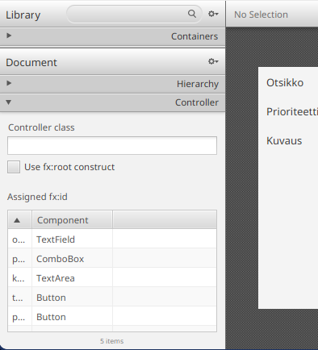

# Multiple Views and Task Editing

It is very common for an application to contain multiple views in addition to the main window.
JavaFX allows views to be loaded and displayed in three different ways.
First, the view displayed in the main window can be replaced using the `stage.setScene()` method, as we mentioned in [Part 7.1](../part7/01-javafx-fundamentals.md#application-startup-and-core-javafx-classes).
Second, a view can be loaded and embedded inside another view. For example, we could add tabs to the main window and place each tab's contents in its own view.

Third, we can create new windows that display a desired view. These windows may operate alongside the main window, or they may be *modal*.
A modal component requires the user's attention. While it is open, the main window cannot be used.
Modal windows are useful for dialogs that request input from the user and prevent the user from continuing until the dialog has been closed.

In this chapter, we will focus on the third approach. We will create a dialog that allows the user to edit the detailed information of a task. The dialog will open whenever the user double‑clicks a task.

## Preparation: Adding More Information to Tasks

Let's first modify the `Task` class by adding more information to it.
We would like each task to contain:

* A title, which is displayed in the table
* A completed/not-completed state, as before
* A more detailed description
* A priority with three allowed values: low, medium, high

The first two are already handled by the current task attributes.
A description can be modeled as a string.

A priority could be modeled using numbers `0`, `1`, and `2`. However, Java provides a special type for situations like this: an *enumeration* (`enum`).
For example, a priority can be modeled as:

```java
// Enumeration type Priority
// Priority allows only three possible values: LOW, MEDIUM, HIGH
public enum Priority {
    LOW, MEDIUM, HIGH
}

// Example usage
void main() {
    Priority priority = Priority.LOW;
    IO.println(priority);
}
```

Enum values can be stored in variables and attributes just like ordinary objects, but the value must always be one of the values defined by the enumeration.

Create a new file `Priority.java` inside the `model` package:

```java,ignore
package fi.jyu.ohj2.name.todo.model;

public enum Priority {
    LOW, MEDIUM, HIGH
}
```

Next, extend the `Task` class by adding new properties for the description and priority.

At the same time, let's rename the `text` property to `title`:

```java
public class Task {
    // HIGHLIGHT_YELLOW_BEGIN
    private final StringProperty title = new SimpleStringProperty("");
    // HIGHLIGHT_YELLOW_END
    // HIGHLIGHT_GREEN_BEGIN
    private final StringProperty description = new SimpleStringProperty("");
    // HIGHLIGHT_GREEN_END
    private final BooleanProperty completed = new SimpleBooleanProperty(false);
    // HIGHLIGHT_GREEN_BEGIN
    private final ObjectProperty<Priority> priority = new SimpleObjectProperty<>(Priority.MEDIUM);
    // HIGHLIGHT_GREEN_END

    @SuppressWarnings("unused")
    public Task() {}

    // HIGHLIGHT_YELLOW_BEGIN
    public Task(String title, boolean completed) {
        setTitle(title);
    // HIGHLIGHT_YELLOW_END
        setCompleted(completed);
    }

    public boolean getCompleted() { return this.completed.get(); }
    public void setCompleted(boolean completed) { this.completed.set(completed); }
    public BooleanProperty completedProperty() { return this.completed; }

    // HIGHLIGHT_YELLOW_BEGIN
    public String getTitle() { return this.title.get(); }
    public void setTitle(String title) { this.title.set(title); }
    public StringProperty titleProperty() { return this.title; }
    // HIGHLIGHT_YELLOW_END

    // HIGHLIGHT_GREEN_BEGIN
    public String getDescription() { return description.get(); }
    public void setDescription(String description) { this.description.set(description); }
    public StringProperty descriptionProperty() { return this.description; }

    public Priority getPriority() { return this.priority.get(); }
    public void setPriority(Priority priority) { this.priority.set(priority); }
    public ObjectProperty<Priority> priorityProperty() { return this.priority; }
    // HIGHLIGHT_GREEN_END

    @Override
    public String toString() {
        return getTitle() + ": " + (getCompleted() ? "DONE" : "NOT DONE");
    }
}
```

Notice that renaming the `text` property requires updating the getter, setter, property methods, and all references in the controller.

You can perform this easily by placing the cursor on the symbol, right-clicking, and selecting **Rename**.

<video src="images/intellij-rename-attr.mp4" controls></video>

Alternatively, you may rename everything manually.
Remember that `MainController` also contains references to `textProperty()`, which must be updated.

Save the changes.
When you run the application now, you will notice that titles disappear from old tasks since the field name changed.
Because we are only testing the application, simply delete `tasks.json` from the project.
If IDEA asks whether to perform a **Safe Delete**, disable it.

## Creating the New Editing View

Let's create a new view for the upcoming dialog.
Remember that every user interface needs both a view (FXML) and a controller class.
We begin with the view.

Open SceneBuilder and choose the *Empty* template from "New Project from Template".


Immediately save the new FXML file.
Place it in the same directory as `main.fxml`:
`src/main/resources/fi/jyu/ohj2/name/todo`
Name the file 
`task-edit.fxml`

Then build the following user interface in SceneBuilder.


Configure the components as follows:

* VBox container
  * Spacing: `10`
  * Padding: `10` on all sides
  * Pref Width: `400`
  * Pref Height: `300`
* All Label components
  * Min Width: `100`
  * Other Width and Height settings: `USE_COMPUTED_SIZE`
* HBox containers for the title field, priority field, and buttons
  * Vgrow: `NEVER`
* HBox containing the description field
  * Vgrow: `ALWAYS`
* HBox containing the buttons
  * Alignment: `TOP_RIGHT`
  * Spacing: `10`
* TextField, ComboBox, and TextArea
  * Hgrow: `ALWAYS`
  * Width and Height settings: `USE_COMPUTED_SIZE`

Assign the following `fx:id` values:

* Title TextField: `titleField`
* Priority ComboBox: `priorityCombo`
* Description TextArea: `descriptionField`
* Save Button: `saveButton`
* Cancel Button: `cancelButton`

Save the FXML file.

<details closed><summary>You can also copy the complete FXML file here</summary>

```xml
<?xml version="1.0" encoding="UTF-8"?>

<?import javafx.geometry.Insets?>
<?import javafx.scene.control.Button?>
<?import javafx.scene.control.ComboBox?>
<?import javafx.scene.control.Label?>
<?import javafx.scene.control.TextArea?>
<?import javafx.scene.control.TextField?>
<?import javafx.scene.layout.HBox?>
<?import javafx.scene.layout.VBox?>

<VBox maxHeight="-Infinity" maxWidth="-Infinity" minHeight="-Infinity" minWidth="-Infinity" prefHeight="300.0" prefWidth="400.0" spacing="10.0" xmlns="http://javafx.com/javafx/25" xmlns:fx="http://javafx.com/fxml/1">
   <children>
      <HBox VBox.vgrow="NEVER">
         <children>
            <Label minWidth="100.0" text="Title" />
            <TextField fx:id="titleField" HBox.hgrow="ALWAYS" />
         </children>
      </HBox>
      <HBox>
         <children>
            <Label minWidth="100.0" text="Priority" />
            <ComboBox fx:id="priorityCombo" HBox.hgrow="ALWAYS" />
         </children>
      </HBox>
      <HBox VBox.vgrow="ALWAYS">
         <children>
            <Label minWidth="100.0" text="Description" />
            <TextArea fx:id="descriptionField" prefHeight="200.0" prefWidth="200.0" HBox.hgrow="ALWAYS" />
         </children>
      </HBox>
      <HBox alignment="TOP_RIGHT" spacing="10.0" VBox.vgrow="NEVER">
         <children>
            <Button fx:id="saveButton" mnemonicParsing="false" text="Save" />
            <Button fx:id="cancelButton" mnemonicParsing="false" text="Cancel" />
         </children>
      </HBox>
   </children>
   <padding>
      <Insets bottom="10.0" left="10.0" right="10.0" top="10.0" />
   </padding>
</VBox>
``` 
</details>

## Creating the Controller Class

Once the view is ready, we also need a controller.
Create a new class called `TaskEditController` inside the `controller` package.
Remember that the class should implement the `Initializable` interface.
Add attributes corresponding to the components that were given `fx:id` values:

```java,ignore
package fi.jyu.ohj2.name.todo.controller;

//-import fi.jyu.ohj2.nimi.todo.model.Prioriteetti;
//-import javafx.fxml.FXML;
//-import javafx.fxml.Initializable;
//-import javafx.scene.control.Button;
//-import javafx.scene.control.ComboBox;
//-import javafx.scene.control.TextArea;
//-import javafx.scene.control.TextField;
//-
//-import java.net.URL;
//-import java.util.ResourceBundle;
// imports hidden...

public class TaskEditController implements Initializable {
    @FXML
    private TextField titleField;

    @FXML
    private ComboBox<Priority> priorityCombo;

    @FXML
    private TextArea descriptionField;

    @FXML
    private Button saveButton;

    @FXML
    private Button cancelButton;

    @Override
    public void initialize(URL location, ResourceBundle resources) {
    }
}
```

A few words about the new components.
`TextArea` is a multi-line text field. It behaves similarly to `TextField` but allows line breaks.
`ComboBox<T>` is a component that displays the contents of an `ObservableList<T>` as a drop-down menu.

Although the controller now exists, we have not yet told JavaFX that the FXML file and controller belong together.
Return to SceneBuilder and open the **Controller** panel at the bottom of the Document view.



The *Controller class* setting determines which controller class is loaded whenever the view is loaded.
Set its value to:
`fi.jyu.ohj2.name.todo.controller.TaskEditController`
using your own package name.

Save the FXML file.
Now every time the edit view is displayed, JavaFX will automatically create a corresponding `TaskEditController`.

## Opening the Dialog from the Main View

We would now like to open the dialog whenever a task in the table is double-clicked.
Unfortunately, `TableView` does not directly provide an event for clicking a row.
Instead, clicks occur on the `TableRow` object representing the individual row.

To customize rows, `TableView` provides the `setRowFactory()` method
([JavaDoc](https://download.java.net/java/GA/javafx25/docs/api/javafx.controls/javafx/scene/control/TableView.html#setRowFactory(javafx.util.Callback))) .
The supplied lambda is executed whenever a new row is created.
The lambda should create and return a `TableRow` object.
This allows us to attach an `onMouseClicked` event handler to each row.

Add the following to the `initialize()` method of `MainController` where we initialize the columns:

```java,ignore
taskTable.setRowFactory(tv -> {
    TableRow<Task> row = new TableRow<>();
    row.setOnMouseClicked(event -> {
        if (event.getButton().equals(MouseButton.PRIMARY)
                && event.getClickCount() == 2 && !row.isEmpty()) {
            Task task = row.getItem();
            openTaskEditor(task);
        }
    });

    return row;
});
```

Next, create the `openTaskEditor()` method:

```java,ignore
private void openTaskEditor(Task task) {
    try {
        /* 1 */ FXMLLoader loader = new FXMLLoader(App.class.getResource("task-edit.fxml"));
        /* 1 */ Parent root = loader.load();
        /* 1 */ Scene scene = new Scene(root);

        /* 2 */ Stage dialog = new Stage();
        /* 2 */ dialog.setScene(scene);

        /* 3 */ dialog.setTitle("Edit Task: " + task.getTitle());
        /* 3 */ dialog.setMinWidth(400);
        /* 3 */ dialog.setMinHeight(300);
        /* 3 */ dialog.initModality(Modality.APPLICATION_MODAL);

        /* 4 */ dialog.showAndWait();
    } catch (IOException e) {
        throw new RuntimeException(e);
    }
}
```

Notice that the logic is essentially the same as the application startup code from [Part 7.1](../part7/01-javafx-fundamentals.md#application-startup-and-core-javafx-classes), with a few differences:

1. **Initializing the view:** Load it with `FXMLLoader` and create a `Scene`.
2. **Attaching the view to a window:** Create a new `Stage` manually.
3. **Adjusting window settings:** Set title, minimum size, and make the window modal.
4. **Displaying the window:** Use `showAndWait()`, which blocks until the dialog closes.

Run the application.
Double-clicking a row should now open the dialog.

<video src="images/todo-app-dialog-open.mp4" controls></video>

## Passing the Selected Task to the Dialog Controller

The dialog still cannot display task information because it knows nothing about the selected task.
We need to pass the selected `Task` object to the dialog controller.

Add a new attribute to `TaskEditController`:

```java,ignore
public class TaskEditController implements Initializable {
    // HIGHLIGHT_GREEN_BEGIN
    private Task editedTask;
    // HIGHLIGHT_GREEN_END
```

For encapsulation reasons the field remains private.
Add a public setter method:

```java,ignore
public void setTask(Task task) {
    this.editedTask = task;
    titleField.setText(task.getTitle());
    priorityCombo.setValue(task.getPriority());
    descriptionField.setText(task.getDescription());
}
```

> [!NOTE]
> At this point, data binding could also be used:
> 
> ```java,ignore
> titleField.textProperty().bindBidirectional(task.titleProperty());
> ```
> 
> However, then every key press would immediately modify the task.
> Since we want the user to be able to cancel changes, we copy values manually instead.

Let's return to the `openTaskEditor()` method in the `MainController` class.
Now, before creating the window, we can retrieve the `TaskEditController` instance and pass the task to be edited to it. We can obtain the controller instance created for the view by calling the `getController()` method of the `FXMLLoader` object (see the [JavaDoc](https://download.java.net/java/GA/javafx25/docs/api/javafx.fxml/javafx/fxml/FXMLLoader.html#getController%28%29)).


```java,ignore
private void openTaskEditor(Task task) {
    // beginning hidden...
//-    FXMLLoader loader = ...
//-    Parent root = loader.load();
    Scene scene = new Scene(root);
    // HIGHLIGHT_GREEN_BEGIN
    TaskEditController controller = loader.getController();
    controller.setTask(task);
    // HIGHLIGHT_GREEN_END

    Stage dialog = new Stage();
    // remainder hidden...
}
```

Run the application again.
Double-clicking a task should now open the dialog with the task information prefilled.


At this point, we notice a small bug: the priority drop-down box does not yet display all the available priority options. We can fix this by setting the `Priority` values displayed in the `ComboBox` component using the `setItems()` method, similarly to how we did earlier with the `ListView` component introduced in this chapter. Add the following line to the `initialize()` method of the `TaskEditController` class:

```java,ignore
public void initialize(URL location, ResourceBundle resources) {
    priorityCombo.setItems(FXCollections.observableArrayList(Priority.values()));
}
```

`Priority.values()` returns all enum values (`LOW`, `MEDIUM`, `HIGH`).
Now all priority values are available in the drop-down list.


## Implementing the Dialog Logic

Finally, let's implement the actual logic for the dialog in the `TaskEditController` class.
The edit dialog contains two buttons:

* The Save button stores the changes made to the task and closes the dialog. We must ensure that a task cannot be saved without a title. The description field, however, is optional.
* The Cancel button closes the dialog without transferring any information to the task object.

Let's begin by adding a helper method `close()` to `TaskEditController`, which closes the dialog, along with event handlers for the Save and Cancel buttons:

```java,ignore
public void initialize(URL location, ResourceBundle resources) {
//-    priorityCombo.setItems(FXCollections.observableArrayList(Priority.values()));
    // beginning of method hidden...

    saveButton.setOnAction(event -> {
        editedTask.setTitle(titleField.getText());
        editedTask.setPriority(priorityCombo.getValue());
        editedTask.setDescription(descriptionField.getText());
        close();
    });

    cancelButton.setOnAction(event -> close());
}

private void close() {
    // Trick: retrieve the Scene object from any component
    Scene scene = titleField.getScene();
    // The Scene object's getWindow() method returns the current window.
    // We know that the window is a Stage, so we perform a cast.
    Stage window = (Stage)scene.getWindow();
    window.close();
}
```

Remember that a task must not be saved if the title field is empty.
Let's implement this check using user-friendly *validation*: if the title field is empty, we change the color of its border and display a clear warning message.
To accomplish this, create a helper method `validate()` that checks whether the title field is valid and returns a boolean indicating whether all fields are valid (`true`) or invalid (`false`).
If the title field contains no value, the field border is colored red and an error message is shown inside the field.

```java
private boolean validate() {
    // Reset any previous error styles and prompt texts
    titleField.setStyle("");
    titleField.setPromptText("");

    String title = titleField.getText();
    if (title == null || title.isBlank()) {
        // Change the border color to red to indicate an error
        titleField.setStyle(
                "-fx-border-color: red; " +
                "-fx-background-color: #fdf2f2;"
        );
        // Display the error message as the prompt text
        titleField.clear();
        titleField.setPromptText("Title is missing!");
        // Return false to indicate validation failure
        return false;
    }

    return true;
}
```

We can now call `validate()` directly inside the Save button's event handler:

```java
public void initialize(URL location, ResourceBundle resources) {
    // beginning of method hidden...
//-    priorityCombo.setItems(FXCollections.observableArrayList(Priority.values()));

    saveButton.setOnAction(event -> {
        // HIGHLIGHT_GREEN_BEGIN
        if (!validate()) {
            return;
        }
        // HIGHLIGHT_GREEN_END

        editedTask.setTitle(titleField.getText());
        editedTask.setPriority(priorityCombo.getValue());
        editedTask.setDescription(descriptionField.getText());

        close();
    });

    // rest of method hidden...

//-    cancelButton.setOnAction(event -> close());
}
```

Try running the application again.
The **Save** and **Cancel** buttons should now function correctly.
In addition, leaving the title field empty displays an error message to the user.

## Saving Changes Made to Task Information

We now notice that editing task information through the dialog updates the values displayed in the table, but the changes are not yet saved to the file.
This happens because saving currently occurs only when the `tasks` list in `TaskCollection` changes.
The list currently changes only when:
a task is added,
a task is removed, or 
the `completed` property changes,
as specified in the extractor:

```java,ignore
private final ObservableList<Task> tasks =
    FXCollections.observableArrayList(
        task -> new Observable[] {task.completedProperty()}
    );
```

There are several ways to handle saving after dialog edits.
For now, let's keep the solution straightforward and add all properties of the `Task` class to the extractor:

```java
private final ObservableList<Task> tasks =
        FXCollections.observableArrayList(
                task -> new Observable[] {
                        task.completedProperty(),
                        task.titleProperty(),
                        task.descriptionProperty(),
                        task.priorityProperty()
                }
        );
```

Now the `tasks` list reports changes to all task properties.
In other words, whenever any property of a task changes, the listener defined in `TaskCollection` saves all tasks.

<details closed><summary><i class="bi bi-stars jyu-gold"></i>Optional additional information: Saving after a short delay</summary>

The solution above is not ideal: every call to a setter method now triggers saving of the entire task collection.

One way to improve this using JavaFX is to introduce a so‑called *debounce* object.
A debounce prevents the same code from being executed repeatedly within a short time period.
For example, we can limit calls to `save()` so that it executes only once every 500 milliseconds.
JavaFX provides the helper class `PauseTransition` for this purpose:

```java,ignore
private final PauseTransition saveDebounce = new PauseTransition(Duration.millis(500));

public TaskCollection() {
    // Define the code whose execution should be limited
    saveDebounce.setOnFinished(event -> save());

    tasks.addListener((ListChangeListener<Task>) change -> {
        // Execute the delayed action after 500 ms
        // If another change occurs within that period,
        // restart the timer.

        saveDebounce.playFromStart();
    });
}
```

With this change, multiple consecutive setter calls cause only a single execution of the `save()` method.

</details>
