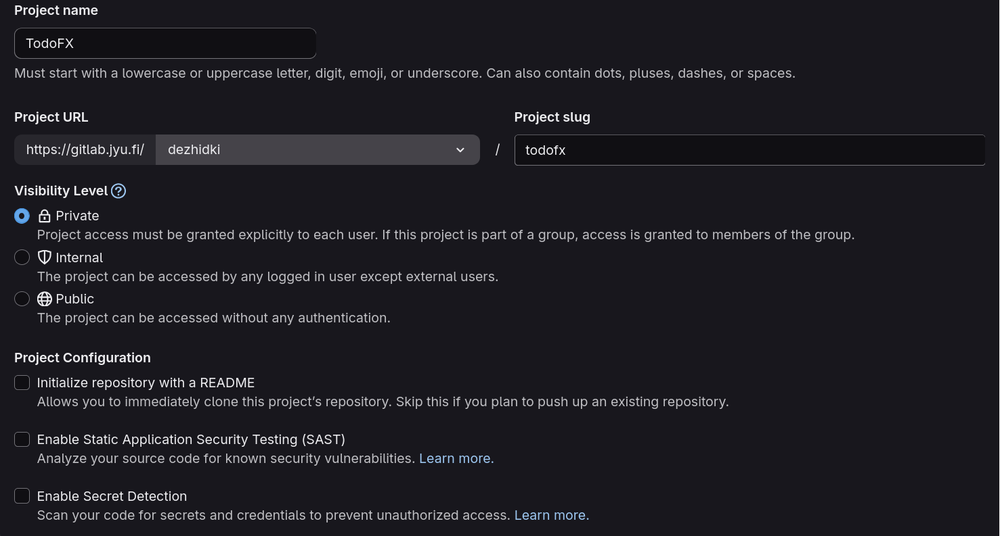
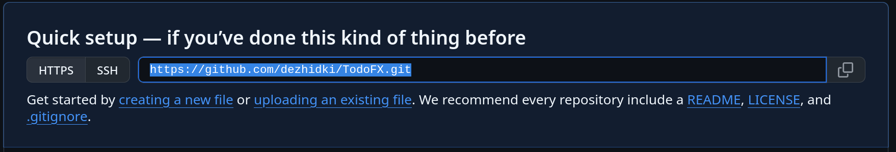
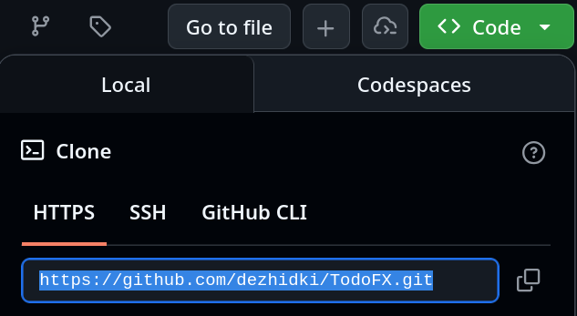

# Remote Use of Version Control

So far, we have used version control only on our own computer. To protect code from hard drive failures and to make it possible to share it with others, the code is usually uploaded to a **remote repository**.
A remote repository may simply be another computer on a network, but nowadays it is more common to use a public remote repository service such as GitHub or GitLab. These, along with many other similar Git hosting services, also provide additional project management features such as issue tracking, discussion forums, and other collaboration tools.
These additional tools are not Git tools themselves, but they make remote repository services versatile collaboration platforms.

In this section, we will move a local project to either GitLab or GitHub.
Students at the University of Jyväskylä have access to the university's own GitLab server. Other students can upload their code to GitHub, for example.

## Creating a Remote Repository

Before a Git repository can be uploaded to a remote repository service, a remote repository must first be created in that service.
Remote repository services often refer to repositories as *projects* because of the additional services they provide.

### [GitLab (JYU)](#tab/gitlab)

1. Sign in to the [University of Jyväskylä GitLab service](https://gitlab.jyu.fi) using your university credentials. Enter your username in the form `username` **without** the `@jyu.fi` suffix.

2. Click the `+` button in the upper-right toolbar and select **New project/repository**.

    

3. From the available options, select **Create blank project**.

4. Fill in the project details as follows:

   - **Project name**: Give the project a name, for example `TodoFX`.
   - **Project URL**: Make sure the drop-down menu after `https://gitlab.jyu.fi/` contains your username. If not, click the drop-down menu and enter your username.
   - **Project slug**: It should automatically be the project name without special characters, for example `todofx`.
   - **Visibility level**: For this project, select Internal or Public so that other people can view the source code. For your own projects, choose whichever option you prefer.
   - **Project configuration**: Disable all check boxes. In particular, **remove** the check mark from *Initialize repository with a README*, because we already have a local project.

       

5. Finally, click **Create project**.

***

### [GitHub](#tab/github)

1. Sign in to [GitHub](https://github.com/). If you do not already have an account, create one.

2. Click the `+` button in the upper-right toolbar and select **New repository**.

3. Fill in the remote repository details as follows:

   - **Repository name**: Give the project a name, for example `TodoFX`.
   - **Description**: You may leave this empty or provide a short description.
   - **Choose visibility**: In this case, select Public. For your own projects, choose whichever option you prefer.
   - **Start with template**: No template
   - **Add README**: Off
   - **Add .gitignore**: No .gitignore
   - **Add license**: No license

4. Finally, click **Create repository**.

***

### [Choose](#tab/default)

Select the remote repository service to use:

- **University of Jyväskylä students**: choose GitLab (JYU). You may use GitHub instead if you wish.
- **Otherwise**, choose GitHub.

*** 

## Connecting a Remote Repository to a Local Project

Open a command prompt and navigate to the root directory of your project.
The root directory is the folder that contains the `src` directory and the `pom.xml` file.
You can verify that you are in the correct directory by running the `git status` command. The status of the Git repository should be displayed in the same way as in [Section 7.3](../part7/03-version-control.md).

Next, we will add the remote repository address to the local repository.
To do this, we first need to know the Git remote repository URL.

## [GitLab (JYU)](#tab/gitlab)

1. Open the page of the project you created.
   The page URL should be in the format:
   `https://gitlab.jyu.fi/username/project-name`

2. Copy the Git remote repository URL.
   Click the blue **Code** button and copy the URL shown in the *Clone with HTTPS* field.

   

***

### [GitHub](#tab/github)

1. Open the page of the repository you created.
   The page URL should be in the format:
   `https://github.com/username/repository-name`

2. Copy the Git remote repository URL.

   If the repository is empty, the URL is displayed directly on the repository page.

    

   If the repository already contains code, click the green **Code** button and select the HTTPS URL.

    

***

### [Choose](#tab/default)

Select the remote repository service to use:

- **University of Jyväskylä students**: choose GitLab (JYU). You may use GitHub instead if you wish.
- **Otherwise**, choose GitHub.

***

Copy the repository URL and add it to the local repository using the `git remote add` command.

The `git remote add` command takes two parameters: the name of the remote repository and the URL of the remote repository.

The name `origin` is the conventional name in Git for the primary remote repository of a project.

## Sending Code to the Remote Repository for the First Time

We can now send the code to the remote repository.
Before sending the code, we must determine the username and password required by the remote repository service. These depend on the service being used.

### [GitLab (JYU)](#tab/gitlab)

When sending code to the remote repository, the username is always your university username without the `@jyu.fi` suffix.
The password is your university password.

***

### [GitHub](#tab/github)

When sending code to the remote repository, the username is your GitHub username.
Your GitHub password **cannot** be used. Instead, you must create a separate access token (Personal Access Token, PAT):

1. Go to the GitHub Personal Access Token settings page <https://github.com/settings/tokens>.
2. Click **Generate new token** and select **Generate new token (classic)**.
3. Fill in the form as follows:

- **Note**: Enter a descriptive name, for example `git-command-line`.
- **Expiration**: Choose a long period of time or `No expiration`.
  Note that if an expiration date is set, the access token will stop working after that date and a new token must be created.
- **Select scopes**: Select `repo` and make sure that all of its sub-options are selected.

4. Click **Generate token** at the bottom of the page.

5. The access token will be displayed in a green field.
This token will act as your password whenever you send code to GitHub.
Store this token somewhere safe.

***

### [Choose](#tab/default)

Select the remote repository service to use:

- **University of Jyväskylä students**: choose GitLab (JYU). You may also use GitHub if you prefer.
- **Otherwise**, choose GitHub.

***

Once you know the username and password, you can send the project to the remote repository for the first time using the `git push` command.

<asciinema src="images/git-push-first.cast" rows="15" poster="npt:15"></asciinema>

This command does two things:

1. `push` sends local commits to the remote repository.
2. `-u origin master` links the local `master` branch to the repository's `master` branch.
Because of this, Git will know in the future that the `git push` command, without additional parameters, should send code to the `origin` remote repository.

Note that when sending code for the first time (that is, when performing the first push), Git may ask for your username and password.
The login dialog varies between operating systems, but the principle is always the same: enter the username and password according to the instructions above.

## From Now On

Once the remote repository has been configured and the first push has been completed, the workflow becomes simple:

1. Make changes to the source code.
2. Run `git add .` This adds the changes to Git's staging area.
3. Run `git commit -m "Added editing window"`
This creates a commit from the staged changes.
4. Run `git push` This sends all commits made so far to the remote repository for safekeeping.

<task>
<task-title>Exercise 8.8: Git Remote Repository
<points>1 p.</points> </task-title>
<handout>

{{#include ../exercises/8-8-git-remote-repository/handout.md}}

</handout>
<task-link><a href="https://tim.jyu.fi/view/kurssit/it/iseai/26-27/programming2/exercises/part8/exercise8">Complete this exercise in TIM</a></task-link>
</task>