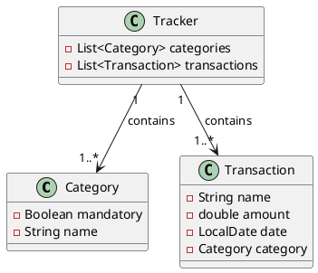
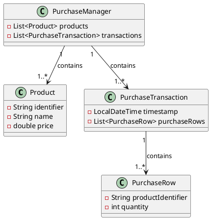
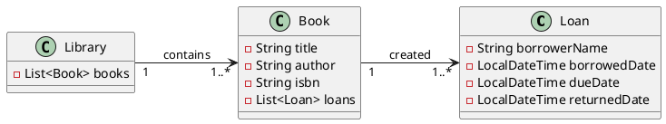
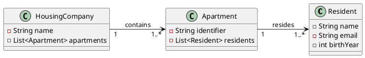
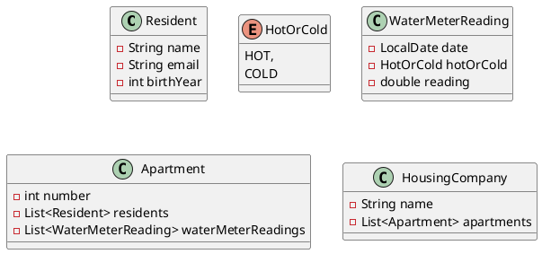
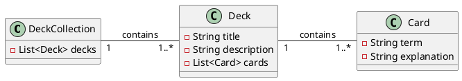

# Project Assignment

The course includes a project assignment in which you implement a graphical Java application using the JavaFX library. The exact assessment requirements for the project are listed below.

You may either implement one of the predefined project specifications or come up with your own topic. Descriptions and requirements for all topics are provided below.

The project is completed incrementally during Parts 9–12. Each part contains guidance intended to help you progress, but you may also implement the requirements in another way as long as they are fulfilled.

We strongly recommend completing and studying the Todo application developed in Parts 7–8 before starting the project. It will provide significant assistance when implementing your own application.

**You must demonstrate your final project, meeting all requirements, to your course instructor before submitting Part 12, either remotely or during in-person guidance.** Once the instructor has approved the work, they will record the approval in TIM.

## Pair Projects

The project may be completed individually or as a pair.
In pair projects, the application must contain at least three domain entities (individual projects require two; Requirement 1.1) and three views (individual projects require two; Requirement 4.1). All other requirements remain the same as for individual work.

Both students must participate as equally as possible in the development of the project. When presenting the assignment, both students must be able to demonstrate to the instructor that they personally know how to implement the project requirements.
For example, it is not acceptable for one student to focus solely on the user interface while the other handles all coding and data-model implementation.

Groups larger than two students are not permitted.

## Topic

You may choose one of the predefined topics below or come up with your own topic that satisfies the requirements.
Requirements marked as bonus (<i class="bi bi-stars jyu-gold"></i>) features are optional.

### Expense Tracker

In this application, the user can track personal expenses and income.

**Functional Requirements**

* The user can enter income and expenses ("transactions").
* The user can view all transactions in a table showing at least the transaction name, amount, and date.
* The user can define expense categories.
* The user can specify which category an expense belongs to. Income does not necessarily need a category.
* The user can view transactions belonging to a specific category.
* The user can view transactions within a selected date range (between two dates).
* The user can edit transactions and categories.
* Renaming a category moves all related transactions to the new category.
* Deleting a category removes that category from transactions but does not delete the transactions themselves.
* <i class="bi bi-stars jyu-gold"></i> An expense category may be marked as *mandatory*, representing essential expenses such as rent or electricity bills.
* <i class="bi bi-stars jyu-gold"></i> The user can select multiple categories in the filter. For example, you may use the ControlsFX `CheckComboBox` component.
* <i class="bi bi-stars jyu-gold"></i> The user can view a graph showing all transactions by month.
* <i class="bi bi-stars jyu-gold"></i> The user can view expense time-series data by category.

You may find the following components useful:

* `DatePicker` for selecting dates.
* `CheckBox` and `ComboBox` for category selection and filtering.
* `FilteredList` together with `TableView` to create filtered views.

**Application Data Model**

In this model, the distinction between income and expense can be represented by positive and negative amounts.
Another alternative would be to create an `IncomeOrExpense` enum and add an `IncomeOrExpense incomeOrExpense` attribute to the `Transaction` class.
It is probably easiest to start without the enum and add it later if needed.

Predefined categories

You may provide some predefined categories, for example:

* Groceries
* Restaurants
* Rent and Housing Charges
* Water
* Electricity
* Other Housing Costs
* Clothing
* Healthcare
* Car
* Public Transportation
* Other Travel
* Streaming Services
* Daycare
* Insurance
* Home Purchases
* Leisure
* Gifts and Donations
* Savings
* Loan Payments and Interest
* Other Expenses

A finished application could look something like this. It does not matter if your own user interface looks different. The important thing is that it fulfills the requirements, not that it resembles the example.

### Cash Register

In this application, the user manages products and creates purchase transactions.

* The user can enter products. A product contains an identifier, name, and price.
* The user can view all products in a table.
* The user can create purchase transactions by entering the product and quantity being purchased.
* During a purchase transaction, each row shows the unit price and line total (unit price × quantity). You will need a column that calculates the multiplication of price and quantity.
* The application displays the total purchase price.
* The application may use separate views for products, or both the product list and purchase transaction list can be shown in the same view (two `TableView` components within the same Scene).
* Products and purchase rows must be editable, but purchase transactions do not need to be editable after completion. A recommended approach is to store the product price as part of the purchase record so that editing a product does not affect historical purchases.
* Bonus: Line-item discounts or transaction-level discounts.

**Application Data Model**

When creating a purchase transaction:

* The user selects a product from a drop-down menu and enters the desired quantity.
* <i class="bi bi-stars jyu-gold"></i> The user can search for products by name using a search field. ControlsFX may be useful here.
* You need a table that displays the current state of the purchase transaction.
* The table must show the product identifier, product name, product price, quantity, and line total.
* Because the `PurchaseRow` class does not contain a direct reference to a `Product` object, product information must be retrieved using the product identifier and helper methods.
* This can be implemented using the `Bindings` class.

### Library

Application for managing library books and loans.
The librarian can manage book information and loan status, as well as view the loan history of books.

**Functional Requirements**

* The user can enter books and their information.
* The user can view all books in a table containing at least the book title, author, ISBN identifier, and loan status. The user should also be able to easily see how many times each book has been borrowed.
* The user can loan books to people and mark loans as returned.
* The user can view the loan history of books.
* Each book may only be loaned to one borrower at a time.
* A book can be borrowed again after it has been returned.
* The user can easily see which books are currently loaned out.
* The user can easily see which loans have passed their due date (overdue loans).

### Application Data Model

The application contains two primary domain entities: `Book` and `Loan`. In addition, there is a `Library` class that manages all books.

### Housing Company Management

In a housing company management application, a property manager can manage information about the housing company, such as apartments, residents, and company events.

**Functional Requirements**

* The user can enter apartments and their information.
* The user can view all apartments in a table containing the apartment number and the number of residents.
* The user can add and remove residents from an apartment.
* The user can view the residents of an apartment in a table containing at least their names, email addresses, and years of birth.

### Application Data Model

The application contains two primary domain entities: `Apartment` and `Resident`. In addition, there is a `HousingCompany` class that manages all apartments.

A completed application might look something like this.

<i class="bi bi-stars jyu-gold"></i> Bonus: Extra Features

You may also add the features below if you wish.
Additional features do not affect project acceptance and may be implemented in any way you choose. However, if you implement additional functionality, it must still follow the project requirements.

**Property Manager and Resident Views**

* The application has two modes: *Property Manager View* and *Resident View*.
* On the startup screen, the user chooses whether to use the property manager view or the resident view.
* If the resident view is selected, the user chooses which resident they are "logging in" as.
* The property manager can manage apartment information, residents, and housing company events (as in the basic version).
* In the resident view, the user can view information about the apartment they belong to. The resident cannot modify the apartment's basic information.
* In the resident view, the user can submit feedback to the property manager.
* In the property manager view, the user can see feedback in a table containing at least the sender's name, date, and feedback content.

**Water Meter Readings**

* In the resident view, a resident can enter water meter readings for an apartment.
* A water meter reading contains:
  * the reading value,
  * the date,
  * whether the reading is from cold or hot water.
* The resident can view the apartment's water meter readings in a table.

**Water Billing**

* The property manager can enter hot- and cold-water prices and their start dates.
* The user can generate a water bill for an apartment.
* A water bill contains the difference between the two most recent cold-water readings and the two most recent hot-water readings.
* It is sufficient for the bill to display:
  * the billing period (start and end dates),
  * cold-water consumption,
  * hot-water consumption,
  * total charge (with hot and cold water separated).

You may find the following data model useful.

### Flashcard Application

An application for creating and managing flashcards (similar to [Anki](https://en.wikipedia.org/wiki/Anki)).
The user can create flashcards containing a term and its explanation. Flashcards related to the same topic are collected into decks, which can then be practiced within the application.

**Functional Requirements**

* The user can create decks that contain cards. A deck has a name and an optional description.
* The user can add cards to a deck. A card contains a term and its explanation.
* The user can browse and edit existing decks.
* The user can practice cards in a deck using a practice mode. In practice mode, the application displays the term of a card. The user can reveal the explanation ("flip the card").
* After viewing the explanation, the user can move to the next or previous card.
* In practice mode, cards are always shown in random order.
* The user can edit and delete decks and cards.

**Application Data Model**

The application contains two main domain entities: `Card` and `Deck`. In addition, a `DeckCollection` class manages all decks.

<i class="bi bi-stars jyu-gold"></i> Bonus: Extra Features

You may also add the features below if desired.
Additional features do not affect project acceptance, and you may implement them however you wish. However, if you implement additional functionality, it must still follow the project requirements.

**Usage Statistics**

* Add a view count to cards. Every time a user reveals a card's explanation in practice mode, the card's view count increases by one.
* Card view counts are displayed in the deck-editing view.
* Add a practice-session count to decks. Every time the user enters practice mode and goes through every card at least once, increment the counter.
* The number of practice sessions is displayed as a separate column in the main view.

**Exam Mode**

* Add an exam mode for decks.
* In exam mode, the user is shown a card's term and three possible explanations as a multiple-choice question.
* The user selects the correct explanation.
* Feedback is shown immediately, after which the next question is displayed.
* Exam mode must work equally well with a deck containing three cards or several hundred cards.
* Exam mode is only available if the deck contains at least three cards.
* Components such as [`RadioButton`](https://jenkov.com/tutorials/javafx/radiobutton.html) and `ToggleGroup` may be useful.

### Own Idea

A custom JavaFX application of your own choosing that fulfills the project requirements.
You may also extend the Todo application developed in Parts 7 and 8.

If you choose your own topic, you must prepare an initial project plan that describes
the application's key functional requirements and the application's data model.
You may use the example topics above as a guide for the scope and detail of the plan.

The plan must be approved by the course instructor before implementation begins.

When writing the plan, also think about how the application will satisfy the general project requirements.
The instructor may request changes if the scope does not meet the expected requirements.

If you decide to extend the Todo application, the project requirements apply to your extension.
For example:

* Requirement 1.1 ("The application contains at least two modeled domain entities") means that you must define two new domain entities in addition to the existing `Task` model.
* Requirement 4.1 means that you must either add two new views or significantly expand the existing views in such a way that the extension could reasonably be considered its own view.

## Technical Requirements and Assessment

The requirements below are used when evaluating the project.
The project is graded on a pass/fail basis.
A failed project may be revised based on feedback from the instructor.

In principle, the project must satisfy all of the requirements below. Individual requirements may be interpreted more flexibly if the project is otherwise particularly extensive or well executed, or if the project topic specifically requires it.

The final decision is made by the instructor on a case-by-case basis.

### Requirement 1: Data Model

1. **The application must contain at least two modeled domain entities.**  

    Examples include tasks, transactions, books, customers, workouts, games, recipes, or similar concepts. Each modeled entity must contain attributes or properties that are meaningful within the application's domain. In the Parts 7–8 example application there was one modeled entity: `Task`. In the flashcard application they could be `Card` and `Deck`. In the expense-tracking application they could be `Transaction` and `Category`.

2. **Each modeled entity must contain at least one domain-specific attribute.**  
    In the Parts 7–8 example, `Task` contained the attributes `completed`, `title`, `description`, and `priority`.

    Note that *an attribute whose only purpose is to reference another model, or whose value can be derived from another attribute*, does not count toward this requirement.
    For example, `TaskCollection` contains only a collection of task references and would therefore not satisfy the requirement by itself.
    By contrast, in the flashcard application `Deck` contains a title and description in addition to its card collection, making it a distinct modeled entity.

3. **Application data must not be modeled using UI components but using dedicated model classes.**

4. **Observable JavaFX structures must be used when connecting data and the user interface.**  
    At minimum, the primary collection of data should be an `ObservableList` or equivalent.

5. **Data must be displayed using appropriate UI components.**  
    If multiple similar objects are displayed, `TableView` is usually an appropriate choice.

### Requirement 2: Core Functionality

1. **CRUD functionality must be implemented in the user interface for every modeled entity.**  

    Users must be able to create (*Create*), read (*Read*), update (*Update*), and delete (*Delete*) objects through the user interface.
    For example, in the Parts 7–8 example application, users can create tasks using a button, read them in a `TableView`, edit them in a separate view, and delete them using a delete button.

2. **The user must not be allowed to enter obviously invalid data.**  

    For example, empty names or missing mandatory fields should not be allowed.
    Validation may be implemented either in the model or in the user interface.

3. **The state of the user interface must always match the state of the model, and vice versa.**  

    When data is updated or deleted, incorrect information must not remain either in the model or in the interface.
    Removing an object from the model must immediately remove it from the interface as well.

### Requirement 3: Persistence

1. **Application data must be stored in a file.**  

      Information must persist after the application is closed.
      Saving may happen automatically or through a dedicated **Save** action.

2. **Stored data must be loaded back when the application starts.**

### Requirement 4: User Interface

1. **The application must contain a graphical user interface with at least two views.**  

    The views may consist, for example, of a main view (listing) and an editing view (dialog).

2. **The user interface must be structured and usable.**  

    Input fields, buttons, labels, and lists should be arranged logically rather than placed randomly.

### Requirement 5: Architecture and Separation of Responsibilities

1. **The application's structure must follow the MVC (Model-View-Controller) architecture.**  

    The key requirement is that the data model, user interface, and controller logic connecting them are separated from one another.

2. **Application data and persistence logic must be separated from the controller class.**  

    The UI controller must not contain all of the application's data and persistence logic.

3. **Loading and saving data must be separated into their own responsibility area.**  

    In practice, loading and saving should be implemented in dedicated methods located outside the controller logic.

### Requirement 6: Testing

1. **Unit tests must be written for the application's core model or business logic.**  

    The tests must verify that key methods (such as adding and removing objects) modify the state of the data model as expected.

### Requirement 7: Version Control and Project Management

1. **A public Git remote repository (for example GitLab or GitHub) must be created for the project.**

2. **The project must contain a `.gitignore` file and a `README.md` file.**  

    The README should briefly describe the application and explain how it works.

3. **Git commits must have descriptive names.**  

    The commit messages should clearly indicate what changes each commit contains.

4. **The project must be developed iteratively, with each iteration saved as a separate commit.**  

    The repository must not contain only a single "finished application" commit. The development history should be visible.

### Requirement 8: Code Quality

1. **No errors or warnings may be visible in the Java source code within IntelliJ IDEA.**  

    Compilation errors and warnings are checked using IDEA's default Java language inspection settings.
    IDEA displays warnings in yellow and errors in red.
    If there is a *justified* reason to allow a warning, it must be documented in the code using `@SuppressWarnings` together with a short explanation describing why the warning is acceptable.

    Language-inspection warnings (shown in green) are permitted.
    Similarly, warning markers inside `.fxml` files are allowed.

    You can run inspections for all files at once using IDEA's [Run All Inspections](https://www.jetbrains.com/help/idea/running-inspections.html#run-all-inspections) feature.

    Note that IntelliJ IDEA provides automatic fixes for many warnings and errors, accessible through the quick-fix action displayed next to the warning (<i class="bi bi-lightbulb-fill"></i>).

2. **All `.java` source files must be formatted using a consistent style.**  

    Use IDEA's **Reformat Code** feature and apply all available fixes(
    *Optimize Imports*, *Rearrange Entries*, *Cleanup Code*)

3. **Visibility modifiers must be explicitly defined for every class, attribute, and method, following good encapsulation practices.**  

    Attributes should generally be declared `private`.
    Method visibility should match the method's purpose
    methods intended for use by other classes should be `public` and the 
    helper methods used only within the class should be `private`

