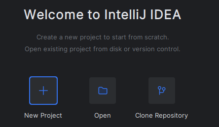
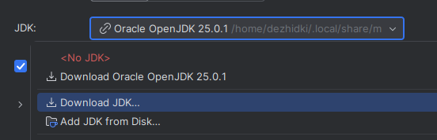
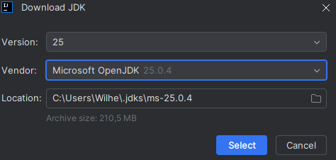

# Tool Instructions

On the **Programming 2** course, we use the following tools:

- **[Java Development Kit (JDK)](#jdk)**, *a software development kit* that includes, among other things, the Java compiler and the Java Virtual Machine for running Java programs.

- **[Git](#git)**, *a version control system* (VCS) that enables source code versioning and collaboration between developers.

- **[IntelliJ IDEA](#idea)**, *an integrated development environment* (IDE) for developing and debugging Java programs and more. We use the free Community Edition of IntelliJ IDEA.

- **[SceneBuilder](#scenebuilder)**, a helper tool for creating JavaFX user interfaces.

The above programs are pre-installed in the Agora computer classrooms. If you have your own computer, we strongly recommend installing them there as well.
In particular, completing the project work is much easier when all required tools are available on your own computer.


The officially supported operating systems for this course are Windows, macOS, and Linux.
Installing the tools on ChromeOS may be possible, but unfortunately we cannot provide support for that operating system. For this reason, we do not recommend using ChromeOS.

Select your operating system below.

#### [Windows](#tab/win)

The instructions below have been tested on:

- Windows 11
- Windows 10 (version 1809 or newer)

You can see your Windows version by running the following command in PowerShell:

```bash
winver
```

***

#### [macOS](#tab/macos)

The instructions below have been tested on:

- macOS 15 Sequoia

***

#### [Linux](#tab/linux)

The instructions below have been tested on:

- Arch Linux (6.17.7-arch1-1)
- CachyOS Linux (6.18.2-2-cachyos)
- Linux Mint 22.2 (6.14.0-37-generic)

***

#### [Choose](#tab/default)

Select your operating system from the options above.

***

### Prerequisites

### [Windows](#tab/win)

If Windows Update offers operating system updates, install them.

After that, verify that the `winget` package manager is installed:

1. Open PowerShell. (*search-icon* <i class="bi bi-chevron-right"></i> *write PowerShell* <i class="bi bi-chevron-right"></i> *Windows PowerShell*).
2. Run the following command:

    ```bash
    winget -v
    ```

    The version of `winget` should be displayed.
    If you instead receive an error such as:
    *'winget' is not recognized as the name of a cmdlet, function, script file, or operable program*
    you most likely do not have `winget` installed.
    If updating Windows does not help, try the following:

    - Verify that your Windows installation is up to date.
    - Download and install winget [manually](https://github.com/microsoft/winget-cli/releases/download/v1.11.430/Microsoft.DesktopAppInstaller_8wekyb3d8bbwe.msixbundle).
    After installation, close and reopen PowerShell.

***

### [macOS](#tab/macos)

First, make sure your computer is up to date.

Then verify that the Homebrew package manager is installed:

1. Open Terminal (*Launchpad* <i class="bi bi-chevron-right"></i> *Terminal*).
2. Run:
    ```bash
    brew --version
    ```

    If you receive the error:
    `command not found: brew`

you must install Homebrew.

<details>
<summary>How to install Homebrew</summary>

1. Open Terminal
2. Install the macOS developer tools:

```bash
xcode-select --install
```

You may receive a prompt asking whether you want to install the command-line developer tools(*The 'xcode-select' command requires the command line developer tools. Would you like to install the tools now?*). If so, choose **Install** and wait for the installation to finish.

If you receive the message:
`command line tools are already installed`
you already have the required tools.

3. install Homebrew:

```bash
/bin/bash -c "$(curl -fsSL https://raw.githubusercontent.com/Homebrew/install/HEAD/install.sh)"
```

Allow the installation to complete.

When prompted for a password, enter your macOS password and press Enter.
Note that no characters, not even asterisks, are shown while typing the password.

When Homebrew asks:

```text
Press RETURN/ENTER to continue or any other key to abort:
```

press Enter and wait for the installation to complete.

4. Run the following command:

```bash
BREW_PREFIX=$( [[ $(uname -m) == arm64 ]] && echo /opt/homebrew || echo /usr/local )
echo >> ~/.zprofile
echo "eval \"\$(${BREW_PREFIX}/bin/brew shellenv)\"" >> ~/.zprofile
eval "$(${BREW_PREFIX}/bin/brew shellenv)"
```

5. Finally, verify that Homebrew works:

```bash
brew --version
```

If installation succeeded, you should see output similar to:

```text
Homebrew X.X.X
```

where `X.X.X` is the installed version number.
</details>

*** 

### [Linux](#tab/linux)

The following instructions assume you have experience installing software on your Linux distribution.
Use your own judgment when following them.

Keep the following in mind:

- Some tools are available through your distribution's package manager, but certain graphical applications are often distributed independently of Linux distributions.

- We recommend using a distribution-independent package manager such as Snap or Flatpak when necessary.

- After installing prerequisite packages, open a fresh terminal window.

***

### [Choose](#tab/default)

Select your operating system from the options above.

***

## Git {#git}

### [Windows](#tab/win)

First, check whether Git is already installed.
1. Open PowerShell.
2. Run:

```bash
git --version
```

If you see the Git version (for example `git version X.XX.XX`, where `X.XX.XX` is the exact version), **you may skip the Git installation instructions entirely.**

If the command is not found, continue with the instructions below.

<details>
<summary>Installing Git</summary>

1. Open PowerShell.

2. Install Git for Windows by running the following command:

```bash
winget install -e --id=Git.Git --custom '/COMPONENTS="ext,ext\shellhere,ext\guihere"'
```

Wait until the command completes and grant installation permissions if necessary.
If you see a prompt such as:

```text
Do you agree to all the source agreements terms?
[Y] Yes [N] No:
```

press `y` and then Enter.

Make sure the output contains:

```text
Successfully installed
```

3. Close all open terminals and open a new PowerShell window.

4. Verify that Git is installed:

```bash
git --version
```

If the installation succeeded, you should see output similar to:

```bash
git version X.XX.XX
```

where `X.XX.XX` is the installed Git version.

5. Also verify that Git Bash is installed.

Open:

```text
Search → Git Bash → Git Bash
```

If everything works correctly, a Git Bash terminal window should open.


</details>

***

#### [macOS](#tab/macos)

First, check whether Git is already installed.

1. Open Terminal.
2. Run:

```bash
git --version
```

If the command is not found, continue with the instructions below.

<details>
<summary>Installing Git</summary>

1. Open Terminal.
2. Git should already be installed if you completed the prerequisite steps.
Verify the installation:

```bash
git --version
```

If successful, you should see output similar to:

```bash
git version X.XX.XX
```

where `X.XX.XX` is the installed Git version.

</details>

***


### [Linux](#tab/linux)

First, check whether Git is already installed.

1. Open your distribution's terminal.
2. Run:

```bash
git --version
```

If you see the Git version, **you may skip the Git installation instructions entirely.**

If the command is not found:

<details>
<summary>Installing Git</summary>

1. Open your distribution's terminal.
2. Install the `git` package.
The package name is generally the same across common Linux distributions such as Ubuntu, Debian, Fedora, and Arch.
3. After installation, close and reopen the terminal.
4. Verify the installation:

```bash
git --version
```

If successful, you should see output similar to:

```bash
git version X.XX.XX
```

where `X.XX.XX` is the installed Git version.

</details>

***


### [Choose](#tab/default)

Select your operating system from the options above.

***

## IntelliJ IDEA {#idea}

### [Windows](#tab/win)

1. Open PowerShell.
2. Install IntelliJ IDEA Community Edition:

```bash
winget install --interactive -e --id=JetBrains.IntelliJIDEA.Community
```

After downloading, the installer will open.
Continue through the installer using the **Next** button.
In **Installation Options**, enable:

- Add "Open Folder as Project"
- Create Associations: `.java`, `.gradle`, `.kt`

Allow the installation to finish.

3. At the end of the installation, select **Run IntelliJ IDEA** and click **Finish**.
 Verify that IntelliJ IDEA starts correctly.

The first startup may take some time because the system performs a security check.
Accept the license agreement if prompted.

4. If another JetBrains IDE or Visual Studio Code is installed, IntelliJ IDEA may ask whether you want to import settings from it.
You may either import the settings or choose **Skip Import**.

5. When startup completes, you should see the **Welcome to IntelliJ IDEA** screen.

6. Disable AI-powered code completion:

```
Settings
→ Editor
→ General
→ Inline Completion
```

Disable:

```text
Enable local Full Line completion suggestions
```

Done!

***

### [macOS](#tab/macos)

1. Open Terminal.

2. Install IntelliJ IDEA:

```bash
brew install --cask intellij-idea-ce
```

Wait for the installation to finish.
You may be asked for your macOS password.

3. Verify that IntelliJ IDEA works:

Open Launchpad and start **IntelliJ IDEA CE**.

The first startup may take some time.
Accept license agreements if prompted.

4. if IntelliJ asks whether to import settings from another IDE, select **Skip Import**.

5. When installation is complete, the **Welcome to IntelliJ IDEA** screen should be visible.

6. Disable AI-powered code completion:

```
Settings
→ Editor
→ General
→ Inline Completion
```

Disable:

```text
Enable local Full Line completion suggestions
```

Done!

***

### [Linux](#tab/linux)

1. Open your distribution's terminal.

2. Install IntelliJ IDEA Community Edition.

Installation methods vary by distribution:

- Arch Linux [`intellij-idea-community-edition`](https://archlinux.org/packages/extra/x86_64/intellij-idea-community-edition/):

```text
pacman -S intellij-idea-community-edition
```

- Other distributions (recommended [IDEA snap](https://snapcraft.io/intellij-idea-community) package):

```text
snap install intellij-idea-community --classic
```

Alternatively, follow the official IntelliJ IDEA installation [instructions](https://www.jetbrains.com/help/idea/installation-guide.html#standalone_linux).

3. Start IntelliJ IDEA.

Accept license agreements if prompted.

4. If IntelliJ asks whether to import settings from another development environment, select **Skip Import**.

5. When installation is complete, the **Welcome to IntelliJ IDEA** screen should be visible.

6. Disable AI-powered code completion:

```
Settings
→ Editor
→ General
→ Inline Completion
```

Disable:

```text
Enable local Full Line completion suggestions
```

Done!

***

### [Choose](#tab/default)

Select your operating system from the options above.

***


## Disabling IntelliJ IDEA AI Assistance

IntelliJ IDEA includes two AI-powered code completion features: *AI Assistant* and *Inline Completion*. These attempt to automatically complete code as you write.

You can disable these features as follows.

1. **Disabling AI Assistant**
  - Settings → Plugins
  - Select the **Installed** tab
  - Find **JetBrains AI Assistant**
  - Disable the plugin or uninstall it completely

2. **Disabling Inline Completion**
  - Open IntelliJ IDEA to the **Welcome to IntelliJ IDEA** screen
  - Select **Configure → Settings** in the lower-left corner
  - Navigate to:

    ```
    Editor
    → General
    → Code Completion
    → Inline
    ```

  - Uncheck:

    ```
    Enable inline completion using language models
    ```

  - Save the settings.

## Java Development Kit (JDK) {#jdk}
 
> - Open IntelliJ IDEA and wait until the **Welcome to IntelliJ IDEA** screen appears.
> 
> - Click **New Project** in the middle or upper part of the window.
> 
> 
> 
> - In the dialog that opens, click the **JDK** drop-down menu and select **Download JDK...**.
> 
> 
> 
> - Configure the download as follows:
> 
>   - **Version:** 25
>   - **Vendor:** Microsoft OpenJDK
> 
>   Do **not** change the path shown in the **Location** field.
> 
>   Finally, click **Select**.
> 
>   
> 
> - Leave the remaining project settings unchanged.
> 
> - Click **Create** in the lower-right corner and allow the project to load.
> 
>   This opens the IntelliJ IDEA development environment.
> 
>   Downloading the JDK may take some time. Wait patiently until all errors and red text disappear.
> 
> - When the project has loaded successfully and no errors are visible, run the project using the **Play** button in the upper-right corner.
> 
> - Wait for the project to compile.
> 
>   If everything works correctly, a console window should appear at the bottom with output similar to:
> 
> ```text
> Hello and welcome!
> 
> i = 1
> i = 2
> i = 3
> i = 4
> i = 5
> ```
> 
> - You may now close IntelliJ IDEA.

## SceneBuilder {#scenebuilder}

### [Windows](#tab/win)

1. Open PowerShell.

2. Install SceneBuilder:

    ```bash
    winget install -e --id=Gluon.SceneBuilder
    ```

    Wait for the installation to complete and grant permissions if necessary.

    If you see a prompt such as:

    ```text
    Do you agree to all the source agreements terms?
    [Y] Yes [N] No:
    ```

    press `y` and then Enter.

    Verify that the output contains: `Successfully installed`

3. Test that SceneBuilder works:
`Search → SceneBuilder → SceneBuilder`

    Verify that the application launches correctly.

4. Close the application.

Done!

***

### [macOS](#tab/macos)

1. Open Terminal.

2. Install SceneBuilder:

    ```bash
    brew install --cask scenebuilder
    ```
    Wait for the installation to complete.
    You may be asked for your macOS password.

3. Verify that SceneBuilder works.

    Open Launchpad and start **SceneBuilder**.

    The application should launch successfully.

4. Close the application.

Done!

***

### [Linux](#tab/linux)

1. Open your distribution's terminal.
2. Install SceneBuilder.  Installation methods vary between distributions:

   - **Arch Linux**
  Install the [`javafx-scenebuilder`](https://aur.archlinux.org/packages/javafx-scenebuilder) package from the AUR by hand or by using the [yay](https://github.com/Jguer/yay) tool.
  For example:

    ```bash
    yay -S javafx-scenebuilder
    ```

   - **Flatpak**

    ```bash
    flatpak install flathub com.gluonhq.SceneBuilder
    ```

   - **Other distributions**
  We recommend downloading the official `.rpm` or `.deb` package from the [SceneBuilder website](https://gluonhq.com/products/scene-builder/#download).

    Installing a `.deb` package (Debian, Ubuntu, Linux Mint):

      ```bash
      sudo dpkg -i file.deb
      ```

      Installing an `.rpm` package (Fedora, CentOS):

      ```bash
      sudo rpm -i file.rpm
      ```

4. Verify that SceneBuilder works.

Start SceneBuilder from your application menu or from the command line.
Close the application.

Done!

***

### [Choose](#tab/default)

Select your operating system from the options above.

***

## What Next?

Congratulations!

You now have all the tools required for the course and can continue to the course materials.

## Common Problems and Solutions

<details>
<summary>I get the error <code>error: illegal character: '\ufeff'</code> when running a Java project in my IDE.</summary>


A problem may occur if you imported settings from JetBrains Rider.
Rider settings are not completely compatible with Java development, and IntelliJ IDEA may not automatically fix the resulting issues.

Try the following:

1. Open IntelliJ IDEA and return to the *Welcome to IntelliJ IDEA* screen.

  **If an old project opens automatically**, select:
  `File → Close Project`

2. Open:
  `Configure → Settings`

3. Navigate to:
  `Editor → File Encodings`

4. Set: `Create UTF-8 files`
    to: `with no BOM`

5. Save the settings.

6. Create a *new* project and try running a simple program.

</details>

<details>
<summary>Internal error: com.intellij.platform.ide.bootstrap... Process "C:\...idea64.exe" is still running and does not respond</summary>

Another possible cause is that Rider is stuck running in the background.

Try the following:

1. Close IntelliJ IDEA completely.

2. Open Rider.

3. Close Rider.

4. Start IntelliJ IDEA again.

</details>